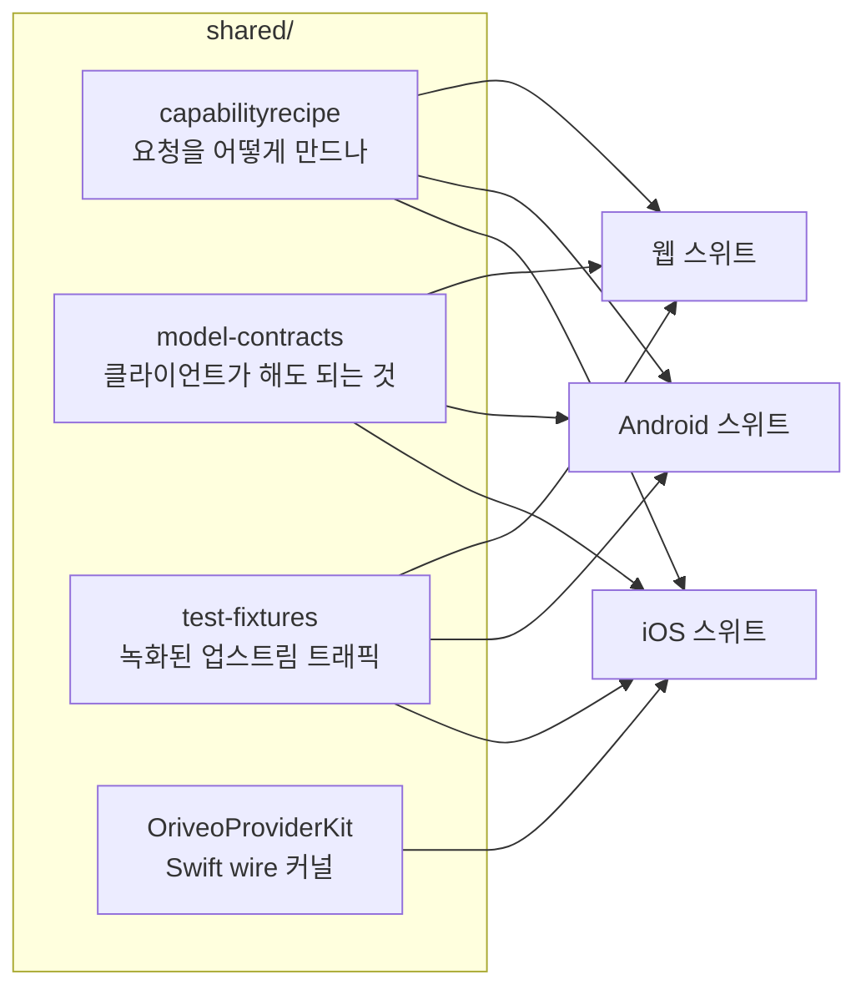

<div align="center">

# 공유 계약

**모델 공급자와 통신하는 방법에 대한 하나의 정의. 세 클라이언트가 모두 이것에 대고 검증합니다.**

<a href="../../LICENSE"></a>


<sub>

<a href="../../shared/README.md">English</a> ·
<a href="../ar/shared.md">العربية</a> ·
<a href="../de/shared.md">Deutsch</a> ·
<a href="../es/shared.md">Español</a> ·
<a href="../fr/shared.md">Français</a> ·
<a href="../hi/shared.md">हिन्दी</a> ·
<a href="../id/shared.md">Indonesia</a> ·
<a href="../ja/shared.md">日本語</a> ·
**한국어** ·
<a href="../pt-BR/shared.md">Português</a> ·
<a href="../ru/shared.md">Русский</a> ·
<a href="../th/shared.md">ไทย</a> ·
<a href="../tr/shared.md">Türkçe</a> ·
<a href="../vi/shared.md">Tiếng Việt</a> ·
<a href="../zh-Hans/shared.md">简体中文</a> ·
<a href="../zh-Hant/shared.md">繁體中文</a>

</sub>

</div>

---

"공급자를 호출한다"를 각자 따로 구현한 클라이언트 셋은 반드시 어긋납니다. 그것도 조용히, 마지막에
누군가 테스트한 쪽 방향으로 어긋나고, 그 어긋남은 한 플랫폼에서만 재현되고 나머지에서는 재현되지
않는 버그로 드러납니다.

`shared/`는 그에 대한 답입니다. 동작을 데이터로 한 번만 적어 두고, 각 클라이언트의 테스트
스위트가 같은 파일에 대고 검증합니다. 그 데이터 안에 있는 특이 동작은 한 번만 고치면 됩니다. 파서
안에 있는 것은 두 플랫폼에 배포되고 세 번째가 깨지는 대신, 세 스위트가 동시에 잡아냅니다.



## capabilityrecipe

레시피 레지스트리입니다. 특정 공급자·transport·기능 — 웹 검색, 추론 강도, 이미지 생성 — 에 대해,
나가는 요청에 어떤 JSON 포인터를 정확히 써넣을지, 그리고 답을 어떻게 다시 읽을지를 규정합니다.

오늘 나온 모델이 클라이언트 업데이트 없이도 동작하는 이유가 이것이고, 어떤 클라이언트도 모델
이름으로 기능을 추측하지 않는 이유도 이것입니다. `capability_runtime.v1.json`이 레시피 자체를
담고, `capability_result_definitions.v1.json`과 `capability_custom_controls.v2.json`이 결과와
사용자에게 보이는 제어를 어떻게 해석할지 정의합니다.

각 레시피는 `executionKind`를 선언합니다 — `request_overlay`, `server_tool`, `client_tool_loop`,
`endpoint_route`, `model_route`, `external_connector`, `unavailable`. 그리고 각 클라이언트의
컴파일러는 레시피를 적용하기 전에 그것이 공급자·기능·transport와 맞는지 검증하고, 아무도 검토하지
않은 요청을 보내는 대신 이름 붙은 사유로 거부합니다. 이 목록은 닫힌 집합입니다. 그 밖의 것을
내세우는 레시피는 추측되지 않고 거부됩니다.

## model-contracts

클라이언트 간 동작을 못 박는 JSON fixture입니다. 특정 공급자와 기능에서 요청이 어떤 모습이어야
하는지, 생성 파라미터가 어떻게 결정되고 재정의가 어떻게 겹쳐지는지, 클라이언트가 어떤 기능 상태를
보여도 되는지, 모델 카탈로그와 그 증거를 어떻게 소비하는지를 담습니다.

각 클라이언트의 테스트가 이 파일들을 직접 읽으므로, 여기서의 변경은 곧 세 클라이언트 전부에 대한
변경입니다.

## test-fixtures

골든 테스트 데이터입니다. 녹화된 업스트림 도구 호출 트래픽, 릴레이 서비스(Relay) 라우팅, 폼 검증, 로컬 주소 분류,
카탈로그와 포터블 설정 시나리오, model-facts와 기능 증거 스냅샷, 로컬 엔진 시나리오가 들어 있습니다.

`provider-toolcall/recorded/` 아래의 `.sse` 파일은 **실제로 캡처한 업스트림 트래픽**이며, 도착한
그대로 바이트 단위로 보존됩니다 — 응답 헤더만 떼어냈고, 본문에 키가 실린 적은 없습니다.
`provider-toolcall/` 바로 아래에 있는 `.sse` 파일은 특정 파싱 경로를 고정하려고 손으로 쓴
fixture입니다. 이 구분은 중요합니다. 손으로 쓴 mock은 공급자가 이렇게 동작할
것이라고 당신이 믿었던 바를 담지만, 녹화된 스트림은 공급자가 실제로 한 일을 담습니다 — 그날 화요일에
보내온 그 망가진 청크까지 포함해서. 공급자 프로토콜 수정에 테스트가 필요할 때는 녹화를 우선하세요.

fixture의 `$comment`, 또는 그 옆에 있는 `expected.json` 매니페스트가 주변 항목들이 무엇을 못 박는지
알려줍니다. 사례를 추가하기 전에 그것을 읽으세요.

## OriveoProviderKit

공급자 wire 프로토콜 커널을 담은 Swift 패키지입니다. SSE 라인 조립, OpenAI 호환 청크 파싱,
Responses / Anthropic Messages / Gemini 프로토콜용 이벤트 기반 조립, transport에 중립적인 요청 구성,
레시피 컴파일과 그 실행 가드, 도구 이름 인코딩, 자격 증명 가림, 업스트림 오류 분류, thinking 태그
파싱, 스트리밍 JSON 경로 추출, 명시적인 `URLSession` 리다이렉트 정책, 공급자별 특이 동작 프로파일이
들어 있습니다.

범위는 일부러 좁게 그었습니다. **포함:** Foundation만으로 되는 wire 지식. **제외:** 앱 모델, UI,
데이터베이스, 텔레메트리, 현지화. 이 패키지는 표준 라이브러리와 Foundation 밖의 어떤 것에도 의존하지
않으며, 각 Apple 클라이언트는 이 위에 얇은 바인딩만 두어, wire 동작의 구현이 정확히 하나만 존재하게
합니다.

이 패키지는 Apple 플랫폼의 요청과 스트리밍 경로 전체를 구현합니다. iOS 앱은 현재 그중 일부만
링크합니다 — 스트림 조립기, wire 프로파일, 도구 이름 코덱, 오류 분류기 — 그리고 요청 빌더는 자체
구현을 씁니다. 개발 중인 macOS 클라이언트가 두 번째 소비자이며, 그래서 레시피 컴파일러와 transport에
중립적인 요청 빌더가 앱 하나 안이 아니라 여기에 있습니다. 아래 스위트는 모든 소비자가 공유하는
부분을 다룹니다: SSE 분할, OpenAI 호환 조립, 도구 이름 코덱, 리다이렉트 정책.

```bash
cd shared/OriveoProviderKit && swift build && swift test
```

- 플랫폼: iOS 18+, macOS 15+ · `swift-tools-version: 6.1`
- `ProviderWireProfile`은 OpenAI 호환 조립기 하나로도 여전히 필요한, 벤더별로 남은 잔여 특이
  동작들을 담습니다 — 추론 텍스트가 어디로 도착하는지, 캐시된 토큰 수가 어디에 있는지, 프롬프트
  토큰에 캐시 히트가 이미 포함되어 있는지. 이것은 *바이트가 어떻게 도착하는가*를 기술할 뿐,
  *모델이 무엇을 할 수 있는가*는 결코 다루지 않습니다. 후자는 레시피의 몫입니다.

## 이 파일들을 손볼 때

여기서의 변경은 모든 클라이언트에 대한 변경입니다. 지금 작업 중인 것 하나만이 아니라, 당신이 건드린
파일을 읽는 모든 클라이언트의 계약 스위트를 돌리세요.

저장소 루트에서:

```bash
(cd web && npm run test:run)
(cd shared/OriveoProviderKit && swift test)
# plus the iOS and Android suites — see their READMEs
```

iOS 스위트는 테스트 파일에서 위로 거슬러 올라가며 `shared/`를 보고 이 디렉터리를 찾아내고, Android
스위트도 같은 방식으로 작업 디렉터리에서 위로 올라가며, 웹 스위트는 워크스페이스를 기준으로
해석합니다. 따라서 셋 다 저장소의 전체 체크아웃이 필요합니다.

pull request를 열기 전에 [CONTRIBUTING.md](../../CONTRIBUTING.md)를 읽으세요.

## 라이선스

[AGPL-3.0-or-later](../../LICENSE).
