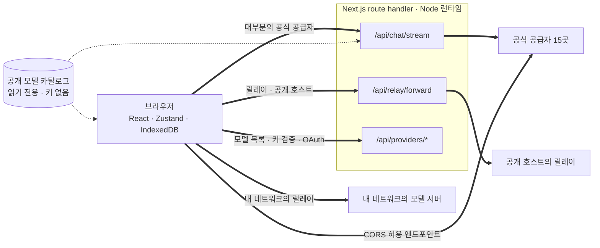
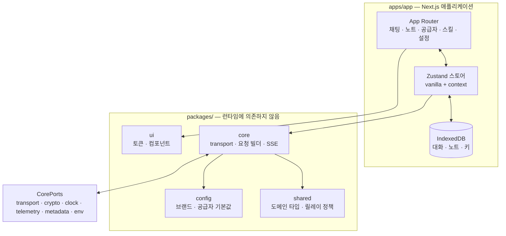

<div align="center">

# 웹용 Oriveo

**이미 돈을 내고 쓰는 AI 모델을 위한 Next.js 채팅 클라이언트.**

<a href="../../LICENSE"></a>


<sub>

<a href="../../web/README.md">English</a> ·
<a href="../ar/web.md">العربية</a> ·
<a href="../de/web.md">Deutsch</a> ·
<a href="../es/web.md">Español</a> ·
<a href="../fr/web.md">Français</a> ·
<a href="../hi/web.md">हिन्दी</a> ·
<a href="../id/web.md">Indonesia</a> ·
<a href="../ja/web.md">日本語</a> ·
**한국어** ·
<a href="../pt-BR/web.md">Português</a> ·
<a href="../ru/web.md">Русский</a> ·
<a href="../th/web.md">ไทย</a> ·
<a href="../tr/web.md">Türkçe</a> ·
<a href="../vi/web.md">Tiếng Việt</a> ·
<a href="../zh-Hans/web.md">简体中文</a> ·
<a href="../zh-Hant/web.md">繁體中文</a>

</sub>

</div>

---

Oriveo 웹 클라이언트는 Next.js로 만든 BYOK(bring-your-own-key) AI 채팅 앱입니다. 대화, 노트, 폴더,
스킬, 그리고 공급자 키는 브라우저 자체 저장소에 있습니다. 계정도 로그인도 없습니다.

이 앱은 [Oriveo Community Edition](README.md)의 일부입니다 — 모델 공급자와 통신하는 방법에 대한
하나의 정의를 공유하는 세 개의 클라이언트.

## 빠른 시작

Node 22가 필요합니다([`.nvmrc`](../../web/.nvmrc) 참고). npm은 함께 딸려 오므로 다른 패키지
매니저는 필요 없습니다.

```bash
npm install
npm run dev:app     # http://localhost:3001
```

첫 화면에서 공급자 API 키를 물어봅니다. 대화를 시작하는 데 그 외에 필요한 것은 없습니다.

## 요청은 실제로 어떤 길로 가는가

무엇보다 먼저 읽어 둘 만한 부분입니다. 웹 클라이언트는 요청이 클라이언트에서 공급자로 대개 **곧장
가지 않는** 유일한 곳이기 때문입니다.



**왜 우회하는가.** 대부분의 공급자 API는 CORS 헤더를 보내지 않으므로 브라우저가 `api.openai.com`
같은 곳을 직접 호출할 수 없습니다 — preflight가 실패합니다. 브라우저 기반 BYOK 클라이언트는
어떻게든 이 문제를 풀어야 하고, 이 앱은 Node 런타임에서 도는 Next.js route handler들로 포워딩합니다.
`npm run dev:app`을 실행하면 그 핸들러들은 당신의 컴퓨터에 있습니다. 앱을 어딘가에 배포하면 배포한
그 머신에 있습니다.

핸들러는 하나가 아닙니다. 채팅 스트리밍, 릴레이 포워더, 이미지 생성, 모델 목록, 키 검증, 그리고
Grok과 Codex의 기기 로그인 교환을 합치면 route 파일이 모두 열두 개입니다. 여기서 짚어 둘 것은 키
검증인데, 키를 당신 자신의 서버로 보내고 그 서버가 그 키로 공급자를 찔러 봅니다.

브라우저 호출을 *허용하는* 엔드포인트도 몇 개 있고, 그런 것들은 중간에 서버 없이 직접 호출합니다.
채팅용 Kimi 중국 엔드포인트(`api.moonshot.cn`), 그리고 OpenRouter · SiliconFlow · DeepSeek ·
Kimi의 잔액 엔드포인트입니다.

**핸들러가 하는 일과 하지 않는 일.** 요청 형태를 검증하고 크기를 제한하며, 채팅과 릴레이 트래픽에
IP별 rate limit을 적용하고, 사설 주소나 link-local 주소로 해석되는 URL을 거부하고, 공급자별 본문을
만들고, 응답을 스트리밍으로 돌려줍니다. `app/api` 아래 어디에도 데이터베이스가 없고, 파일 쓰기가
없고, 요청 본문 로깅이 없습니다 — 당신의 키와 메시지는 전달되고 잊힙니다. 이 라우트는 모든 방문자가
공유하는 하나의 프로세스이므로, 한 사용자의 거부된 파라미터를 캐시해 다른 사람의 요청에 적용하는 일이
결코 없다는 것을 전용 테스트(`server-never-learns.test.ts`)가 못 박아 둡니다.

릴레이 포워더는 여기에 더해 자기가 해석한 주소로 DNS를 고정하고, 응답 크기를 제한하고, 모든
타임아웃에 상한을 두고, 리다이렉트를 같은 출처로만 한정하며, hop-by-hop 헤더를 그대로 통과시키기를
거부합니다.

**로컬 엔드포인트는 이 과정을 통째로 건너뜁니다.** 사설 주소, `.local` 이름, `localhost`에 있는
릴레이나 로컬 HTTP 또는 사설 VPN 모드로 설정된 릴레이는 `credentials: 'omit'`과
`targetAddressSpace: 'local'`을 붙여 **브라우저에서 직접** 호출합니다. LAN 트래픽은 네트워크 밖으로
나가지 않고, 앱의 서버도 거치지 않습니다.

## 아키텍처



`packages/core`는 공급자 프로토콜 지식을 한 바이트도 빠짐없이 담고 있으며, 브라우저 전역에서
의도적으로 자유롭게 유지됩니다 — eslint가 그 안과 `packages/ipc-contract` 안에서 `window`,
`document`, `fetch`, `crypto`, `localStorage`, `sessionStorage`, `indexedDB`를 금지합니다. 환경에서
필요한 것은 모두 `CorePorts`를 통해 들어옵니다. 같은 코드가 브라우저에서도, Node route
handler에서도, DOM이 없는 테스트에서도 돌아가는 이유입니다.

공급자 지원은 서로 독립적인 두 개의 축입니다. `providerKind`는 **요청 빌더**(이 벤더에서 본문이
어떤 모습인가)를 고릅니다. `model.transport`는 열두 개 중에서 **transport 전략**(어떤 wire
프로토콜을 쓰는가)을 고르며, 공급자별이 아니라 모델별로 카탈로그를 보고 결정되므로 같은 키 뒤에
있는 두 모델이 서로 다를 수 있습니다. 전략이 구현하는 메서드는 정확히 셋입니다.
`buildRequestBody`, `parseStreamChunk`, `parseError`.

## 워크스페이스

```
apps/app/               the Next.js application
packages/core/          provider protocols: transports, request builders, SSE parsing
packages/shared/        domain types, relay policy, helpers
packages/ui/            design tokens and shared components
packages/config/        brand and provider defaults
packages/ipc-contract/  typed channel contract for a desktop shell
```

스타일링은 `packages/ui`의 커스텀 프로퍼티 토큰 시트 하나 위에 얹은 CSS Modules입니다. 유틸리티
클래스 프레임워크는 쓰지 않습니다. `packages/ipc-contract`는 데스크톱 셸이 바인딩할 채널 표면을
기술하는데, 이 저장소에는 그런 셸이 들어 있지 않으므로 웹 빌드에서는 타입과 결코 실행되지 않는
분기만 보탤 뿐입니다.

## 저장

모든 것이 파티션 단위이며, 기본값이 `guest`인 활성 id로 구분됩니다.

| 무엇 | 어디에 |
|---|---|
| 대화, 메시지, 폴더, 노트, 공급자 | IndexedDB `oriveo--{id}`, 오브젝트 스토어 8개 |
| 모델 카탈로그 스냅샷(약 3 MB)과 model facts | IndexedDB blob 스토어. 의도적으로 localStorage가 아님 |
| 환경 설정과 모델 제어 테이블 | `localStorage`. 예외를 던지는 것으로 확인된 경로를 `safeLocalStorage`가 감쌈 |
| 생성된 이미지와 첨부된 이미지 | 별도의 IndexedDB 데이터베이스 |

취향이 아니라 실제로 겪은 고장에서 나온 두 가지가 있습니다. 카탈로그 스냅샷이 IndexedDB에 있는
이유는, 약 3 MB인 그것이 브라우저 오리진의 5 MB localStorage 할당량 대부분을 잡아먹었기
때문입니다. 그리고 모든 localStorage 접근이 `safeLocalStorage`를 거치는 이유는, 브라우저가 사이트
데이터를 차단하도록 설정된 경우 `window.localStorage` *getter* 자체가 `SecurityError`를 던지기
때문입니다 — 맨몸으로 읽으면 당신의 `try` 블록이 실행되기도 전에 페이지가 죽습니다.

> [!IMPORTANT]
> 웹에서는 공급자 키가 IndexedDB에 **암호화되지 않은 채로** 저장됩니다 — 브라우저를 쓰는 BYOK
> 클라이언트가 보통 택하는 방식과 같은데, 브라우저에는 그보다 나은 자리가 없기 때문입니다. 가장
> 강한 보장을 원한다면 시스템 keychain이나 keystore가 암호화해 주는 iOS나 Android 클라이언트를
> 쓰세요. 백업 아카이브는 얘기가 다릅니다. 비밀번호를 정하면 AES-256-GCM과 반복 600,000회의
> PBKDF2-SHA-256으로 암호화됩니다.

## 모델 카탈로그

각 공급자가 어떤 모델을 제공하고 각 모델이 무엇을 지원하는지는 시작할 때 받아 오는 읽기 전용
카탈로그에서 옵니다. 요청하는 엔드포인트는 정확히 둘이며, 둘 다 `GET`이고, 둘 다 ETag 조건부이고,
어느 쪽도 API 키나 대화, 사용자 식별자를 싣지 않습니다.

```
GET {backend}/api/metadata?view=lean
GET {backend}/api/metadata/model-facts
```

기본 백엔드는 `https://api.oriveoai.com`입니다. 직접 서비스하려면 `NEXT_PUBLIC_BACKEND_URL`이
자신의 호스트를 가리키게 하세요. 응답은 IndexedDB에 24시간 캐시되고 `If-None-Match`로
재검증되므로, 카탈로그에 닿지 못할 때도 앱은 캐시본으로 계속 동작합니다.

## 명령

이 디렉터리에서 실행하세요.

| 명령 | 하는 일 |
|---|---|
| `npm run dev:app` | 3001 포트에서 개발 서버 |
| `npm run build:app` | 프로덕션 빌드 |
| `npm run typecheck` | 모든 워크스페이스에 걸친 `tsc --noEmit` |
| `npm run test:run` | vitest, 한 번 실행 |
| `npm run test` | vitest watch 모드 |
| `npm run lint` | `apps/`와 `packages/`에 eslint |

테스트 파일 하나만 돌리려면 그 파일을 소유한 워크스페이스에서 실행하세요. 몇몇 스위트가 작업
디렉터리를 기준으로 fixture를 찾기 때문입니다.

```bash
cd apps/app && npx vitest run lib/core/chat/__tests__/stream-options.test.ts
```

## 설정

전부 선택 사항입니다. [`.env.example`](../../web/.env.example)을 `.env.local`로 복사하고 필요한
것만 설정하세요. 각 키는 그 파일에 설명되어 있습니다. 코드가 읽지만 그 파일에는 없는 변수도 몇 개
있습니다: `BACKEND_URL`(`NEXT_PUBLIC_BACKEND_URL`의 서버 전용 쌍둥이), `NEXT_PUBLIC_LIBRARY_ENABLED`,
`ORIVEO_DESKTOP`, `NEXT_DIST_DIR`.

### 오류 보고

앱은 Sentry SDK를 함께 번들합니다. **DSN이 없으면 아무 일도 하지 않습니다** —
`NEXT_PUBLIC_SENTRY_DSN`이 없으면 transport도, 이벤트도 없고 어디로도 아무것도 보내지 않으며, 이
저장소에서 빌드하면 그것이 기본값입니다. DSN을 설정하면 오류 보고와 10% 성능 추적, 1% 세션 리플레이를
얻고, 이벤트가 브라우저를 떠나기 전에 공급자 키·엔드포인트·메시지 내용을 걷어내는 훅이 붙습니다.
오류 보고를 원하는 배포가 그것을 쓸 수 있도록 여기 있는 것이지, 이 빌드가 어딘가로 신호를 보내기
때문이 아닙니다.

## 테스트

461개 파일에 걸쳐 약 4,600개 테스트가 vitest로 돌아갑니다. 실수의 대가가 가장 큰 곳에 커버리지가
가장 두텁습니다. 공급자별 요청 형태, wire 프로토콜별 transport 동작, SSE와 프록시 청크 파싱, 사용량
과 비용 파싱, 오류 분류, 릴레이 프로빙과 보안 모드, SSRF 가드, 기능 레시피 실행, 카탈로그 캐싱과
계약 버전 무효화, IndexedDB 영속화, 저장 파티셔닝, 백업 왕복, 그리고 route handler 자체가 그렇습니다.

> [!IMPORTANT]
> 약 24개 스위트가 `../shared`에서 계약 fixture를 읽으므로 **테스트는 전체 체크아웃에서만
> 통과합니다** — `web/`만 따로 복사해 내면 동작하지 않습니다.

## 현지화

`apps/app/messages`에 16개 로케일이 있고 각각 키가 약 1,800개이며, 소스는 영어입니다. 한 테스트가
디렉터리를 훑어 어떤 로케일의 키 집합이라도 영어와 다르면 실패시키므로, 로케일 파일을 추가하는
것만으로 자동 등록됩니다. 아랍어는 완전한 오른쪽에서 왼쪽 레이아웃을 받습니다. 로케일 선택은
명시적인 `?locale=` 파라미터, 그다음 쿠키, 그다음 `Accept-Language` 순으로 따릅니다.

## 기여하기

[CONTRIBUTING.md](../../CONTRIBUTING.md)를 보세요. `packages/core`는 transport가 먼저입니다.
공급자를 추가하는 일은 보통 새 클라이언트가 아니라 요청 빌더 하나와 응답 어댑터 하나입니다. 공급자
프로토콜 수정이라면 손으로 쓴 mock보다 `shared/test-fixtures` 아래의 녹화된 fixture를 쓰세요.

## 라이선스

[AGPL-3.0-or-later](../../LICENSE).
