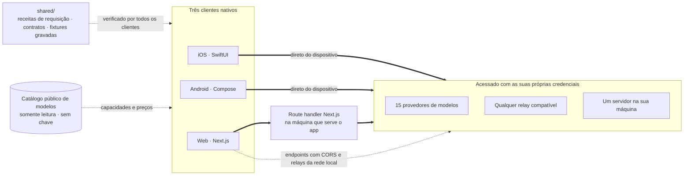

<div align="center">


# Oriveo Community Edition

**Todos os modelos, um só app.**

Chat com IA open source, com a sua própria chave, para iOS, Android e web,
com um cliente nativo para macOS em desenvolvimento.
Sem conta, sem assinatura e sem nenhum serviço nosso no caminho das requisições de chat.

<a href="../../LICENSE"></a>
<a href="ios.md"></a>
<a href="android.md"></a>
<a href="web.md"></a>
<a href="macos.md"></a>
<a href="https://github.com/oriveo/oriveo/releases/latest"></a>
<a href="https://github.com/oriveo/oriveo/stargazers"></a>

**Obtenha o Oriveo:**
<a href="https://oriveoai.com"><b>oriveoai.com</b></a> &nbsp;·&nbsp;
<a href="https://apps.apple.com/app/oriveo/id6775370458">App Store</a> &nbsp;·&nbsp;
<a href="https://play.google.com/store/apps/details?id=com.kenny.oriveo">Google Play</a> &nbsp;·&nbsp;
<a href="https://app.oriveoai.com">App web</a>

<sub>As builds das lojas são o <b>Oriveo</b>, a edição comercial. Este repositório é o <a href="#community-edition-e-oriveo">Community Edition</a>, compilado do código-fonte.</sub>

<a href="#começar">Compilar do código-fonte</a> &nbsp;·&nbsp;
<a href="#arquitetura">Arquitetura</a> &nbsp;·&nbsp;
<a href="#community-edition-e-oriveo">Edições</a> &nbsp;·&nbsp;
<a href="#faq">FAQ</a> &nbsp;·&nbsp;
<a href="../../CONTRIBUTING.md">Como contribuir</a>

<sub>

<a href="../../README.md">English</a> ·
<a href="../ar/README.md">العربية</a> ·
<a href="../de/README.md">Deutsch</a> ·
<a href="../es/README.md">Español</a> ·
<a href="../fr/README.md">Français</a> ·
<a href="../hi/README.md">हिन्दी</a> ·
<a href="../id/README.md">Indonesia</a> ·
<a href="../ja/README.md">日本語</a> ·
<a href="../ko/README.md">한국어</a> ·
**Português** ·
<a href="../ru/README.md">Русский</a> ·
<a href="../th/README.md">ไทย</a> ·
<a href="../tr/README.md">Türkçe</a> ·
<a href="../vi/README.md">Tiếng Việt</a> ·
<a href="../zh-Hans/README.md">简体中文</a> ·
<a href="../zh-Hant/README.md">繁體中文</a>

</sub>

&nbsp;
&nbsp;


<sub>Cada provedor que você usa e o que cada um já custou · um segundo modelo verificando o primeiro · uma resposta guardada como nota</sub>

</div>

---

## O que é o Oriveo

O Oriveo Community Edition é um cliente de chat com IA (AI chat client) open source e multimodelo
(multi-model) no modelo bring-your-own-key (BYOK) — você traz a sua própria chave — para iOS,
Android e web, com um cliente nativo para macOS em desenvolvimento. É uma alternativa local-first a
um plano hospedado do ChatGPT ou do Claude, para quem prefere pagar direto a um provedor de modelos
em vez de pagar assinatura para o que estiver na frente dele. Você fornece chaves de API que já
possui, o cliente conversa com o provedor usando elas, e o cliente web é seu para hospedar por conta
própria (self-host) — sem conta Oriveo e sem nada reportando nada de volta para nós.

Ele fala nativamente com **15 provedores de modelos** — OpenAI, Anthropic, Google Gemini,
OpenRouter, DeepSeek, Grok, Mistral, Groq, Together AI, Fireworks AI, MiniMax, Z.ai, Qwen,
Kimi (Moonshot) e SiliconFlow — além de **qualquer endpoint compatível com OpenAI, Anthropic ou
Gemini** para o qual você apontá-lo, incluindo llama.cpp, Ollama, LM Studio ou vLLM rodando na sua
própria máquina. Um só cliente de LLM (LLM client), um só conjunto de conversas, seja qual for o
modelo que responde.

<table>
<tr>
<td width="33%" valign="top"><b>15 provedores</b><br>Mais endpoints de retransmissão e servidores de modelo locais.</td>
<td width="33%" valign="top"><b>Local por padrão</b><br>Conversas, notas, pastas, habilidades e anexos ficam no dispositivo.</td>
<td width="33%" valign="top"><b>Um comportamento, três clientes</b><br>Uma especificação em <code>shared/</code>, três suítes a verificam.</td>
</tr><tr>
<td valign="top"><b>Sem conta</b><br>Nada reporta de volta para nós.</td>
<td valign="top"><b>Hospede você mesmo</b><br>O cliente web roda na sua máquina.</td>
<td valign="top"><b>16 idiomas</b><br>Layout completo da direita para a esquerda em árabe.</td>
</tr></table>

## Por que ele existe

Ninguém deveria conseguir tarifar, registrar ou remarcar o modelo que você está pagando.

- **Suas chaves, sua fatura.** Você paga o preço de tabela do provedor. Nada é remarcado, tarifado
  ou revendido.
- **Local por padrão.** Conversas, notas, pastas, habilidades e anexos ficam no dispositivo. Exporte tudo
  para um arquivo quando quiser; não existe cópia na nuvem para você perder o acesso.
- **Um comportamento, três clientes.** Como uma requisição é montada para um determinado provedor,
  transporte e capacidade é definido uma única vez em [`shared/`](shared.md), e os três clientes
  fazem asserções contra as mesmas fixtures JSON. Uma peculiaridade que mora nesses dados é corrigida
  uma vez; uma que mora em um parser é pega por três suítes de teste ao mesmo tempo.
- **A única coisa que ele busca.** Um catálogo público de modelos, somente leitura, para que um
  modelo lançado hoje funcione sem atualizar o app — sem chave, sem identificador anexado por nós e
  apontável para um host seu.

## Recursos

- **Chat** — streaming, blocos de raciocínio, citações, anexos (imagens e vídeo, PDF, Office (docx,
  xlsx, pptx), OpenDocument, EPUB, RTF, HTML e qualquer arquivo de texto puro ou de código), citar
  uma seleção, tentar de novo, regenerar, continuar depois de uma resposta interrompida
- **Provedores** — 15 embutidos, cada um com a sua própria chave; sobrescritas de modelo e de
  parâmetros de geração por provedor, e escolha de endpoint regional quando o provedor oferece um
- **Serviço de retransmissão (Relay)** — qualquer endpoint compatível com OpenAI, Anthropic ou
  Gemini, além da API nativa do llama.cpp, inclusive um na sua rede local
- **Servidores de modelo locais** — llama.cpp, Ollama, LM Studio, vLLM, Open WebUI; o iOS e o Android
  encontram esses servidores na rede local via mDNS quando a engine se anuncia, e sondando as portas
  habituais quando não
- **Login por assinatura** — use uma assinatura ChatGPT ou Grok que você já tem, no lugar de uma
  chave de API, pelo fluxo de autorização de dispositivo de cada provedor
- **Habilidades** — prompts de sistema reutilizáveis com modelo, configuração de raciocínio e
  documentos de referência próprios
- **Notas e pastas** — salve uma resposta como nota, organize conversas, busque nas duas coisas
- **Verificar com outro modelo** — entregue uma resposta a um segundo modelo para revisão e mantenha
  as duas juntas
- **Custo** — gasto por mensagem e por provedor, calculado no dispositivo a partir do que cada
  resposta de fato reportou, incluindo as faixas de leitura e de escrita de cache
- **Geração de imagens** — onde o provedor oferece suporte
- **Backup** — exporte tudo para um arquivo; as chaves de provedor nele, se você escolher incluí-las,
  são criptografadas com uma senha sua
- **16 idiomas de interface**, incluindo layout completo da direita para a esquerda em árabe

## Community Edition e Oriveo

Este repositório é o **Oriveo Community Edition**, licenciado sob
[AGPL-3.0-or-later](../../LICENSE). Os apps na App Store, no Google Play e o app web hospedado são o
**Oriveo** — um produto proprietário separado que acrescenta uma camada de conta.

| | Community Edition | Oriveo |
|---|---|---|
| Código-fonte | Este repositório, AGPL-3.0-or-later | Proprietário |
| Chat com as suas próprias chaves de provedor | Sim | Sim |
| Serviço de retransmissão e servidores de modelo locais | Sim | Sim |
| Notas, pastas, habilidades, anexos | Sim | Sim |
| Controle de custo no dispositivo | Sim | Sim |
| Conta | Nenhuma | Conta Oriveo |
| Armazenamento | No dispositivo; exportação e restauração manuais | Local-first, mais sincronização na nuvem entre dispositivos |
| Insights de uso e alertas de orçamento | — | Sim |
| Modelos pagos pelo Oriveo | — | Sim |
| Analytics e relatório de crash | Nenhum. O Sentry do bundle web fica mudo sem um DSN seu | Sim |

As builds da Community Edition usam o prefixo de identificador `ai.oriveo.community`, então uma delas
pode ficar no mesmo dispositivo que uma build de loja sem que as duas compartilhem keychain ou
qualquer dado local. O que esta edição aceita e o que não aceita está escrito em
[COMMUNITY.md](../../COMMUNITY.md).

**Oriveo, o produto completo:** [iPhone e iPad](https://apps.apple.com/app/oriveo/id6775370458) ·
[Android](https://play.google.com/store/apps/details?id=com.kenny.oriveo) · [Web](https://app.oriveoai.com) · [oriveoai.com](https://oriveoai.com)

## Provedores

Todo provedor abaixo é acessado com uma chave que você mesmo cria. Dois deles também podem ser
acessados entrando com uma assinatura que você já tem, no lugar de uma chave: a OpenAI com um plano
ChatGPT, e o Grok.

| Provedor | Onde obter uma chave |
|---|---|
| OpenAI | [platform.openai.com](https://platform.openai.com/api-keys) |
| Anthropic | [platform.claude.com](https://platform.claude.com/settings/keys) |
| Google Gemini | [aistudio.google.com](https://aistudio.google.com/apikey) |
| OpenRouter | [openrouter.ai](https://openrouter.ai/keys) |
| DeepSeek | [platform.deepseek.com](https://platform.deepseek.com/api_keys) |
| Grok | [console.x.ai](https://console.x.ai/) |
| Mistral | [console.mistral.ai](https://console.mistral.ai/api-keys) |
| Groq | [console.groq.com](https://console.groq.com/keys) |
| Together AI | [api.together.xyz](https://api.together.xyz/settings/api-keys) |
| Fireworks AI | [fireworks.ai](https://fireworks.ai/api-keys) |
| MiniMax | [platform.minimax.io](https://platform.minimax.io/docs/guides/quickstart-preparation) |
| Z.ai | [open.bigmodel.cn](https://open.bigmodel.cn/usercenter/apikeys) |
| Qwen | [bailian.console.alibabacloud.com](https://bailian.console.alibabacloud.com/?apiKey=1#/api-key) |
| Kimi (Moonshot) | [platform.kimi.ai](https://platform.kimi.ai/console/api-keys) |
| SiliconFlow | [cloud.siliconflow.cn](https://cloud.siliconflow.cn/account/ak) |
| **Serviço de retransmissão** | Qualquer endpoint compatível com OpenAI, Anthropic ou Gemini, além da API nativa do llama.cpp, inclusive um na sua própria máquina |

## Arquitetura

Três clientes nativos, uma única definição de como falar com um provedor de modelos.



Cada cliente tem a sua própria UI, armazenamento e navegação, e encontra os contratos compartilhados
em exatamente uma costura: a camada que transforma *este modelo, esta capacidade* em uma requisição
HTTP.

A única assimetria que vale conhecer é o cliente web. A maioria das APIs dos provedores não envia
cabeçalhos CORS, então um navegador não consegue chamá-las diretamente. Essas requisições passam por
um route handler Next.js rodando na máquina que serve o app — a sua, quando você roda localmente. Os
poucos endpoints que de fato aceitam um navegador (o endpoint chinês do Kimi e os endpoints de saldo
do OpenRouter, do SiliconFlow, do DeepSeek e do Kimi) e os relays na sua própria rede são chamados
diretamente. Os clientes iOS e Android não têm essa restrição e vão sempre direto ao provedor.

**A arquitetura de cada cliente:**

| | Stack | README |
|---|---|---|
| **iOS** | SwiftUI com uma transcrição em UIKit, GRDB | [ios.md](ios.md) |
| **Android** | Jetpack Compose, Room, Koin, Ktor/OkHttp | [android.md](android.md) |
| **Web** | Next.js App Router, React, Zustand, TypeScript | [web.md](web.md) |
| **macOS** | Em desenvolvimento, chegando nos próximos meses | [macos.md](macos.md) |
| **Shared** | Contratos, fixtures gravadas e o núcleo Swift de protocolo | [shared.md](shared.md) |

## Começar

Aqui não há binários prontos — nenhum APK, nenhum `.ipa`. O Community Edition é código-fonte que
você mesmo compila. O cliente web é o caminho mais curto para ter um app rodando.

<details open>
<summary><b>Web</b> — o jeito mais rápido de experimentar</summary>

<br>

Requer Node 22.22.2 ou uma versão 22.x mais recente (veja [`web/.nvmrc`](../../web/.nvmrc)); o Node 23+ não é suportado.

```bash
cd web
npm install
npm run dev:app        # http://localhost:3001
```

A primeira tela pede uma chave de API de provedor. Nada mais é necessário.
Mais comandos e configuração: [web.md](web.md).

</details>

<details>
<summary><b>iOS</b> — compile e rode no seu próprio iPhone</summary>

<br>

Requer um Mac com Xcode 26 e um dispositivo com iOS 18 ou superior. Uma conta gratuita de Apple
Developer é suficiente — o app não usa nenhuma capability paga.

1. Abra `ios/Oriveo/Oriveo.xcodeproj`
2. Selecione o scheme `Oriveo`
3. Em Signing &amp; Capabilities, escolha o seu próprio Team
4. Se o Xcode não conseguir registrar `ai.oriveo.community`, troque o bundle identifier por um que pertença ao seu Team
5. Rode

Passo a passo completo, incluindo o que fazer se o Xcode se recusar a abrir o projeto:
[ios.md](ios.md).

</details>

<details>
<summary><b>Android</b> — gere o APK</summary>

<br>

Requer JDK 21 e o Android SDK. O build usa AGP 9.3, Gradle 9.5 e Kotlin 2.3, então o Android Studio
precisa ser uma versão capaz de sincronizá-los. Pela linha de comando bastam o JDK e o SDK.

```bash
cd android
./gradlew :app:assembleDebug
```

Servindo o catálogo de modelos a partir do seu próprio host: [android.md](android.md).

</details>

## Privacidade

- **As chaves de provedor** vão para o Keychain do iOS e, no Android, para
  `EncryptedSharedPreferences` sob uma chave guardada no Keystore do Android. Um navegador não tem
  recurso equivalente, então na web elas ficam sem criptografia no IndexedDB — o mesmo modelo que os
  clientes BYOK de navegador costumam usar. Para a garantia mais forte, use o cliente iOS ou
  Android.
- **Conversas, notas, pastas, habilidades e anexos** ficam armazenados no dispositivo. Nada é enviado
  para lugar nenhum.
- **Sem conta e sem analytics.** Não há onde fazer login, e nada conta o que você faz. O bundle web
  inclui o Sentry para relato de erros. Ele fica mudo até você apontar `NEXT_PUBLIC_SENTRY_DSN` para
  um projeto seu e, se você fizer isso, ele está configurado para capturar também replays de sessão,
  além dos stack traces. Os clientes iOS e Android não contêm nenhum SDK de relato.
- **No iOS e no Android, as requisições de chat vão direto do dispositivo para o provedor.** Na web
  a maioria delas passa pelo servidor Next.js que serve o app, porque a maioria das APIs dos
  provedores não permite uma chamada direta do navegador. Esse servidor não persiste chaves nem
  mensagens, e quando você roda o app localmente ele é a sua própria máquina.
- **Duas requisições que o app faz por conta própria:** um catálogo de modelos somente leitura, lido
  em duas chamadas. Uma cobre como cada modelo quer ser chamado; a outra, os fatos sobre cada modelo,
  que o iOS só lê depois de um login por assinatura. Entre as duas, um modelo lançado hoje funciona
  sem um novo build. Nenhuma delas leva chave, conversa ou identificador anexado por nós. O host vê o
  User-Agent padrão da plataforma, e a única coisa que o cliente devolve é o próprio `ETag` do
  catálogo, como `If-None-Match`. O cliente web (`NEXT_PUBLIC_BACKEND_URL`) e o build Android
  (`-PORIVEO_METADATA_BASE_URL`) podem ser apontados para um host seu; no iOS essa sobrescrita é
  apenas uma conveniência de build Debug.

## FAQ

<details>
<summary><b>O Oriveo é um cliente BYOK para OpenAI, Claude, Gemini e OpenRouter?</b></summary>

<br>

Bring your own key: traga a sua própria chave. Você cria uma chave de API no console do próprio
provedor — OpenAI, Anthropic, Google e assim por diante — e cola no Oriveo. As requisições são
cobradas por esse provedor no preço de tabela dele. O Oriveo é o cliente; não é revendedor e não
fica com nenhuma parte.

</details>

<details>
<summary><b>O Oriveo é uma alternativa ao ChatGPT gratuita e open source?</b></summary>

<br>

O cliente é: open source, nada para assinar e nenhuma parte dele retida atrás de um pagamento. O que
você paga é o preço de tabela do próprio provedor de modelos pelas requisições que você faz, cobrado
por ele na conta a que a chave pertence. O Oriveo nunca vê essa fatura.

</details>

<details>
<summary><b>As minhas conversas passam por algum servidor do Oriveo?</b></summary>

<br>

Não. O iOS e o Android chamam o provedor diretamente. Na web a maioria das requisições passa pelo
servidor Next.js que está servindo o app — a sua própria máquina quando você roda localmente —,
porque a maioria das APIs dos provedores recusa uma chamada do navegador. Nenhum servidor operado por
nós fica no caminho do chat. Veja [Privacidade](#privacidade).

</details>

<details>
<summary><b>Funciona com Ollama, LM Studio ou llama.cpp?</b></summary>

<br>

Sim. Adicione uma conexão de retransmissão apontando para qualquer servidor compatível com OpenAI,
Anthropic ou Gemini — llama.cpp, Ollama, LM Studio, vLLM, Open WebUI, ou qualquer outro que fale um
desses protocolos. Os clientes iOS e Android encontram um deles na rede local via mDNS quando a
engine se anuncia, e sondando as portas habituais quando não; o cliente web sugere o endereço
habitual de cada engine. O HTTP local não usa credencial nenhuma e nunca sai da sua rede.

</details>

<details>
<summary><b>Posso hospedar o Oriveo por conta própria?</b></summary>

<br>

Sim. O cliente web é a única parte do projeto que tem algum lado servidor, e ela não guarda chaves
nem mensagens. Aponte-o para um servidor de modelos no seu próprio hardware, hospede o catálogo por
conta própria com `NEXT_PUBLIC_BACKEND_URL` (web) ou `-PORIVEO_METADATA_BASE_URL` (Android), e nada
alcança nada além da sua rede. No iOS essa sobrescrita só existe em builds Debug. Veja
[Privacidade](#privacidade).

</details>

<details>
<summary><b>Qual é a diferença entre o Community Edition e o app Oriveo da App Store?</b></summary>

<br>

Os apps das lojas são o Oriveo, um produto proprietário que acrescenta conta, sincronização na nuvem
entre dispositivos, insights de uso e modelos pagos pelo Oriveo. O Community Edition não tem nada
disso. Veja [Community Edition e Oriveo](#community-edition-e-oriveo) para a comparação completa.

</details>

<details>
<summary><b>Existe um app para macOS?</b></summary>

<br>

Um cliente nativo para macOS está em desenvolvimento e chega nos próximos meses; [`macos/`](macos.md)
é onde ele vai ficar. Até então, o cliente web funciona bem como app de desktop em qualquer navegador,
e o build de iOS roda em um Mac com Apple silicon direto do Xcode. O pacote Swift que fala com os
provedores já declara o macOS 15, então a camada de protocolo de que um cliente Mac precisa já está
sob teste hoje.

</details>

<details>
<summary><b>Em quais idiomas a interface está disponível?</b></summary>

<br>

Dezesseis: árabe, alemão, inglês, espanhol, francês, hindi, indonésio, japonês, coreano, português
do Brasil, russo, tailandês, turco, vietnamita, chinês simplificado e chinês tradicional. O árabe
tem layout completo da direita para a esquerda.

</details>

## Estrutura do repositório

```
ios/           cliente iOS (SwiftUI)
android/       cliente Android (Jetpack Compose)
web/           cliente web (Next.js)
macos/         cliente macOS — em desenvolvimento, chega nos próximos meses
shared/        contratos entre clientes, fixtures gravadas e o núcleo Swift
readme_i18n/   estes READMEs em mais quinze idiomas
docs/assets/   imagens usadas pelos READMEs
llms.txt       um índice desta documentação legível por máquina
.github/       modelos de issue e de pull request
```

## Como contribuir

Relatos de bug e pull requests são bem-vindos. O [CONTRIBUTING.md](../../CONTRIBUTING.md) explica
como compilar cada cliente e como é um bom pull request. O [COMMUNITY.md](../../COMMUNITY.md)
descreve para que serve esta edição, e os poucos tipos de mudança que não serão aceitos por melhor
que estejam escritos.

Encontrou um problema de segurança? Por favor, não abra uma issue pública — o
[SECURITY.md](../../SECURITY.md) explica como relatá-lo em privado, e o que este projeto trata e
não trata como vulnerabilidade. Espera-se que todos os participantes sigam o
[código de conduta](../../CODE_OF_CONDUCT.md).

## Licença

[AGPL-3.0-or-later](../../LICENSE). As contribuições são aceitas sob a mesma licença.

Nomes e logos de provedores pertencem aos seus respectivos donos e aparecem aqui apenas para
identificar os serviços para os quais este cliente pode ser apontado. Eles não estão cobertos pela
licença deste repositório, e a presença deles não é endosso de ninguém. As fontes e bibliotecas que
os clientes empacotam, e os termos sob os quais vêm, estão listadas em
[THIRD-PARTY-NOTICES.md](../../THIRD-PARTY-NOTICES.md).
