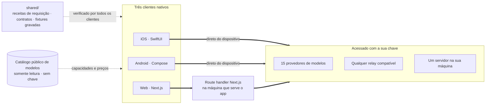

<div align="center">


# Oriveo

**Todos os modelos, um só app.**

Chat com IA open source, com a sua própria chave, para iOS, Android e web.
Sem conta, sem assinatura, sem nenhum servidor nosso entre você e o modelo.

<a href="../../LICENSE"></a>
<a href="ios.md"></a>
<a href="android.md"></a>
<a href="web.md"></a>


<a href="https://oriveoai.com">Site</a> &nbsp;·&nbsp;
<a href="#começar">Começar</a> &nbsp;·&nbsp;
<a href="#arquitetura">Arquitetura</a> &nbsp;·&nbsp;
<a href="#community-edition-e-oriveo">Edições</a> &nbsp;·&nbsp;
<a href="#faq">FAQ</a> &nbsp;·&nbsp;
<a href="../../CONTRIBUTING.md">Como contribuir</a>

<sub>

<a href="../../README.md">English</a> ·
<a href="../ar/README.md">العربية</a> ·
<a href="../de/README.md">Deutsch</a> ·
<a href="../es/README.md">Español</a> ·
<a href="../fr/README.md">Français</a> ·
<a href="../hi/README.md">हिन्दी</a> ·
<a href="../id/README.md">Indonesia</a> ·
<a href="../ja/README.md">日本語</a> ·
<a href="../ko/README.md">한국어</a> ·
**Português** ·
<a href="../ru/README.md">Русский</a> ·
<a href="../th/README.md">ไทย</a> ·
<a href="../tr/README.md">Türkçe</a> ·
<a href="../vi/README.md">Tiếng Việt</a> ·
<a href="../zh-Hans/README.md">简体中文</a> ·
<a href="../zh-Hant/README.md">繁體中文</a>

</sub>

</div>

---

## O que é o Oriveo

O Oriveo Community Edition é um cliente de chat com IA no modelo BYOK — você traz a sua própria
chave — para iOS, Android e web. Você fornece chaves de API que já possui, e o cliente conversa com
o provedor usando elas. Não existe conta Oriveo, não existe assinatura e não existe analytics.

Ele fala nativamente com **15 provedores de modelos** — OpenAI, Anthropic, Google Gemini,
OpenRouter, DeepSeek, Grok, Mistral, Groq, Together AI, Fireworks AI, MiniMax, Z.ai, Qwen, Kimi e
SiliconFlow — além de **qualquer endpoint compatível com OpenAI, Anthropic ou Gemini** para o qual
você apontá-lo, incluindo llama.cpp, Ollama, LM Studio ou vLLM rodando na sua própria máquina.

| | |
|---|---|
| **Provedores** | 15 embutidos, mais endpoints relay personalizados e servidores de modelo locais |
| **Clientes** | iOS (SwiftUI) · Android (Jetpack Compose) · Web (Next.js) |
| **Idiomas de interface** | 16 |
| **Conta necessária** | Nenhuma |
| **Chamadas que ele faz em nome próprio** | Uma: um catálogo de modelos somente leitura, sem chave e sem identificador anexado |
| **Licença** | AGPL-3.0-or-later |

## Por que ele existe

Um cliente de chat não deveria ficar entre você e o modelo que você está pagando.

- **Suas chaves, sua fatura.** Você paga o preço de tabela do provedor. Nada é remarcado, tarifado
  ou revendido.
- **Local por padrão.** Conversas, notas, pastas, skills e anexos ficam no dispositivo. Exporte tudo
  para um arquivo quando quiser; não existe cópia na nuvem para você perder o acesso.
- **Um comportamento, três clientes.** Como uma requisição é montada para um determinado provedor,
  transporte e capacidade é definido uma única vez em [`shared/`](shared.md), e os três clientes
  fazem asserções contra as mesmas fixtures JSON. Uma peculiaridade de provedor é corrigida uma vez,
  não três.
- **Honesto sobre a única chamada que faz.** O app busca um catálogo público de modelos para que um
  modelo lançado hoje funcione sem atualizar o app. Ele é somente leitura, não leva chave nem
  identificador, e você pode apontá-lo para o seu próprio host.

## Recursos

- **Chat** — streaming, blocos de raciocínio, citações, anexos (imagens, PDF, Office, EPUB, HTML,
  texto puro), citar uma seleção, tentar de novo, regenerar, continuar depois de uma resposta
  interrompida
- **Provedores** — 15 embutidos, cada um com a sua própria chave; sobrescritas de endpoint, modelo e
  parâmetros por provedor
- **Relay** — qualquer endpoint compatível com OpenAI, Anthropic ou Gemini, inclusive um na sua rede
  local
- **Servidores de modelo locais** — llama.cpp, Ollama, LM Studio, vLLM, com descoberta na rede local
- **Login por assinatura** — use uma assinatura Codex ou Grok que você já tem, no lugar de uma chave
  de API
- **Skills** — prompts de sistema reutilizáveis com modelo, parâmetros e documentos de referência
  próprios
- **Notas e pastas** — salve uma resposta como nota, organize conversas, busca em texto completo
- **Verificação cruzada** — refaça a mesma pergunta a um segundo modelo e mantenha as duas respostas
  lado a lado
- **Custo** — gasto por mensagem e por provedor, calculado no dispositivo a partir do que cada
  resposta de fato reportou, incluindo faixas de desconto por cache
- **Geração de imagens** — onde o provedor oferece suporte
- **Backup** — exporte tudo para um arquivo, opcionalmente criptografado com uma senha escolhida por
  você
- **16 idiomas de interface**, incluindo layout completo da direita para a esquerda em árabe

## Community Edition e Oriveo

Este repositório é o **Oriveo Community Edition**, licenciado sob
[AGPL-3.0-or-later](../../LICENSE). Os apps na App Store, no Google Play e o app web hospedado são o
**Oriveo** — um produto proprietário separado, construído a partir dos mesmos clientes, com uma
camada de conta por cima.

| | Community Edition | Oriveo |
|---|---|---|
| Código-fonte | Este repositório, AGPL-3.0-or-later | Proprietário |
| Chat com as suas próprias chaves de provedor | Sim | Sim |
| Relay e servidores de modelo locais | Sim | Sim |
| Notas, pastas, skills, anexos | Sim, ilimitados | Sim |
| Controle de custo no dispositivo | Sim | Sim |
| Conta | Nenhuma | Conta Oriveo |
| Armazenamento | No dispositivo; exportação e restauração manuais | Local-first, mais sincronização na nuvem entre dispositivos |
| Insights de uso e alertas de orçamento | — | Sim |
| Modelos pagos pelo Oriveo | — | Sim |
| Analytics e relatório de crash | Nenhum | Sim |

As builds da Community Edition usam o prefixo de identificador `ai.oriveo.community`, então uma
delas pode conviver com uma build de loja sem que as duas compartilhem keychain, canal de
atualização ou dados locais. O que esta edição aceita e o que não aceita está escrito em
[COMMUNITY.md](../../COMMUNITY.md).

**Oriveo, o produto completo:**
[iPhone e iPad](https://apps.apple.com/app/oriveo/id6775370458) &nbsp;·&nbsp;
[Android](https://play.google.com/store/apps/details?id=com.kenny.oriveo) &nbsp;·&nbsp;
[Web](https://app.oriveoai.com) &nbsp;·&nbsp;
[oriveoai.com](https://oriveoai.com)

## Provedores

Todo provedor abaixo é acessado com uma chave que você mesmo cria.

| Provedor | Onde obter uma chave |
|---|---|
| OpenAI | [platform.openai.com](https://platform.openai.com/api-keys) |
| Anthropic | [console.anthropic.com](https://console.anthropic.com/settings/keys) |
| Google Gemini | [aistudio.google.com](https://aistudio.google.com/apikey) |
| OpenRouter | [openrouter.ai](https://openrouter.ai/keys) |
| DeepSeek | [platform.deepseek.com](https://platform.deepseek.com/api_keys) |
| Grok | [console.x.ai](https://console.x.ai/) |
| Mistral | [console.mistral.ai](https://console.mistral.ai/api-keys) |
| Groq | [console.groq.com](https://console.groq.com/keys) |
| Together AI | [api.together.xyz](https://api.together.xyz/settings/api-keys) |
| Fireworks AI | [fireworks.ai](https://fireworks.ai/api-keys) |
| MiniMax | [platform.minimax.io](https://platform.minimax.io/docs/guides/quickstart-preparation) |
| Z.ai | [open.bigmodel.cn](https://open.bigmodel.cn/usercenter/apikeys) |
| Qwen | [bailian.console.alibabacloud.com](https://bailian.console.alibabacloud.com/?apiKey=1#/api-key) |
| Kimi | [platform.kimi.ai](https://platform.kimi.ai/console/api-keys) |
| SiliconFlow | [cloud.siliconflow.cn](https://cloud.siliconflow.cn/account/ak) |
| **Relay** | Qualquer endpoint compatível com OpenAI, Anthropic ou Gemini, inclusive um na sua própria máquina |

## Arquitetura

Três clientes nativos, uma única definição de como falar com um provedor de modelos.



Cada cliente tem a sua própria UI, armazenamento e navegação, e encontra os contratos compartilhados
em exatamente uma costura: a camada que transforma *este modelo, esta capacidade* em uma requisição
HTTP.

A única assimetria que vale conhecer é o cliente web. As APIs dos provedores não enviam cabeçalhos
CORS, então um navegador não consegue chamá-las diretamente; por isso as requisições aos 15
provedores oficiais passam por um route handler Next.js rodando na máquina que serve o app — a sua,
quando você roda localmente. Os clientes iOS e Android não têm essa restrição e vão direto ao
provedor. Endpoints relay na sua própria rede também são chamados diretamente pelo navegador.

**A arquitetura de cada cliente:**

| | Stack | README |
|---|---|---|
| **iOS** | SwiftUI com uma transcrição em UIKit, GRDB | [ios/README.md](ios.md) |
| **Android** | Jetpack Compose, Room, Koin, Ktor/OkHttp | [android/README.md](android.md) |
| **Web** | Next.js App Router, React, Zustand, TypeScript | [web/README.md](web.md) |
| **Shared** | Contratos, fixtures gravadas e o núcleo Swift de protocolo | [shared/README.md](shared.md) |

## Começar

<details open>
<summary><b>Web</b> — o jeito mais rápido de experimentar</summary>

<br>

Requer Node 22 (veja [`web/.nvmrc`](../../web/.nvmrc)).

```bash
cd web
npm install
npm run dev:app        # http://localhost:3001
```

A primeira tela pede uma chave de API de provedor. Nada mais é necessário.
Mais comandos e configuração: [web/README.md](web.md).

</details>

<details>
<summary><b>iOS</b> — compile e rode no seu próprio iPhone</summary>

<br>

Requer um Mac com Xcode 26 e um dispositivo com iOS 18 ou superior. Uma conta gratuita de Apple
Developer é suficiente — o app não usa nenhuma capability paga.

1. Abra `ios/Oriveo/Oriveo.xcodeproj`
2. Selecione o scheme `Oriveo`
3. Em Signing &amp; Capabilities, escolha o seu próprio Team
4. Rode

Passo a passo completo, incluindo o que fazer se o Xcode se recusar a abrir o projeto:
[ios/README.md](ios.md).

</details>

<details>
<summary><b>Android</b> — gere o APK</summary>

<br>

Requer JDK 17 ou superior e o Android SDK. O build usa AGP 9.3, Gradle 9.5 e Kotlin 2.3, então o
Android Studio precisa ser uma versão capaz de sincronizá-los; pela linha de comando bastam o JDK e
o SDK.

```bash
cd android
./gradlew :app:assembleDebug
```

Servindo o catálogo de modelos a partir do seu próprio host: [android/README.md](android.md).

</details>

## Privacidade

- **As chaves de provedor** são guardadas pelo recurso próprio de cada plataforma — o Keychain do
  iOS, o Keystore do Android (`EncryptedSharedPreferences`) ou o IndexedDB do navegador — e são
  usadas apenas para acessar o provedor a que pertencem. Na web elas ficam armazenadas sem
  criptografia, o mesmo modelo que os clientes BYOK de navegador costumam usar; para a garantia mais
  forte, use o cliente iOS ou Android.
- **Conversas, notas, pastas, skills e anexos** ficam armazenados no dispositivo. Nada é enviado para
  lugar nenhum.
- **Sem conta, sem analytics, sem relatório de crash.** Não há onde fazer login e não há nada ligando
  de volta para casa.
- **No iOS e no Android, as requisições de chat vão direto do dispositivo para o provedor.** Na web
  elas passam pelo servidor Next.js que serve o app, porque as APIs dos provedores não permitem
  chamadas diretas do navegador; esse servidor não persiste chaves nem mensagens, e quando você roda
  o app localmente ele é a sua própria máquina.
- **Uma requisição nossa:** um catálogo de modelos somente leitura, buscado sem chave, sem conversa e
  sem nenhum identificador anexado, para que um modelo lançado hoje funcione sem um novo build.
  Aponte-o para o seu próprio host se preferir servi-lo você mesmo.

## FAQ

<details>
<summary><b>O que significa BYOK?</b></summary>

<br>

Bring your own key: traga a sua própria chave. Você cria uma chave de API no console do próprio
provedor — OpenAI, Anthropic, Google e assim por diante — e cola no Oriveo. As requisições são
cobradas por esse provedor no preço de tabela dele. O Oriveo é o cliente; não é revendedor e não
fica com nenhuma parte.

</details>

<details>
<summary><b>As minhas conversas passam por algum servidor do Oriveo?</b></summary>

<br>

Não. No iOS e no Android o cliente chama o endpoint do provedor diretamente. Na web a requisição
passa pelo servidor Next.js que está servindo o app — a sua própria máquina quando você roda
localmente —, porque navegadores não conseguem chamar as APIs dos provedores diretamente. Nenhum dos
caminhos envolve um servidor operado pelo Oriveo. A única requisição que o Oriveo faz em nome
próprio é a busca somente leitura do catálogo público de modelos, que não leva chave, nem conversa,
nem identificador.

</details>

<details>
<summary><b>Posso usar um modelo rodando na minha própria máquina?</b></summary>

<br>

Sim. Adicione uma conexão Relay apontando para qualquer servidor compatível com OpenAI, Anthropic ou
Gemini — llama.cpp, Ollama, LM Studio, vLLM, ou qualquer outro que fale um desses protocolos. Os
clientes Android e web também conseguem descobrir um servidor desses na rede local. O HTTP local não
usa credencial nenhuma e nunca sai da sua rede.

</details>

<details>
<summary><b>Qual é a diferença para o app da App Store?</b></summary>

<br>

Os apps das lojas são o Oriveo, um produto proprietário que acrescenta conta, sincronização na nuvem
entre dispositivos, insights de uso e modelos pagos pelo Oriveo. O Community Edition são os mesmos
três clientes sem nada disso: sem conta, sem serviço de sincronização, sem cobrança, sem analytics.
Veja [Community Edition e Oriveo](#community-edition-e-oriveo) para a comparação completa.

</details>

<details>
<summary><b>Existe um cliente para macOS?</b></summary>

<br>

Não neste repositório. Enquanto isso, o cliente web funciona bem como app de desktop em qualquer
navegador, e o build de iOS roda em Macs com Apple silicon.

</details>

<details>
<summary><b>Em quais idiomas a interface está disponível?</b></summary>

<br>

Dezesseis: árabe, alemão, inglês, espanhol, francês, hindi, indonésio, japonês, coreano, português
do Brasil, russo, tailandês, turco, vietnamita, chinês simplificado e chinês tradicional. O árabe
tem layout completo da direita para a esquerda.

</details>

## Estrutura do repositório

```
ios/       iOS client (SwiftUI)
android/   Android client (Jetpack Compose)
web/       Web client (Next.js)
macos/     Reserved for a macOS client
shared/    Cross-client contracts, recorded fixtures, and the Swift wire kernel
```

## Como contribuir

Relatos de bug e pull requests são bem-vindos. O [CONTRIBUTING.md](../../CONTRIBUTING.md) explica
como compilar cada cliente e como é um bom pull request; o [COMMUNITY.md](../../COMMUNITY.md)
descreve para que serve esta edição, e os poucos tipos de mudança que não serão aceitos por melhor
que estejam escritos.

Encontrou um problema de segurança? Por favor, não abra uma issue pública — o
[SECURITY.md](../../SECURITY.md) explica como relatá-lo em privado, e o que este projeto trata e
não trata como vulnerabilidade. Espera-se que todos os participantes sigam o
[código de conduta](../../CODE_OF_CONDUCT.md).

## Licença

[AGPL-3.0-or-later](../../LICENSE). As contribuições são aceitas sob a mesma licença.
