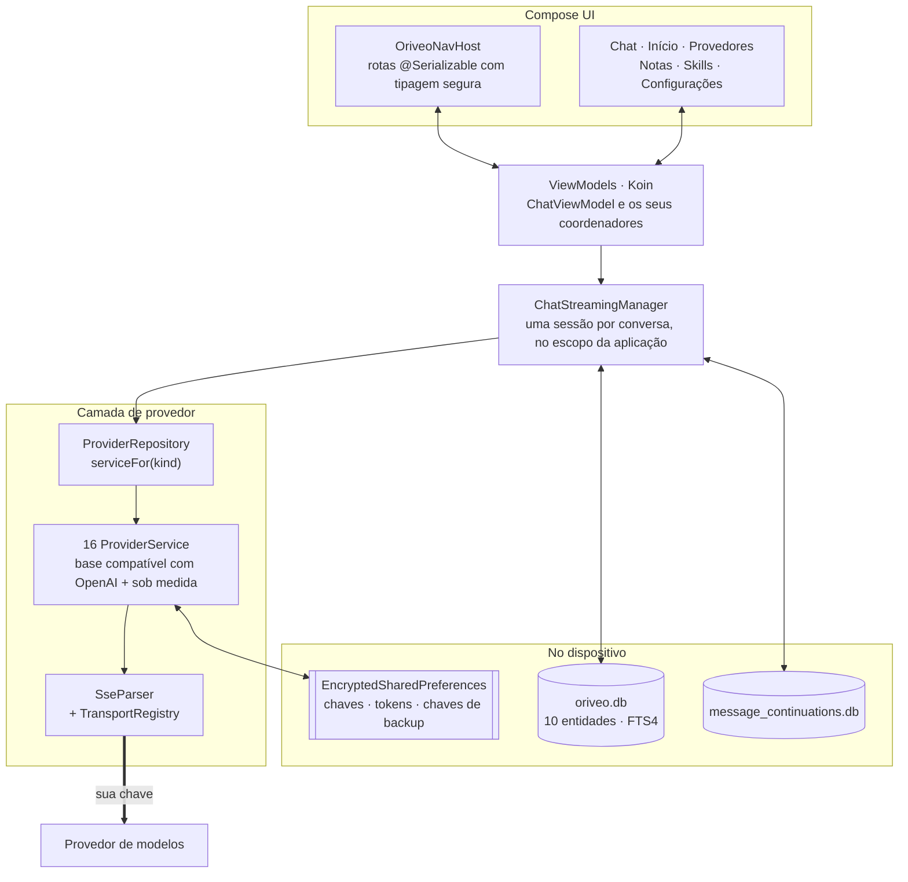

<div align="center">

# Oriveo para Android

**Um cliente de chat nativo em Jetpack Compose para os modelos de IA que você já paga.**

<a href="../../LICENSE"></a>


<sub>

<a href="../../android/README.md">English</a> ·
<a href="../ar/android.md">العربية</a> ·
<a href="../de/android.md">Deutsch</a> ·
<a href="../es/android.md">Español</a> ·
<a href="../fr/android.md">Français</a> ·
<a href="../hi/android.md">हिन्दी</a> ·
<a href="../id/android.md">Indonesia</a> ·
<a href="../ja/android.md">日本語</a> ·
<a href="../ko/android.md">한국어</a> ·
**Português** ·
<a href="../ru/android.md">Русский</a> ·
<a href="../th/android.md">ไทย</a> ·
<a href="../tr/android.md">Türkçe</a> ·
<a href="../vi/android.md">Tiếng Việt</a> ·
<a href="../zh-Hans/android.md">简体中文</a> ·
<a href="../zh-Hant/android.md">繁體中文</a>

</sub>

</div>

---

O cliente Android do Oriveo é um app de chat com IA no modelo BYOK. Você adiciona chaves de API que
já possui, e o app conversa com cada provedor diretamente do telefone. Conversas, notas, pastas e
skills são armazenadas no dispositivo em Room; as chaves de API são criptografadas com uma chave
guardada no Android Keystore. Não há conta nem login.

Ele faz parte do [Oriveo Community Edition](README.md) — três clientes que compartilham uma única
definição de como falar com um provedor de modelos.

## Arquitetura



Três coisas neste diagrama são decisões de projeto deliberadas, não estrutura acidental.

**O streaming vive acima da tela.** O `ChatStreamingManager` mantém uma `StreamingSession` por id de
conversa em um `ConcurrentHashMap`, cada uma com o seu próprio
`CoroutineScope(SupervisorJob() + Dispatchers.IO)` no escopo da aplicação. Sair de um chat não
cancela a resposta, e o `StreamingTokenBuffer` descarrega periodicamente o texto parcial no SQLite,
então matar o app no meio de uma resposta não perde o que já chegou.

**Dois bancos de dados, não um.** O `oriveo.db` guarda conversas, mensagens, anexos, notas, pastas,
skills e o cache do catálogo de modelos. O `message_continuations.db` é um arquivo fisicamente
separado que guarda estado opaco de continuação do provedor, justamente para que `backup_rules.xml`
e `data_extraction_rules.xml` possam excluí-lo do backup na nuvem e da transferência entre
dispositivos — um token de continuação restaurado em outro aparelho é, na melhor das hipóteses, sem
sentido.

**Um catálogo mais novo que o binário degrada, não quebra.** `TransportKind` é um enum fechado com um
deserializador tolerante: uma string de transporte desconhecida decodifica para `null`, o
`TransportRegistry` não devolve estratégia nenhuma, e o modelo é filtrado para fora do seletor. A
alternativa — um enum estrito — faria o parse do catálogo inteiro falhar e derrubaria junto todos os
outros modelos.

## O que um modelo pode fazer

O cliente nunca adivinha as capacidades de um modelo pelo nome. Ele lê um runtime de capacidades do
catálogo: receitas que descrevem, para um dado provedor, transporte e capacidade, exatamente quais
JSON pointers escrever na requisição. O `ProviderRecipeRequestCompiler` valida a receita contra o
provedor, a capacidade e o transporte antes de compilá-la em um delta de corpo próprio, e rejeita
com um motivo nomeado (`recipe_not_found`, `transport_mismatch`,
`model_route_must_not_patch_body`) em vez de produzir silenciosamente uma requisição que ninguém
revisou.

Na volta, o `CapabilityEvidenceFacade` ordena o que realmente se sabe sobre uma capacidade por
fonte — `operator_override` > `server_typed` > `server_profile` > `model_facts` >
`relay_verification` > `relay_declaration` > `legacy_metadata`. Só o parser de stream pode marcar
uma capacidade como *observada*; intenção, receitas, um HTTP 200 e uma declaração de tool
explicitamente não contam. O resultado por mensagem é persistido, então a interface consegue
distinguir *pedido* de *confirmado*.

As sobrescritas são resolvidas por last-write-wins em sete escopos, em ordem de prioridade:
`single_send` > `conversation_connection_model` > `skill_agent` > `connection_model` > `connection` >
`provider_recipe` > `provider_default`.

## Armazenamento e segredos

| O quê | Onde |
|---|---|
| Conversas, mensagens, anexos, notas, pastas, skills | Room, `oriveo.db` |
| Busca em texto completo sobre notas | tabela virtual FTS4 |
| Cache do catálogo de modelos | uma única linha em `oriveo.db`, lida de volta em pedaços |
| Estado de continuação do provedor | `message_continuations.db`, excluído do backup |
| Chaves de API dos provedores | `EncryptedSharedPreferences`, AES-256-GCM, chave mestra guardada no Keystore |
| Tokens OAuth de assinatura | um segundo arquivo de preferências criptografado, separado |
| Chaves dos arquivos de backup | um terceiro |
| Blobs de anexo | arquivos em disco, referenciados por id |

Os três arquivos de preferências criptografados são separados por tempo de vida e raio de impacto,
em vez de fundidos por conveniência. Cada um tem um caminho de recuperação: um arquivo corrompido
(`AEADBadTagException`, `VERIFICATION_FAILED`) é detectado, apagado e recriado, em vez de derrubar o
app a cada inicialização.

Os três, mais o banco de continuações, ficam de fora do backup na nuvem e da transferência entre
dispositivos do Android. Isso é consequência de estarem atrelados ao Keystore, não um descuido — o
texto cifrado seria indecifrável no aparelho novo de qualquer forma. **Depois de trocar de celular,
você digita as suas chaves de API de novo e faz login outra vez em qualquer assinatura de
provedor**; conversas e notas passam normalmente.

Os arquivos de backup que você mesmo exporta são criptografados à parte, com PBKDF2-HMAC-SHA256 a
600.000 iterações e AES-GCM, usando uma senha escolhida por você.

## Alcançando um servidor de modelo na sua própria rede

O manifest define `android:usesCleartextTraffic="true"`, e isso é deliberado: servidores de modelo
locais — llama.cpp, Ollama, LM Studio, vLLM — falam HTTP puro na sua própria máquina ou na sua rede
local, e em geral não têm certificado.

A fronteira de verdade está no código, não no manifest, porque tem que estar. O
`RelayEndpointPolicy` resolve o host, exige que **todos** os endereços resolvidos sejam privados
(loopback, RFC 1918, link-local, unique-local e a faixa CGNAT em modo VPN), rejeita um host que
resolve para uma mistura de endereços públicos e privados, fixa o conjunto de endereços resolvidos
contra DNS rebinding e o reverifica na hora de enviar, recusa qualquer requisição em texto claro que
carregue material de credencial e bloqueia redirecionamentos entre origens ou que troquem de
esquema.

Uma network security config do Android não consegue expressar esse conjunto: ela casa apenas por
nome de host, não tem sintaxe para faixas de endereços, e aqui os endereços vêm da rede do próprio
usuário em tempo de execução. Uma config também seria estritamente mais fraca, já que nunca enxerga
o endereço para o qual um nome foi resolvido.

## O catálogo de modelos

O app lê capacidades e preços de modelos de um catálogo público, para que um modelo lançado hoje
funcione sem atualizar o app. É um `GET` HTTPS simples, sem credenciais e sem identificador anexado,
e as requisições de chat nunca passam perto dele. Só dois endpoints são consultados:

```
GET {base}/api/metadata?view=lean
GET {base}/api/metadata/model-facts
```

A URL base é uma propriedade de build, com padrão `https://api.oriveoai.com`:

```bash
./gradlew :app:assembleDebug -PORIVEO_METADATA_BASE_URL=https://your.host
```

As respostas são revalidadas por ETag e cacheadas em `oriveo.db`, então, uma vez que uma busca tenha
dado certo, o app continua funcionando a partir da cópia em cache quando o catálogo ficar
inacessível mais tarde.

> [!IMPORTANT]
> Compilar com um valor vazio (`-PORIVEO_METADATA_BASE_URL=`) desativa por completo a busca do
> catálogo, e **não há snapshot embutido no APK**. Em uma instalação nova de um build desses:
>
> - nenhum dos 15 provedores embutidos recebe lista de modelos, e o app não pede uma ao provedor —
>   o catálogo é a única fonte;
> - a falha é **silenciosa**. Adicionar uma chave continua reportando sucesso, e o seletor de
>   modelos fica simplesmente vazio, sem explicação;
> - a **OpenAI fica inutilizável**, porque a entrada manual de modelos é bloqueada para esse
>   provedor;
> - endpoints Relay e servidores de modelo locais continuam funcionando por completo, e são o único
>   caminho intacto.
>
> Se você quer um build offline, sirva o catálogo você mesmo e aponte o build para ele, em vez de
> esvaziar o valor.

## Estrutura do projeto

```
android/
  app/src/main/java/ai/oriveo/community/
    core/
      provider/    every provider service, transports, relay, capability recipes
      data/        Room entities, DAOs, repositories, backup, catalog client
      model/       domain models and the capability/preference resolvers
      attachments/ routing, budgets, per-format text extraction
      security/    SecureKeyStore, BackupCrypto, external-URL policy
      streaming/   ChatStreamingManager
      navigation/  AppRoute, OriveoNavHost
    feature/       one package per screen
    ui/            shared components, Markdown + LaTeX renderer, theme
    di/            Koin modules
  benchmark/       macrobenchmark suite (cold start, model picker)
```

## Compilando

Requisitos: **JDK 17 ou superior** e o Android SDK. O build usa AGP 9.3, Gradle 9.5 e Kotlin 2.3,
então o Android Studio precisa ser uma versão capaz de sincronizar o AGP 9.3; pela linha de comando
bastam o JDK e o SDK.

```bash
./gradlew :app:assembleDebug
./gradlew :app:testDebugUnitTest
```

O build tem como alvo `minSdk 26`, `targetSdk 36`, `compileSdk 37`. O `local.properties` (o caminho
do seu SDK) é gerado pelo Android Studio e não é versionado. A assinatura de release está descrita
em [SIGNING.md](../../android/SIGNING.md).

> [!NOTE]
> O daemon do Gradle roda sobre uma toolchain Java 21 (`gradle/gradle-daemon-jvm.properties`), e o
> casamento é com o 21 exatamente, não com "21 ou mais novo". Com qualquer outro JDK instalado, o
> Gradle baixa um JDK 21 para si no primeiro build, o que exige acesso à rede; instalar o JDK 21
> você mesmo evita isso. Se você definiu `org.gradle.java.installations.auto-download=false`, esse
> download não pode acontecer e o build falha com `Toolchain auto-provisioning is not enabled.` —
> esse é o único caso em que só o JDK 17 realmente não basta. De todo jeito, a compilação tem como
> alvo o Java 17.

O paralelismo dos testes unitários é derivado da contagem de CPUs e da memória física da máquina, em
vez de ser fixado no código, então a suíte se comporta bem tanto em um notebook quanto em uma
workstation grande.

## Dependências

| Biblioteca | Versão | Usada para |
|---|---|---|
| Jetpack Compose BOM | 2026.08.00 | UI, Material 3 |
| Room | 2.8.4 | SQLite, DAOs, FTS4 |
| Koin | 4.2.2 | injeção de dependências |
| Ktor client (motor OkHttp) | 3.5.2 | HTTP e SSE dos provedores |
| kotlinx.serialization | 1.11.0 | JSON |
| navigation-compose | 2.9.6 | rotas com tipagem segura |
| androidx.security-crypto | 1.1.0 | `EncryptedSharedPreferences` |
| haze | 1.7.3 | desfoque de fundo |
| PDFBox-Android, jsoup | 2.0.27.0, 1.23.2 | extração de texto de anexos |
| jlatexmath-android | 0.2.0 | renderização de LaTeX |

As versões exatas estão fixadas em
[`gradle/libs.versions.toml`](../../android/gradle/libs.versions.toml).

## Testes

```bash
./gradlew :app:testDebugUnitTest
```

Cerca de 3.000 testes unitários em 319 arquivos, usando JUnit 4, MockK, Turbine,
`kotlinx-coroutines-test` e o mock engine do Ktor. A cobertura é mais densa onde os erros custam
mais caro: formato da requisição por provedor, parsing de SSE, seleção de transporte, sondagem de
relay e modos de segurança, execução de receitas de capacidade, cache do catálogo e tratamento de
versão de contrato, persistência no Room e ciclos completos de backup.

> [!IMPORTANT]
> Cerca de 38 suítes carregam fixtures de contrato de `shared/` subindo a partir do diretório de
> trabalho, então **os testes só passam em um checkout completo** — copiar só `android/` para fora
> não vai funcionar.

Existem também três testes instrumentados — uma matriz de releases de engines locais, um teste de
socket em texto claro e um teste de isolamento do keystore. Eles não são autocontidos: os de engine
local precisam de argumentos de instrumentação nomeando um servidor de modelo real rodando na sua
rede, então o `connectedAndroidTest` não passa de saída. A suíte de testes unitários é o portão para
um pull request.

O módulo `:benchmark` guarda macrobenchmarks de inicialização a frio e do seletor de modelos. É um
módulo Gradle separado que usa `com.android.test` com auto-instrumentação, e ele aciona um build
type `benchmark` dedicado do `:app`.

Os dois bancos de dados estão em `version = 1`, ainda sem migrações; os schemas são exportados para
`app/schemas/` e versionados, que é onde o `2.json` da primeira migração vai cair.

## Localização

Dezesseis idiomas: `values/` (inglês, a origem) mais quinze diretórios `values-*`, com cerca de
1.700 strings cada, e todos os locales mantendo um conjunto de chaves idêntico. A troca de idioma
dentro do app passa por `AppLanguageManager` e `android:localeConfig`. Os splits por idioma estão
desativados no bundle, para que um único artefato carregue todas as traduções.

## Como contribuir

Veja o [CONTRIBUTING.md](../../CONTRIBUTING.md). O idioma de trabalho do projeto é o inglês: código,
comentários, testes e mensagens de commit. As strings de interface são traduzidas — adicione uma
string nova em `values/` primeiro e deixe os outros locales virem depois. Rode os testes unitários
antes de abrir um pull request.

## Licença

[AGPL-3.0-or-later](../../LICENSE).
