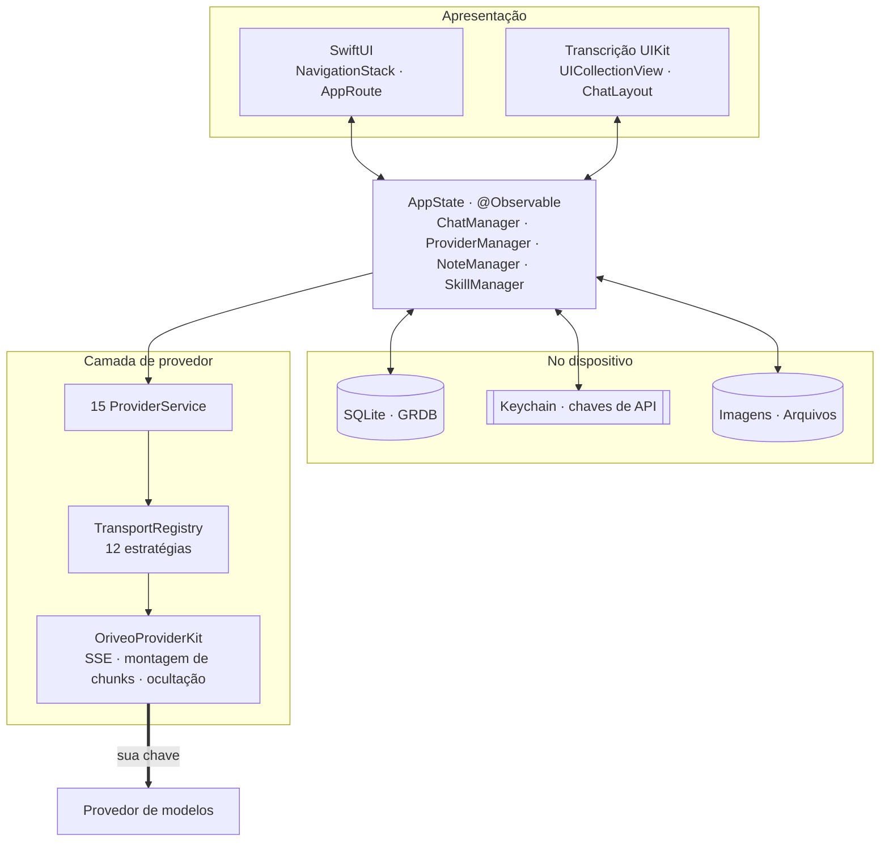
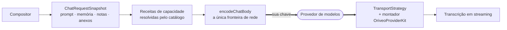

<div align="center">

# Oriveo para iOS

**Um cliente de chat nativo em SwiftUI para os modelos de IA que você já paga.**

<a href="../../LICENSE"></a>


<sub>

<a href="../../ios/README.md">English</a> ·
<a href="../ar/ios.md">العربية</a> ·
<a href="../de/ios.md">Deutsch</a> ·
<a href="../es/ios.md">Español</a> ·
<a href="../fr/ios.md">Français</a> ·
<a href="../hi/ios.md">हिन्दी</a> ·
<a href="../id/ios.md">Indonesia</a> ·
<a href="../ja/ios.md">日本語</a> ·
<a href="../ko/ios.md">한국어</a> ·
**Português** ·
<a href="../ru/ios.md">Русский</a> ·
<a href="../th/ios.md">ไทย</a> ·
<a href="../tr/ios.md">Türkçe</a> ·
<a href="../vi/ios.md">Tiếng Việt</a> ·
<a href="../zh-Hans/ios.md">简体中文</a> ·
<a href="../zh-Hant/ios.md">繁體中文</a>

</sub>

</div>

---

O cliente iOS do Oriveo é um app de chat com IA no modelo BYOK. Você adiciona chaves de API que já
possui, e o app chama cada provedor diretamente do telefone. Conversas, notas, pastas, skills e
anexos são armazenados no dispositivo em SQLite; as chaves de API vão para o Keychain do iOS. Não há
conta nem login.

Ele faz parte do [Oriveo Community Edition](README.md) — três clientes que compartilham uma única
definição de como falar com um provedor de modelos.

## Arquitetura



Três coisas sobre este diagrama merecem ser ditas com clareza.

**A transcrição é UIKit, o resto é SwiftUI.** O `ChatView` embute um
`ChatListViewControllerRepresentable` em volta de uma `UICollectionView` conduzida pelo
[ChatLayout](https://github.com/ekazaev/ChatLayout). Todo o resto — navegação, configurações,
cadastro de provedor, notas, skills — é SwiftUI. A divisão existe porque uma transcrição em
streaming na velocidade dos tokens precisa de um controle no nível da célula sobre medição e reuso
que o diffing do SwiftUI não oferece. O
[`Features/Chat/ARCHITECTURE.md`](../../ios/Oriveo/Oriveo/Features/Chat/ARCHITECTURE.md) documenta
essa fronteira.

**Três caminhos separados atualizam essa transcrição**, de propósito:

| Caminho | Carrega | Por quê |
|---|---|---|
| `@Observable AppState` | mudanças estruturais — uma mensagem aparece, uma conversa muda | nativo do SwiftUI, barato para eventos de baixa frequência |
| GRDB `ValueObservation` | estado durável lido de volta do SQLite | uma única fonte de verdade depois de uma escrita, sobrevive a um relançamento |
| Combine `PassthroughSubject` por conversa | deltas de texto e de raciocínio em streaming | contorna completamente o diffing do SwiftUI na velocidade dos tokens |

**O suporte a provedores são quatro eixos independentes, não um enum.** `ProviderKind` (16 casos) é
*quem o usuário configurou*. `ProviderServiceProtocol` é *a superfície de chamada*. `TransportKind`
(12 casos) é *qual protocolo de rede é de fato falado* — e ele é resolvido **por modelo, a partir do
catálogo**, então dois modelos atrás da mesma chave podem discordar. `RelayKind` cobre endpoints
fornecidos pelo usuário. Mantê-los separados é o que permite que um modelo novo funcione sem um novo
build.

### Como uma mensagem é enviada



O `BaseAPIService.encodeChatBody` é o ponto único onde o corpo de uma requisição vira bytes. Toda
receita de capacidade, parâmetro de geração e campo personalizado tem que passar por ele, e é isso
que torna o formato de rede testável em um lugar só, em vez de quinze.

## O que um modelo pode fazer

O cliente nunca adivinha as capacidades de um modelo pelo nome. Ele lê um **runtime de capacidades**
— um conjunto de receitas que descrevem, para um dado provedor, transporte e capacidade, exatamente
quais JSON pointers escrever na requisição. Essas receitas ficam em
[`shared/capabilityrecipe`](shared.md) e são aplicadas pelo `CapabilityRecipeRequestCompiler`.

Na volta, o `CapabilityExecutionRuntime` registra o que de fato aconteceu. Só um parser de stream de
produção selecionado pode promover uma capacidade a *observada*. Um HTTP 200, uma resposta não
vazia e uma declaração de tool na requisição explicitamente **não** são evidência. O estado final é
guardado por mensagem, para que a interface possa dizer que um controle foi pedido mas nunca
confirmado, em vez de silenciosamente dar a entender que funcionou.

## Armazenamento

```
Application Support/Oriveo/
  active-uid                     # storage partition, "guest" by default
  users/<uid>/
    oriveo.sqlite                # conversations, messages, notes, catalog cache
    Images/  Files/              # attachment blobs, referenced by id
    session-snapshot.json        # preferences, provider list (never API keys)
```

- **SQLite via GRDB** com WAL, foreign keys ligadas e um `DatabaseMigrator` cobrindo cada mudança de
  schema. A busca em texto completo sobre mensagens e notas usa FTS5 com um tokenizador de
  trigramas.
- **As chaves de API ficam no Keychain**, indexadas por provedor e partição, e são apagadas do
  snapshot de sessão antes de ele ser escrito.
- **Os blobs de anexo são arquivos em disco**, não linhas, então um PDF grande nunca incha o banco de
  dados.

## A única chamada de rede que o app faz por conta própria

Na inicialização a frio, o app faz duas requisições `GET` não autenticadas e condicionais por ETag
para `https://api.oriveoai.com` — `/api/metadata?view=lean` e `/api/metadata/model-facts`. Elas
buscam o catálogo público de modelos: quais modelos existem, o que cada um suporta, como os seus
controles de raciocínio se chamam e quanto custa. Nenhuma chave, conversa ou identificador é
anexado, e a resposta é cacheada em SQLite, de modo que o app funciona a partir da cópia em cache
quando o catálogo está inacessível.

Essa é a única requisição que o app faz em nome próprio. Todo o resto vai para um provedor que você
configurou, com a sua chave.

## Estrutura do projeto

```
ios/Oriveo/
  Oriveo.xcodeproj/
  Oriveo/
    Core/
      Providers/       15 provider services, transports, capability runtime, catalog client
      State/           AppState and the managers it owns
      Database/        GRDB pool, schema, migrator, stores, observations
      Models/          domain types
      Attachments/     import limits, budgets, per-format text extraction
      Tools/           tool-call loop and per-protocol adapters
    Features/
      Chat/            transcript, composer, model controls, export
      Providers/       setup, detail, relay, local engines, subscription sign-in
      Home/ Notes/ Skills/ Settings/ Backup/ Onboarding/
    Shared/Components/ shared views
    DesignSystem/      theme, colour, haptics
  OriveoTests/
```

## Compilar e executar

Você precisa de um Mac com **Xcode 26** e um dispositivo com **iOS 18 ou superior**. Uma conta
gratuita de Apple Developer é suficiente; o app não usa nenhuma capability paga e vem com um arquivo
de entitlements vazio.

1. Abra `ios/Oriveo/Oriveo.xcodeproj`
2. Selecione o scheme `Oriveo`
3. Em **Signing & Capabilities**, escolha o seu próprio Team
4. Se o Xcode não conseguir registrar `ai.oriveo.community`, troque o bundle identifier por um que o
   seu time possua
5. Conecte o seu iPhone, ative o Modo de Desenvolvedor, confie no computador e rode

Para compilar para o Simulador, escolha qualquer simulador de iPhone e rode. As dependências de
pacote são resolvidas a partir do `Package.resolved` versionado.

O arquivo de projeto usa `objectVersion = 77` com grupos sincronizados com o sistema de arquivos,
então um Xcode mais antigo pode se recusar a abri-lo. Atualize o Xcode em vez de editar o formato do
projeto.

> [!NOTE]
> O target do app compila no modo de linguagem Swift 5, com `SWIFT_APPROACHABLE_CONCURRENCY` e
> `SWIFT_DEFAULT_ACTOR_ISOLATION = MainActor`. O pacote local `OriveoProviderKit` declara
> `swift-tools-version: 6.1` e compila no modo de linguagem Swift 6.

## Dependências

| Pacote | Versão | Usado para |
|---|---|---|
| [GRDB.swift](https://github.com/groue/GRDB.swift) | 7.11.1 | acesso a SQLite, migrações, `ValueObservation` |
| [ChatLayout](https://github.com/ekazaev/ChatLayout) | 2.4.3 | o layout de collection view da transcrição |
| [swift-markdown-ui](https://github.com/gonzalezreal/swift-markdown-ui) | 2.4.1 | renderização de Markdown |
| [SwiftMath](https://github.com/mgriebling/SwiftMath) | 1.7.3 | renderização de LaTeX |
| [ZIPFoundation](https://github.com/weichsel/ZIPFoundation) | 0.9.20 | arquivos de backup, extração de Office/EPUB/ODF |
| `OriveoProviderKit` | local | o núcleo de protocolo dos provedores, compartilhado com o macOS |

## Testes

Rode o scheme `OriveoTests` pelo Xcode, ou, a partir da raiz do repositório:

```bash
xcodebuild test -project ios/Oriveo/Oriveo.xcodeproj -scheme Oriveo \
  -destination 'platform=iOS Simulator,name=iPhone 17'
```

Substitua por um simulador que você realmente tenha — `xcrun simctl list devices available` lista
todos.

> [!IMPORTANT]
> O target de testes lê fixtures de contrato de `shared/` subindo a partir de `#filePath` até
> encontrar esse diretório. Cerca de 29 suítes dependem disso, então **os testes só passam em um
> checkout completo** — copiar só `ios/` para fora não vai funcionar.

A suíte é grande: cerca de 2.900 testes em 273 arquivos, na maior parte [Swift
Testing](https://github.com/swiftlang/swift-testing). Ela cobre o formato da requisição por
provedor, replay de SSE upstream gravado, política de relay e de engines locais, medição da
transcrição e comportamento de streaming, armazenamento e ciclos completos de backup.

O `shared/OriveoProviderKit` tem a sua própria suíte:

```bash
cd shared/OriveoProviderKit && swift test
```

## Localização

Dezesseis idiomas, guardados como String Catalogs do Xcode (`.xcstrings`) — dez catálogos, cerca de
1.900 chaves, com o inglês como origem. As strings são resolvidas por `L10n.tr(_:table:)` contra um
bundle `.lproj` escolhido pela configuração de idioma dentro do app, então trocar de idioma faz
efeito sem reiniciar. O layout da direita para a esquerda em árabe é tratado explicitamente.

## Como contribuir

Veja o [CONTRIBUTING.md](../../CONTRIBUTING.md). Acrescente um teste junto com uma mudança de
comportamento; para uma correção de protocolo de provedor, prefira uma fixture gravada em
`shared/test-fixtures` a um mock escrito à mão, e diga contra qual provedor e modelo você testou.

## Licença

[AGPL-3.0-or-later](../../LICENSE).
