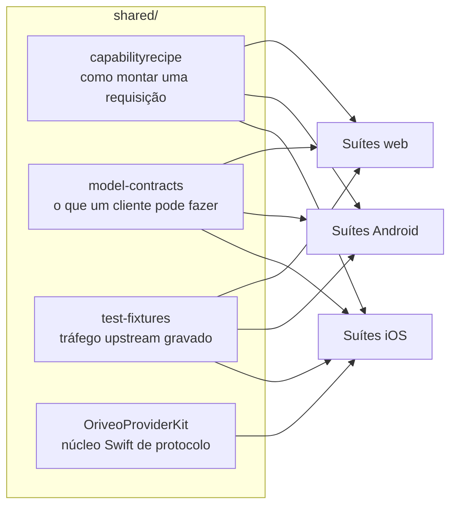

<div align="center">

# Contratos compartilhados

**Uma única definição de como falar com um provedor de modelos, verificada pelos três clientes.**

<a href="../../LICENSE"></a>


<sub>

<a href="../../shared/README.md">English</a> ·
<a href="../ar/shared.md">العربية</a> ·
<a href="../de/shared.md">Deutsch</a> ·
<a href="../es/shared.md">Español</a> ·
<a href="../fr/shared.md">Français</a> ·
<a href="../hi/shared.md">हिन्दी</a> ·
<a href="../id/shared.md">Indonesia</a> ·
<a href="../ja/shared.md">日本語</a> ·
<a href="../ko/shared.md">한국어</a> ·
**Português** ·
<a href="../ru/shared.md">Русский</a> ·
<a href="../th/shared.md">ไทย</a> ·
<a href="../tr/shared.md">Türkçe</a> ·
<a href="../vi/shared.md">Tiếng Việt</a> ·
<a href="../zh-Hans/shared.md">简体中文</a> ·
<a href="../zh-Hant/shared.md">繁體中文</a>

</sub>

</div>

---

Três clientes que implementam “chamar o provedor” cada um por conta própria vão divergir. Vão
divergir em silêncio, na direção daquele que alguém testou por último, e a divergência vai aparecer
como um bug que se reproduz em uma plataforma e não nas outras.

O `shared/` é a resposta a isso: o comportamento é escrito uma única vez como dado, e a suíte de
testes de cada cliente faz asserções contra os mesmos arquivos. Uma peculiaridade de provedor é
corrigida uma vez. Uma mudança de contrato quebra três suítes ao mesmo tempo, em vez de ir para
produção em duas plataformas e estragar a terceira.



## capabilityrecipe

O registro de receitas. Para um dado provedor, transporte e capacidade — busca na web, esforço de
raciocínio, geração de imagens — ele diz exatamente quais JSON pointers escrever na requisição de
saída, e como ler a resposta de volta.

É isso que faz um modelo lançado hoje funcionar sem atualizar o cliente, e é por isso que nenhum
cliente adivinha uma capacidade pelo nome do modelo. O `capability_runtime.v1.json` carrega as
receitas em si; `capability_result_definitions.v1.json` e `capability_custom_controls.v2.json`
definem como resultados e controles voltados ao usuário são interpretados.

Cada receita declara um `executionKind` — `request_overlay`, `server_tool`, `client_tool_loop`,
`endpoint_route`, `model_route` — e o compilador de cada cliente valida que a receita combina com o
provedor, a capacidade e o transporte antes de aplicá-la, rejeitando com um motivo nomeado em vez de
enviar uma requisição que ninguém revisou.

## model-contracts

Fixtures JSON que fixam o comportamento entre clientes: como uma requisição precisa ser para um dado
provedor e capacidade, como os parâmetros de geração são resolvidos e como as sobrescritas se
empilham, quais estados de capacidade um cliente pode apresentar, e como o catálogo de modelos e as
suas evidências são consumidos.

Os testes de cada cliente carregam esses arquivos diretamente, então uma mudança aqui é uma mudança
nos três clientes de uma vez.

## test-fixtures

Dados de teste de referência: tráfego de tool call upstream gravado, cenários de roteamento e
descoberta de relay, snapshots de model facts e de evidências de capacidade, e cenários de engines
locais.

Os arquivos `.sse` são **tráfego upstream real capturado** e ficam intocados byte a byte. Um mock
escrito à mão codifica o que você acreditava que o provedor faz; um stream gravado codifica o que
ele de fato fez, incluindo o chunk malformado que ele mandou naquela terça-feira. Quando uma
correção de protocolo de provedor precisa de um teste, uma gravação vale mais que um mock.

## OriveoProviderKit

Um pacote Swift com o núcleo do protocolo de rede dos provedores: montagem de linhas SSE, parsing de
chunks compatíveis com OpenAI, codificação de nomes de tool, ocultação de credenciais, classificação
de erros upstream, parsing de tags de thinking, extração de caminhos JSON em streaming e perfis de
peculiaridades por provedor.

O escopo dele é deliberadamente estreito. **Dentro:** conhecimento de rede que usa só o Foundation.
**Fora:** modelos do app, UI, banco de dados, telemetria, localização. Cada cliente Apple mantém uma
casca fina em volta dele, para que o comportamento de rede tenha exatamente uma implementação.

```bash
cd shared/OriveoProviderKit && swift build && swift test
```

- Plataformas: iOS 18+, macOS 15+ · `swift-tools-version: 6.1`
- O `ProviderWireProfile` carrega as peculiaridades residuais de cada fornecedor de que um único
  montador compatível com OpenAI ainda precisa — onde chega o texto de raciocínio, onde ficam as
  contagens de tokens em cache, se os tokens de prompt já incluem os acertos de cache. Ele descreve
  *como os bytes chegam*, nunca *o que um modelo pode fazer*; esse é o trabalho das receitas.

## Mexendo nestes arquivos

Uma mudança aqui é uma mudança em todos os clientes. Rode as suítes de contrato de cada cliente que
lê o arquivo que você tocou, não só a daquele em que você por acaso está trabalhando:

```bash
cd web && npm run test:run
cd shared/OriveoProviderKit && swift test
# plus the iOS and Android suites — see their READMEs
```

Tanto as suítes de iOS quanto as de Android localizam este diretório subindo a partir do arquivo de
teste até encontrar `shared/`, e as suítes web o resolvem relativamente ao workspace. Todas elas,
portanto, exigem um checkout completo do repositório.

## Licença

[AGPL-3.0-or-later](../../LICENSE).
