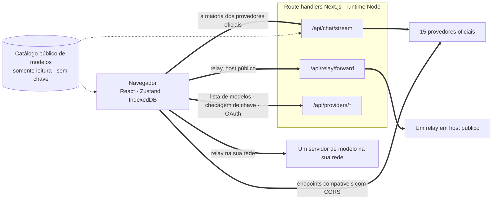
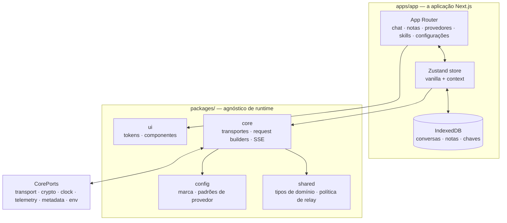

<div align="center">

# Oriveo para Web

**Um cliente de chat em Next.js para os modelos de IA que você já paga.**

<a href="../../LICENSE"></a>


<sub>

<a href="../../web/README.md">English</a> ·
<a href="../ar/web.md">العربية</a> ·
<a href="../de/web.md">Deutsch</a> ·
<a href="../es/web.md">Español</a> ·
<a href="../fr/web.md">Français</a> ·
<a href="../hi/web.md">हिन्दी</a> ·
<a href="../id/web.md">Indonesia</a> ·
<a href="../ja/web.md">日本語</a> ·
<a href="../ko/web.md">한국어</a> ·
**Português** ·
<a href="../ru/web.md">Русский</a> ·
<a href="../th/web.md">ไทย</a> ·
<a href="../tr/web.md">Türkçe</a> ·
<a href="../vi/web.md">Tiếng Việt</a> ·
<a href="../zh-Hans/web.md">简体中文</a> ·
<a href="../zh-Hant/web.md">繁體中文</a>

</sub>

</div>

---

O cliente web do Oriveo é um app de chat com IA no modelo BYOK, feito com Next.js. Conversas, notas,
pastas, skills e as suas chaves de provedor ficam no armazenamento do próprio navegador. Não há
conta nem login.

Ele faz parte do [Oriveo Community Edition](README.md) — três clientes que compartilham uma única
definição de como falar com um provedor de modelos.

## Início rápido

Requer Node 22.22 ou mais recente (veja [`.nvmrc`](../../web/.nvmrc)). O npm vem junto; nenhum outro
gerenciador de pacotes é necessário.

```bash
npm install
npm run dev:app     # http://localhost:3001
```

A primeira tela pede uma chave de API de provedor. Nada mais é necessário para começar a conversar.

## Como uma requisição realmente viaja

Esta é a parte que vale ler antes de qualquer outra, porque o cliente web é o único lugar onde uma
requisição normalmente **não** vai direto do cliente para o provedor.



**Por que o desvio existe.** A maioria das APIs dos provedores não envia cabeçalhos CORS, então um
navegador não consegue chamar `api.openai.com` e companhia diretamente — o preflight falha. Todo
cliente BYOK de navegador precisa resolver isso de alguma forma; este encaminha por route handlers
Next.js rodando no runtime Node. Quando você roda `npm run dev:app`, esses handlers estão na sua
própria máquina. Quando você faz deploy do app em algum lugar, eles estão na máquina para a qual você
fez o deploy.

Não é um handler só: o streaming de chat, o encaminhador de relay, a geração de imagens, a lista de
modelos, a validação de chave e as trocas de device login do Grok e do ChatGPT dão doze arquivos de
rota no total. A validação de chave importa aqui — ela manda a chave para o seu próprio servidor,
que sonda o provedor com ela.

Alguns poucos endpoints *aceitam* um navegador, e esses são chamados diretamente, sem servidor no
meio: o endpoint chinês do Kimi (`api.moonshot.cn`) para chat, e os endpoints de saldo de
OpenRouter, SiliconFlow, DeepSeek e Kimi.

**O que o handler faz e o que não faz.** Ele valida o formato da requisição e limita o seu tamanho,
aplica um rate limit por IP ao tráfego de chat e de relay, recusa URLs que resolvem para endereços
privados ou link-local, monta o corpo específico do provedor e devolve a resposta em streaming. Não
há banco de dados, nem escrita em disco, nem log de corpos de requisição em lugar nenhum sob
`app/api` — a sua chave e as suas mensagens são encaminhadas e esquecidas. Como a rota é um único
processo compartilhado por todos os visitantes, um teste dedicado (`server-never-learns.test.ts`)
fixa que ela nunca guarda em cache o parâmetro rejeitado de um usuário para aplicá-lo à requisição de
outro.

O encaminhador de relay ainda fixa o DNS no endereço que resolveu, limita o tamanho da resposta,
delimita todos os timeouts, restringe redirecionamentos à mesma origem e se recusa a repassar
cabeçalhos hop-by-hop.

**Endpoints locais pulam tudo isso.** Um relay em um endereço privado, em um nome `.local`, em
`localhost`, ou configurado em modo HTTP local ou VPN privada é buscado **diretamente pelo
navegador**, com `credentials: 'omit'` e `targetAddressSpace: 'local'`. O seu tráfego de rede local
não sai da sua rede, e também não passa pelo servidor do app.

## Arquitetura



O `packages/core` guarda cada byte do conhecimento sobre protocolos de provedores e é mantido
deliberadamente livre de globais do navegador — o eslint proíbe `window`, `document`, `fetch`,
`crypto`, `localStorage`, `sessionStorage` e `indexedDB` dentro dele e em `packages/ipc-contract`.
Tudo o que ele precisa do ambiente chega por `CorePorts`. É isso que permite que o mesmo código rode
em um navegador, em um route handler Node e em um teste sem DOM.

O suporte a provedores são dois eixos independentes. O `providerKind` escolhe um **request builder**
(como o corpo se parece para este fornecedor). O `model.transport` escolhe uma **estratégia de
transporte** (qual protocolo de rede é falado) entre doze, e é resolvido por modelo a partir do
catálogo, não por provedor — então dois modelos atrás da mesma chave podem discordar. Uma estratégia
implementa exatamente três métodos: `buildRequestBody`, `parseStreamChunk`, `parseError`.

## Workspaces

```
apps/app/               the Next.js application
packages/core/          provider protocols: transports, request builders, SSE parsing
packages/shared/        domain types, relay policy, helpers
packages/ui/            design tokens and shared components
packages/config/        brand and provider defaults
packages/ipc-contract/  typed channel contract for a desktop shell
```

A estilização é feita com CSS Modules sobre uma única folha de tokens em custom properties em
`packages/ui` — não há framework de classes utilitárias. O `packages/ipc-contract` descreve a
superfície de canal a que um shell de desktop se ligaria; nenhum shell desses é publicado neste
repositório, então no build web ele contribui apenas com tipos e ramos que nunca são tomados.

Há mais uma costura do mesmo tipo. O `apps/app/lib/core/sync-port.ts` declara a interface que um
backend de sincronização implementaria, e todos os pontos de chamada o alcançam por optional
chaining. Nada instala um, então `getSyncAdapter()` retorna `null` e o IndexedDB segue sendo a única
cópia dos seus dados — que é exatamente o que "sem conta, sem login" significa na prática.

## Armazenamento

Tudo é por partição, indexado por um id ativo cujo padrão é `guest`.

| O quê | Onde |
|---|---|
| Conversas, mensagens, pastas, notas, provedores | IndexedDB `oriveo--{id}`, 8 object stores |
| Snapshot do catálogo de modelos (~3 MB) e model facts | store de blobs no IndexedDB, deliberadamente não no localStorage |
| Preferências e tabelas de controle de modelo | `localStorage`, com o `safeLocalStorage` envolvendo os caminhos em que se viu exceção |
| Imagens geradas e anexadas | um banco IndexedDB separado |

Dois detalhes que vieram de quebra real, não de gosto. O snapshot do catálogo vive no IndexedDB
porque, com ~3 MB, ele consumia a maior parte da cota de 5 MB de localStorage de uma origem no
navegador. E todo acesso ao localStorage passa por `safeLocalStorage`, porque o próprio *getter*
`window.localStorage` lança `SecurityError` quando o navegador está configurado para bloquear dados
de site — uma leitura crua derruba a página antes mesmo de o seu bloco `try` rodar.

> [!IMPORTANT]
> Na web, as chaves de provedor são guardadas no IndexedDB **sem criptografia** — o mesmo modelo que
> os clientes BYOK de navegador costumam usar, porque um navegador não tem lugar melhor para
> colocá-las. Para a garantia mais forte, use o cliente iOS ou Android, onde o keychain ou o
> keystore do sistema as criptografa. Os arquivos de backup são outra história: esses são
> criptografados com AES-256-GCM e PBKDF2-SHA-256 a 600.000 iterações quando você escolhe uma senha.

## O catálogo de modelos

Quais modelos cada provedor oferece, e o que cada um suporta, vem de um catálogo somente leitura
buscado na inicialização. Exatamente dois endpoints são consultados, ambos `GET`, ambos condicionais
por ETag, e nenhum deles leva chave de API, conversa ou qualquer identificador de usuário:

```
GET {backend}/api/metadata?view=lean
GET {backend}/api/metadata/model-facts
```

O backend padrão é `https://api.oriveoai.com`. Aponte `NEXT_PUBLIC_BACKEND_URL` para o seu próprio
host para servi-lo você mesmo. A resposta é cacheada por 24 horas no IndexedDB e revalidada com
`If-None-Match`; quando o catálogo está inacessível o app continua funcionando a partir da cópia em
cache.

## Comandos

Rode estes comandos a partir deste diretório.

| Comando | O que faz |
|---|---|
| `npm run dev:app` | servidor de desenvolvimento na porta 3001 |
| `npm run build:app` | build de produção |
| `npm run typecheck` | `tsc --noEmit` em todos os workspaces |
| `npm run test:run` | vitest, uma passada |
| `npm run test` | vitest em modo watch |
| `npm run lint` | eslint sobre `apps/` e `packages/` |

`npm start --workspace @oriveo/app` serve um build finalizado na porta 3001.

Para rodar um único arquivo de teste, faça isso a partir do workspace que o contém, porque várias
suítes resolvem fixtures relativas ao diretório de trabalho:

```bash
cd apps/app && npx vitest run lib/core/chat/__tests__/stream-options.test.ts
```

## Configuração

Tudo é opcional. Copie [`.env.example`](../../web/.env.example) para `.env.local` e defina só o que
você precisa; toda variável que o código lê está listada e explicada lá.

### Relatório de erros

O app embute o SDK do Sentry. Ele é **inerte sem um DSN** — sem `NEXT_PUBLIC_SENTRY_DSN` não há
transporte, não há eventos, nada é enviado para lugar nenhum, e esse é o padrão de um build feito a
partir deste repositório. Defina um e você ganha relatório de erros, 10% de tracing de performance e
1% de session replay, com hooks que removem chaves de provedor, endpoints e conteúdo de mensagens
antes de um evento sair do navegador. Está aqui para que um deploy que queira relatório de erros
possa tê-lo, não porque este build liga de volta para casa.

## Auto-hospedagem

Não há Dockerfile nem script de deploy; o app é um servidor Next.js comum.

```bash
npm ci
npm run build:app
npm start --workspace @oriveo/app     # 127.0.0.1:3001
```

Três coisas vale saber antes de colocá-lo atrás de um proxy reverso.

O `npm start` faz bind em `127.0.0.1`, então o proxy tem que rodar no mesmo host, ou o endereço de
bind precisa ser alterado.

Defina `NEXT_PUBLIC_APP_URL` com a origem de onde você realmente serve. Links canônicos, o sitemap e
a imagem de preview social são todos resolvidos em relação a ela, e o padrão é a porta de
desenvolvimento.

Defina `TRUSTED_PROXY_HOP_COUNT` com o número de proxies na frente do app. O rate limiter do chat lê
o endereço do cliente a essa quantidade de saltos a partir da *direita* de `X-Forwarded-For` — nunca
da esquerda, que o cliente controla e pode falsificar. O padrão de 1 está certo para um único proxy;
deixe-o baixo demais atrás de dois e todos os visitantes passam a compartilhar um único bucket de
rate limit, porque o endereço lido é o do seu próprio proxy interno.

O app já envia HSTS, `X-Content-Type-Options`, `X-Frame-Options`, `Referrer-Policy`,
`Permissions-Policy` e `Cross-Origin-Opener-Policy` a partir do `next.config.ts`, então o proxy não
precisa adicioná-los. A terminação TLS e os limites de tamanho de requisição são trabalho do proxy.

Uma última coisa que vale decidir de forma deliberada: qualquer pessoa que consiga alcançar o deploy
pode usar os route handlers dele para chamar um provedor com uma chave que ela mesma fornece. Os
handlers não guardam chaves próprias e não armazenam nada, mas são um caminho HTTP de saída, então um
deploy alcançável publicamente pertence atrás do mesmo controle de acesso que você daria a qualquer
outra ferramenta interna.

## Testes

Cerca de 5.600 testes em 460 arquivos, no vitest. A cobertura mais densa está onde um erro custa
mais caro: formato da requisição por provedor, comportamento do transporte por protocolo de rede,
parsing de chunks de SSE e de proxy, parsing de uso e de custo, classificação de erros, sondagem de
relay e modos de segurança, a proteção contra SSRF, execução de receitas de capacidade, cache do
catálogo e invalidação por versão de contrato, persistência no IndexedDB, particionamento de
armazenamento, ciclos completos de backup e os próprios route handlers.

> [!IMPORTANT]
> Mais de trinta suítes carregam fixtures de contrato de `../shared`, então **os testes só passam em um
> checkout completo** — copiar só `web/` para fora não vai funcionar.

## Localização

Dezesseis locales em `apps/app/messages`, cerca de 1.800 chaves cada, com o inglês como origem. Um
teste percorre o diretório e falha se o conjunto de chaves de algum locale diferir do inglês, então
adicionar um arquivo de locale já o inscreve automaticamente. O árabe recebe layout completo da
direita para a esquerda. A seleção de locale segue um parâmetro `?locale=` explícito, depois um
cookie, depois `Accept-Language`.

## Como contribuir

Veja o [CONTRIBUTING.md](../../CONTRIBUTING.md). O `packages/core` é orientado a transporte:
adicionar um provedor costuma ser um request builder e um adaptador de resposta, não um cliente
novo. Para uma correção de protocolo de provedor, prefira uma fixture gravada em
`shared/test-fixtures` a um mock escrito à mão.

## Licença

[AGPL-3.0-or-later](../../LICENSE).
