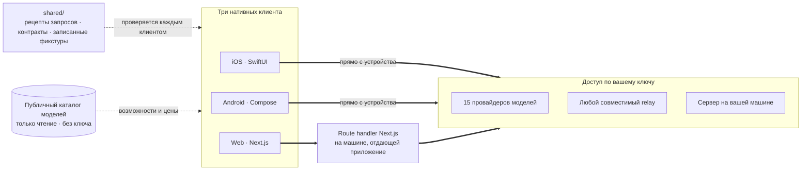

<div align="center">


# Oriveo

**Каждая модель — в одном приложении.**

Открытый AI-чат со своим ключом для iOS, Android и веба.
Без аккаунта, без подписки и без нашего сервиса на пути запроса.

<a href="../../LICENSE"></a>
<a href="ios.md"></a>
<a href="android.md"></a>
<a href="web.md"></a>


<a href="https://oriveoai.com">Сайт</a> &nbsp;·&nbsp;
<a href="#начало-работы">Начало работы</a> &nbsp;·&nbsp;
<a href="#архитектура">Архитектура</a> &nbsp;·&nbsp;
<a href="#community-edition-и-oriveo">Редакции</a> &nbsp;·&nbsp;
<a href="#faq">FAQ</a> &nbsp;·&nbsp;
<a href="../../CONTRIBUTING.md">Участие</a>

<sub>

<a href="../../README.md">English</a> ·
<a href="../ar/README.md">العربية</a> ·
<a href="../de/README.md">Deutsch</a> ·
<a href="../es/README.md">Español</a> ·
<a href="../fr/README.md">Français</a> ·
<a href="../hi/README.md">हिन्दी</a> ·
<a href="../id/README.md">Indonesia</a> ·
<a href="../ja/README.md">日本語</a> ·
<a href="../ko/README.md">한국어</a> ·
<a href="../pt-BR/README.md">Português</a> ·
**Русский** ·
<a href="../th/README.md">ไทย</a> ·
<a href="../tr/README.md">Türkçe</a> ·
<a href="../vi/README.md">Tiếng Việt</a> ·
<a href="../zh-Hans/README.md">简体中文</a> ·
<a href="../zh-Hant/README.md">繁體中文</a>

</sub>

</div>

---

## Что такое Oriveo

Oriveo Community Edition — это AI-чат в модели BYOK, со своим ключом, для iOS, Android и веба. Вы
указываете API-ключи, которые у вас уже есть, и клиент обращается с ними к провайдеру. Нет аккаунта
Oriveo и нет подписки, и ничто не отчитывается перед нами.

Он нативно работает с **15 провайдерами моделей** — OpenAI, Anthropic, Google Gemini, OpenRouter,
DeepSeek, Grok, Mistral, Groq, Together AI, Fireworks AI, MiniMax, Z.ai, Qwen, Kimi (Moonshot) и
SiliconFlow — плюс с **любым endpoint, совместимым с OpenAI, Anthropic или Gemini**, на который вы
его направите, включая llama.cpp, Ollama, LM Studio или vLLM, запущенные на вашей собственной
машине.

| | |
|---|---|
| **Провайдеры** | 15 встроенных, плюс собственные relay-endpoint'ы и локальные серверы моделей |
| **Клиенты** | iOS (SwiftUI) · Android (Jetpack Compose) · Web (Next.js) |
| **Языки интерфейса** | 16 |
| **Нужен ли аккаунт** | Нет |
| **Запросы, которые он делает от своего имени** | Одно дело, в двух запросах: каталог моделей только на чтение, без приложенного ключа и без идентификатора |
| **Лицензия** | AGPL-3.0-or-later |

## Зачем он нужен

Никто не должен тарифицировать, логировать или накручивать цену на модель, за которую вы платите.

- **Ваши ключи — ваш счёт.** Вы платите провайдеру по его прайс-листу. Ничего не накручивается, не
  тарифицируется и не перепродаётся.
- **По умолчанию локально.** Разговоры, заметки, папки, skills и вложения живут на устройстве.
  Экспортируйте их в файл когда угодно; никакой облачной копии, доступ к которой можно потерять, не
  существует.
- **Одно поведение, три клиента.** То, как формируется запрос для конкретного провайдера,
  транспорта и возможности, записано один раз в [`shared/`](shared.md), и все три клиента
  проверяются по одним и тем же JSON-фикстурам. Причуда, которая живёт в этих данных, чинится один
  раз; та, что живёт в парсере, ловится тремя наборами тестов одновременно.
- **Единственный собственный запрос.** Приложение забирает публичный каталог моделей,
  чтобы вышедшая сегодня модель работала без обновления приложения. Он только на чтение, не несёт ни
  ключа, ни идентификатора, и вы можете направить его на свой хост.

## Возможности

- **Чат** — стриминг, блоки рассуждений, ссылки на источники, вложения (изображения, PDF, Office,
  EPUB, HTML, простой текст), цитирование выделенного, повтор, перегенерация, продолжение после
  прерванного ответа
- **Провайдеры** — 15 встроенных, каждый с вашим собственным ключом; переопределение endpoint'а,
  модели и параметров для каждого провайдера
- **Relay** — любой endpoint, совместимый с OpenAI, Anthropic или Gemini, в том числе в вашей
  локальной сети
- **Локальные серверы моделей** — llama.cpp, Ollama, LM Studio, vLLM; iOS и Android находят их в
  локальной сети через mDNS
- **Вход по подписке** — используйте уже имеющуюся подписку Codex или Grok вместо API-ключа
- **Skills** — переиспользуемые системные промпты со своей моделью, параметрами и справочными
  документами
- **Заметки и папки** — сохраните ответ как заметку, наведите порядок в разговорах, полнотекстовый
  поиск
- **Перекрёстная проверка** — задайте тот же вопрос второй модели и держите оба ответа рядом
- **Стоимость** — траты по сообщениям и по провайдерам, посчитанные на устройстве по тому, что
  реально сообщил каждый ответ, включая уровни скидок за кэш
- **Генерация изображений** — там, где провайдер её поддерживает
- **Резервная копия** — экспорт всего в файл, при желании зашифрованный выбранным вами паролем
- **16 языков интерфейса**, включая полную раскладку справа налево для арабского

## Community Edition и Oriveo

Этот репозиторий — **Oriveo Community Edition** под лицензией
[AGPL-3.0-or-later](../../LICENSE). Приложения в App Store, Google Play и размещённое
веб-приложение — это **Oriveo**, отдельный проприетарный продукт, собранный из тех же клиентов, но
со слоем аккаунта сверху.

| | Community Edition | Oriveo |
|---|---|---|
| Исходный код | Этот репозиторий, AGPL-3.0-or-later | Проприетарный |
| Чат со своими ключами провайдеров | Да | Да |
| Relay и локальные серверы моделей | Да | Да |
| Заметки, папки, skills, вложения | Да | Да |
| Учёт стоимости на устройстве | Да | Да |
| Аккаунт | Нет | Аккаунт Oriveo |
| Хранение | На устройстве; ручной экспорт и восстановление | Local-first плюс облачная синхронизация между устройствами |
| Аналитика расходов и оповещения о бюджете | — | Да |
| Модели, за которые платит Oriveo | — | Да |
| Аналитика и отчёты о сбоях | По умолчанию выключены — в веб-бандл входит Sentry, молчащий без DSN | Да |

Сборки Community Edition используют префикс идентификатора `ai.oriveo.community`, поэтому такая
сборка может стоять рядом со сборкой из магазина, не разделяя с ней ни keychain, ни локальные
данные. Что эта редакция принимает, а что нет, записано в [COMMUNITY.md](../../COMMUNITY.md).

**Oriveo, полный продукт:**
[iPhone и iPad](https://apps.apple.com/app/oriveo/id6775370458) &nbsp;·&nbsp;
[Android](https://play.google.com/store/apps/details?id=com.kenny.oriveo) &nbsp;·&nbsp;
[Web](https://app.oriveoai.com) &nbsp;·&nbsp;
[oriveoai.com](https://oriveoai.com)

## Провайдеры

К каждому провайдеру ниже вы обращаетесь ключом, который создаёте сами.

| Провайдер | Где взять ключ |
|---|---|
| OpenAI | [platform.openai.com](https://platform.openai.com/api-keys) |
| Anthropic | [console.anthropic.com](https://console.anthropic.com/settings/keys) |
| Google Gemini | [aistudio.google.com](https://aistudio.google.com/apikey) |
| OpenRouter | [openrouter.ai](https://openrouter.ai/keys) |
| DeepSeek | [platform.deepseek.com](https://platform.deepseek.com/api_keys) |
| Grok | [console.x.ai](https://console.x.ai/) |
| Mistral | [console.mistral.ai](https://console.mistral.ai/api-keys) |
| Groq | [console.groq.com](https://console.groq.com/keys) |
| Together AI | [api.together.xyz](https://api.together.xyz/settings/api-keys) |
| Fireworks AI | [fireworks.ai](https://fireworks.ai/api-keys) |
| MiniMax | [platform.minimax.io](https://platform.minimax.io/docs/guides/quickstart-preparation) |
| Z.ai | [open.bigmodel.cn](https://open.bigmodel.cn/usercenter/apikeys) |
| Qwen | [bailian.console.alibabacloud.com](https://bailian.console.alibabacloud.com/?apiKey=1#/api-key) |
| Kimi (Moonshot) | [platform.kimi.ai](https://platform.kimi.ai/console/api-keys) |
| SiliconFlow | [cloud.siliconflow.cn](https://cloud.siliconflow.cn/account/ak) |
| **Relay** | Любой endpoint, совместимый с OpenAI, Anthropic или Gemini, в том числе на вашей собственной машине |

## Архитектура

Три нативных клиента, одно определение того, как разговаривать с провайдером моделей.



У каждого клиента свои UI, хранилище и навигация, и с общими контрактами он встречается ровно в
одном шве: в слое, который превращает *эту модель и эту возможность* в HTTP-запрос.

Единственная асимметрия, о которой стоит знать, — веб-клиент. Большинство API провайдеров не отдают
CORS-заголовки, поэтому браузер не может обратиться к ним напрямую; такие запросы идут через route
handler Next.js, работающий на той машине, которая отдаёт приложение, — на вашей собственной, когда
вы запускаете его локально. Немногочисленные endpoint'ы, которые браузеру всё же доступны
(китайский endpoint Kimi, endpoint'ы баланса у нескольких провайдеров), и relay в вашей
собственной сети вызываются напрямую. У клиентов iOS и Android такого ограничения нет, и они всегда
идут прямо к провайдеру.

**Архитектура каждого клиента:**

| | Стек | README |
|---|---|---|
| **iOS** | SwiftUI с лентой чата на UIKit, GRDB | [ios/README.md](ios.md) |
| **Android** | Jetpack Compose, Room, Koin, Ktor/OkHttp | [android/README.md](android.md) |
| **Web** | Next.js App Router, React, Zustand, TypeScript | [web/README.md](web.md) |
| **Shared** | Контракты, записанные фикстуры и Swift-ядро протокола | [shared/README.md](shared.md) |

## Начало работы

Готовых сборок здесь нет — ни APK, ни `.ipa`, ни релизов. Community Edition — это исходный код,
который вы собираете сами, а приложения из магазинов — другой продукт. Веб-клиент — самый короткий
путь к работающему приложению.

<details open>
<summary><b>Web</b> — самый быстрый способ попробовать</summary>

<br>

Требуется Node 22 (см. [`web/.nvmrc`](../../web/.nvmrc)).

```bash
cd web
npm install
npm run dev:app        # http://localhost:3001
```

Первый экран попросит API-ключ провайдера. Больше ничего не нужно.
Больше команд и настроек: [web/README.md](web.md).

</details>

<details>
<summary><b>iOS</b> — соберите и запустите на своём iPhone</summary>

<br>

Требуется Mac с Xcode 26 и устройство на iOS 18 или новее. Хватит бесплатного аккаунта Apple
Developer — приложение не использует платных capability.

1. Откройте `ios/Oriveo/Oriveo.xcodeproj`
2. Выберите схему `Oriveo`
3. В разделе Signing &amp; Capabilities выберите свою Team
4. Запустите

Полное руководство, включая то, что делать, если Xcode отказывается открыть проект:
[ios/README.md](ios.md).

</details>

<details>
<summary><b>Android</b> — соберите APK</summary>

<br>

Требуется JDK 21 и Android SDK. Сборка использует AGP 9.3, Gradle 9.5 и Kotlin 2.3, поэтому
Android Studio должна быть версией, способной их синхронизировать; из командной строки нужны только
JDK и SDK.

```bash
cd android
./gradlew :app:assembleDebug
```

Как отдавать каталог моделей со своего хоста: [android/README.md](android.md).

</details>

## Приватность

- **Ключи провайдеров** попадают в iOS Keychain, а на Android — в `EncryptedSharedPreferences` под
  ключом, который хранится в Android Keystore. У браузера равнозначного средства нет, поэтому в вебе
  они лежат без шифрования в IndexedDB — это та же модель, которую обычно используют браузерные
  BYOK-клиенты. За самой сильной гарантией идите в клиент iOS или Android.
- **Разговоры, заметки, папки, skills и вложения** хранятся на устройстве. Ничего никуда не
  загружается.
- **Нет аккаунта, и ничто не отчитывается перед нами.** Входить некуда. В веб-бандл входит Sentry,
  который молчит, пока вы не настроите собственный DSN.
- **На iOS и Android запросы чата идут прямо с устройства к провайдеру.** В вебе большинство из них
  проходит через сервер Next.js, который отдаёт приложение, потому что большинство API провайдеров
  не разрешают прямой вызов из браузера; этот сервер не сохраняет ни ключи, ни сообщения, а когда
  вы запускаете приложение локально — это ваша собственная машина.
- **Один запрос от нас самих:** каталог моделей только на чтение, запрашиваемый без ключа, без
  разговора и без какого-либо идентификатора, чтобы вышедшая сегодня модель работала без новой
  сборки. Направьте его на свой хост, если хотите отдавать его сами.

## FAQ

<details>
<summary><b>Что означает BYOK?</b></summary>

<br>

Bring your own key — принесите свой ключ. Вы создаёте API-ключ в консоли самого провайдера — OpenAI,
Anthropic, Google и так далее — и вставляете его в Oriveo. Запросы тарифицирует этот провайдер по
своему прайс-листу. Oriveo — это клиент; он не реселлер и не берёт себе долю.

</details>

<details>
<summary><b>Проходят ли мои разговоры через сервер Oriveo?</b></summary>

<br>

Нет. На iOS и Android клиент вызывает endpoint провайдера напрямую. В вебе большинство запросов идёт
через сервер Next.js, который отдаёт приложение — вашу собственную машину, когда вы запускаете его
локально, — потому что большинство API провайдеров отказывают в прямом вызове из браузера; те
немногие, что его допускают, вызываются напрямую. Ни один из этих путей не проходит через сервер,
которым управляет Oriveo. Единственный запрос, который Oriveo делает от своего имени, — это чтение
публичного каталога моделей: без ключа, без разговора и без идентификатора.

</details>

<details>
<summary><b>Можно ли использовать модель, запущенную на моей машине?</b></summary>

<br>

Да. Добавьте подключение Relay, указывающее на любой сервер, совместимый с OpenAI, Anthropic или
Gemini — llama.cpp, Ollama, LM Studio, vLLM или что угодно ещё, говорящее на одном из этих
протоколов. Клиенты iOS и Android умеют находить такой сервер в локальной сети через mDNS, а
веб-клиент предлагает для каждого движка адрес по умолчанию и проверяет его. Локальный HTTP не
использует никаких учётных данных и никогда не покидает вашу сеть.

</details>

<details>
<summary><b>Чем это отличается от приложения в App Store?</b></summary>

<br>

Приложения из магазинов — это Oriveo, проприетарный продукт, который добавляет аккаунт, облачную
синхронизацию между устройствами, аналитику расходов и модели, за которые платит Oriveo. Community
Edition — это те же три клиента без всего этого: без аккаунта, без сервиса синхронизации, без
биллинга, и ничто не отчитывается перед нами. Полное сравнение — в разделе
[Community Edition и Oriveo](#community-edition-и-oriveo).

</details>

<details>
<summary><b>Есть ли клиент для macOS?</b></summary>

<br>

В этом репозитории — нет. Пока что веб-клиент неплохо работает как настольное приложение в любом
браузере, а сборку для iOS обычно можно запустить на Mac с Apple silicon.

</details>

<details>
<summary><b>На каких языках доступен интерфейс?</b></summary>

<br>

На шестнадцати: арабский, немецкий, английский, испанский, французский, хинди, индонезийский,
японский, корейский, бразильский португальский, русский, тайский, турецкий, вьетнамский, китайский
упрощённый и китайский традиционный. Для арабского сделана полная раскладка справа налево.

</details>

## Структура репозитория

```
ios/           iOS client (SwiftUI)
android/       Android client (Jetpack Compose)
web/           Web client (Next.js)
macos/         Reserved for a macOS client
shared/        Cross-client contracts, recorded fixtures, and the Swift wire kernel
readme_i18n/   These READMEs in fifteen more languages
docs/assets/   Images used by the READMEs
```

## Как участвовать

Сообщения об ошибках и pull request'ы приветствуются. В [CONTRIBUTING.md](../../CONTRIBUTING.md)
описано, как собрать каждый клиент и как выглядит хороший pull request; в
[COMMUNITY.md](../../COMMUNITY.md) — зачем нужна эта редакция и те немногие виды изменений, которые
не будут приняты, как бы хорошо они ни были написаны.

Нашли проблему с безопасностью? Пожалуйста, не заводите публичный issue — в
[SECURITY.md](../../SECURITY.md) описано, как сообщить о ней приватно и что этот проект считает
уязвимостью, а что нет. От всех участников ожидается соблюдение
[кодекса поведения](../../CODE_OF_CONDUCT.md).

## Лицензия

[AGPL-3.0-or-later](../../LICENSE). Вклады принимаются на условиях той же лицензии.
