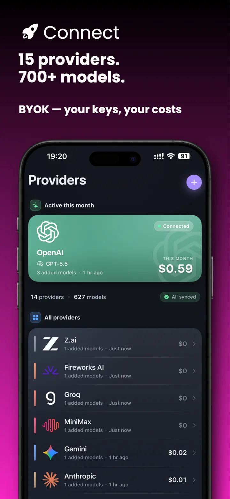
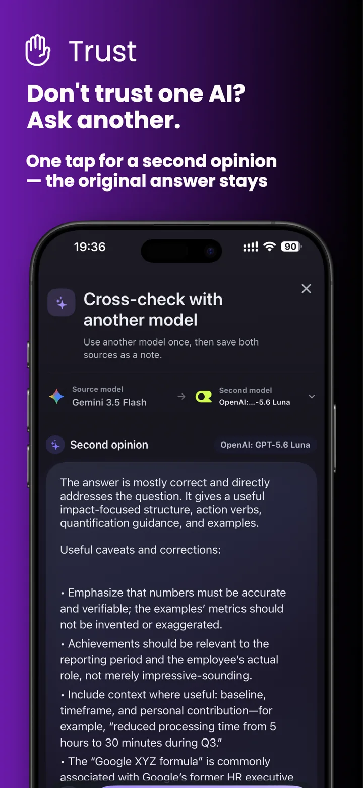
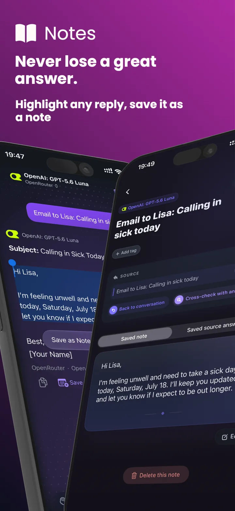
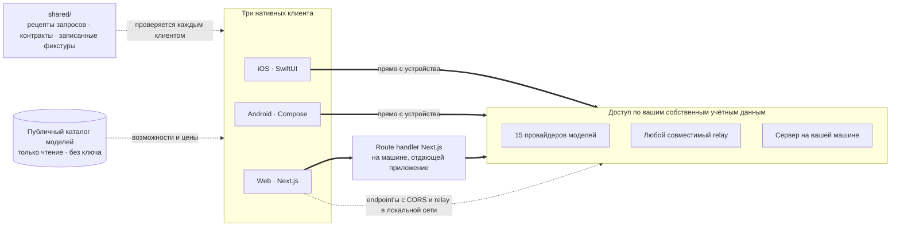

<div align="center">


# Oriveo Community Edition

**Каждая модель — в одном приложении.**

Открытый AI-чат со своим ключом для iOS, Android и веба,
нативный клиент для macOS в разработке.
Без аккаунта, без подписки и без нашего сервиса на пути запроса к чату.

<a href="../../LICENSE"></a>
<a href="ios.md"></a>
<a href="android.md"></a>
<a href="web.md"></a>
<a href="macos.md"></a>
<a href="https://github.com/oriveo/oriveo/releases/latest"></a>
<a href="https://github.com/oriveo/oriveo/stargazers"></a>

**Получить Oriveo:**
<a href="https://oriveoai.com"><b>oriveoai.com</b></a> &nbsp;·&nbsp;
<a href="https://apps.apple.com/app/oriveo/id6775370458">App Store</a> &nbsp;·&nbsp;
<a href="https://play.google.com/store/apps/details?id=com.kenny.oriveo">Google Play</a> &nbsp;·&nbsp;
<a href="https://app.oriveoai.com">Веб-приложение</a>

<sub>Сборки из магазинов — это <b>Oriveo</b>, коммерческая редакция. Этот репозиторий — <a href="#community-edition-и-oriveo">Community Edition</a>, собираемая из исходников.</sub>

<a href="#начало-работы">Собрать из исходников</a> &nbsp;·&nbsp;
<a href="#архитектура">Архитектура</a> &nbsp;·&nbsp;
<a href="#community-edition-и-oriveo">Редакции</a> &nbsp;·&nbsp;
<a href="#faq">FAQ</a> &nbsp;·&nbsp;
<a href="../../CONTRIBUTING.md">Участие</a>

<sub>

<a href="../../README.md">English</a> ·
<a href="../ar/README.md">العربية</a> ·
<a href="../de/README.md">Deutsch</a> ·
<a href="../es/README.md">Español</a> ·
<a href="../fr/README.md">Français</a> ·
<a href="../hi/README.md">हिन्दी</a> ·
<a href="../id/README.md">Indonesia</a> ·
<a href="../ja/README.md">日本語</a> ·
<a href="../ko/README.md">한국어</a> ·
<a href="../pt-BR/README.md">Português</a> ·
**Русский** ·
<a href="../th/README.md">ไทย</a> ·
<a href="../tr/README.md">Türkçe</a> ·
<a href="../vi/README.md">Tiếng Việt</a> ·
<a href="../zh-Hans/README.md">简体中文</a> ·
<a href="../zh-Hant/README.md">繁體中文</a>

</sub>

&nbsp;
&nbsp;


<sub>Каждый провайдер, которым вы пользуетесь, и во что он обошёлся · вторая модель проверяет первую · ответ, сохранённый как заметка</sub>

</div>

---

## Что такое Oriveo

Oriveo Community Edition — это открытый (open-source) мультимодельный (multi-model) AI-чат-клиент
(AI chat client) в модели «принеси свой ключ» (bring-your-own-key, BYOK) для iOS, Android и веба;
нативный клиент для macOS в разработке. Это local-first альтернатива размещённому тарифу ChatGPT или
Claude для тех, кто предпочитает платить провайдеру модели напрямую, а не подписку тому, кто стоит
перед ним. Вы указываете API-ключи, которые у вас уже есть, клиент обращается с ними к провайдеру, а
веб-клиент вы можете разместить у себя (self-host) — без аккаунта Oriveo и без чего бы то ни было,
что отчитывается перед нами.

Он нативно работает с **15 провайдерами моделей** — OpenAI, Anthropic, Google Gemini, OpenRouter,
DeepSeek, Grok, Mistral, Groq, Together AI, Fireworks AI, MiniMax, Z.ai, Qwen, Kimi (Moonshot) и
SiliconFlow — плюс с **любым endpoint, совместимым с OpenAI, Anthropic или Gemini**, на который вы
его направите, включая llama.cpp, Ollama, LM Studio или vLLM, запущенные на вашей собственной
машине. Один LLM-клиент (LLM client), один набор разговоров, какая бы модель ни отвечала.

<table>
<tr>
<td width="33%" valign="top"><b>15 провайдеров</b><br>Плюс endpoint'ы ретрансляции и локальные серверы моделей.</td>
<td width="33%" valign="top"><b>По умолчанию локально</b><br>Разговоры, заметки, папки, навыки и вложения остаются на устройстве.</td>
<td width="33%" valign="top"><b>Одно поведение, три клиента</b><br>Одна спецификация в <code>shared/</code>, три набора тестов её проверяют.</td>
</tr><tr>
<td valign="top"><b>Без аккаунта</b><br>Ничто не отчитывается перед нами.</td>
<td valign="top"><b>Разместите у себя</b><br>Веб-клиент работает на вашей машине.</td>
<td valign="top"><b>16 языков</b><br>Полная раскладка справа налево для арабского.</td>
</tr></table>

## Зачем он нужен

Никто не должен тарифицировать, логировать или накручивать цену на модель, за которую вы платите.

- **Ваши ключи — ваш счёт.** Вы платите провайдеру по его прайс-листу. Ничего не накручивается, не
  тарифицируется и не перепродаётся.
- **По умолчанию локально.** Разговоры, заметки, папки, навыки и вложения живут на устройстве.
  Экспортируйте их в файл когда угодно; никакой облачной копии, доступ к которой можно потерять, не
  существует.
- **Одно поведение, три клиента.** То, как формируется запрос для конкретного провайдера,
  транспорта и возможности, записано один раз в [`shared/`](shared.md), и все три клиента
  проверяются по одним и тем же JSON-фикстурам. Причуда, которая живёт в этих данных, чинится один
  раз; та, что живёт в парсере, ловится тремя наборами тестов одновременно.
- **Единственное, что он забирает.** Публичный каталог моделей, только на чтение, чтобы вышедшая
  сегодня модель работала без обновления приложения — без ключа, без добавленного нами
  идентификатора и с возможностью направить его на свой хост.

## Возможности

- **Чат** — стриминг, блоки рассуждений, ссылки на источники, вложения (изображения и видео, PDF,
  Office (docx, xlsx, pptx), OpenDocument, EPUB, RTF, HTML и любой файл с обычным текстом или
  исходным кодом), цитирование выделенного, повтор, перегенерация, продолжение после прерванного
  ответа
- **Провайдеры** — 15 встроенных, каждый с вашим собственным ключом; переопределение модели и
  параметров генерации для каждого провайдера, а также выбор регионального endpoint'а там, где
  провайдер его предлагает
- **Служба ретрансляции (Relay)** — любой endpoint, совместимый с OpenAI, Anthropic или Gemini,
  плюс нативный API llama.cpp, в том числе в вашей локальной сети
- **Локальные серверы моделей** — llama.cpp, Ollama, LM Studio, vLLM, Open WebUI; iOS и Android
  находят их в локальной сети через mDNS там, где движок объявляет о себе, а иначе — перебором
  обычных портов
- **Вход по подписке** — используйте уже имеющуюся подписку ChatGPT или Grok вместо API-ключа, через
  собственный поток авторизации устройства у каждого провайдера
- **Навыки** — переиспользуемые системные промпты со своей моделью, настройкой рассуждений и
  справочными документами
- **Заметки и папки** — сохраните ответ как заметку, наведите порядок в разговорах, ищите и по тем, и
  по другим
- **Проверить другой моделью** — отдайте ответ второй модели на разбор и держите оба вместе
- **Стоимость** — траты по сообщениям и по провайдерам, посчитанные на устройстве по тому, что
  реально сообщил каждый ответ, включая уровни чтения и записи кэша
- **Генерация изображений** — там, где провайдер её поддерживает
- **Резервная копия** — экспорт всего в файл; ключи провайдеров в нём, если вы решите их включить,
  шифруются вашим паролем
- **16 языков интерфейса**, включая полную раскладку справа налево для арабского

## Community Edition и Oriveo

Этот репозиторий — **Oriveo Community Edition** под лицензией
[AGPL-3.0-or-later](../../LICENSE). Приложения в App Store, Google Play и размещённое
веб-приложение — это **Oriveo**, отдельный проприетарный продукт, который добавляет слой аккаунта.

| | Community Edition | Oriveo |
|---|---|---|
| Исходный код | Этот репозиторий, AGPL-3.0-or-later | Проприетарный |
| Чат со своими ключами провайдеров | Да | Да |
| Служба ретрансляции и локальные серверы моделей | Да | Да |
| Заметки, папки, навыки, вложения | Да | Да |
| Учёт стоимости на устройстве | Да | Да |
| Аккаунт | Нет | Аккаунт Oriveo |
| Хранение | На устройстве; ручной экспорт и восстановление | Local-first плюс облачная синхронизация между устройствами |
| Аналитика расходов и оповещения о бюджете | — | Да |
| Модели, за которые платит Oriveo | — | Да |
| Аналитика и отчёты о сбоях | Нет. Sentry в веб-бандле молчит без вашего собственного DSN | Да |

Сборки Community Edition используют префикс идентификатора `ai.oriveo.community`, поэтому такая
сборка может стоять на том же устройстве, что и сборка из магазина, не разделяя с ней ни keychain, ни
каких-либо локальных данных. Что эта редакция принимает, а что нет, записано в
[COMMUNITY.md](../../COMMUNITY.md).

**Oriveo, полный продукт:** [iPhone и iPad](https://apps.apple.com/app/oriveo/id6775370458) ·
[Android](https://play.google.com/store/apps/details?id=com.kenny.oriveo) · [Web](https://app.oriveoai.com) · [oriveoai.com](https://oriveoai.com)

## Провайдеры

К каждому провайдеру ниже вы обращаетесь ключом, который создаёте сами. К двум из них можно
обратиться и войдя по подписке, которая у вас уже есть, вместо ключа: к OpenAI — по плану ChatGPT, и
к Grok.

| Провайдер | Где взять ключ |
|---|---|
| OpenAI | [platform.openai.com](https://platform.openai.com/api-keys) |
| Anthropic | [platform.claude.com](https://platform.claude.com/settings/keys) |
| Google Gemini | [aistudio.google.com](https://aistudio.google.com/apikey) |
| OpenRouter | [openrouter.ai](https://openrouter.ai/keys) |
| DeepSeek | [platform.deepseek.com](https://platform.deepseek.com/api_keys) |
| Grok | [console.x.ai](https://console.x.ai/) |
| Mistral | [console.mistral.ai](https://console.mistral.ai/api-keys) |
| Groq | [console.groq.com](https://console.groq.com/keys) |
| Together AI | [api.together.xyz](https://api.together.xyz/settings/api-keys) |
| Fireworks AI | [fireworks.ai](https://fireworks.ai/api-keys) |
| MiniMax | [platform.minimax.io](https://platform.minimax.io/docs/guides/quickstart-preparation) |
| Z.ai | [open.bigmodel.cn](https://open.bigmodel.cn/usercenter/apikeys) |
| Qwen | [bailian.console.alibabacloud.com](https://bailian.console.alibabacloud.com/?apiKey=1#/api-key) |
| Kimi (Moonshot) | [platform.kimi.ai](https://platform.kimi.ai/console/api-keys) |
| SiliconFlow | [cloud.siliconflow.cn](https://cloud.siliconflow.cn/account/ak) |
| **Служба ретрансляции** | Любой endpoint, совместимый с OpenAI, Anthropic или Gemini, плюс нативный API llama.cpp, в том числе на вашей собственной машине |

## Архитектура

Три нативных клиента, одно определение того, как разговаривать с провайдером моделей.



У каждого клиента свои UI, хранилище и навигация, и с общими контрактами он встречается ровно в
одном шве: в слое, который превращает *эту модель и эту возможность* в HTTP-запрос.

Единственная асимметрия, о которой стоит знать, — веб-клиент. Большинство API провайдеров не отдают
CORS-заголовки, поэтому браузер не может обратиться к ним напрямую. Такие запросы идут через route
handler Next.js, работающий на той машине, которая отдаёт приложение, — на вашей собственной, когда
вы запускаете его локально. Немногочисленные endpoint'ы, которые браузеру всё же доступны
(китайский endpoint Kimi и endpoint'ы баланса OpenRouter, SiliconFlow, DeepSeek и Kimi), и relay в
вашей собственной сети вызываются напрямую. У клиентов iOS и Android такого ограничения нет, и они
всегда идут прямо к провайдеру.

**Архитектура каждого клиента:**

| | Стек | README |
|---|---|---|
| **iOS** | SwiftUI с лентой чата на UIKit, GRDB | [ios.md](ios.md) |
| **Android** | Jetpack Compose, Room, Koin, Ktor/OkHttp | [android.md](android.md) |
| **Web** | Next.js App Router, React, Zustand, TypeScript | [web.md](web.md) |
| **macOS** | В разработке, появится в ближайшие месяцы | [macos.md](macos.md) |
| **Shared** | Контракты, записанные фикстуры и Swift-ядро протокола | [shared.md](shared.md) |

## Начало работы

Готовых сборок здесь нет — ни APK, ни `.ipa`. Community Edition — это исходный код, который вы
собираете сами. Веб-клиент — самый короткий путь к работающему приложению.

<details open>
<summary><b>Web</b> — самый быстрый способ попробовать</summary>

<br>

Требуется Node 22.22.2 или более поздняя 22.x (см. [`web/.nvmrc`](../../web/.nvmrc)); Node 23+ не поддерживается.

```bash
cd web
npm install
npm run dev:app        # http://localhost:3001
```

Первый экран попросит API-ключ провайдера. Больше ничего не нужно.
Больше команд и настроек: [web.md](web.md).

</details>

<details>
<summary><b>iOS</b> — соберите и запустите на своём iPhone</summary>

<br>

Требуется Mac с Xcode 26 и устройство на iOS 18 или новее. Хватит бесплатного аккаунта Apple
Developer — приложение не использует платных capability.

1. Откройте `ios/Oriveo/Oriveo.xcodeproj`
2. Выберите схему `Oriveo`
3. В разделе Signing &amp; Capabilities выберите свою Team
4. Если Xcode не может зарегистрировать `ai.oriveo.community`, смените bundle identifier на тот, что принадлежит вашей Team
5. Запустите

Полное руководство, включая то, что делать, если Xcode отказывается открыть проект:
[ios.md](ios.md).

</details>

<details>
<summary><b>Android</b> — соберите APK</summary>

<br>

Требуется JDK 21 и Android SDK. Сборка использует AGP 9.3, Gradle 9.5 и Kotlin 2.3, поэтому
Android Studio должна быть версией, способной их синхронизировать. Из командной строки нужны только
JDK и SDK.

```bash
cd android
./gradlew :app:assembleDebug
```

Как отдавать каталог моделей со своего хоста: [android.md](android.md).

</details>

## Приватность

- **Ключи провайдеров** попадают в iOS Keychain, а на Android — в `EncryptedSharedPreferences` под
  ключом, который хранится в Android Keystore. У браузера равнозначного средства нет, поэтому в вебе
  они лежат без шифрования в IndexedDB — это та же модель, которую обычно используют браузерные
  BYOK-клиенты. За самой сильной гарантией идите в клиент iOS или Android.
- **Разговоры, заметки, папки, навыки и вложения** хранятся на устройстве. Ничего никуда не
  загружается.
- **Нет аккаунта и нет аналитики.** Входить некуда, и ничто не считает, что вы делаете. В веб-бандл
  входит Sentry для отчётов об ошибках. Он молчит, пока вы не укажете в `NEXT_PUBLIC_SENTRY_DSN`
  собственный проект, а если укажете — он настроен записывать не только стектрейсы, но и повторы
  сессий. В клиентах iOS и Android нет вообще никакого SDK отчётности.
- **На iOS и Android запросы чата идут прямо с устройства к провайдеру.** В вебе большинство из них
  проходит через сервер Next.js, который отдаёт приложение, потому что большинство API провайдеров
  не разрешают прямой вызов из браузера. Этот сервер не сохраняет ни ключи, ни сообщения, а когда
  вы запускаете приложение локально — это ваша собственная машина.
- **Два запроса, которые приложение делает само по себе:** каталог моделей только на чтение,
  читаемый двумя вызовами. Один — про то, как следует обращаться к каждой модели, второй — про факты
  об отдельных моделях, который iOS читает только после входа по подписке. Вместе они дают то, что
  вышедшая сегодня модель работает без новой сборки. Ни один из них не несёт ни ключа, ни разговора,
  ни добавленного нами идентификатора. Хост видит User-Agent платформы по умолчанию, а единственное,
  что клиент отправляет обратно, — это собственный `ETag` каталога, в виде `If-None-Match`.
  Веб-клиент (`NEXT_PUBLIC_BACKEND_URL`) и сборку Android (`-PORIVEO_METADATA_BASE_URL`) можно
  направить на свой хост; на iOS это переопределение — лишь удобство для Debug-сборки.

## FAQ

<details>
<summary><b>Oriveo — это BYOK-клиент для OpenAI, Claude, Gemini и OpenRouter?</b></summary>

<br>

Bring your own key — принесите свой ключ. Вы создаёте API-ключ в консоли самого провайдера — OpenAI,
Anthropic, Google и так далее — и вставляете его в Oriveo. Запросы тарифицирует этот провайдер по
своему прайс-листу. Oriveo — это клиент; он не реселлер и не берёт себе долю.

</details>

<details>
<summary><b>Oriveo — это бесплатная альтернатива ChatGPT с открытым исходным кодом?</b></summary>

<br>

Клиент — да: открытый исходный код, подписываться не на что, и ни одна его часть не спрятана за
оплатой. Вы платите провайдеру модели по его собственному прайс-листу за те запросы, которые
сделали; счёт выставляет он, на тот аккаунт, которому принадлежит ключ. Oriveo этого счёта никогда не
видит.

</details>

<details>
<summary><b>Проходят ли мои разговоры через сервер Oriveo?</b></summary>

<br>

Нет. iOS и Android вызывают провайдера напрямую. В вебе большинство запросов идёт через сервер
Next.js, который отдаёт приложение — вашу собственную машину, когда вы запускаете его локально, —
потому что большинство API провайдеров отказывают в вызове из браузера. Ни один сервер, которым
управляем мы, не стоит на пути чата. См. [Приватность](#приватность).

</details>

<details>
<summary><b>Работает ли он с Ollama, LM Studio или llama.cpp?</b></summary>

<br>

Да. Добавьте подключение ретрансляции, указывающее на любой сервер, совместимый с OpenAI, Anthropic
или Gemini — llama.cpp, Ollama, LM Studio, vLLM, Open WebUI или что угодно ещё, говорящее на одном из
этих протоколов. Клиенты iOS и Android находят такой сервер в локальной сети через mDNS там, где
движок объявляет о себе, а иначе — перебором обычных портов; веб-клиент предлагает для каждого движка
его обычный адрес. Локальный HTTP не использует никаких учётных данных и никогда не покидает вашу
сеть.

</details>

<details>
<summary><b>Можно ли разместить Oriveo у себя?</b></summary>

<br>

Да. Веб-клиент — единственная часть проекта, у которой вообще есть серверная сторона, и она не хранит
ни ключей, ни сообщений. Направьте его на сервер модели на своём железе, разместите каталог у себя
через `NEXT_PUBLIC_BACKEND_URL` (веб) или `-PORIVEO_METADATA_BASE_URL` (Android) — и ничто не выйдет
за пределы вашей сети. На iOS это переопределение есть только в Debug-сборках. См.
[Приватность](#приватность).

</details>

<details>
<summary><b>Чем Community Edition отличается от приложения Oriveo в App Store?</b></summary>

<br>

Приложения из магазинов — это Oriveo, проприетарный продукт, который добавляет аккаунт, облачную
синхронизацию между устройствами, аналитику расходов и модели, за которые платит Oriveo. В Community
Edition ничего этого нет. Полное сравнение — в разделе
[Community Edition и Oriveo](#community-edition-и-oriveo).

</details>

<details>
<summary><b>Есть ли приложение для macOS?</b></summary>

<br>

Нативный клиент для macOS в разработке и появится в ближайшие месяцы; [`macos/`](macos.md) — то
место, где он появится. А пока веб-клиент неплохо работает как настольное приложение в любом
браузере, а сборка для iOS запускается на Mac с Apple silicon прямо из Xcode. Swift-пакет, который
разговаривает с провайдерами, уже объявляет macOS 15, так что протокольный слой, нужный
Mac-клиенту, уже под тестами.

</details>

<details>
<summary><b>На каких языках доступен интерфейс?</b></summary>

<br>

На шестнадцати: арабский, немецкий, английский, испанский, французский, хинди, индонезийский,
японский, корейский, бразильский португальский, русский, тайский, турецкий, вьетнамский, китайский
упрощённый и китайский традиционный. Для арабского сделана полная раскладка справа налево.

</details>

## Структура репозитория

```
ios/           клиент iOS (SwiftUI)
android/       клиент Android (Jetpack Compose)
web/           веб-клиент (Next.js)
macos/         клиент macOS — в разработке, появится в ближайшие месяцы
shared/        общие контракты, записанные фикстуры и Swift-ядро протокола
readme_i18n/   эти README ещё на пятнадцати языках
docs/assets/   изображения, которые используют README
llms.txt       машиночитаемый указатель по этой документации
.github/       шаблоны issue и pull request
```

## Как участвовать

Сообщения об ошибках и pull request'ы приветствуются. В [CONTRIBUTING.md](../../CONTRIBUTING.md)
описано, как собрать каждый клиент и как выглядит хороший pull request. В
[COMMUNITY.md](../../COMMUNITY.md) — зачем нужна эта редакция и те немногие виды изменений, которые
не будут приняты, как бы хорошо они ни были написаны.

Нашли проблему с безопасностью? Пожалуйста, не заводите публичный issue — в
[SECURITY.md](../../SECURITY.md) описано, как сообщить о ней приватно и что этот проект считает
уязвимостью, а что нет. От всех участников ожидается соблюдение
[кодекса поведения](../../CODE_OF_CONDUCT.md).

## Лицензия

[AGPL-3.0-or-later](../../LICENSE). Вклады принимаются на условиях той же лицензии.

Названия и логотипы провайдеров принадлежат их владельцам и приведены здесь только для того, чтобы
обозначить сервисы, на которые можно направить этот клиент. Лицензия этого репозитория их не
покрывает, и их присутствие не является чьим-либо одобрением. Шрифты и библиотеки, которые входят в
клиенты, и условия, на которых они поставляются, перечислены в
[THIRD-PARTY-NOTICES.md](../../THIRD-PARTY-NOTICES.md).
