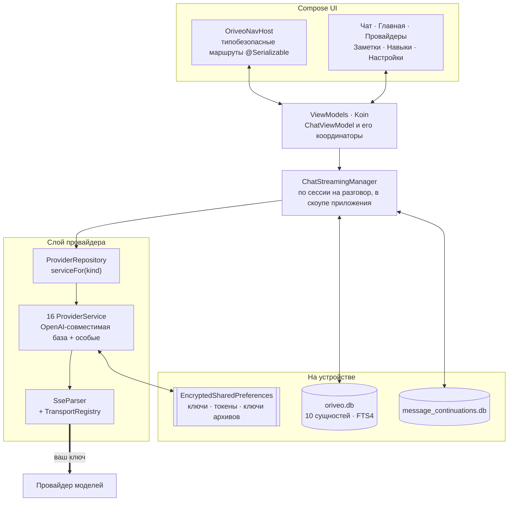

<div align="center">

# Oriveo для Android

**Нативный клиент чата на Jetpack Compose для AI-моделей, за которые вы и так платите.**

<a href="../../LICENSE"></a>


<sub>

<a href="../../android/README.md">English</a> ·
<a href="../ar/android.md">العربية</a> ·
<a href="../de/android.md">Deutsch</a> ·
<a href="../es/android.md">Español</a> ·
<a href="../fr/android.md">Français</a> ·
<a href="../hi/android.md">हिन्दी</a> ·
<a href="../id/android.md">Indonesia</a> ·
<a href="../ja/android.md">日本語</a> ·
<a href="../ko/android.md">한국어</a> ·
<a href="../pt-BR/android.md">Português</a> ·
**Русский** ·
<a href="../th/android.md">ไทย</a> ·
<a href="../tr/android.md">Türkçe</a> ·
<a href="../vi/android.md">Tiếng Việt</a> ·
<a href="../zh-Hans/android.md">简体中文</a> ·
<a href="../zh-Hant/android.md">繁體中文</a>

</sub>

</div>

---

Клиент Oriveo для Android — это AI-чат в модели BYOK. Вы добавляете API-ключи, которые у вас уже
есть, и приложение разговаривает с каждым провайдером прямо с телефона. Разговоры, заметки, папки и
навыки хранятся на устройстве в Room; API-ключи шифруются ключом, который держит Android Keystore.
Ни аккаунта, ни входа.

Это часть [Oriveo Community Edition](README.md) — трёх клиентов, у которых одно общее определение
того, как разговаривать с провайдером моделей.

## Архитектура



Три вещи на этой схеме — осознанные проектные решения, а не случайно сложившаяся структура.

**Стриминг живёт выше экрана.** `ChatStreamingManager` держит по одной `StreamingSession` на id
разговора в `ConcurrentHashMap`, и каждая работает своим `Job` в одном общем
`CoroutineScope(SupervisorJob() + Dispatchers.IO)` в скоупе приложения — supervisor здесь и есть
суть: падение одного потока не роняет остальные. Уход с экрана чата не отменяет ответ, а
`ChatRepository` сбрасывает частичный текст в SQLite всякий раз, когда `StreamingTokenBuffer`
говорит, что накопилось достаточно (4 000 символов или 60 секунд), так что убийство приложения
посреди ответа не теряет то, что уже пришло.

**Две базы данных, а не одна.** `oriveo.db` хранит разговоры, сообщения, вложения, заметки, папки,
навыки и кэш каталога моделей. `message_continuations.db` — физически отдельный файл с непрозрачным
состоянием продолжения от провайдера, именно для того, чтобы `backup_rules.xml` и
`data_extraction_rules.xml` могли исключить его из облачного бэкапа и переноса на другое
устройство: токен продолжения, восстановленный на другом устройстве, в лучшем случае бессмыслен.

**Каталог новее бинарника деградирует, а не ломается.** `TransportKind` — закрытый enum со
снисходительным десериализатором: неизвестная строка транспорта декодируется в `null`,
`TransportRegistry` не возвращает стратегию, и модель отфильтровывается из списка выбора.
Альтернатива — строгий enum — уронила бы разбор всего каталога и утащила бы за собой все остальные
модели.

## Что модели разрешено делать

Клиент никогда не угадывает возможности модели по её имени. Он читает runtime возможностей из
каталога: рецепты, которые для конкретного провайдера, транспорта и возможности описывают, какие
именно JSON pointer'ы записать в запрос. `ProviderRecipeRequestCompiler` проверяет рецепт на
соответствие провайдеру, возможности и транспорту, прежде чем скомпилировать его в собственную
дельту тела, и отклоняет с названной причиной (`recipe_not_found`, `transport_mismatch`,
`model_route_must_not_patch_body`), а не собирает молча запрос, который никто не проверял.

На обратном пути `CapabilityEvidenceFacade` ранжирует то, что о возможности действительно известно,
по источнику — `operator_override` > `server_typed` > `server_profile` > `model_facts` >
`relay_verification` > `relay_declaration` > `legacy_metadata`. Пометить возможность как *observed*
может только парсер потока; намерение, рецепты, HTTP 200 и объявление tool явным образом не в счёт.
Результат по каждому сообщению сохраняется, поэтому интерфейс отличает *запрошено* от
*подтверждено*.

Переопределения разрешаются по правилу last-write-wins в семи областях, в порядке приоритета:
`single_send` > `conversation_connection_model` > `skill_agent` > `connection_model` > `connection` >
`provider_recipe` > `provider_default`.

## Хранение и секреты

| Что | Где |
|---|---|
| Разговоры, сообщения, вложения, заметки, папки, навыки | Room, `oriveo.db` |
| Полнотекстовый поиск по заметкам | виртуальная таблица FTS4 |
| Кэш каталога моделей | одна строка в `oriveo.db`, читается обратно кусками |
| Состояние продолжения от провайдера | `message_continuations.db`, исключён из бэкапа |
| API-ключи провайдеров | `EncryptedSharedPreferences`, AES-256-GCM, мастер-ключ в Keystore |
| OAuth-токены подписок | второй, отдельный зашифрованный файл настроек |
| Ключи архивов резервных копий | третий |
| Блобы вложений | файлы на диске, по ссылке на id |

Три зашифрованных файла настроек разделены по времени жизни и радиусу поражения, а не слиты в один
ради удобства. У каждого есть путь восстановления: повреждённый файл (`AEADBadTagException`,
`VERIFICATION_FAILED`) обнаруживается, удаляется и создаётся заново, вместо того чтобы ронять
приложение при каждом запуске.

Все три, вместе с базой продолжений, исключены из облачного бэкапа Android и переноса на другое
устройство. Это следствие их привязки к Keystore, а не недосмотр: шифротекст на новом устройстве всё
равно было бы нечем расшифровать. **После переезда на новый телефон вы заново вводите свои API-ключи
и заново входите в подписки провайдеров**; разговоры и заметки переезжают как обычно.

Архив, который вы экспортируете сами, — это zip с `data.json` и файлами вложений. Выбранный вами
пароль защищает **только API-ключи провайдеров** внутри него: они шифруются PBKDF2-HMAC-SHA256 с
600 000 итераций и AES-GCM и лежат одним полем в `data.json`. Разговоры, сообщения, заметки, папки,
навыки, настройки и вложения в любом случае пишутся обычным JSON и обычными файлами, так что
относитесь к архиву как к читаемому любым, у кого есть этот файл. Если вам нужна только история,
экспортируйте без ключей.

## Как дотянуться до сервера модели в вашей собственной сети

Манифест выставляет `android:usesCleartextTraffic="true"`, и это сделано намеренно: локальные
серверы моделей — llama.cpp, Ollama, LM Studio, vLLM — говорят по обычному HTTP на вашей собственной
машине или в локальной сети и обычно не имеют сертификата.

Настоящая граница проходит в коде, а не в манифесте, потому что иначе и быть не может.
`RelayEndpointPolicy` резолвит хост, требует, чтобы **каждый** полученный адрес был приватным
(loopback, RFC 1918, link-local, unique-local и диапазон CGNAT в режиме VPN), отклоняет хост,
который резолвится в смесь публичных и приватных адресов, фиксирует полученный набор адресов против
DNS rebinding и перепроверяет его в момент отправки. Он отказывает любому запросу в открытом виде,
несущему учётные данные. В клиентах обнаружения и локальных движков редиректы не выполняются вовсе,
а подстраховкой служит та же фиксация адресов.

Android network security config такой набор выразить не может: она сопоставляет только по имени
хоста, не имеет синтаксиса для диапазонов адресов, а адреса здесь приходят из собственной сети
пользователя во время работы. К тому же config был бы строго слабее, поскольку он никогда не видит
адрес, в который разрезолвилось имя.

## Каталог моделей

Приложение читает возможности и цены моделей из публичного каталога, чтобы вышедшая сегодня модель
работала без обновления приложения. Это обычный HTTPS `GET` без учётных данных и без приложенного
идентификатора, и запросы чата к нему близко не подходят. Запрашиваются только два endpoint'а:

```
GET {base}/api/metadata?view=lean
GET {base}/api/metadata/model-facts
```

Базовый URL — свойство времени сборки, по умолчанию `https://api.oriveoai.com`:

```bash
./gradlew :app:assembleDebug -PORIVEO_METADATA_BASE_URL=https://your.host
```

Ответы перевалидируются по ETag и кэшируются в `oriveo.db`, так что после первой успешной загрузки
приложение продолжает работать с кэшированной копией, когда каталог позже окажется недоступен.

> [!IMPORTANT]
> Сборка с пустым значением (`-PORIVEO_METADATA_BASE_URL=`) полностью отключает загрузку каталога, и
> **в APK не зашит никакой снимок**. При чистой установке такой сборки:
>
> - ни один из 15 встроенных провайдеров не получает списка моделей, и приложение не запрашивает его
>   у провайдера — каталог является единственным источником;
> - на экране провайдера появляется баннер «Не удалось загрузить официальные модели», но добавление ключа
>   по-прежнему сообщает об успехе, а список выбора моделей просто пуст;
> - **OpenAI становится непригодной**, потому что ручной ввод модели для этого провайдера запрещён;
> - Relay-endpoint'ы и локальные серверы моделей продолжают работать полностью и остаются
>   единственным целым путём.
>
> Если вам нужна офлайновая сборка, отдавайте каталог сами и направьте сборку на него, а не
> опустошайте значение.

## Структура проекта

```
android/
  app/src/main/java/ai/oriveo/community/
    core/
      provider/    every provider service, transports, relay, capability recipes
      data/        Room entities, DAOs, repositories, backup, catalog client
      model/       domain models and the capability/preference resolvers
      attachments/ routing, budgets, per-format text extraction
      security/    SecureKeyStore, BackupCrypto, external-URL policy
      streaming/   ChatStreamingManager
      navigation/  AppRoute, OriveoNavHost
    feature/       one package per screen
    ui/            shared components, Markdown + LaTeX renderer, theme
    di/            Koin modules
  benchmark/       macrobenchmark suite (cold start, model picker)
```

## Сборка

Требования: **JDK 21** и Android SDK. Сборка использует AGP 9.3, Gradle 9.5 и Kotlin 2.3, поэтому
Android Studio должна быть версией, способной синхронизировать AGP 9.3; из командной строки нужны
только JDK и SDK.

```bash
./gradlew :app:assembleDebug
./gradlew :app:testDebugUnitTest
```

Сборка нацелена на `minSdk 26`, `targetSdk 36`, `compileSdk 37`. `local.properties` (путь к вашему
SDK) генерируется Android Studio и не коммитится. Подпись релиза описана в
[SIGNING.md](../../android/SIGNING.md).

> [!NOTE]
> Демон Gradle работает на toolchain Java 21 (`gradle/gradle-daemon-jvm.properties`), причём
> совпадение требуется ровно с 21, а не «21 или новее». С любым другим установленным JDK Gradle при
> первой сборке скачивает JDK 21 для себя, и для этого нужен доступ в сеть; установите JDK 21
> самостоятельно, и загрузки не будет. Если вы выставили
> `org.gradle.java.installations.auto-download=false`, эта загрузка невозможна и сборка падает с
> `Toolchain auto-provisioning is not enabled.` — это единственный случай, когда одного JDK 17
> действительно не хватает. Компиляция в любом случае нацелена на Java 17.

Параллелизм юнит-тестов выводится из числа CPU и объёма физической памяти машины, а не задан
константой, поэтому набор ведёт себя разумно и на ноутбуке, и на большой рабочей станции.

## Зависимости

| Библиотека | Версия | Для чего |
|---|---|---|
| Jetpack Compose BOM | 2026.08.00 | UI, Material 3 |
| Room | 2.8.4 | SQLite, DAO, FTS4 |
| Koin | 4.2.2 | внедрение зависимостей |
| Ktor client (движок OkHttp) | 3.5.2 | HTTP и SSE к провайдерам |
| kotlinx.serialization | 1.11.0 | JSON |
| navigation-compose | 2.9.6 | типобезопасные маршруты |
| androidx.security-crypto | 1.1.0 | `EncryptedSharedPreferences` |
| haze | 1.7.3 | размытие фона |
| PDFBox-Android, jsoup | 2.0.27.0, 1.23.2 | извлечение текста из вложений |
| jlatexmath-android | 0.2.0 | рендеринг LaTeX |

Точные версии зафиксированы в
[`gradle/libs.versions.toml`](../../android/gradle/libs.versions.toml).

## Тесты

```bash
./gradlew :app:testDebugUnitTest
```

Примерно 3 000 юнит-тестов в 318 файлах, на JUnit 4, MockK, Robolectric, `kotlinx-coroutines-test`
и mock engine из Ktor. Покрытие плотнее всего там, где ошибки обходятся дороже всего: форма запроса
для каждого провайдера, разбор SSE, выбор транспорта, зондирование relay и режимы безопасности,
исполнение рецептов возможностей, кэширование каталога и работа с версией контракта, хранение в Room
и полный цикл резервного копирования и восстановления.

> [!IMPORTANT]
> Около 38 наборов загружают контрактные фикстуры, поднимаясь вверх от рабочей директории, пока не
> найдут `shared/`, поэтому **тесты проходят только в полной копии репозитория** — если скопировать
> наружу один `android/`, работать не будет.

Есть ещё три инструментальных теста — матрица релизов локальных движков, тест открытого сокета и
тест изоляции keystore. Они не самодостаточны: тестам локальных движков нужны аргументы
инструментации, называющие реально работающий сервер модели в вашей сети, поэтому
`connectedAndroidTest` из коробки не проходит. Воротами для pull request'а служит набор
юнит-тестов.

Модуль `:benchmark` содержит макробенчмарки холодного старта и списка выбора моделей. Это отдельный
модуль Gradle на `com.android.test` с самоинструментацией, и он гоняет отдельный тип сборки
`benchmark` у `:app`.

Обе базы данных находятся на `version = 1`, миграций пока нет; схемы экспортируются в
`app/schemas/` и коммитятся — туда же ляжет `2.json` первой миграции.

## Локализация

Шестнадцать языков: `values/` (английский, исходный) плюс пятнадцать директорий локалей — рядом с
`values-night`, в которой строк нет, — примерно по 1 340 строк в каждой, и во всех локалях набор
ключей одинаковый. Смена языка внутри приложения
идёт через `AppLanguageManager` и `android:localeConfig`. Разделение по языкам в бандле отключено,
поэтому один артефакт несёт все переводы.

## Как участвовать

См. [CONTRIBUTING.md](../../CONTRIBUTING.md). Рабочий язык проекта — английский: исходники,
комментарии, тесты и сообщения коммитов. Строки интерфейса переводятся: добавьте новую строку сначала
в `values/`, а остальные локали подтянутся позже. Прогоните юнит-тесты перед тем, как открывать pull
request.

## Лицензия

[AGPL-3.0-or-later](../../LICENSE).
