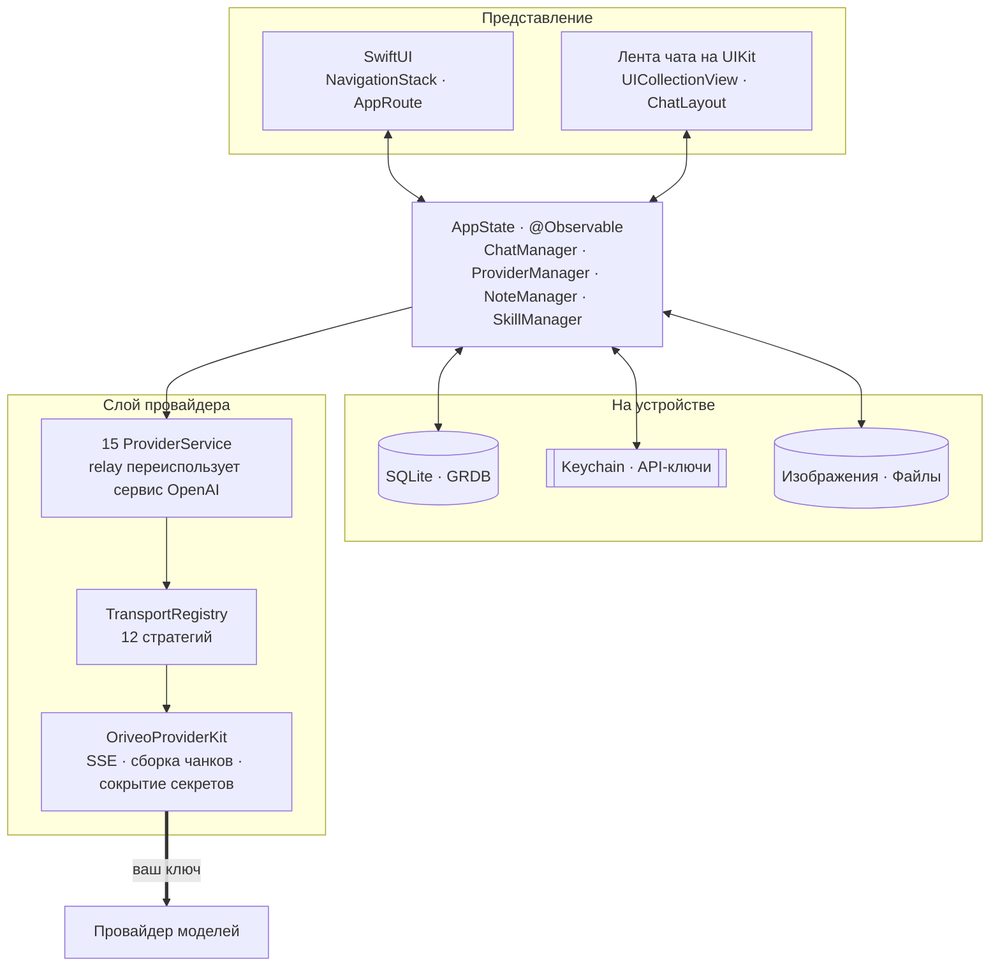

<div align="center">

# Oriveo для iOS

**Нативный клиент чата на SwiftUI для AI-моделей, за которые вы и так платите.**

<a href="../../LICENSE"></a>


<sub>

<a href="../../ios/README.md">English</a> ·
<a href="../ar/ios.md">العربية</a> ·
<a href="../de/ios.md">Deutsch</a> ·
<a href="../es/ios.md">Español</a> ·
<a href="../fr/ios.md">Français</a> ·
<a href="../hi/ios.md">हिन्दी</a> ·
<a href="../id/ios.md">Indonesia</a> ·
<a href="../ja/ios.md">日本語</a> ·
<a href="../ko/ios.md">한국어</a> ·
<a href="../pt-BR/ios.md">Português</a> ·
**Русский** ·
<a href="../th/ios.md">ไทย</a> ·
<a href="../tr/ios.md">Türkçe</a> ·
<a href="../vi/ios.md">Tiếng Việt</a> ·
<a href="../zh-Hans/ios.md">简体中文</a> ·
<a href="../zh-Hant/ios.md">繁體中文</a>

</sub>

</div>

---

Клиент Oriveo для iOS — это AI-чат в модели BYOK. Вы добавляете API-ключи, которые у вас уже есть, и
приложение обращается к каждому провайдеру прямо с телефона. Разговоры, заметки, папки, skills и
вложения хранятся на устройстве в SQLite; API-ключи уходят в iOS Keychain. Ни аккаунта, ни входа.

Это часть [Oriveo Community Edition](README.md) — трёх клиентов, у которых одно общее определение
того, как разговаривать с провайдером моделей.

## Архитектура



Три вещи об этой схеме стоит сказать прямо.

**Лента чата — это UIKit, всё остальное — SwiftUI.** `ChatView` встраивает
`ChatListViewControllerRepresentable` вокруг `UICollectionView`, которым управляет
[ChatLayout](https://github.com/ekazaev/ChatLayout). Всё остальное — навигация, настройки, настройка
провайдеров, заметки, skills — на SwiftUI. Разделение существует потому, что ленте, которая
стримится со скоростью токенов, нужен контроль над измерением и переиспользованием на уровне ячейки,
которого diffing SwiftUI не даёт. Границу описывает
[`Features/Chat/ARCHITECTURE.md`](../../ios/Oriveo/Oriveo/Features/Chat/ARCHITECTURE.md).

**Эту ленту обновляют три отдельных пути**, и это сделано намеренно:

| Путь | Что несёт | Зачем |
|---|---|---|
| `@Observable AppState` | структурные изменения — появилось сообщение, переключился разговор | нативно для SwiftUI, дёшево для редких событий |
| GRDB `ValueObservation` | долговременное состояние, прочитанное обратно из SQLite | единый источник правды после записи, переживает перезапуск |
| Combine `PassthroughSubject` на каждый разговор | стриминговые дельты текста и рассуждений | полностью обходит diffing SwiftUI на скорости токенов |

**Поддержка провайдеров — это четыре независимые оси, а не один enum.** `ProviderKind` (16 вариантов)
— это *что настроил пользователь*. `ProviderServiceProtocol` — это *поверхность вызова*.
`TransportKind` (12 вариантов) — это *на каком сетевом протоколе на самом деле идёт разговор*, и он
определяется **по модели, из каталога**, так что две модели за одним и тем же ключом могут
расходиться. `RelayKind` покрывает endpoint'ы, заданные пользователем. Именно то, что они разделены,
позволяет новой модели заработать без новой сборки.

### Как отправляется одно сообщение


`BaseAPIService.encodeChatBody` — единственная точка, где тело запроса становится байтами. Каждый
рецепт возможности, каждый параметр генерации и каждое пользовательское поле обязаны пройти через
неё, и именно это делает сетевой формат проверяемым в одном месте, а не в пятнадцати.

## Что модели разрешено делать

Клиент никогда не угадывает возможности модели по её имени. Он читает **runtime возможностей** —
набор рецептов, которые для конкретного провайдера, транспорта и возможности описывают, какие именно
JSON pointer'ы записать в запрос. Эти рецепты лежат в
[`shared/capabilityrecipe`](../../shared/capabilityrecipe/) и применяются
`CapabilityRecipeRequestCompiler`.

На обратном пути `CapabilityExecutionRuntime` фиксирует, что произошло на самом деле. Повысить
возможность до *observed* может только выбранный продакшен-парсер потока. HTTP 200, непустой ответ и
объявление tool в запросе явным образом **не** являются доказательством. Итоговое состояние
сохраняется для каждого сообщения, поэтому интерфейс может сказать, что управление было запрошено,
но так и не подтвердилось, вместо того чтобы молча намекать, будто всё сработало.

## Хранение

```
Application Support/Oriveo/
  active-uid                     # storage partition, "guest" by default
  users/<uid>/
    oriveo.sqlite                # conversations, messages, notes, catalog cache
    Images/  Files/              # attachment blobs, referenced by id
    session-snapshot.json        # preferences, provider list (never API keys)
```

- **SQLite через GRDB** с WAL, включёнными foreign keys и `DatabaseMigrator`, покрывающим каждое
  изменение схемы. Полнотекстовый поиск по сообщениям и заметкам использует FTS5 с триграммным
  токенизатором.
- **API-ключи живут в Keychain**, с ключом по провайдеру и партиции, и вычищаются из снимка сессии
  до того, как он будет записан.
- **Блобы вложений — это файлы на диске**, а не строки, поэтому большой PDF никогда не раздувает
  базу данных.

## Единственный сетевой запрос, который приложение делает для себя

При холодном старте приложение делает два неаутентифицированных `GET`-запроса с условием по ETag к
`https://api.oriveoai.com` — `/api/metadata?view=lean` и `/api/metadata/model-facts`. Они забирают
публичный каталог моделей: какие модели существуют, что каждая поддерживает, как называются её
элементы управления рассуждением и сколько она стоит. Ни ключа, ни разговора, ни идентификатора не
прикладывается, а ответ кэшируется в SQLite, так что приложение работает с кэшированной копией,
когда каталог недоступен.

Это единственный запрос, который приложение делает от своего имени. Всё остальное уходит провайдеру,
которого настроили вы, с вашим ключом.

Чтобы направить **Debug**-сборку на свой хост каталога, задайте `ORIVEO_METADATA_BASE_URL` — либо
переменной окружения в схеме, либо ключом в `ios/Oriveo/Config/Info.plist`. В отличие от клиентов
Android и веба, Release-сборка её игнорирует и всегда берёт опубликованный каталог; чтобы это
изменить, придётся править `BackendURLResolver`.

## Структура проекта

```
ios/Oriveo/
  Oriveo.xcodeproj/
  Oriveo/
    Core/
      Providers/       15 provider services, transports, capability runtime, catalog client
      State/           AppState and the managers it owns
      Database/        GRDB pool, schema, migrator, stores, observations
      Models/          domain types
      Attachments/     import limits, budgets, per-format text extraction
      Tools/           tool-call loop and per-protocol adapters
    Features/
      Chat/            transcript, composer, model controls, export
      Providers/       setup, detail, relay, local engines, subscription sign-in
      Home/ Notes/ Skills/ Settings/ Backup/ Onboarding/
    Shared/Components/ shared views
    DesignSystem/      theme, colour, haptics
  OriveoTests/
```

## Сборка и запуск

Вам понадобится Mac с **Xcode 26** и устройство на **iOS 18 или новее**. Хватит бесплатного аккаунта
Apple Developer; приложение не использует платных capability и поставляется с пустым файлом
entitlements.

1. Откройте `ios/Oriveo/Oriveo.xcodeproj`
2. Выберите схему `Oriveo`
3. В разделе **Signing & Capabilities** выберите свою Team
4. Если Xcode не может зарегистрировать `ai.oriveo.community`, смените bundle identifier на тот,
   который принадлежит вашей команде
5. Подключите iPhone, включите режим разработчика, доверьтесь компьютеру и запустите

Чтобы собрать для симулятора, выберите любой симулятор iPhone и запустите. Зависимости пакетов
разрешаются из закоммиченного `Package.resolved`.

Файл проекта использует `objectVersion = 77` с группами, синхронизированными с файловой системой,
поэтому более старый Xcode может отказаться его открывать. Обновите Xcode, а не правьте формат
проекта.

> [!NOTE]
> Таргет приложения компилируется в языковом режиме Swift 5 с `SWIFT_APPROACHABLE_CONCURRENCY` и
> `SWIFT_DEFAULT_ACTOR_ISOLATION = MainActor`. Локальный пакет `OriveoProviderKit` объявляет
> `swift-tools-version: 6.1` и собирается в языковом режиме Swift 6.

## Зависимости

| Пакет | Версия | Для чего |
|---|---|---|
| [GRDB.swift](https://github.com/groue/GRDB.swift) | 7.11.1 | доступ к SQLite, миграции, `ValueObservation` |
| [ChatLayout](https://github.com/ekazaev/ChatLayout) | 2.4.3 | вёрстка collection view для ленты чата |
| [swift-markdown-ui](https://github.com/gonzalezreal/swift-markdown-ui) | 2.4.1 | рендеринг Markdown |
| [SwiftMath](https://github.com/mgriebling/SwiftMath) | 1.7.3 | рендеринг LaTeX |
| [ZIPFoundation](https://github.com/weichsel/ZIPFoundation) | 0.9.20 | архивы резервных копий, разбор Office/EPUB/ODF |
| `OriveoProviderKit` | локальный | сетевое ядро провайдеров, в [`shared/`](shared.md) |

## Тесты

Запустите тестовое действие схемы `Oriveo` (⌘U) в Xcode или из корня репозитория:

```bash
xcodebuild test -project ios/Oriveo/Oriveo.xcodeproj -scheme Oriveo \
  -destination 'platform=iOS Simulator,name=iPhone 17'
```

Подставьте симулятор, который у вас действительно есть — их список даёт
`xcrun simctl list devices available`.

> [!IMPORTANT]
> Тестовый таргет читает контрактные фикстуры из `shared/`, поднимаясь вверх от `#filePath`, пока не
> найдёт эту директорию. От неё зависят около 29 наборов, поэтому **тесты проходят только в полной
> копии репозитория** — если скопировать наружу один `ios/`, работать не будет.

Набор большой: примерно 2 900 тестов в 273 файлах, в основном на [Swift
Testing](https://github.com/swiftlang/swift-testing). Он покрывает форму запроса для каждого
провайдера, воспроизведение записанного SSE от upstream, политику relay и локальных движков,
измерение ленты чата и поведение стриминга, хранение и полный цикл резервного копирования и
восстановления.

У `shared/OriveoProviderKit` есть собственный набор:

```bash
cd shared/OriveoProviderKit && swift test
```

## Локализация

Шестнадцать языков, хранящихся как Xcode String Catalogs (`.xcstrings`) — десять каталогов, около
1 900 ключей, английский как исходный. Строки резолвятся через `L10n.tr(_:table:)` из бандла
`.lproj`, выбранного по настройке языка внутри приложения, поэтому смена языка вступает в силу без
перезапуска. Раскладка справа налево для арабского обрабатывается явно.

## Как участвовать

См. [CONTRIBUTING.md](../../CONTRIBUTING.md). Добавляйте тест вместе с изменением поведения; для
исправления протокола провайдера предпочитайте записанную фикстуру в `shared/test-fixtures`
написанному вручную моку и указывайте, на каком провайдере и какой модели вы это проверяли.

## Лицензия

[AGPL-3.0-or-later](../../LICENSE).
