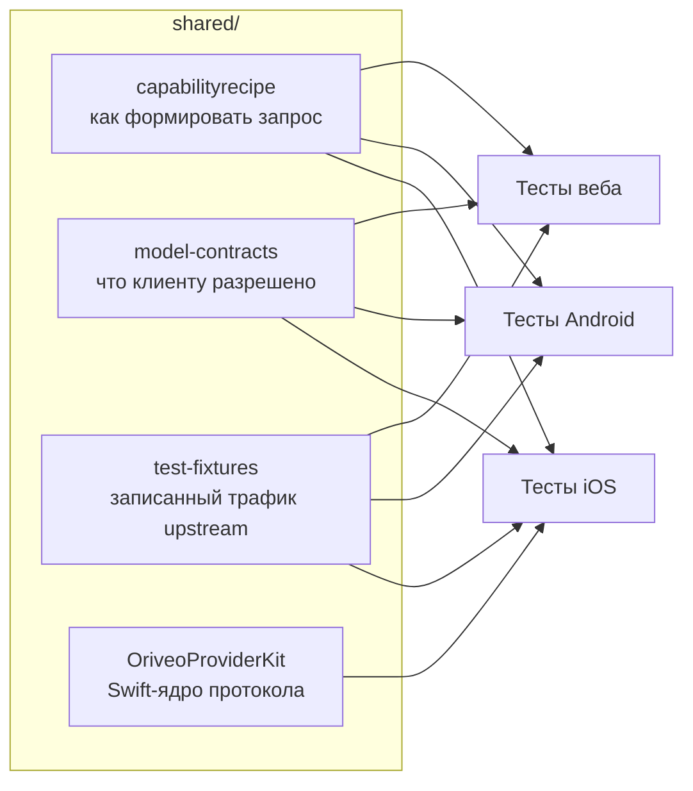

<div align="center">

# Общие контракты

**Одно определение того, как разговаривать с провайдером моделей, проверяемое всеми тремя
клиентами.**

<a href="../../LICENSE"></a>


<sub>

<a href="../../shared/README.md">English</a> ·
<a href="../ar/shared.md">العربية</a> ·
<a href="../de/shared.md">Deutsch</a> ·
<a href="../es/shared.md">Español</a> ·
<a href="../fr/shared.md">Français</a> ·
<a href="../hi/shared.md">हिन्दी</a> ·
<a href="../id/shared.md">Indonesia</a> ·
<a href="../ja/shared.md">日本語</a> ·
<a href="../ko/shared.md">한국어</a> ·
<a href="../pt-BR/shared.md">Português</a> ·
**Русский** ·
<a href="../th/shared.md">ไทย</a> ·
<a href="../tr/shared.md">Türkçe</a> ·
<a href="../vi/shared.md">Tiếng Việt</a> ·
<a href="../zh-Hans/shared.md">简体中文</a> ·
<a href="../zh-Hant/shared.md">繁體中文</a>

</sub>

</div>

---

Три клиента, каждый из которых реализует «вызвать провайдера» самостоятельно, обязательно разойдутся.
Разойдутся тихо, в сторону того из них, который кто-то тестировал последним, и это расхождение
всплывёт багом, который воспроизводится на одной платформе и не воспроизводится на других.

`shared/` — ответ на это: поведение записано один раз как данные, и тестовый набор каждого клиента
проверяется по одним и тем же файлам. Причуда, которая живёт в этих данных, чинится один раз.
Причуда, которая живёт в парсере, ловится тремя наборами одновременно, вместо того чтобы уехать в
релиз на двух платформах и сломать третью.



## capabilityrecipe

Реестр рецептов. Для конкретного провайдера, транспорта и возможности — веб-поиск, уровень усилия на
рассуждение, генерация изображений — он говорит, какие именно JSON pointer'ы записать в исходящий
запрос и как прочитать ответ обратно.

Именно это позволяет вышедшей сегодня модели работать без обновления клиента, и именно поэтому ни
один клиент не угадывает возможность по имени модели. Сами рецепты лежат в
`capability_runtime.v1.json`; `capability_result_definitions.v1.json` и
`capability_custom_controls.v2.json` задают, как трактуются результаты и элементы управления,
которые видит пользователь.

Каждый рецепт объявляет `executionKind` — `request_overlay`, `server_tool`, `client_tool_loop`,
`endpoint_route`, `model_route` — и компилятор каждого клиента проверяет, что рецепт соответствует
провайдеру, возможности и транспорту, прежде чем его применить, отклоняя с названной причиной, а не
отправляя запрос, который никто не проверял.

## model-contracts

JSON-фикстуры, прибивающие межклиентское поведение: как должен выглядеть запрос для конкретного
провайдера и возможности, как разрешаются параметры генерации и как наслаиваются переопределения,
какие состояния возможности клиент вправе показать и как потребляются каталог моделей и его
свидетельства.

Тесты каждого клиента загружают их напрямую, поэтому изменение здесь — это изменение сразу во всех
трёх клиентах.

## test-fixtures

Эталонные тестовые данные: записанный трафик tool call от upstream, сценарии маршрутизации и
обнаружения relay, снимки model facts и свидетельств о возможностях, сценарии локальных движков.

Файлы `.sse` внутри `recorded/` — это **реально захваченный трафик upstream**, оставленный
нетронутым, байт в байт; остальные — написанные вручную фикстуры, прибивающие конкретный путь
разбора. Различие важно: написанный вручную мок кодирует то, что вы думали о поведении провайдера, а
запись кодирует то, что он на самом деле сделал, включая битый чанк, который он прислал в тот
вторник. Когда исправлению протокола провайдера нужен тест, предпочитайте запись.

## OriveoProviderKit

Swift-пакет с ядром сетевого протокола провайдеров: сборка строк SSE, разбор OpenAI-совместимых
чанков, кодирование имён tool, сокрытие учётных данных, классификация ошибок upstream, разбор тегов
thinking, извлечение JSON-путей на потоке и профили причуд по каждому провайдеру.

Его границы намеренно проведены узко. **Внутри:** знание о сети, опирающееся только на Foundation.
**Снаружи:** модели приложения, UI, база данных, телеметрия, локализация. Каждый Apple-клиент держит
вокруг него тонкую обвязку, чтобы у сетевого поведения была ровно одна реализация.

```bash
cd shared/OriveoProviderKit && swift build && swift test
```

- Платформы: iOS 18+, macOS 15+ · `swift-tools-version: 6.1`
- `ProviderWireProfile` несёт остаточные причуды отдельных вендоров, которые всё ещё нужны единому
  OpenAI-совместимому сборщику: куда приходит текст рассуждений, где лежат счётчики закэшированных
  токенов, включают ли токены промпта попадания в кэш. Он описывает, *как приходят байты*, и никогда
  — *что модель умеет*; это работа рецептов.

## Работа с этими файлами

Изменение здесь — это изменение во всех клиентах. Прогоните контрактные наборы каждого клиента,
который читает тронутый вами файл, а не только того, в котором вы сейчас работаете:

Из корня репозитория:

```bash
(cd web && npm run test:run)
(cd shared/OriveoProviderKit && swift test)
# plus the iOS and Android suites — see their READMEs
```

iOS-наборы находят эту директорию, поднимаясь вверх от файла теста, пока не встретят `shared/`;
Android-наборы резолвят `../../shared` от директории Gradle-модуля; веб-наборы резолвят её
относительно workspace. Поэтому всем им нужна полная копия репозитория.

## Лицензия

[AGPL-3.0-or-later](../../LICENSE).
