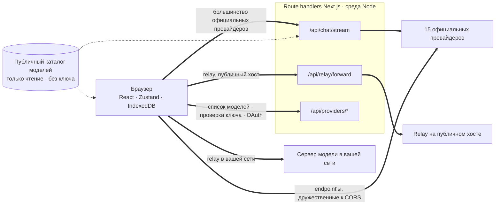
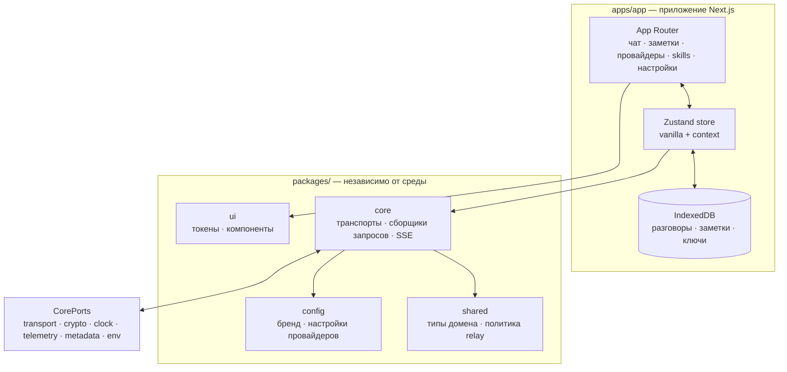

<div align="center">

# Oriveo для веба

**Клиент чата на Next.js для AI-моделей, за которые вы и так платите.**

<a href="../../LICENSE"></a>


<sub>

<a href="../../web/README.md">English</a> ·
<a href="../ar/web.md">العربية</a> ·
<a href="../de/web.md">Deutsch</a> ·
<a href="../es/web.md">Español</a> ·
<a href="../fr/web.md">Français</a> ·
<a href="../hi/web.md">हिन्दी</a> ·
<a href="../id/web.md">Indonesia</a> ·
<a href="../ja/web.md">日本語</a> ·
<a href="../ko/web.md">한국어</a> ·
<a href="../pt-BR/web.md">Português</a> ·
**Русский** ·
<a href="../th/web.md">ไทย</a> ·
<a href="../tr/web.md">Türkçe</a> ·
<a href="../vi/web.md">Tiếng Việt</a> ·
<a href="../zh-Hans/web.md">简体中文</a> ·
<a href="../zh-Hant/web.md">繁體中文</a>

</sub>

</div>

---

Веб-клиент Oriveo — это AI-чат в модели BYOK, собранный на Next.js. Разговоры, заметки, папки,
skills и ваши ключи провайдеров живут в собственном хранилище браузера. Ни аккаунта, ни входа.

Это часть [Oriveo Community Edition](README.md) — трёх клиентов, у которых одно общее определение
того, как разговаривать с провайдером моделей.

## Быстрый старт

Требуется Node 22.22 или новее (см. [`.nvmrc`](../../web/.nvmrc)). npm идёт вместе с ним; другой
пакетный менеджер не нужен.

```bash
npm install
npm run dev:app     # http://localhost:3001
```

Первый экран попросит API-ключ провайдера. Больше ничего не нужно, чтобы начать общаться.

## Как на самом деле идёт запрос

Это та часть, которую стоит прочитать раньше всего остального, потому что веб-клиент — единственное
место, где запрос обычно **не** идёт от клиента к провайдеру напрямую.



**Зачем нужен этот крюк.** Большинство API провайдеров не отдают CORS-заголовки, поэтому браузер не
может обратиться к `api.openai.com` и его собратьям напрямую — preflight падает. Каждому браузерному
BYOK-клиенту приходится как-то это решать; этот пробрасывает запросы через route handlers Next.js,
работающие в среде Node. Когда вы запускаете `npm run dev:app`, эти handlers — на вашей собственной
машине. Когда вы куда-то деплоите приложение, они на той машине, куда вы задеплоили.

Handler не один: стриминг чата, пробрасыватель relay, генерация изображений, список моделей,
проверка ключа и обмены при входе по устройству для Grok и ChatGPT дают в сумме двенадцать файлов
маршрутов. Проверка ключа здесь важна — она отправляет ключ на ваш собственный сервер, а тот с ним
зондирует провайдера.

Несколько endpoint'ов браузеру *всё же* доступны, и они вызываются напрямую, без сервера посередине:
китайский endpoint Kimi (`api.moonshot.cn`) для чата и endpoint'ы баланса у OpenRouter, SiliconFlow,
DeepSeek и Kimi.

**Что handler делает и чего не делает.** Он проверяет форму запроса и ограничивает его размер,
применяет rate limit по IP к трафику чата и relay, отказывает URL'ам, которые резолвятся в приватные
или link-local адреса, собирает тело под конкретного провайдера и стримит ответ обратно. Нигде под
`app/api` нет ни базы данных, ни записи на диск, ни логирования тел запросов — ваш ключ и ваши
сообщения пробрасываются и забываются. А поскольку route — это один процесс, общий для всех
посетителей, отдельным тестом (`server-never-learns.test.ts`) прибито то, что он никогда не кэширует
отклонённый параметр одного пользователя и не применяет его к запросу другого.

Пробрасыватель relay вдобавок фиксирует DNS на том адресе, который он отрезолвил, ограничивает
размер ответа, ставит границы на все таймауты, разрешает редиректы только в пределах того же origin
и отказывается пропускать hop-by-hop заголовки.

**Локальные endpoint'ы обходят его целиком.** Relay на приватном адресе, на `.local`-имени, на
`localhost` или настроенный в режиме локального HTTP либо приватного VPN запрашивается **прямо из
браузера**, с `credentials: 'omit'` и `targetAddressSpace: 'local'`. Ваш трафик в локальной сети не
покидает эту сеть и через сервер приложения тоже не проходит.

## Архитектура



`packages/core` держит каждый байт знаний о протоколах провайдеров и намеренно избавлен от
браузерных глобалей — eslint запрещает `window`, `document`, `fetch`, `crypto`, `localStorage`,
`sessionStorage` и `indexedDB` внутри него и в `packages/ipc-contract`. Всё, что ему нужно от
окружения, приходит через `CorePorts`. Именно это позволяет одному и тому же коду работать в
браузере, в route handler на Node и в тесте без DOM.

Поддержка провайдеров — это две независимые оси. `providerKind` выбирает **request builder** (как
выглядит тело для этого вендора). `model.transport` выбирает **стратегию транспорта** (на каком
сетевом протоколе идёт разговор) из двенадцати, и выбирается она по модели из каталога, а не по
провайдеру — так что две модели за одним и тем же ключом могут расходиться. Стратегия реализует
ровно три метода: `buildRequestBody`, `parseStreamChunk`, `parseError`.

## Workspaces

```
apps/app/               the Next.js application
packages/core/          provider protocols: transports, request builders, SSE parsing
packages/shared/        domain types, relay policy, helpers
packages/ui/            design tokens and shared components
packages/config/        brand and provider defaults
packages/ipc-contract/  typed channel contract for a desktop shell
```

Стилизация — это CSS Modules поверх единого набора токенов на custom properties в `packages/ui`;
фреймворка утилитарных классов здесь нет. `packages/ipc-contract` описывает поверхность канала, к
которой подключалась бы настольная оболочка; такой оболочки в этом репозитории нет, поэтому в
веб-сборке от него остаются только типы и ветки, которые никогда не выполняются.

Есть ещё один шов того же рода. `apps/app/lib/core/sync-port.ts` объявляет интерфейс, который
реализовал бы бэкенд синхронизации, и все места вызова добираются до него через опциональную цепочку.
Никто такой бэкенд не подставляет, поэтому `getSyncAdapter()` возвращает `null`, а IndexedDB остаётся
единственной копией ваших данных — именно это на практике и значит «без аккаунта, без входа».

## Хранение

Всё разложено по партициям, ключом служит активный id, по умолчанию `guest`.

| Что | Где |
|---|---|
| Разговоры, сообщения, папки, заметки, провайдеры | IndexedDB `oriveo--{id}`, 8 object store'ов |
| Снимок каталога моделей (~3 МБ) и model facts | blob-хранилище в IndexedDB, намеренно не localStorage |
| Настройки и таблицы управления моделью | `localStorage`, с `safeLocalStorage` вокруг тех путей, на которых были замечены исключения |
| Сгенерированные и приложенные изображения | отдельная база IndexedDB |

Две детали, которые появились из реальных поломок, а не из вкуса. Снимок каталога живёт в IndexedDB
потому, что при своих ~3 МБ он съедал большую часть 5-мегабайтной квоты localStorage на origin. А
каждое обращение к localStorage идёт через `safeLocalStorage`, потому что сам *геттер*
`window.localStorage` бросает `SecurityError`, когда в браузере запрещены данные сайтов, — голое
чтение роняет страницу ещё до того, как выполнится ваш блок `try`.

> [!IMPORTANT]
> В вебе ключи провайдеров хранятся в IndexedDB **без шифрования** — это та же модель, которую
> обычно используют браузерные BYOK-клиенты, потому что у браузера нет места получше. За самой
> сильной гарантией идите в клиент iOS или Android, где их шифрует системный keychain или keystore.
> С архивами резервных копий всё иначе: они шифруются AES-256-GCM и PBKDF2-SHA-256 с 600 000
> итераций, когда вы задаёте пароль.

## Каталог моделей

Какие модели предлагает каждый провайдер и что каждая из них поддерживает — берётся из каталога
только на чтение, загружаемого при старте. Запрашиваются ровно два endpoint'а, оба `GET`, оба с
условием по ETag, и ни один из них не несёт API-ключа, разговора или какого-либо идентификатора
пользователя:

```
GET {backend}/api/metadata?view=lean
GET {backend}/api/metadata/model-facts
```

Бэкенд по умолчанию — `https://api.oriveoai.com`. Направьте `NEXT_PUBLIC_BACKEND_URL` на свой хост,
чтобы отдавать каталог самостоятельно. Ответ кэшируется на 24 часа в IndexedDB и перевалидируется
через `If-None-Match`; когда каталог недоступен, приложение продолжает работать с кэшированной
копией.

## Команды

Запускайте их из этой директории.

| Команда | Что делает |
|---|---|
| `npm run dev:app` | сервер разработки на порту 3001 |
| `npm run build:app` | продакшен-сборка |
| `npm run typecheck` | `tsc --noEmit` по всем workspace'ам |
| `npm run test:run` | vitest, один прогон |
| `npm run test` | vitest в режиме watch |
| `npm run lint` | eslint по `apps/` и `packages/` |

`npm start --workspace @oriveo/app` отдаёт готовую сборку на порту 3001.

Чтобы запустить один файл тестов, делайте это из того workspace, которому он принадлежит: несколько
наборов ищут фикстуры относительно рабочей директории.

```bash
cd apps/app && npx vitest run lib/core/chat/__tests__/stream-options.test.ts
```

## Настройка

Всё опционально. Скопируйте [`.env.example`](../../web/.env.example) в `.env.local` и задайте только
то, что вам нужно; каждая переменная, которую читает код, там перечислена и описана.

### Отчёты об ошибках

В приложение входит SDK Sentry. Без DSN он **инертен** — нет `NEXT_PUBLIC_SENTRY_DSN`, значит нет
транспорта, нет событий, никуда ничего не уходит, и именно так собирается сборка из этого
репозитория. Задайте его — и вы получите отчёты об ошибках, трассировку производительности на 10 % и
запись сессий на 1 %, с хуками, которые вырезают ключи провайдеров, endpoint'ы и содержимое
сообщений до того, как событие покинет браузер. Он здесь для того, чтобы деплой, которому отчёты об
ошибках нужны, мог их получить, а не потому, что эта сборка звонит домой.

## Размещение у себя

Ни Dockerfile, ни скрипта деплоя здесь нет; приложение — обычный сервер Next.js.

```bash
npm ci
npm run build:app
npm start --workspace @oriveo/app     # 127.0.0.1:3001
```

Прежде чем ставить его за обратный прокси, стоит знать три вещи.

`npm start` слушает `127.0.0.1`, поэтому прокси должен работать на том же хосте — либо адрес привязки
надо менять.

Задайте в `NEXT_PUBLIC_APP_URL` тот origin, с которого вы действительно отдаёте приложение.
Канонические ссылки, sitemap и картинка для превью в соцсетях разрешаются относительно него, а по
умолчанию там стоит порт для разработки.

Задайте в `TRUSTED_PROXY_HOP_COUNT` число прокси перед приложением. Рейт-лимитер чата читает адрес
клиента на столько шагов от *правого* края `X-Forwarded-For` — никогда с левого, который клиент
контролирует и может подделать. Значение по умолчанию 1 верно для одного прокси; если оставить его
слишком маленьким за двумя, все посетители попадут в одну корзину лимита, потому что прочитанный
адрес — это адрес вашего же внутреннего прокси.

Приложение уже отдаёт HSTS, `X-Content-Type-Options`, `X-Frame-Options`, `Referrer-Policy`,
`Permissions-Policy` и `Cross-Origin-Opener-Policy` из `next.config.ts`, так что прокси не нужно их
добавлять. Терминирование TLS и ограничения на размер запроса — работа прокси.

И последнее, что стоит решить осознанно: любой, кто может дотянуться до этого развёртывания, может
через его route handler'ы обратиться к провайдеру с ключом, который принесёт сам. Своих ключей
handler'ы не держат и ничего не сохраняют, но они всё же исходящий HTTP-путь — поэтому публично
доступное развёртывание стоит держать за тем же контролем доступа, какой вы дали бы любому другому
внутреннему инструменту.

## Тесты

Примерно 5 600 тестов в 460 файлах, на vitest. Плотнее всего покрыто то, где ошибка обходится дороже
всего: форма запроса для каждого провайдера, поведение транспорта для каждого сетевого протокола,
разбор чанков SSE и прокси, разбор потребления и стоимости, классификация ошибок, зондирование relay
и режимы безопасности, защита от SSRF, исполнение рецептов возможностей, кэширование каталога и
инвалидация по версии контракта, хранение в IndexedDB, разделение хранилища на партиции, полный цикл
резервного копирования и восстановления и сами route handlers.

> [!IMPORTANT]
> Более тридцати наборов загружают контрактные фикстуры из `../shared`, поэтому **тесты проходят только в
> полной копии репозитория** — если скопировать наружу один `web/`, работать не будет.

## Локализация

Шестнадцать локалей в `apps/app/messages`, примерно по 1 800 ключей в каждой, английский как
исходный. Тест обходит директорию и падает, если набор ключей какой-либо локали отличается от
английского, поэтому добавленный файл локали подключается автоматически. Для арабского сделана
полная раскладка справа налево. Выбор локали идёт по явному параметру `?locale=`, затем по cookie,
затем по `Accept-Language`.

## Как участвовать

См. [CONTRIBUTING.md](../../CONTRIBUTING.md). `packages/core` устроен вокруг транспортов: добавить
провайдера — это обычно request builder и адаптер ответа, а не новый клиент. Для исправления
протокола провайдера предпочитайте записанную фикстуру в `shared/test-fixtures` написанному вручную
моку.

## Лицензия

[AGPL-3.0-or-later](../../LICENSE).
