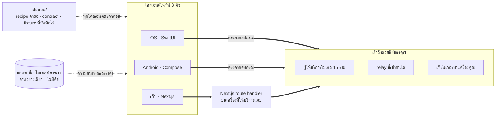

<div align="center">


# Oriveo Community Edition

**ทุกโมเดล ในแอปเดียว**

แอปแชท AI แบบโอเพนซอร์สที่ใช้คีย์ของคุณเอง สำหรับ iOS, Android และเว็บ
พร้อมไคลเอนต์ macOS แบบเนทีฟที่อยู่ระหว่างการพัฒนา
ไม่มีบัญชี ไม่มีการสมัครสมาชิก และไม่มีบริการใดของเราอยู่ในเส้นทางของคำขอ

<a href="../../LICENSE"></a>
<a href="ios.md"></a>
<a href="android.md"></a>
<a href="web.md"></a>
<a href="macos.md"></a>


**รับ Oriveo ได้ที่:**
<a href="https://oriveoai.com"><b>oriveoai.com</b></a> &nbsp;·&nbsp;
<a href="https://apps.apple.com/app/oriveo/id6775370458">App Store</a> &nbsp;·&nbsp;
<a href="https://play.google.com/store/apps/details?id=com.kenny.oriveo">Google Play</a> &nbsp;·&nbsp;
<a href="https://app.oriveoai.com">เว็บแอป</a>

<a href="#เริ่มต้นใช้งาน">บิลด์จากซอร์สโค้ด</a> &nbsp;·&nbsp;
<a href="#สถาปัตยกรรม">สถาปัตยกรรม</a> &nbsp;·&nbsp;
<a href="#community-edition-กับ-oriveo">เอดิชัน</a> &nbsp;·&nbsp;
<a href="#คำถามที่พบบ่อย">คำถามที่พบบ่อย</a> &nbsp;·&nbsp;
<a href="../../CONTRIBUTING.md">การมีส่วนร่วม</a>

<sub>

<a href="../../README.md">English</a> ·
<a href="../ar/README.md">العربية</a> ·
<a href="../de/README.md">Deutsch</a> ·
<a href="../es/README.md">Español</a> ·
<a href="../fr/README.md">Français</a> ·
<a href="../hi/README.md">हिन्दी</a> ·
<a href="../id/README.md">Indonesia</a> ·
<a href="../ja/README.md">日本語</a> ·
<a href="../ko/README.md">한국어</a> ·
<a href="../pt-BR/README.md">Português</a> ·
<a href="../ru/README.md">Русский</a> ·
**ไทย** ·
<a href="../tr/README.md">Türkçe</a> ·
<a href="../vi/README.md">Tiếng Việt</a> ·
<a href="../zh-Hans/README.md">简体中文</a> ·
<a href="../zh-Hant/README.md">繁體中文</a>

</sub>

</div>

---

## Oriveo คืออะไร

Oriveo Community Edition คือแอปแชท AI แบบโอเพนซอร์สที่ใช้คีย์ของคุณเอง (BYOK) สำหรับ iOS, Android
และเว็บ พร้อมไคลเอนต์ macOS แบบเนทีฟที่อยู่ระหว่างการพัฒนา
มันมีไว้สำหรับคนที่ยอมจ่ายเงินตรงให้ผู้ให้บริการโมเดล มากกว่าจะจ่ายค่าสมาชิกให้อะไรก็ตามที่มาขวางอยู่ข้างหน้า
คุณใส่ API key ที่คุณเป็นเจ้าของอยู่แล้ว แล้วตัวแอปจะใช้คีย์นั้นคุยกับผู้ให้บริการโดยตรง
นั่นทำให้มันเป็นทางเลือกแบบเก็บในเครื่องเป็นหลักและใช้ได้หลายโมเดล แทนแพ็กเกจ ChatGPT หรือ Claude
ที่โฮสต์ไว้ให้ — ไม่มีบัญชี Oriveo ไม่มีการสมัครสมาชิก ไม่มีอะไรส่งข้อมูลกลับมาหาเรา
และไคลเอนต์เว็บที่คุณโฮสต์เองได้

แอปคุยกับ **ผู้ให้บริการโมเดล 15 ราย** ได้แบบเนทีฟ — OpenAI, Anthropic, Google Gemini, OpenRouter,
DeepSeek, Grok, Mistral, Groq, Together AI, Fireworks AI, MiniMax, Z.ai, Qwen, Kimi (Moonshot)
และ SiliconFlow — และยังชี้ไปที่ **ปลายทางใดก็ได้ที่เข้ากันได้กับ OpenAI, Anthropic หรือ Gemini**
รวมถึง llama.cpp, Ollama, LM Studio หรือ vLLM ที่รันอยู่บนเครื่องของคุณเอง

| | |
|---|---|
| **ผู้ให้บริการ** | 15 รายในตัว บวกปลายทาง relay ที่กำหนดเอง และเซิร์ฟเวอร์โมเดลในเครื่อง |
| **ไคลเอนต์** | iOS (SwiftUI) · Android (Jetpack Compose) · เว็บ (Next.js) · macOS อยู่ระหว่างการพัฒนา |
| **ภาษาของอินเทอร์เฟซ** | 16 ภาษา |
| **ต้องมีบัญชีไหม** | ไม่ต้อง |
| **การเรียกที่แอปทำในนามของตัวเอง** | หนึ่งอย่าง แบ่งเป็นสองคำขอ: แคตตาล็อกโมเดลแบบอ่านอย่างเดียว ไม่แนบคีย์และไม่แนบตัวระบุตัวตนใดที่เราใส่เข้าไป |
| **สัญญาอนุญาต** | AGPL-3.0-or-later |

## ทำไมถึงมีโปรเจกต์นี้

ไม่ควรมีใครมาตัดโควตา เก็บบันทึก หรือบวกส่วนต่างกับโมเดลที่คุณจ่ายเงินใช้อยู่

- **คีย์ของคุณ บิลของคุณ** คุณจ่ายตามราคาป้ายของผู้ให้บริการ ไม่มีการบวกส่วนต่าง ไม่มีการตัดโควตา
  และไม่มีการขายต่อ
- **เก็บในเครื่องเป็นค่าเริ่มต้น** บทสนทนา โน้ต โฟลเดอร์ สกิล และไฟล์แนบ อยู่บนอุปกรณ์
  ส่งออกเป็นไฟล์ได้ทุกเมื่อ และไม่มีสำเนาบนคลาวด์ที่คุณจะเสียสิทธิ์เข้าถึง
- **พฤติกรรมเดียว ไคลเอนต์สามตัว** วิธีประกอบคำขอสำหรับผู้ให้บริการ transport และความสามารถหนึ่ง ๆ
  ถูกเขียนไว้ครั้งเดียวใน [`shared/`](shared.md) และไคลเอนต์ทั้งสามตรวจสอบกับ JSON fixture
  ชุดเดียวกัน พฤติกรรมประหลาดที่อยู่ในข้อมูลชุดนั้นจึงแก้ครั้งเดียว
  ส่วนพฤติกรรมประหลาดที่อยู่ใน parser จะถูกจับได้จากชุดทดสอบทั้งสามชุดพร้อมกัน
- **สิ่งเดียวที่แอปไปดึงมา** แอปอ่านแคตตาล็อกโมเดลสาธารณะเพื่อให้โมเดลที่เพิ่งออกวันนี้ใช้งานได้
  โดยไม่ต้องอัปเดตแอป คำขอทั้งสองของมันเป็นแบบอ่านอย่างเดียว ไม่แนบคีย์และไม่แนบตัวระบุตัวตนใดที่เราใส่เข้าไป
  และไคลเอนต์เว็บกับ Android ชี้ไปที่โฮสต์ของคุณเองได้

## ฟีเจอร์

- **แชท** — สตรีมมิง บล็อกการให้เหตุผล การอ้างอิงแหล่งที่มา ไฟล์แนบ (รูปภาพและวิดีโอ, PDF,
  Office (docx, xlsx, pptx), OpenDocument, EPUB, RTF, HTML และไฟล์ข้อความล้วนหรือไฟล์ซอร์สโค้ดใดก็ได้)
  อ้างเฉพาะข้อความที่เลือก ลองใหม่ สร้างคำตอบใหม่ และเขียนต่อจากคำตอบที่ถูกขัดจังหวะ
- **ผู้ให้บริการ** — 15 รายในตัว แต่ละรายใช้คีย์ของคุณเอง กำหนดโมเดล
  และพารามิเตอร์การสร้างข้อความแยกรายผู้ให้บริการได้ และเลือกปลายทางตามภูมิภาคได้ในรายที่มีให้เลือก
- **Relay** — ปลายทางใดก็ได้ที่เข้ากันได้กับ OpenAI, Anthropic หรือ Gemini รวมถึงปลายทางใน LAN ของคุณ
- **เซิร์ฟเวอร์โมเดลในเครื่อง** — llama.cpp, Ollama, LM Studio, vLLM, Open WebUI โดย iOS และ Android
  ค้นหาเซิร์ฟเวอร์เหล่านี้ในเครือข่ายท้องถิ่นได้ผ่าน mDNS
- **เข้าสู่ระบบด้วยแพ็กเกจสมาชิก** — ใช้แพ็กเกจ ChatGPT หรือ Grok ที่คุณมีอยู่แล้วแทน API key
  ผ่านขั้นตอนอนุญาตอุปกรณ์ของผู้ให้บริการแต่ละรายเอง
- **สกิล** — system prompt ที่นำกลับมาใช้ซ้ำได้ พร้อมโมเดล การตั้งค่าการให้เหตุผล
  และเอกสารอ้างอิงของตัวเอง
- **โน้ตและโฟลเดอร์** — เก็บคำตอบเป็นโน้ต จัดระเบียบบทสนทนา ค้นหาข้ามทั้งสองอย่าง
- **ตรวจทานไขว้** — ส่งคำตอบหนึ่งให้โมเดลตัวที่สองตรวจ แล้วเก็บทั้งสองไว้ด้วยกัน
- **ค่าใช้จ่าย** — ยอดใช้จ่ายรายข้อความและรายผู้ให้บริการ
  คำนวณบนอุปกรณ์จากสิ่งที่แต่ละคำตอบรายงานมาจริง รวมถึงชั้นการอ่านแคชและการเขียนแคช
- **สร้างภาพ** — ในกรณีที่ผู้ให้บริการรองรับ
- **สำรองข้อมูล** — ส่งออกทุกอย่างเป็นไฟล์ ส่วนคีย์ของผู้ให้บริการที่อยู่ในนั้น ถ้าคุณเลือกให้รวมไปด้วย
  จะถูกเข้ารหัสด้วยรหัสผ่านของคุณเอง
- **อินเทอร์เฟซ 16 ภาษา** รวมถึงเลย์เอาต์ขวาไปซ้ายเต็มรูปแบบสำหรับภาษาอาหรับ

## Community Edition กับ Oriveo

ที่เก็บโค้ดนี้คือ **Oriveo Community Edition** เผยแพร่ภายใต้
[AGPL-3.0-or-later](../../LICENSE) ส่วนแอปบน App Store, Google Play และเว็บแอปที่โฮสต์ไว้ให้ คือ
**Oriveo** — ผลิตภัณฑ์แบบปิดต่างหาก ที่สร้างจากไคลเอนต์ชุดเดียวกัน แล้วเพิ่มชั้นบัญชีผู้ใช้ทับลงไป

| | Community Edition | Oriveo |
|---|---|---|
| ซอร์สโค้ด | ที่เก็บโค้ดนี้ AGPL-3.0-or-later | ปิด |
| แชทด้วยคีย์ผู้ให้บริการของคุณเอง | ได้ | ได้ |
| Relay และเซิร์ฟเวอร์โมเดลในเครื่อง | ได้ | ได้ |
| โน้ต โฟลเดอร์ สกิล ไฟล์แนบ | ได้ | ได้ |
| ติดตามค่าใช้จ่ายบนอุปกรณ์ | ได้ | ได้ |
| บัญชีผู้ใช้ | ไม่มี | บัญชี Oriveo |
| การจัดเก็บ | บนอุปกรณ์ ส่งออกและกู้คืนเอง | เก็บในเครื่องเป็นหลัก บวกซิงก์ข้ามอุปกรณ์ผ่านคลาวด์ |
| สรุปการใช้งานและการแจ้งเตือนงบประมาณ | — | มี |
| โมเดลที่ Oriveo ออกค่าใช้จ่ายให้ | — | มี |
| ข้อมูลวิเคราะห์และรายงานแครช | ไม่มี บันเดิลเว็บพา Sentry มาด้วย แต่เงียบสนิทจนกว่าคุณจะตั้ง DSN ของคุณเอง | มี |

บิลด์ของ Community Edition ใช้คำนำหน้าตัวระบุ `ai.oriveo.community`
จึงอยู่บนอุปกรณ์เครื่องเดียวกับบิลด์จากสโตร์ได้ โดยทั้งสองตัวไม่แชร์ keychain
หรือข้อมูลในเครื่องใด ๆ กัน สิ่งที่เอดิชันนี้รับและไม่รับ เขียนไว้ใน
[COMMUNITY.md](../../COMMUNITY.md)

**Oriveo ตัวผลิตภัณฑ์เต็ม:**
[iPhone และ iPad](https://apps.apple.com/app/oriveo/id6775370458) &nbsp;·&nbsp;
[Android](https://play.google.com/store/apps/details?id=com.kenny.oriveo) &nbsp;·&nbsp;
[เว็บ](https://app.oriveoai.com) &nbsp;·&nbsp;
[oriveoai.com](https://oriveoai.com)

## ผู้ให้บริการ

ผู้ให้บริการทุกรายด้านล่างเข้าถึงด้วยคีย์ที่คุณสร้างขึ้นเอง สองรายในนั้นยังเข้าถึงได้ด้วยการเข้าสู่ระบบ
ด้วยแพ็กเกจสมาชิกที่คุณมีอยู่แล้วแทนที่จะใช้คีย์ ได้แก่ OpenAI ด้วยแพ็กเกจ ChatGPT และ Grok

| ผู้ให้บริการ | ขอคีย์ได้ที่ |
|---|---|
| OpenAI | [platform.openai.com](https://platform.openai.com/api-keys) |
| Anthropic | [platform.claude.com](https://platform.claude.com/settings/keys) |
| Google Gemini | [aistudio.google.com](https://aistudio.google.com/apikey) |
| OpenRouter | [openrouter.ai](https://openrouter.ai/keys) |
| DeepSeek | [platform.deepseek.com](https://platform.deepseek.com/api_keys) |
| Grok | [console.x.ai](https://console.x.ai/) |
| Mistral | [console.mistral.ai](https://console.mistral.ai/api-keys) |
| Groq | [console.groq.com](https://console.groq.com/keys) |
| Together AI | [api.together.xyz](https://api.together.xyz/settings/api-keys) |
| Fireworks AI | [fireworks.ai](https://fireworks.ai/api-keys) |
| MiniMax | [platform.minimax.io](https://platform.minimax.io/docs/guides/quickstart-preparation) |
| Z.ai | [open.bigmodel.cn](https://open.bigmodel.cn/usercenter/apikeys) |
| Qwen | [bailian.console.alibabacloud.com](https://bailian.console.alibabacloud.com/?apiKey=1#/api-key) |
| Kimi (Moonshot) | [platform.kimi.ai](https://platform.kimi.ai/console/api-keys) |
| SiliconFlow | [cloud.siliconflow.cn](https://cloud.siliconflow.cn/account/ak) |
| **Relay** | ปลายทางใดก็ได้ที่เข้ากันได้กับ OpenAI, Anthropic หรือ Gemini รวมถึงปลายทางบนเครื่องของคุณเอง |

## สถาปัตยกรรม

ไคลเอนต์เนทีฟสามตัว กับนิยามเดียวว่าจะคุยกับผู้ให้บริการโมเดลอย่างไร



ไคลเอนต์แต่ละตัวเป็นเจ้าของ UI ที่จัดเก็บข้อมูล และการนำทางของตัวเอง
และมาบรรจบกับข้อกำหนดร่วมที่รอยต่อเดียวเท่านั้น คือชั้นที่แปลง *โมเดลนี้ ความสามารถนี้*
ให้กลายเป็นคำขอ HTTP

มีความไม่สมมาตรอยู่หนึ่งจุดที่ควรรู้ นั่นคือไคลเอนต์เว็บ API ของผู้ให้บริการส่วนใหญ่ไม่ส่ง
CORS header เบราว์เซอร์จึงเรียกตรงไม่ได้ คำขอเหล่านั้นจึงต้องผ่าน Next.js route handler
ที่รันอยู่บนเครื่องซึ่งให้บริการแอป — ซึ่งก็คือเครื่องของคุณเองเมื่อคุณรันในเครื่อง
ส่วนปลายทางไม่กี่แห่งที่อนุญาตให้เบราว์เซอร์เรียกได้ (ปลายทางจีนของ Kimi
และปลายทางดูยอดคงเหลือของผู้ให้บริการบางราย) รวมถึง relay ที่อยู่ในเครือข่ายของคุณเอง
จะถูกเรียกตรง ส่วนไคลเอนต์ iOS และ Android ไม่มีข้อจำกัดนี้ จึงยิงตรงไปหาผู้ให้บริการเสมอ

**สถาปัตยกรรมของไคลเอนต์แต่ละตัว:**

| | สแตก | README |
|---|---|---|
| **iOS** | SwiftUI พร้อม transcript แบบ UIKit, GRDB | [ios/README.md](ios.md) |
| **Android** | Jetpack Compose, Room, Koin, Ktor/OkHttp | [android/README.md](android.md) |
| **เว็บ** | Next.js App Router, React, Zustand, TypeScript | [web/README.md](web.md) |
| **macOS** | อยู่ระหว่างการพัฒนา จะมาในอีกไม่กี่เดือน | [macos/README.md](macos.md) |
| **Shared** | ข้อกำหนดร่วม fixture ที่บันทึกไว้ และ Swift wire kernel | [shared/README.md](shared.md) |

## เริ่มต้นใช้งาน

ที่นี่ไม่มีไบนารีสำเร็จรูป — ไม่มี APK ไม่มี `.ipa` ไม่มี release
Community Edition คือซอร์สโค้ดที่คุณบิลด์เอง ส่วนแอปในสโตร์เป็นอีกผลิตภัณฑ์หนึ่ง
ไคลเอนต์เว็บคือเส้นทางที่สั้นที่สุดที่จะได้แอปที่รันได้จริง

<details open>
<summary><b>เว็บ</b> — วิธีที่เร็วที่สุดในการลองใช้</summary>

<br>

ต้องใช้ Node 22.22 ขึ้นไป (ดู [`web/.nvmrc`](../../web/.nvmrc))

```bash
cd web
npm install
npm run dev:app        # http://localhost:3001
```

หน้าจอแรกจะขอ API key ของผู้ให้บริการ นอกจากนั้นไม่ต้องตั้งค่าอะไรอีก
คำสั่งและการตั้งค่าเพิ่มเติม: [web/README.md](web.md)

</details>

<details>
<summary><b>iOS</b> — บิลด์และรันบน iPhone ของคุณเอง</summary>

<br>

ต้องมี Mac ที่ติดตั้ง Xcode 26 และอุปกรณ์ที่รัน iOS 18 ขึ้นไป บัญชี Apple Developer แบบฟรีก็พอ —
แอปไม่ได้ใช้ capability ที่ต้องเสียเงิน

1. เปิด `ios/Oriveo/Oriveo.xcodeproj`
2. เลือก scheme ชื่อ `Oriveo`
3. ใต้ Signing &amp; Capabilities เลือก Team ของคุณเอง
4. กด Run

คำแนะนำแบบเต็ม รวมถึงวิธีรับมือเมื่อ Xcode ไม่ยอมเปิดโปรเจกต์:
[ios/README.md](ios.md)

</details>

<details>
<summary><b>Android</b> — บิลด์ APK</summary>

<br>

ต้องมี JDK 21 และ Android SDK บิลด์นี้ใช้ AGP 9.3, Gradle 9.5 และ Kotlin 2.3
Android Studio จึงต้องเป็นรุ่นที่ sync ทั้งสามอย่างนี้ได้ ส่วนถ้าใช้บรรทัดคำสั่ง
ต้องการแค่ JDK กับ SDK เท่านั้น

```bash
cd android
./gradlew :app:assembleDebug
```

การให้บริการแคตตาล็อกโมเดลจากโฮสต์ของคุณเอง: [android/README.md](android.md)

</details>

## ความเป็นส่วนตัว

- **คีย์ของผู้ให้บริการ** ถูกเก็บใน iOS Keychain ส่วนบน Android เก็บใน
  `EncryptedSharedPreferences` ภายใต้คีย์ที่ถืออยู่ใน Android Keystore
  เบราว์เซอร์ไม่มีกลไกที่เทียบเท่า บนเว็บคีย์จึงอยู่ใน IndexedDB แบบไม่เข้ารหัส
  ซึ่งเป็นรูปแบบเดียวกับที่ไคลเอนต์ BYOK บนเบราว์เซอร์ทั่วไปใช้กัน
  ถ้าต้องการการรับประกันที่แข็งแรงที่สุด ให้ใช้ไคลเอนต์ iOS หรือ Android
- **บทสนทนา โน้ต โฟลเดอร์ สกิล และไฟล์แนบ** ถูกเก็บบนอุปกรณ์ ไม่มีอะไรถูกอัปโหลดไปที่ไหนทั้งสิ้น
- **ไม่มีบัญชี และไม่มีข้อมูลวิเคราะห์** ไม่มีอะไรให้เข้าสู่ระบบ และไม่มีอะไรนับว่าคุณทำอะไรบ้าง
  บันเดิลเว็บมี Sentry สำหรับรายงานข้อผิดพลาดอยู่ด้วย
  แต่มันจะเงียบสนิทจนกว่าคุณจะตั้ง `NEXT_PUBLIC_SENTRY_DSN` ให้ชี้ไปที่โปรเจกต์ของคุณเอง
  และถ้าคุณตั้ง มันถูกตั้งค่าให้เก็บทั้ง session replay และ stack trace
  ส่วนไคลเอนต์ iOS และ Android ไม่มี SDK รายงานอะไรอยู่เลย
- **บน iOS และ Android คำขอแชทวิ่งตรงจากอุปกรณ์ไปหาผู้ให้บริการ** ส่วนบนเว็บ คำขอส่วนใหญ่จะผ่าน
  เซิร์ฟเวอร์ Next.js ที่ให้บริการแอปอยู่ เพราะ API ของผู้ให้บริการส่วนใหญ่ไม่อนุญาตให้เบราว์เซอร์เรียกตรง
  เซิร์ฟเวอร์นั้นไม่เก็บคีย์หรือข้อความไว้ และเมื่อคุณรันแอปในเครื่อง มันก็คือเครื่องของคุณเอง
- **สองคำขอที่เป็นของเราเอง:** แคตตาล็อกโมเดลแบบอ่านอย่างเดียว อ่านด้วยสองการเรียก —
  ครั้งหนึ่งเพื่อดูว่าแต่ละโมเดลต้องการให้เรียกอย่างไร อีกครั้งเพื่อดูข้อเท็จจริงของแต่ละโมเดล
  ซึ่ง iOS จะอ่านครั้งหลังนี้เฉพาะหลังจากเข้าสู่ระบบด้วยแพ็กเกจสมาชิกแล้ว —
  เพื่อให้โมเดลที่เพิ่งออกวันนี้ใช้งานได้โดยไม่ต้องบิลด์ใหม่ ทั้งสองคำขอไม่แนบคีย์ ไม่แนบบทสนทนา
  และไม่แนบตัวระบุตัวตนใดที่เราใส่เข้าไป ไคลเอนต์เว็บ (`NEXT_PUBLIC_BACKEND_URL`) และบิลด์ Android
  (`-PORIVEO_METADATA_BASE_URL`) ชี้ไปที่โฮสต์ของคุณเองได้ ส่วนบน iOS
  การแทนค่านั้นเป็นแค่ความสะดวกของบิลด์แบบ Debug เท่านั้น

## คำถามที่พบบ่อย

<details>
<summary><b>BYOK หมายความว่าอะไร</b></summary>

<br>

Bring your own key คือเอาคีย์ของคุณเองมาใช้ คุณสร้าง API key ในคอนโซลของผู้ให้บริการ — OpenAI,
Anthropic, Google และรายอื่น ๆ — แล้ววางลงใน Oriveo คำขอจะถูกเรียกเก็บเงินโดยผู้ให้บริการรายนั้น
ตามราคาป้ายของเขา Oriveo เป็นแค่ไคลเอนต์ ไม่ใช่ตัวแทนขายต่อ และไม่หักส่วนแบ่งใด ๆ

</details>

<details>
<summary><b>ใช้ฟรีไหม</b></summary>

<br>

ตัวไคลเอนต์ฟรี มันเป็นโอเพนซอร์สภายใต้ AGPL-3.0-or-later ไม่มีอะไรให้สมัครสมาชิก
และไม่มีส่วนไหนถูกกันไว้หลังการจ่ายเงิน สิ่งที่คุณจ่ายคือราคาป้ายของผู้ให้บริการโมเดลเอง
สำหรับคำขอที่คุณส่ง โดยเขาเรียกเก็บกับบัญชีที่คีย์นั้นสังกัดอยู่ Oriveo ไม่เคยเห็นบิลนั้นเลย

</details>

<details>
<summary><b>บทสนทนาของฉันวิ่งผ่านเซิร์ฟเวอร์ของ Oriveo หรือไม่</b></summary>

<br>

ไม่ บน iOS และ Android ไคลเอนต์เรียกปลายทางของผู้ให้บริการโดยตรง ส่วนบนเว็บ
คำขอส่วนใหญ่จะผ่านเซิร์ฟเวอร์ Next.js ที่ให้บริการแอปอยู่ — ซึ่งก็คือเครื่องของคุณเองเมื่อคุณรันในเครื่อง
เพราะ API ของผู้ให้บริการส่วนใหญ่ไม่ยอมให้เบราว์เซอร์เรียกตรง ๆ ส่วนไม่กี่รายที่ยอมก็ถูกเรียกตรง
ทั้งสองเส้นทางไม่มีเซิร์ฟเวอร์ที่ Oriveo ดำเนินการอยู่เลย สิ่งเดียวที่ Oriveo ไปดึงมาในนามของตัวเอง
คือแคตตาล็อกโมเดลสาธารณะ ด้วยสองคำขอแบบอ่านอย่างเดียวที่ไม่แนบคีย์ ไม่แนบบทสนทนา
และไม่แนบตัวระบุตัวตนใดที่เราใส่เข้าไป

</details>

<details>
<summary><b>ใช้โมเดลที่รันอยู่บนเครื่องของฉันเองได้ไหม</b></summary>

<br>

ได้ เพิ่มการเชื่อมต่อแบบ Relay ที่ชี้ไปยังเซิร์ฟเวอร์ใดก็ได้ที่เข้ากันได้กับ OpenAI, Anthropic
หรือ Gemini — llama.cpp, Ollama, LM Studio, vLLM, Open WebUI
หรืออะไรก็ตามที่พูดหนึ่งในโปรโตคอลเหล่านั้น
ไคลเอนต์ iOS และ Android ค้นหาเซิร์ฟเวอร์แบบนั้นในเครือข่ายท้องถิ่นได้ผ่าน mDNS
ส่วนไคลเอนต์เว็บจะเสนอที่อยู่ที่แต่ละเอนจินใช้กันเป็นปกติมาให้แล้วลองยิงดู
HTTP ในเครือข่ายท้องถิ่นไม่ใช้ข้อมูลรับรองใด ๆ และไม่ออกไปนอกเครือข่ายของคุณ

</details>

<details>
<summary><b>รันทั้งระบบด้วยตัวเองได้ไหม</b></summary>

<br>

ได้ ไคลเอนต์เว็บเป็นแอป Next.js ที่คุณบิลด์และให้บริการจากเครื่องของคุณเอง
มันเป็นส่วนเดียวของโปรเจกต์นี้ที่มีฝั่งเซิร์ฟเวอร์เลย และมันไม่เก็บทั้งคีย์และข้อความ
ชี้มันไปที่เซิร์ฟเวอร์โมเดลบนฮาร์ดแวร์ของคุณเอง แล้วจะไม่มีคำขอใดออกไปนอกเครือข่ายของคุณ
แคตตาล็อกโมเดลก็โฮสต์เองได้ ให้บิลด์เว็บใช้ `NEXT_PUBLIC_BACKEND_URL` ของคุณเอง
หรือให้บิลด์ Android ใช้ `-PORIVEO_METADATA_BASE_URL`
แล้วจะไม่มีอะไรในแอปเอื้อมออกไปพ้นเครือข่ายของคุณเลย

</details>

<details>
<summary><b>ต่างจากแอปใน App Store อย่างไร</b></summary>

<br>

แอปในสโตร์คือ Oriveo ซึ่งเป็นผลิตภัณฑ์แบบปิดที่เพิ่มบัญชีผู้ใช้ การซิงก์ข้ามอุปกรณ์ผ่านคลาวด์
สรุปการใช้งาน และโมเดลที่ Oriveo ออกค่าใช้จ่ายให้ ส่วน Community Edition
คือไคลเอนต์สามตัวเดียวกันโดยไม่มีสิ่งเหล่านั้นเลย ไม่มีบัญชี ไม่มีบริการซิงก์ ไม่มีการเรียกเก็บเงิน
และไม่มีอะไรส่งข้อมูลกลับมาหาเรา ดูตารางเทียบแบบเต็มได้ที่
[Community Edition กับ Oriveo](#community-edition-กับ-oriveo)

</details>

<details>
<summary><b>มีไคลเอนต์สำหรับ macOS ไหม</b></summary>

<br>

ไคลเอนต์ macOS แบบเนทีฟอยู่ระหว่างการพัฒนา และจะออกในอีกไม่กี่เดือน โดย `macos/` คือที่ที่มันจะไปอยู่
ระหว่างนี้ไคลเอนต์เว็บใช้งานเป็นแอปเดสก์ท็อปในเบราว์เซอร์ใดก็ได้อย่างดี
และบิลด์ iOS รันบน Mac ที่ใช้ Apple silicon ได้ตรงจาก Xcode
แพ็กเกจ Swift ที่คุยกับผู้ให้บริการประกาศ macOS 15 เป็นแพลตฟอร์มที่รองรับอยู่แล้ว
ชั้นสื่อสารที่ไคลเอนต์บน Mac ต้องใช้จึงเขียนไว้และอยู่ในการทดสอบแล้ววันนี้ ดู
[macos/README.md](macos.md)

</details>

<details>
<summary><b>อินเทอร์เฟซมีภาษาอะไรบ้าง</b></summary>

<br>

สิบหกภาษา ได้แก่ อาหรับ เยอรมัน อังกฤษ สเปน ฝรั่งเศส ฮินดี อินโดนีเซีย ญี่ปุ่น เกาหลี
โปรตุเกสบราซิล รัสเซีย ไทย ตุรกี เวียดนาม จีนตัวย่อ และจีนตัวเต็ม
ภาษาอาหรับได้เลย์เอาต์ขวาไปซ้ายเต็มรูปแบบ

</details>

## โครงสร้างที่เก็บโค้ด

```
ios/           iOS client (SwiftUI)
android/       Android client (Jetpack Compose)
web/           Web client (Next.js)
macos/         macOS client — in development, arriving in the coming months
shared/        Cross-client contracts, recorded fixtures, and the Swift wire kernel
readme_i18n/   These READMEs in fifteen more languages
docs/assets/   Images used by the READMEs
```

## การมีส่วนร่วม

ยินดีรับรายงานบั๊กและ pull request [CONTRIBUTING.md](../../CONTRIBUTING.md)
อธิบายวิธีบิลด์ไคลเอนต์แต่ละตัว และลักษณะของ pull request ที่ดี ส่วน
[COMMUNITY.md](../../COMMUNITY.md) อธิบายว่าเอดิชันนี้มีไว้เพื่ออะไร
และมีการเปลี่ยนแปลงไม่กี่ประเภทที่จะไม่ถูกรับ ไม่ว่าจะเขียนมาดีแค่ไหนก็ตาม

เจอปัญหาด้านความปลอดภัยใช่ไหม กรุณาอย่าเปิด issue สาธารณะ —
[SECURITY.md](../../SECURITY.md) อธิบายวิธีรายงานแบบไม่เปิดเผยต่อสาธารณะ
และอธิบายว่าโปรเจกต์นี้นับอะไรเป็นช่องโหว่และไม่นับอะไร
ทุกคนที่เข้าร่วมต้องปฏิบัติตาม[หลักปฏิบัติของชุมชน](../../CODE_OF_CONDUCT.md)

## สัญญาอนุญาต

[AGPL-3.0-or-later](../../LICENSE) การมีส่วนร่วมทั้งหมดรับภายใต้สัญญาอนุญาตเดียวกัน

ชื่อและโลโก้ของผู้ให้บริการเป็นของเจ้าของแต่ละราย และปรากฏที่นี่เพียงเพื่อระบุว่าไคลเอนต์นี้ชี้ไปที่บริการใดได้
ทั้งสองอย่างไม่อยู่ในความคุ้มครองของสัญญาอนุญาตของที่เก็บโค้ดนี้
และการปรากฏอยู่ที่นี่ไม่ใช่การรับรองจากใคร ฟอนต์และไลบรารีที่ไคลเอนต์รวมมาด้วย
พร้อมเงื่อนไขที่ใช้กับสิ่งเหล่านั้น อยู่ในรายการที่
[THIRD-PARTY-NOTICES.md](../../THIRD-PARTY-NOTICES.md)
