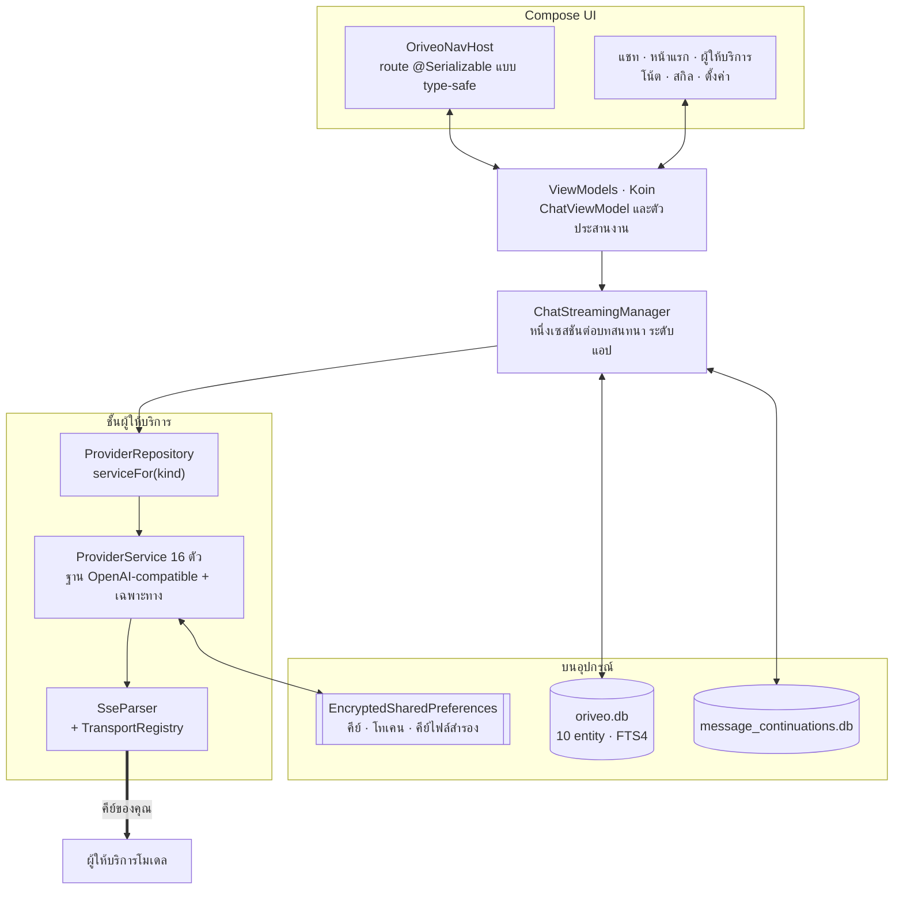

<div align="center">

# Oriveo สำหรับ Android

**ไคลเอนต์แชท Jetpack Compose แบบเนทีฟ สำหรับโมเดล AI ที่คุณจ่ายเงินใช้อยู่แล้ว**

<a href="../../LICENSE"></a>


<sub>

<a href="../../android/README.md">English</a> ·
<a href="../ar/android.md">العربية</a> ·
<a href="../de/android.md">Deutsch</a> ·
<a href="../es/android.md">Español</a> ·
<a href="../fr/android.md">Français</a> ·
<a href="../hi/android.md">हिन्दी</a> ·
<a href="../id/android.md">Indonesia</a> ·
<a href="../ja/android.md">日本語</a> ·
<a href="../ko/android.md">한국어</a> ·
<a href="../pt-BR/android.md">Português</a> ·
<a href="../ru/android.md">Русский</a> ·
**ไทย** ·
<a href="../tr/android.md">Türkçe</a> ·
<a href="../vi/android.md">Tiếng Việt</a> ·
<a href="../zh-Hans/android.md">简体中文</a> ·
<a href="../zh-Hant/android.md">繁體中文</a>

</sub>

</div>

---

ไคลเอนต์ Android ของ Oriveo คือแอปแชท AI แบบ bring-your-own-key คุณเพิ่ม API key
ที่คุณเป็นเจ้าของอยู่แล้ว แล้วแอปจะคุยกับผู้ให้บริการแต่ละรายตรงจากเครื่องโทรศัพท์ บทสนทนา โน้ต
โฟลเดอร์ และสกิล ถูกเก็บบนอุปกรณ์ผ่าน Room ส่วน API key ถูกเข้ารหัสด้วยคีย์ที่เก็บอยู่ใน Android
Keystore ไม่มีบัญชีและไม่ต้องเข้าสู่ระบบ

แอปนี้เป็นส่วนหนึ่งของ [Oriveo Community Edition](README.md) —
ไคลเอนต์สามตัวที่ใช้นิยามเดียวกันว่าจะคุยกับผู้ให้บริการโมเดลอย่างไร

## สถาปัตยกรรม



สามเรื่องในแผนภาพนี้เป็นการตัดสินใจเชิงออกแบบโดยตั้งใจ ไม่ใช่โครงสร้างที่บังเอิญเป็นเช่นนั้น

**การสตรีมอยู่เหนือระดับหน้าจอ** `ChatStreamingManager` เก็บ `StreamingSession` หนึ่งตัว
ต่อ id ของบทสนทนาไว้ใน `ConcurrentHashMap` แต่ละตัวรันเป็น `Job` ของตัวเองบน
`CoroutineScope(SupervisorJob() + Dispatchers.IO)` ระดับแอปตัวเดียวที่ใช้ร่วมกัน —
supervisor คือหัวใจของเรื่องนี้ สตรีมตัวหนึ่งล้มจึงไม่ลากตัวอื่นล้มตามไปด้วย
การเดินออกจากหน้าแชทไม่ยกเลิกคำตอบ และ `ChatRepository` จะเขียนข้อความบางส่วนลง SQLite
ทุกครั้งที่ `StreamingTokenBuffer` บอกว่าสะสมมามากพอแล้ว (4,000 ตัวอักษร หรือ 60 วินาที)
การปิดแอปกลางคันจึงไม่ทำให้สิ่งที่มาถึงแล้วหายไป

**ฐานข้อมูลสองตัว ไม่ใช่ตัวเดียว** `oriveo.db` เก็บบทสนทนา ข้อความ ไฟล์แนบ โน้ต โฟลเดอร์ สกิล
และแคชของแคตตาล็อกโมเดล ส่วน `message_continuations.db` เป็นไฟล์ที่แยกออกมาทางกายภาพ
เก็บสถานะ continuation ของผู้ให้บริการซึ่งเป็นข้อมูลทึบ ที่ทำแบบนี้ก็เพื่อให้
`backup_rules.xml` และ `data_extraction_rules.xml` กันมันออกจากการสำรองบนคลาวด์
และการย้ายเครื่องได้พอดี เพราะโทเคน continuation ที่ถูกกู้คืนลงอีกเครื่องหนึ่ง
อย่างดีที่สุดก็ไร้ความหมาย

**แคตตาล็อกที่ใหม่กว่าไบนารีจะลดทอนความสามารถ ไม่ใช่พังทั้งระบบ** `TransportKind` เป็น enum
แบบปิดที่มี deserializer ผ่อนปรน สตริง transport ที่ไม่รู้จักจะถอดรหัสเป็น `null`
`TransportRegistry` จึงไม่คืนกลยุทธ์ใด ๆ และโมเดลนั้นถูกกรองออกจากตัวเลือก ทางเลือกอีกทาง —
enum แบบเข้มงวด — จะทำให้การ parse แคตตาล็อกทั้งก้อนล้มเหลว และลากโมเดลอื่นทั้งหมดล้มตามไปด้วย

## โมเดลได้รับอนุญาตให้ทำอะไรบ้าง

ไคลเอนต์ไม่เดาความสามารถของโมเดลจากชื่อของมันเด็ดขาด แต่จะอ่าน capability runtime
จากแคตตาล็อก ซึ่งเป็น recipe ที่อธิบายว่าสำหรับผู้ให้บริการ transport และความสามารถหนึ่ง ๆ
ต้องเขียน JSON pointer ตัวไหนลงในคำขอบ้าง `ProviderRecipeRequestCompiler` จะตรวจสอบ recipe
เทียบกับผู้ให้บริการ ความสามารถ และ transport ก่อนคอมไพล์เป็น body delta ที่มีเจ้าของชัดเจน
และจะปฏิเสธพร้อมเหตุผลที่มีชื่อกำกับ (`recipe_not_found`, `transport_mismatch`,
`model_route_must_not_patch_body`) แทนที่จะเงียบ ๆ สร้างคำขอที่ไม่มีใครตรวจสอบออกมา

ขากลับ `CapabilityEvidenceFacade` จะจัดอันดับสิ่งที่รู้จริงเกี่ยวกับความสามารถหนึ่งตามแหล่งที่มา —
`operator_override` > `server_typed` > `server_profile` > `model_facts` > `relay_verification` >
`relay_declaration` > `legacy_metadata` มีเพียง stream parser เท่านั้นที่ทำเครื่องหมายความสามารถ
ว่า *observed* ได้ ส่วนเจตนา recipe HTTP 200 และการประกาศ tool ไม่ถูกนับอย่างชัดเจน
ผลลัพธ์รายข้อความถูกเก็บถาวรไว้ UI จึงแยกได้ว่า *ร้องขอแล้ว* ต่างจาก *ยืนยันแล้ว*

การ override ถูกตัดสินแบบเขียนทีหลังชนะ ครอบคลุมเจ็ดขอบเขต เรียงตามลำดับความสำคัญ:
`single_send` > `conversation_connection_model` > `skill_agent` > `connection_model` >
`connection` > `provider_recipe` > `provider_default`

## การจัดเก็บข้อมูลและความลับ

| อะไร | อยู่ที่ไหน |
|---|---|
| บทสนทนา ข้อความ ไฟล์แนบ โน้ต โฟลเดอร์ สกิล | Room, `oriveo.db` |
| ค้นหาแบบ full-text ในโน้ต | ตารางเสมือน FTS4 |
| แคชแคตตาล็อกโมเดล | หนึ่งแถวใน `oriveo.db` อ่านกลับมาทีละ chunk |
| สถานะ continuation ของผู้ให้บริการ | `message_continuations.db` ไม่รวมในการสำรองข้อมูล |
| API key ของผู้ให้บริการ | `EncryptedSharedPreferences`, AES-256-GCM, master key เก็บใน Keystore |
| โทเคน OAuth ของแพ็กเกจสมาชิก | ไฟล์ preferences เข้ารหัสอีกไฟล์ แยกต่างหาก |
| คีย์ของไฟล์สำรองข้อมูล | ไฟล์ที่สาม |
| ไฟล์แนบ | ไฟล์บนดิสก์ อ้างอิงด้วย id |

ไฟล์ preferences ที่เข้ารหัสทั้งสามไฟล์ถูกแยกตามอายุการใช้งานและรัศมีความเสียหาย
แทนที่จะรวมกันเพื่อความสะดวก แต่ละไฟล์มีเส้นทางกู้คืนของตัวเอง ไฟล์ที่เสียหาย
(`AEADBadTagException`, `VERIFICATION_FAILED`) จะถูกตรวจพบ ลบทิ้ง และสร้างใหม่
แทนที่จะทำให้แอปแครชทุกครั้งที่เปิด

ทั้งสามไฟล์ รวมถึงฐานข้อมูล continuation ถูกกันออกจากการสำรองบนคลาวด์ของ Android
และการย้ายเครื่อง นี่เป็นผลจากการผูกไฟล์เหล่านี้ไว้กับ Keystore ไม่ใช่ความหลงลืม —
ยังไงเสีย ciphertext ก็ถอดรหัสบนเครื่องใหม่ไม่ได้อยู่ดี
**หลังย้ายไปโทรศัพท์เครื่องใหม่ คุณต้องใส่ API key ใหม่และเข้าสู่ระบบแพ็กเกจสมาชิกของผู้ให้บริการ
อีกครั้ง** ส่วนบทสนทนาและโน้ตจะย้ายตามมาตามปกติ

ไฟล์สำรองข้อมูลที่คุณส่งออกเองคือ zip ที่บรรจุ `data.json` พร้อมไฟล์แนบ
รหัสผ่านที่คุณตั้งปกป้อง**เฉพาะ API key ของผู้ให้บริการ**ที่อยู่ข้างในเท่านั้น
โดยคีย์เหล่านั้นถูกเข้ารหัสด้วย PBKDF2-HMAC-SHA256 ที่ 600,000 รอบ และ AES-GCM
แล้วเก็บไว้เป็นฟิลด์หนึ่งของ `data.json` ส่วนบทสนทนา ข้อความ โน้ต โฟลเดอร์ สกิล การตั้งค่า และไฟล์แนบ
ถูกเขียนเป็น JSON ธรรมดาและไฟล์ธรรมดาอยู่ดี ดังนั้นให้ถือว่าไฟล์สำรองเป็นสิ่งที่ใครได้ไปก็อ่านได้
ถ้าคุณต้องการแค่ประวัติการใช้งาน ก็ส่งออกแบบไม่รวมคีย์

## การเข้าถึงเซิร์ฟเวอร์โมเดลในเครือข่ายของคุณเอง

ไฟล์ manifest ตั้งค่า `android:usesCleartextTraffic="true"` โดยตั้งใจ เพราะเซิร์ฟเวอร์โมเดลในเครื่อง
— llama.cpp, Ollama, LM Studio, vLLM — พูด HTTP แบบไม่เข้ารหัสบนเครื่องคุณเองหรือใน LAN
และโดยทั่วไปไม่มีใบรับรอง

ขอบเขตจริงอยู่ในโค้ด ไม่ใช่ใน manifest เพราะมันต้องเป็นอย่างนั้น `RelayEndpointPolicy`
จะ resolve โฮสต์ และบังคับว่า **ทุก** ที่อยู่ที่ resolve ได้ต้องเป็นที่อยู่ส่วนตัว (loopback,
RFC 1918, link-local, unique-local และช่วง CGNAT ในโหมด VPN) ปฏิเสธโฮสต์ที่ resolve
ออกมาปนกันทั้งที่อยู่สาธารณะและส่วนตัว ตรึงชุดที่อยู่ที่ resolve ได้เพื่อกัน DNS rebinding
และตรวจซ้ำอีกครั้งตอนส่งจริง มันปฏิเสธคำขอแบบไม่เข้ารหัสทุกรายการที่พกข้อมูลรับรองไปด้วย
ส่วนไคลเอนต์ที่ใช้ค้นหาและที่ใช้คุยกับเอนจินในเครื่องนั้นไม่ตาม redirect เลยแม้แต่ครั้งเดียว
โดยมีการตรึงที่อยู่นั้นเป็นแนวป้องกันสุดท้าย

network security config ของ Android แสดงเงื่อนไขชุดนั้นไม่ได้ มันจับคู่ได้แค่ชื่อโฮสต์
ไม่มีไวยากรณ์สำหรับช่วงที่อยู่ และที่อยู่ในกรณีนี้มาจากเครือข่ายของผู้ใช้เองตอนรันไทม์
อีกทั้ง config ยังอ่อนกว่าอย่างชัดเจน เพราะมันไม่เคยเห็นว่าชื่อหนึ่ง resolve ไปเป็นที่อยู่ใด

## แคตตาล็อกโมเดล

แอปอ่านความสามารถและราคาของโมเดลจากแคตตาล็อกสาธารณะ
เพื่อให้โมเดลที่เพิ่งออกวันนี้ใช้งานได้โดยไม่ต้องอัปเดตแอป มันเป็น HTTPS `GET` ธรรมดา
ที่ไม่มีข้อมูลรับรองและไม่แนบตัวระบุตัวตน และคำขอแชทไม่เข้าใกล้มันเลย
มีเพียงสองปลายทางที่ถูกเรียก:

```
GET {base}/api/metadata?view=lean
GET {base}/api/metadata/model-facts
```

Base URL เป็น property ตอนบิลด์ ค่าเริ่มต้นคือ `https://api.oriveoai.com`:

```bash
./gradlew :app:assembleDebug -PORIVEO_METADATA_BASE_URL=https://your.host
```

คำตอบถูกตรวจสอบซ้ำด้วย ETag และแคชไว้ใน `oriveo.db` เมื่อดึงสำเร็จไปแล้วครั้งหนึ่ง
แอปจึงทำงานต่อได้จากสำเนาที่แคชไว้เมื่อเข้าถึงแคตตาล็อกไม่ได้ในภายหลัง

> [!IMPORTANT]
> การบิลด์ด้วยค่าว่าง (`-PORIVEO_METADATA_BASE_URL=`) จะปิดการดึงแคตตาล็อกไปเลย และ
> **ไม่มี snapshot แนบมาใน APK** เมื่อติดตั้งบิลด์แบบนั้นใหม่บนเครื่องเปล่า:
>
> - ผู้ให้บริการในตัวทั้ง 15 รายจะไม่ได้รายชื่อโมเดลเลย และแอปก็ไม่ไปถามผู้ให้บริการเอาเอง —
>   แคตตาล็อกคือแหล่งเดียว
> - หน้ารายละเอียดผู้ให้บริการจะขึ้นแบนเนอร์ "ไม่สามารถโหลดโมเดลอย่างเป็นทางการได้" แต่การเพิ่มคีย์
>   ยังรายงานว่าสำเร็จ และตัวเลือกโมเดลก็ว่างเปล่าเฉย ๆ
> - **OpenAI จะใช้ไม่ได้เลย** เพราะการกรอกชื่อโมเดลเองถูกปิดไว้สำหรับผู้ให้บริการรายนั้น
> - ปลายทาง Relay และเซิร์ฟเวอร์โมเดลในเครื่องยังทำงานได้เต็มที่ และเป็นเส้นทางเดียวที่ยังสมบูรณ์
>
> ถ้าต้องการบิลด์แบบออฟไลน์ ให้ให้บริการแคตตาล็อกเองแล้วชี้บิลด์ไปที่นั่น แทนการเว้นค่าให้ว่าง

## โครงสร้างโปรเจกต์

```
android/
  app/src/main/java/ai/oriveo/community/
    core/
      provider/    every provider service, transports, relay, capability recipes
      data/        Room entities, DAOs, repositories, backup, catalog client
      model/       domain models and the capability/preference resolvers
      attachments/ routing, budgets, per-format text extraction
      security/    SecureKeyStore, BackupCrypto, external-URL policy
      streaming/   ChatStreamingManager
      navigation/  AppRoute, OriveoNavHost
    feature/       one package per screen
    ui/            shared components, Markdown + LaTeX renderer, theme
    di/            Koin modules
  benchmark/       macrobenchmark suite (cold start, model picker)
```

## การบิลด์

ข้อกำหนด: **JDK 21** และ Android SDK บิลด์นี้ใช้ AGP 9.3, Gradle 9.5 และ Kotlin 2.3
Android Studio จึงต้องเป็นรุ่นที่ sync AGP 9.3 ได้ ส่วนถ้าใช้บรรทัดคำสั่ง ต้องการแค่ JDK กับ SDK

```bash
./gradlew :app:assembleDebug
./gradlew :app:testDebugUnitTest
```

บิลด์ตั้งเป้าที่ `minSdk 26`, `targetSdk 36`, `compileSdk 37` ส่วน `local.properties`
(พาธ SDK ของคุณ) ถูกสร้างโดย Android Studio และไม่ได้ commit ไว้ การเซ็นชื่อสำหรับรุ่น release
อธิบายไว้ใน [SIGNING.md](../../android/SIGNING.md)

> [!NOTE]
> Gradle daemon รันบน toolchain Java 21 (`gradle/gradle-daemon-jvm.properties`) และการจับคู่คือ 21
> พอดี ไม่ใช่ "21 ขึ้นไป" ถ้าติดตั้ง JDK อื่นไว้ Gradle จะดาวน์โหลด JDK 21 มาใช้เองในการบิลด์ครั้งแรก
> ซึ่งต้องต่ออินเทอร์เน็ต การติดตั้ง JDK 21 เองจะเลี่ยงขั้นตอนนั้นได้ และถ้าคุณตั้ง
> `org.gradle.java.installations.auto-download=false` ไว้ การดาวน์โหลดนั้นจะเกิดขึ้นไม่ได้
> และบิลด์จะล้มเหลวด้วยข้อความ `Toolchain auto-provisioning is not enabled.` — นั่นคือกรณีเดียว
> ที่ JDK 17 อย่างเดียวไม่พอจริง ๆ ส่วนการคอมไพล์ตั้งเป้าที่ Java 17 ไม่ว่าทางไหนก็ตาม

ระดับการรันเทสต์แบบขนานคำนวณจากจำนวน CPU และหน่วยความจำจริงของเครื่อง ไม่ได้ตายตัว
ชุดทดสอบจึงทำตัวได้ดีทั้งบนแล็ปท็อปและบนเวิร์กสเตชันตัวใหญ่

## ไลบรารีที่ใช้

| ไลบรารี | เวอร์ชัน | ใช้ทำอะไร |
|---|---|---|
| Jetpack Compose BOM | 2026.08.00 | UI, Material 3 |
| Room | 2.8.4 | SQLite, DAO, FTS4 |
| Koin | 4.2.2 | dependency injection |
| Ktor client (OkHttp engine) | 3.5.2 | HTTP และ SSE ของผู้ให้บริการ |
| kotlinx.serialization | 1.11.0 | JSON |
| navigation-compose | 2.9.6 | route แบบ type-safe |
| androidx.security-crypto | 1.1.0 | `EncryptedSharedPreferences` |
| haze | 1.7.3 | เบลอพื้นหลัง |
| PDFBox-Android, jsoup | 2.0.27.0, 1.23.2 | แตกข้อความจากไฟล์แนบ |
| jlatexmath-android | 0.2.0 | เรนเดอร์ LaTeX |

เวอร์ชันที่แน่นอนถูกตรึงไว้ใน
[`gradle/libs.versions.toml`](../../android/gradle/libs.versions.toml)

## การทดสอบ

```bash
./gradlew :app:testDebugUnitTest
```

unit test ราว 3,000 รายการ กระจายอยู่ใน 318 ไฟล์ ใช้ JUnit 4, MockK, Robolectric,
`kotlinx-coroutines-test` และ mock engine ของ Ktor ความครอบคลุมหนาแน่นที่สุดในจุดที่ผิดพลาดแล้วแพงที่สุด
ได้แก่ รูปแบบคำขอรายผู้ให้บริการ การ parse SSE การเลือก transport การ probe relay และโหมดความปลอดภัย
การรัน capability recipe การแคชแคตตาล็อกและการจัดการเวอร์ชันของข้อกำหนด การเก็บข้อมูลด้วย Room
และการสำรอง–กู้คืนแบบไปกลับ

> [!IMPORTANT]
> ชุดทดสอบราว 38 ชุดโหลด contract fixture โดย resolve `../../shared` จากไดเรกทอรีของโมดูล Gradle
> ดังนั้น **เทสต์จะผ่านก็ต่อเมื่อ checkout มาทั้งที่เก็บโค้ด** — คัดลอกเฉพาะ `android/`
> ออกไปจะไม่ทำงาน

ยังมี instrumented test อีกสามชุด — เมทริกซ์ release ของเอนจินในเครื่อง เทสต์ซ็อกเก็ตแบบไม่เข้ารหัส
และเทสต์การแยกส่วนของ keystore ทั้งสามไม่ได้ครบในตัวเอง เพราะชุดของเอนจินในเครื่อง
ต้องการอาร์กิวเมนต์ instrumentation ที่ระบุเซิร์ฟเวอร์โมเดลตัวจริงที่รันอยู่ในเครือข่ายของคุณ
`connectedAndroidTest` จึงไม่ผ่านตั้งแต่แกะกล่อง ด่านสำหรับ pull request คือชุด unit test

โมดูล `:benchmark` เก็บ macrobenchmark สำหรับ cold start และตัวเลือกโมเดล เป็นโมดูล Gradle
แยกต่างหากที่ใช้ `com.android.test` พร้อม self-instrumentation และขับ build type ชื่อ `benchmark`
ของ `:app` โดยเฉพาะ

ฐานข้อมูลทั้งสองตัวอยู่ที่ `version = 1` และยังไม่มี migration ส่วน schema ถูกส่งออกไปที่
`app/schemas/` และ commit ไว้ ซึ่งเป็นที่ที่ `2.json` ของ migration แรกจะไปลง

## การแปลภาษา

สิบหกภาษา: `values/` (อังกฤษ ซึ่งเป็นต้นทาง) บวกไดเรกทอรี `values-*` อีกสิบห้าชุด
แต่ละชุดมีสตริงราว 1,300 รายการ และทุกโลแคลมีชุดคีย์เหมือนกันทั้งหมด
การสลับภาษาในแอปทำผ่าน `AppLanguageManager` และ `android:localeConfig`
ส่วนการแยกไฟล์ตามภาษาถูกปิดไว้ในบันเดิล อาร์ติแฟกต์ชิ้นเดียวจึงพกทุกคำแปลไปด้วย

## การมีส่วนร่วม

ดู [CONTRIBUTING.md](../../CONTRIBUTING.md) ภาษาที่ใช้ทำงานในโปรเจกต์นี้คือภาษาอังกฤษ
ทั้งซอร์สโค้ด คอมเมนต์ เทสต์ และข้อความ commit ส่วนสตริงใน UI นั้นถูกแปล — เพิ่มสตริงใหม่ลงใน
`values/` ก่อน แล้วปล่อยให้โลแคลอื่นตามมาทีหลัง และรัน unit test ก่อนเปิด pull request

## สัญญาอนุญาต

[AGPL-3.0-or-later](../../LICENSE)
