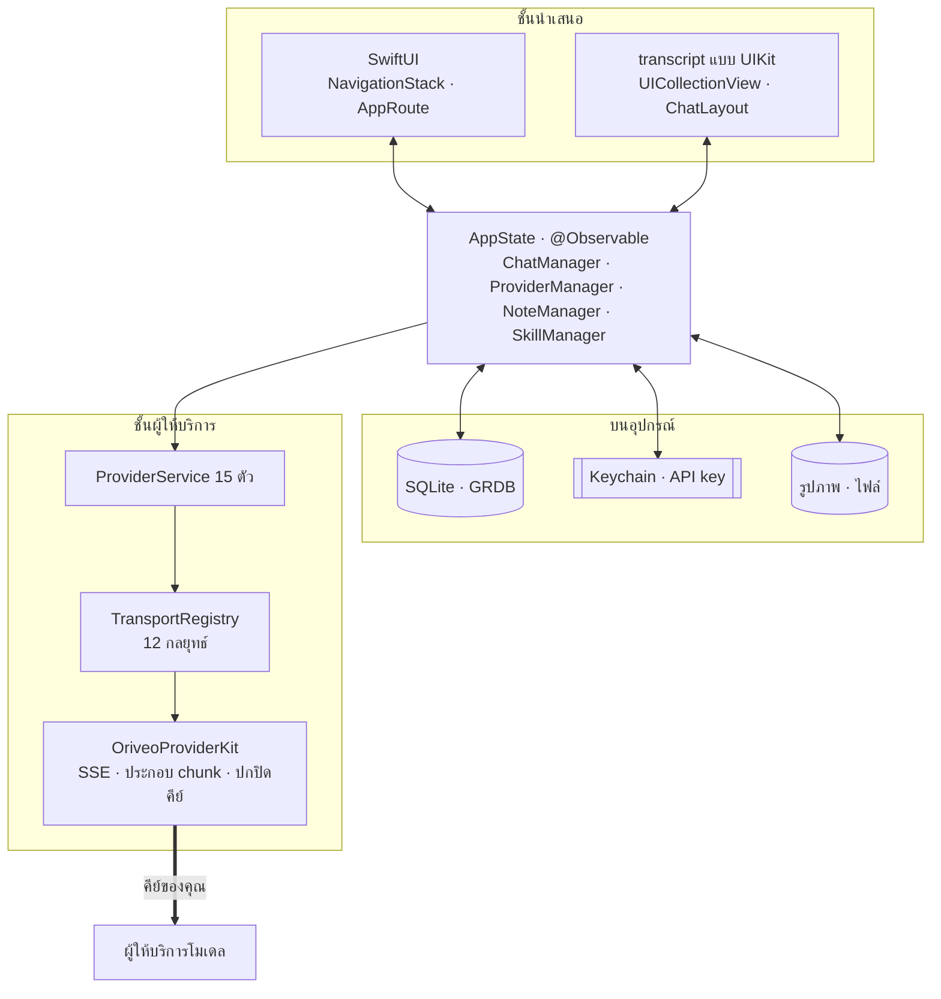
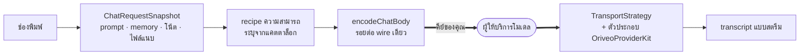

<div align="center">

# Oriveo สำหรับ iOS

**ไคลเอนต์แชท SwiftUI แบบเนทีฟ สำหรับโมเดล AI ที่คุณจ่ายเงินใช้อยู่แล้ว**

<a href="../../LICENSE"></a>


<sub>

<a href="../../ios/README.md">English</a> ·
<a href="../ar/ios.md">العربية</a> ·
<a href="../de/ios.md">Deutsch</a> ·
<a href="../es/ios.md">Español</a> ·
<a href="../fr/ios.md">Français</a> ·
<a href="../hi/ios.md">हिन्दी</a> ·
<a href="../id/ios.md">Indonesia</a> ·
<a href="../ja/ios.md">日本語</a> ·
<a href="../ko/ios.md">한국어</a> ·
<a href="../pt-BR/ios.md">Português</a> ·
<a href="../ru/ios.md">Русский</a> ·
**ไทย** ·
<a href="../tr/ios.md">Türkçe</a> ·
<a href="../vi/ios.md">Tiếng Việt</a> ·
<a href="../zh-Hans/ios.md">简体中文</a> ·
<a href="../zh-Hant/ios.md">繁體中文</a>

</sub>

</div>

---

ไคลเอนต์ iOS ของ Oriveo คือแอปแชท AI แบบ bring-your-own-key คุณเพิ่ม API key
ที่คุณเป็นเจ้าของอยู่แล้ว แล้วแอปจะเรียกผู้ให้บริการแต่ละรายตรงจากเครื่องโทรศัพท์ บทสนทนา โน้ต
โฟลเดอร์ สกิล และไฟล์แนบ ถูกเก็บบนอุปกรณ์ใน SQLite ส่วน API key เข้าไปอยู่ใน iOS Keychain
ไม่มีบัญชีและไม่ต้องเข้าสู่ระบบ

แอปนี้เป็นส่วนหนึ่งของ [Oriveo Community Edition](README.md) —
ไคลเอนต์สามตัวที่ใช้นิยามเดียวกันว่าจะคุยกับผู้ให้บริการโมเดลอย่างไร

## สถาปัตยกรรม



มีสามเรื่องในแผนภาพนี้ที่ควรพูดให้ชัด

**transcript เป็น UIKit ส่วนที่เหลือเป็น SwiftUI** `ChatView` ฝัง
`ChatListViewControllerRepresentable` ครอบ `UICollectionView` ที่ขับเคลื่อนด้วย
[ChatLayout](https://github.com/ekazaev/ChatLayout) ส่วนอย่างอื่นทั้งหมด — การนำทาง การตั้งค่า
การตั้งค่าผู้ให้บริการ โน้ต สกิล — เป็น SwiftUI ที่แยกแบบนี้เพราะ transcript
ที่สตรีมมาด้วยความเร็วระดับ token ต้องการการควบคุมการวัดขนาดและการนำ cell กลับมาใช้ซ้ำในระดับ cell
ซึ่ง diffing ของ SwiftUI ให้ไม่ได้ ขอบเขตของการแยกนี้อธิบายไว้ใน
[`Features/Chat/ARCHITECTURE.md`](../../ios/Oriveo/Oriveo/Features/Chat/ARCHITECTURE.md)

**มีสามเส้นทางแยกกันที่อัปเดต transcript นั้น** และเป็นความตั้งใจ

| เส้นทาง | ส่งอะไร | ทำไม |
|---|---|---|
| `@Observable AppState` | การเปลี่ยนเชิงโครงสร้าง — ข้อความใหม่โผล่ขึ้นมา หรือสลับบทสนทนา | เป็นวิธีดั้งเดิมของ SwiftUI และต้นทุนต่ำสำหรับเหตุการณ์ที่เกิดไม่บ่อย |
| GRDB `ValueObservation` | สถานะถาวรที่อ่านกลับมาจาก SQLite | เป็นแหล่งความจริงเดียวหลังการเขียน และอยู่รอดข้ามการเปิดแอปใหม่ |
| Combine `PassthroughSubject` หนึ่งตัวต่อบทสนทนา | ข้อความและ delta ของการให้เหตุผลที่สตรีมเข้ามา | เลี่ยง diffing ของ SwiftUI ทั้งหมดที่ความเร็วระดับ token |

**การรองรับผู้ให้บริการเป็นสี่แกนอิสระ ไม่ใช่ enum เดียว** `ProviderKind` (16 กรณี) คือ
*ผู้ใช้ตั้งค่าอะไรไว้* `ProviderServiceProtocol` คือ *พื้นผิวสำหรับเรียกใช้* `TransportKind`
(12 กรณี) คือ *โปรโตคอล wire ที่ใช้พูดจริง ๆ* และถูกระบุ **รายโมเดล จากแคตตาล็อก**
สองโมเดลที่อยู่หลังคีย์เดียวกันจึงต่างกันได้ ส่วน `RelayKind` ดูแลปลายทางที่ผู้ใช้ใส่เอง
การแยกสิ่งเหล่านี้ออกจากกันคือเหตุผลที่โมเดลใหม่ใช้งานได้โดยไม่ต้องบิลด์ใหม่

### ข้อความหนึ่งถูกส่งอย่างไร



`BaseAPIService.encodeChatBody` คือจุดเดียวที่ body ของคำขอกลายเป็นไบต์ ทุก recipe ความสามารถ
ทุกพารามิเตอร์การสร้าง และทุกฟิลด์ที่กำหนดเอง ต้องผ่านจุดนี้ ซึ่งทำให้ทดสอบรูปแบบ wire
ได้ในที่เดียวแทนที่จะเป็นสิบห้าที่

## โมเดลได้รับอนุญาตให้ทำอะไรบ้าง

ไคลเอนต์ไม่เดาความสามารถของโมเดลจากชื่อของมันเด็ดขาด แต่จะอ่าน **capability runtime** —
ชุด recipe ที่อธิบายว่าสำหรับผู้ให้บริการ transport และความสามารถหนึ่ง ๆ ต้องเขียน JSON pointer
ตัวไหนลงในคำขอบ้าง recipe เหล่านั้นอยู่ใน [`shared/capabilityrecipe`](shared.md) และถูกนำไปใช้โดย
`CapabilityRecipeRequestCompiler`

ขากลับ `CapabilityExecutionRuntime` จะบันทึกว่าเกิดอะไรขึ้นจริง มีเพียง stream parser
ในเส้นทางโปรดักชันที่ถูกเลือกไว้เท่านั้นที่เลื่อนสถานะความสามารถเป็น *observed* ได้ HTTP 200
คำตอบที่ไม่ว่างเปล่า และการประกาศ tool ในคำขอ **ไม่ถือเป็นหลักฐาน** อย่างชัดเจน
สถานะสุดท้ายถูกเก็บแยกรายข้อความ UI จึงบอกคุณได้ว่ามีการร้องขอตัวควบคุมหนึ่งไป
แต่ไม่เคยได้รับการยืนยัน แทนที่จะทำเป็นเงียบ ๆ ว่ามันทำงานสำเร็จ

## การจัดเก็บข้อมูล

```
Application Support/Oriveo/
  active-uid                     # storage partition, "guest" by default
  users/<uid>/
    oriveo.sqlite                # conversations, messages, notes, catalog cache
    Images/  Files/              # attachment blobs, referenced by id
    session-snapshot.json        # preferences, provider list (never API keys)
```

- **SQLite ผ่าน GRDB** โดยเปิด WAL เปิด foreign key และมี `DatabaseMigrator`
  ครอบคลุมทุกการเปลี่ยนแปลงของ schema การค้นหาแบบ full-text ในข้อความและโน้ตใช้ FTS5
  กับ trigram tokenizer
- **API key อยู่ใน Keychain** แยกตามผู้ให้บริการและพาร์ทิชัน
  และถูกลบออกจาก session snapshot ก่อนที่ snapshot นั้นจะถูกเขียนลงดิสก์
- **ไฟล์แนบเป็นไฟล์บนดิสก์** ไม่ใช่แถวในตาราง ไฟล์ PDF ขนาดใหญ่จึงไม่ทำให้ฐานข้อมูลบวม

## คำขอเครือข่ายเดียวที่แอปส่งเพื่อตัวเอง

ตอนเปิดแอปแบบ cold start แอปจะยิงคำขอ `GET` แบบไม่ต้องยืนยันตัวตนและมีเงื่อนไข ETag สองรายการ
ไปยัง `https://api.oriveoai.com` — `/api/metadata?view=lean` และ `/api/metadata/model-facts`
ทั้งสองรายการดึงแคตตาล็อกโมเดลสาธารณะ ว่ามีโมเดลอะไรบ้าง แต่ละตัวรองรับอะไร
ตัวควบคุมการให้เหตุผลของมันชื่ออะไร และราคาเท่าไร ไม่มีคีย์ ไม่มีบทสนทนา
และไม่มีตัวระบุตัวตนแนบไปด้วย ส่วนคำตอบถูกแคชไว้ใน SQLite
แอปจึงทำงานจากสำเนาที่แคชไว้ได้เมื่อเข้าถึงแคตตาล็อกไม่ได้

นี่คือคำขอเดียวที่แอปส่งในนามของตัวเอง ที่เหลือทั้งหมดวิ่งไปหาผู้ให้บริการที่คุณตั้งค่าไว้
ด้วยคีย์ของคุณ

## โครงสร้างโปรเจกต์

```
ios/Oriveo/
  Oriveo.xcodeproj/
  Oriveo/
    Core/
      Providers/       15 provider services, transports, capability runtime, catalog client
      State/           AppState and the managers it owns
      Database/        GRDB pool, schema, migrator, stores, observations
      Models/          domain types
      Attachments/     import limits, budgets, per-format text extraction
      Tools/           tool-call loop and per-protocol adapters
    Features/
      Chat/            transcript, composer, model controls, export
      Providers/       setup, detail, relay, local engines, subscription sign-in
      Home/ Notes/ Skills/ Settings/ Backup/ Onboarding/
    Shared/Components/ shared views
    DesignSystem/      theme, colour, haptics
  OriveoTests/
```

## บิลด์และรัน

คุณต้องมี Mac ที่ติดตั้ง **Xcode 26** และอุปกรณ์ที่รัน **iOS 18 ขึ้นไป** บัญชี Apple Developer
แบบฟรีก็เพียงพอ แอปไม่ได้ใช้ capability ที่ต้องเสียเงิน และแนบไฟล์ entitlements เปล่ามาให้

1. เปิด `ios/Oriveo/Oriveo.xcodeproj`
2. เลือก scheme ชื่อ `Oriveo`
3. ใต้ **Signing & Capabilities** เลือก Team ของคุณเอง
4. ถ้า Xcode ลงทะเบียน `ai.oriveo.community` ไม่ได้ ให้เปลี่ยน bundle identifier
   เป็นชื่อที่ทีมของคุณเป็นเจ้าของ
5. เสียบ iPhone เปิด Developer Mode กด trust เครื่องคอมพิวเตอร์ แล้วกด Run

ถ้าจะบิลด์ลงซิมูเลเตอร์แทน ให้เลือกซิมูเลเตอร์ iPhone ตัวใดก็ได้แล้วกด Run
ส่วน dependency ของ package จะถูก resolve จาก `Package.resolved` ที่ commit ไว้

ไฟล์โปรเจกต์ใช้ `objectVersion = 77` พร้อม file-system synchronized group
ดังนั้น Xcode รุ่นเก่ากว่านี้อาจไม่ยอมเปิด ให้อัปเดต Xcode แทนที่จะไปแก้รูปแบบไฟล์โปรเจกต์

> [!NOTE]
> เป้าหมายของแอปคอมไพล์ในโหมดภาษา Swift 5 พร้อม `SWIFT_APPROACHABLE_CONCURRENCY` และ
> `SWIFT_DEFAULT_ACTOR_ISOLATION = MainActor` ส่วน package `OriveoProviderKit` ในเครื่องประกาศ
> `swift-tools-version: 6.1` และบิลด์ในโหมดภาษา Swift 6

## ไลบรารีที่ใช้

| Package | เวอร์ชัน | ใช้ทำอะไร |
|---|---|---|
| [GRDB.swift](https://github.com/groue/GRDB.swift) | 7.11.1 | เข้าถึง SQLite, migration, `ValueObservation` |
| [ChatLayout](https://github.com/ekazaev/ChatLayout) | 2.4.3 | เลย์เอาต์ collection view ของ transcript |
| [swift-markdown-ui](https://github.com/gonzalezreal/swift-markdown-ui) | 2.4.1 | เรนเดอร์ Markdown |
| [SwiftMath](https://github.com/mgriebling/SwiftMath) | 1.7.3 | เรนเดอร์ LaTeX |
| [ZIPFoundation](https://github.com/weichsel/ZIPFoundation) | 0.9.20 | ไฟล์สำรองข้อมูล, แตกข้อความจาก Office/EPUB/ODF |
| `OriveoProviderKit` | ในเครื่อง | เคอร์เนล wire ของผู้ให้บริการ ใช้ร่วมกับ macOS |

## การทดสอบ

รัน scheme `OriveoTests` จาก Xcode หรือรันจากรากของที่เก็บโค้ด:

```bash
xcodebuild test -project ios/Oriveo/Oriveo.xcodeproj -scheme Oriveo \
  -destination 'platform=iOS Simulator,name=iPhone 17'
```

เปลี่ยนไปใช้ซิมูเลเตอร์ที่คุณมีจริง — `xcrun simctl list devices available` จะแสดงรายการให้

> [!IMPORTANT]
> เป้าหมายทดสอบอ่าน contract fixture จาก `shared/` โดยไล่ขึ้นไปจาก `#filePath`
> จนกว่าจะเจอไดเรกทอรีนั้น มีชุดทดสอบราว 29 ชุดที่พึ่งพาสิ่งนี้ ดังนั้น
> **เทสต์จะผ่านก็ต่อเมื่อ checkout มาทั้งที่เก็บโค้ด** — คัดลอกเฉพาะ `ios/` ออกไปจะไม่ทำงาน

ชุดทดสอบมีขนาดใหญ่ ราว 2,900 เทสต์ กระจายอยู่ใน 273 ไฟล์ ส่วนใหญ่เป็น
[Swift Testing](https://github.com/swiftlang/swift-testing) ครอบคลุมรูปแบบคำขอรายผู้ให้บริการ
การเล่นซ้ำ SSE จาก upstream ที่บันทึกไว้ นโยบายของ relay และเอนจินในเครื่อง
การวัดขนาด transcript และพฤติกรรมการสตรีม การจัดเก็บข้อมูล และการสำรอง–กู้คืนแบบไปกลับ

`shared/OriveoProviderKit` มีชุดทดสอบของตัวเอง:

```bash
cd shared/OriveoProviderKit && swift test
```

## การแปลภาษา

สิบหกภาษา เก็บเป็น Xcode String Catalog (`.xcstrings`) — สิบแคตตาล็อก คีย์ราว 1,900 รายการ
โดยใช้ภาษาอังกฤษเป็นต้นทาง สตริงถูก resolve ผ่าน `L10n.tr(_:table:)` จาก bundle `.lproj`
ที่เลือกตามการตั้งค่าภาษาในแอปของผู้ใช้ การสลับภาษาจึงมีผลทันทีโดยไม่ต้องเปิดแอปใหม่
ส่วนเลย์เอาต์ขวาไปซ้ายสำหรับภาษาอาหรับถูกจัดการไว้อย่างชัดเจน

## การมีส่วนร่วม

ดู [CONTRIBUTING.md](../../CONTRIBUTING.md) ถ้าเปลี่ยนพฤติกรรม ให้เพิ่มเทสต์มาด้วย
สำหรับการแก้โปรโตคอลของผู้ให้บริการ ควรใช้ fixture ที่บันทึกไว้ใต้ `shared/test-fixtures`
มากกว่าการเขียน mock ขึ้นเอง และระบุด้วยว่าคุณทดสอบกับผู้ให้บริการและโมเดลตัวไหน

## สัญญาอนุญาต

[AGPL-3.0-or-later](../../LICENSE)
