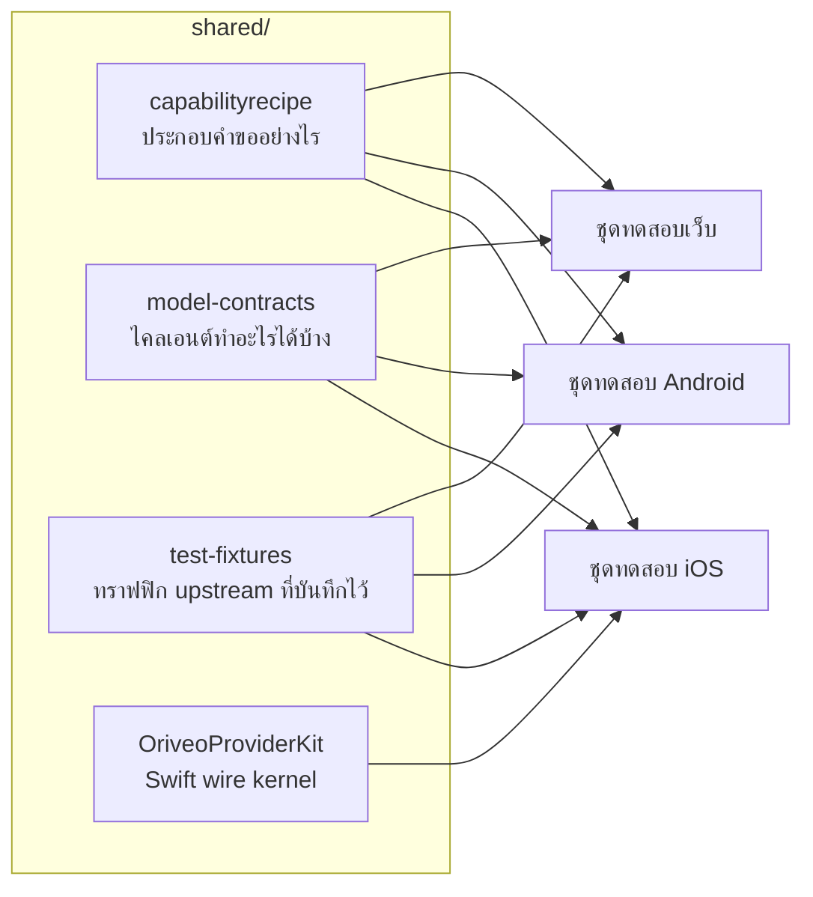

<div align="center">

# ข้อกำหนดร่วม

**นิยามเดียวว่าจะคุยกับผู้ให้บริการโมเดลอย่างไร และไคลเอนต์ทั้งสามตัวตรวจสอบกับนิยามนี้**

<a href="../../LICENSE"></a>


<sub>

<a href="../../shared/README.md">English</a> ·
<a href="../ar/shared.md">العربية</a> ·
<a href="../de/shared.md">Deutsch</a> ·
<a href="../es/shared.md">Español</a> ·
<a href="../fr/shared.md">Français</a> ·
<a href="../hi/shared.md">हिन्दी</a> ·
<a href="../id/shared.md">Indonesia</a> ·
<a href="../ja/shared.md">日本語</a> ·
<a href="../ko/shared.md">한국어</a> ·
<a href="../pt-BR/shared.md">Português</a> ·
<a href="../ru/shared.md">Русский</a> ·
**ไทย** ·
<a href="../tr/shared.md">Türkçe</a> ·
<a href="../vi/shared.md">Tiếng Việt</a> ·
<a href="../zh-Hans/shared.md">简体中文</a> ·
<a href="../zh-Hant/shared.md">繁體中文</a>

</sub>

</div>

---

ไคลเอนต์สามตัวที่ต่างคนต่างอิมพลีเมนต์ "เรียกผู้ให้บริการ" ด้วยตัวเอง ย่อมเบี่ยงออกจากกัน
มันจะเบี่ยงอย่างเงียบ ๆ ไปในทิศทางของตัวที่มีคนทดสอบล่าสุด และความเบี่ยงนั้นจะโผล่ออกมาเป็นบั๊ก
ที่เกิดซ้ำได้บนแพลตฟอร์มเดียว แต่ไม่เกิดบนอีกสองแพลตฟอร์ม

`shared/` คือคำตอบของเรื่องนั้น พฤติกรรมถูกเขียนไว้ครั้งเดียวในรูปข้อมูล
และชุดทดสอบของไคลเอนต์แต่ละตัวตรวจสอบกับไฟล์ชุดเดียวกัน
พฤติกรรมประหลาดที่อยู่ในข้อมูลชุดนั้นจึงแก้ครั้งเดียว ส่วนพฤติกรรมประหลาดที่อยู่ใน parser
จะถูกจับได้จากชุดทดสอบสามชุดพร้อมกัน แทนที่จะปล่อยของขึ้นสองแพลตฟอร์มแล้วทำแพลตฟอร์มที่สามพัง



## capabilityrecipe

ทะเบียน recipe สำหรับผู้ให้บริการ transport และความสามารถหนึ่ง ๆ — ค้นเว็บ ระดับการให้เหตุผล
การสร้างภาพ — มันระบุชัดว่าต้องเขียน JSON pointer ตัวไหนลงในคำขอที่ส่งออกไป
และต้องอ่านคำตอบกลับมาอย่างไร

นี่คือสิ่งที่ทำให้โมเดลที่เพิ่งออกวันนี้ใช้งานได้โดยไม่ต้องอัปเดตไคลเอนต์
และเป็นเหตุผลที่ไม่มีไคลเอนต์ตัวไหนเดาความสามารถจากชื่อโมเดล `capability_runtime.v1.json`
เก็บตัว recipe เอง ส่วน `capability_result_definitions.v1.json` และ
`capability_custom_controls.v2.json` นิยามว่าผลลัพธ์และตัวควบคุมที่ผู้ใช้เห็นถูกตีความอย่างไร

recipe แต่ละอันประกาศ `executionKind` ของตัวเอง — `request_overlay`, `server_tool`,
`client_tool_loop`, `endpoint_route`, `model_route`, `external_connector`, `unavailable` —
และคอมไพเลอร์ของไคลเอนต์แต่ละตัวจะตรวจสอบว่า recipe ตรงกับผู้ให้บริการ ความสามารถ และ transport
ก่อนนำไปใช้ โดยปฏิเสธพร้อมเหตุผลที่มีชื่อกำกับ แทนที่จะส่งคำขอที่ไม่มีใครตรวจสอบออกไป
รายการนี้เป็นชุดปิด recipe ที่ระบุชื่ออย่างอื่นจะถูกปฏิเสธ ไม่ใช่ถูกเดา

## model-contracts

JSON fixture ที่ตรึงพฤติกรรมข้ามไคลเอนต์ไว้ ว่าคำขอต้องหน้าตาเป็นอย่างไร
สำหรับผู้ให้บริการและความสามารถหนึ่ง ๆ พารามิเตอร์การสร้างถูกตัดสินอย่างไร
การ override ซ้อนกันอย่างไร ไคลเอนต์แสดงสถานะความสามารถแบบใดได้บ้าง
และแคตตาล็อกโมเดลกับหลักฐานของมันถูกนำไปใช้อย่างไร

เทสต์ของไคลเอนต์แต่ละตัวโหลดไฟล์เหล่านี้โดยตรง
การเปลี่ยนแปลงที่นี่จึงเป็นการเปลี่ยนแปลงไคลเอนต์ทั้งสามตัวพร้อมกัน

## test-fixtures

ข้อมูลทดสอบมาตรฐาน ได้แก่ ทราฟฟิกการเรียก tool จาก upstream ที่บันทึกไว้ การจัดเส้นทาง relay
การตรวจความถูกต้องของฟอร์ม การจำแนกที่อยู่ในเครื่อง สถานการณ์ของแคตตาล็อกและคอนฟิกแบบพกพา
snapshot ของ model-facts และหลักฐานความสามารถ และสถานการณ์ของเอนจินในเครื่อง

ไฟล์ `.sse` ใต้ `provider-toolcall/recorded/` คือ **ทราฟฟิก upstream ที่ดักจับมาจริง**
เก็บไว้ทุกไบต์ตามที่มันมาถึง — มีแต่ header ของคำตอบที่ถูกตัดออก และตัวเนื้อหาไม่เคยมีคีย์ติดมาด้วย
ส่วนไฟล์ `.sse` ที่อยู่ใน `provider-toolcall/` โดยตรง
เป็น fixture ที่เขียนขึ้นเองเพื่อตรึงเส้นทางการ parse เส้นใดเส้นหนึ่ง
ความต่างนี้สำคัญ mock ที่เขียนขึ้นเองเข้ารหัสสิ่งที่คุณ *เชื่อว่า* ผู้ให้บริการทำ
ส่วนสิ่งที่บันทึกไว้เข้ารหัสสิ่งที่ผู้ให้บริการ *ทำจริง* รวมถึง chunk ผิดรูป
ที่มันส่งมาในวันอังคารวันนั้นด้วย เมื่อการแก้โปรโตคอลของผู้ให้บริการต้องการเทสต์สักตัว
ควรเลือกสิ่งที่บันทึกไว้

`$comment` ของ fixture หรือไฟล์ `expected.json` ที่วางอยู่ข้าง ๆ
จะบอกว่ารายการรอบ ๆ มันตรึงอะไรไว้ อ่านตรงนั้นก่อนจะเพิ่มเคสใหม่

## OriveoProviderKit

Swift package ที่เก็บเคอร์เนลของโปรโตคอล wire ฝั่งผู้ให้บริการ ได้แก่ การประกอบบรรทัด SSE
การ parse chunk แบบ OpenAI-compatible การประกอบแบบอิงอีเวนต์สำหรับโปรโตคอล Responses /
Anthropic Messages / Gemini การสร้างคำขอที่ไม่ผูกกับ transport การคอมไพล์ recipe
พร้อมตัวกันตอนรันมัน การเข้ารหัสชื่อ tool การปกปิดข้อมูลรับรอง
การจำแนกข้อผิดพลาดจาก upstream การ parse แท็ก thinking การดึงค่าตามเส้นทาง JSON แบบสตรีม
นโยบายการ redirect ของ `URLSession` ที่ระบุไว้ชัดเจน และโปรไฟล์พฤติกรรมประหลาดรายผู้ให้บริการ

ขอบเขตของมันถูกขีดไว้แคบโดยตั้งใจ **อยู่ใน:** ความรู้เรื่อง wire ที่ใช้แค่ Foundation
**อยู่นอก:** โมเดลของแอป, UI, ฐานข้อมูล, telemetry, การแปลภาษา
ตัว package ไม่พึ่งพาอะไรนอกจาก standard library และ Foundation
และไคลเอนต์ฝั่ง Apple แต่ละตัวมีชั้นเชื่อมบาง ๆ ครอบมันไว้ เพื่อให้พฤติกรรมของ wire
มีอิมพลีเมนต์เพียงชุดเดียวเท่านั้น

มันอิมพลีเมนต์เส้นทางคำขอและสตรีมมิงทั้งเส้นสำหรับแพลตฟอร์มของ Apple
ปัจจุบันแอป iOS ลิงก์เพียงส่วนย่อยของมัน — ตัวประกอบสตรีม โปรไฟล์ wire โคเดกชื่อ tool
และตัวจำแนกข้อผิดพลาด — และยังใช้ตัวสร้างคำขอของตัวเองอยู่ ส่วนไคลเอนต์ macOS
ที่อยู่ระหว่างการพัฒนาเป็นผู้ใช้รายที่สอง
นั่นคือเหตุผลที่คอมไพเลอร์ของ recipe และตัวสร้างคำขอที่ไม่ผูกกับ transport
อยู่ที่นี่แทนที่จะอยู่ในแอปตัวใดตัวหนึ่ง ชุดทดสอบด้านล่างครอบคลุมส่วนที่ผู้ใช้ทุกรายใช้ร่วมกัน
ได้แก่ การตัดบรรทัด SSE การประกอบแบบ OpenAI-compatible โคเดกชื่อ tool และนโยบายการ redirect

```bash
cd shared/OriveoProviderKit && swift build && swift test
```

- แพลตฟอร์ม: iOS 18+, macOS 15+ · `swift-tools-version: 6.1`
- `ProviderWireProfile` เก็บพฤติกรรมประหลาดรายผู้ขายที่ยังเหลืออยู่
  ซึ่งตัวประกอบแบบ OpenAI-compatible ตัวเดียวยังจำเป็นต้องรู้ — ข้อความการให้เหตุผลมาถึงที่ไหน
  จำนวน token ที่แคชไว้อยู่ตรงไหน และ prompt token รวม cache hit ไปแล้วหรือยัง
  มันอธิบาย *ไบต์มาถึงอย่างไร* ไม่ใช่ *โมเดลทำอะไรได้* อย่างหลังเป็นหน้าที่ของ recipe

## การแก้ไขไฟล์เหล่านี้

การเปลี่ยนแปลงที่นี่คือการเปลี่ยนแปลงไคลเอนต์ทุกตัว ให้รันชุดทดสอบข้อกำหนดของทุกไคลเอนต์
ที่อ่านไฟล์ซึ่งคุณแก้ไป ไม่ใช่แค่ตัวที่คุณบังเอิญกำลังทำงานอยู่

รันจากรากของที่เก็บโค้ด:

```bash
(cd web && npm run test:run)
(cd shared/OriveoProviderKit && swift test)
# plus the iOS and Android suites — see their READMEs
```

ชุดทดสอบ iOS หาไดเรกทอรีนี้โดยไล่ขึ้นไปจากไฟล์เทสต์จนกว่าจะเจอ `shared/` ส่วนชุดทดสอบ Android
ก็ไล่ขึ้นจากไดเรกทอรีทำงานแบบเดียวกัน และชุดทดสอบเว็บ resolve โดยอิงกับเวิร์กสเปซ
ทั้งสามชุดจึงต้องการ checkout ทั้งที่เก็บโค้ด

ก่อนเปิด pull request กรุณาอ่าน [CONTRIBUTING.md](../../CONTRIBUTING.md)

## สัญญาอนุญาต

[AGPL-3.0-or-later](../../LICENSE)
