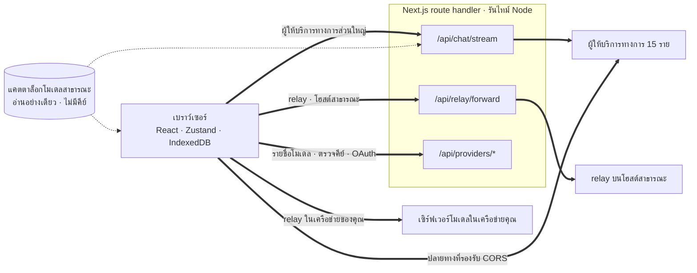
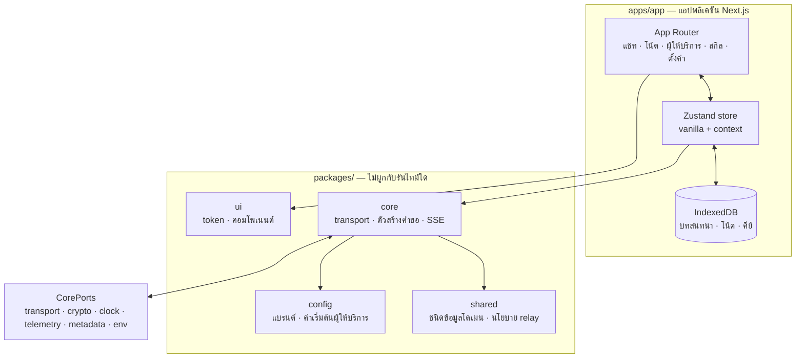

<div align="center">

# Oriveo สำหรับเว็บ

**ไคลเอนต์แชท Next.js สำหรับโมเดล AI ที่คุณจ่ายเงินใช้อยู่แล้ว**

<a href="../../LICENSE"></a>


<sub>

<a href="../../web/README.md">English</a> ·
<a href="../ar/web.md">العربية</a> ·
<a href="../de/web.md">Deutsch</a> ·
<a href="../es/web.md">Español</a> ·
<a href="../fr/web.md">Français</a> ·
<a href="../hi/web.md">हिन्दी</a> ·
<a href="../id/web.md">Indonesia</a> ·
<a href="../ja/web.md">日本語</a> ·
<a href="../ko/web.md">한국어</a> ·
<a href="../pt-BR/web.md">Português</a> ·
<a href="../ru/web.md">Русский</a> ·
**ไทย** ·
<a href="../tr/web.md">Türkçe</a> ·
<a href="../vi/web.md">Tiếng Việt</a> ·
<a href="../zh-Hans/web.md">简体中文</a> ·
<a href="../zh-Hant/web.md">繁體中文</a>

</sub>

</div>

---

ไคลเอนต์เว็บของ Oriveo คือแอปแชท AI แบบ bring-your-own-key ที่สร้างด้วย Next.js บทสนทนา โน้ต
โฟลเดอร์ สกิล และคีย์ผู้ให้บริการของคุณ อยู่ในที่จัดเก็บข้อมูลของเบราว์เซอร์เอง
ไม่มีบัญชีและไม่ต้องเข้าสู่ระบบ

แอปนี้เป็นส่วนหนึ่งของ [Oriveo Community Edition](README.md) —
ไคลเอนต์สามตัวที่ใช้นิยามเดียวกันว่าจะคุยกับผู้ให้บริการโมเดลอย่างไร

## เริ่มต้นอย่างรวดเร็ว

ต้องใช้ Node 22.22 ขึ้นไป (ดู [`.nvmrc`](../../web/.nvmrc)) npm มาพร้อมกับ Node อยู่แล้ว
ไม่ต้องใช้ package manager ตัวอื่น

```bash
npm install
npm run dev:app     # http://localhost:3001
```

หน้าจอแรกจะขอ API key ของผู้ให้บริการ นอกจากนั้นไม่ต้องตั้งค่าอะไรอีกก่อนเริ่มแชท

## คำขอเดินทางอย่างไรจริง ๆ

นี่คือส่วนที่ควรอ่านก่อนอย่างอื่น เพราะไคลเอนต์เว็บเป็นที่เดียวที่โดยปกติแล้วคำขอ **ไม่ได้**
วิ่งตรงจากไคลเอนต์ไปหาผู้ให้บริการ



**ทำไมต้องอ้อม** API ของผู้ให้บริการส่วนใหญ่ไม่ส่ง CORS header เบราว์เซอร์จึงเรียก
`api.openai.com` และเพื่อน ๆ ตรง ๆ ไม่ได้ — preflight ล้มเหลว
ไคลเอนต์ BYOK บนเบราว์เซอร์ทุกตัวต้องแก้ปัญหานี้ด้วยวิธีใดวิธีหนึ่ง
ตัวนี้เลือกส่งต่อผ่าน Next.js route handler ที่รันบนรันไทม์ Node เมื่อคุณรัน `npm run dev:app`
handler นั้นอยู่บนเครื่องของคุณเอง เมื่อคุณดีพลอยแอปไปที่ไหนสักแห่ง
มันก็อยู่บนเครื่องที่คุณดีพลอยไป

handler ไม่ได้มีแค่ตัวเดียว ได้แก่ การสตรีมแชท ตัวส่งต่อของ relay การสร้างภาพ รายชื่อโมเดล
การตรวจสอบคีย์ และการแลกเปลี่ยน device login ของ Grok กับ ChatGPT ซึ่งรวมกันแล้วเป็นไฟล์ route
ทั้งหมดสิบสองไฟล์ การตรวจสอบคีย์เป็นเรื่องสำคัญตรงนี้ — มันโพสต์คีย์ไปยังเซิร์ฟเวอร์ของคุณเอง
แล้วเซิร์ฟเวอร์นั้นก็เอาคีย์ไป probe ผู้ให้บริการ

มีปลายทางไม่กี่แห่งที่ *อนุญาต* ให้เบราว์เซอร์เรียกได้ และปลายทางเหล่านั้นถูกเรียกตรง
โดยไม่มีเซิร์ฟเวอร์คั่นกลาง ได้แก่ ปลายทางจีนของ Kimi (`api.moonshot.cn`) สำหรับแชท
และปลายทางดูยอดคงเหลือของ OpenRouter, SiliconFlow, DeepSeek และ Kimi

**สิ่งที่ handler ทำและไม่ทำ** มันตรวจสอบรูปแบบของคำขอและจำกัดขนาด บังคับ rate limit รายไอพี
กับทราฟฟิกของแชทและ relay ปฏิเสธ URL ที่ resolve ไปยังที่อยู่ส่วนตัวหรือ link-local
ประกอบ body เฉพาะของผู้ให้บริการ แล้วสตรีมคำตอบกลับมา ใต้ `app/api` ไม่มีฐานข้อมูล
ไม่มีการเขียนลงระบบไฟล์ และไม่มีการบันทึก body ของคำขอไว้ที่ใดเลย — คีย์และข้อความของคุณ
ถูกส่งต่อแล้วก็ถูกลืม และเพราะ route นี้เป็นโปรเซสเดียวที่ผู้เข้าชมทุกคนใช้ร่วมกัน
จึงมีเทสต์เฉพาะทาง (`server-never-learns.test.ts`) ตรึงไว้ว่ามันจะไม่แคชพารามิเตอร์
ที่ถูกปฏิเสธของผู้ใช้คนหนึ่ง แล้วเอาไปใช้กับคำขอของอีกคนหนึ่ง

ตัวส่งต่อของ relay ยังตรึง DNS ไว้กับที่อยู่ที่มัน resolve ได้ จำกัดขนาดคำตอบ
กำหนดขอบเขตของทุก timeout จำกัดการ redirect ให้อยู่ใน origin เดิม
และปฏิเสธการส่งผ่าน hop-by-hop header

**ปลายทางในเครื่องข้ามขั้นตอนนี้ไปทั้งหมด** relay ที่อยู่บนที่อยู่ส่วนตัว ชื่อลงท้าย `.local`
`localhost` หรือที่ตั้งค่าไว้ในโหมด local-HTTP หรือ private-VPN จะถูกเรียก **ตรงจากเบราว์เซอร์**
พร้อม `credentials: 'omit'` และ `targetAddressSpace: 'local'` ทราฟฟิกใน LAN ของคุณ
จึงไม่ออกไปนอกเครือข่าย และไม่ผ่านเซิร์ฟเวอร์ของแอปด้วย

## สถาปัตยกรรม



`packages/core` เก็บความรู้เรื่องโปรโตคอลของผู้ให้บริการไว้ครบทุกไบต์
และถูกกันให้ปลอดจากตัวแปร global ของเบราว์เซอร์อย่างจงใจ — eslint ห้ามใช้ `window`, `document`,
`fetch`, `crypto`, `localStorage`, `sessionStorage` และ `indexedDB` ทั้งภายในนั้นและใน
`packages/ipc-contract` อะไรก็ตามที่มันต้องการจากสภาพแวดล้อมจะเข้ามาผ่าน `CorePorts`
นั่นคือเหตุผลที่โค้ดชุดเดียวกันรันได้ทั้งในเบราว์เซอร์ ใน Node route handler และในเทสต์ที่ไม่มี DOM

การรองรับผู้ให้บริการมีสองแกนอิสระ `providerKind` เลือก **ตัวสร้างคำขอ**
(body ของผู้ขายรายนี้หน้าตาเป็นอย่างไร) ส่วน `model.transport` เลือก **กลยุทธ์ transport**
(ใช้โปรโตคอล wire ไหน) จากทั้งหมดสิบสองแบบ และถูกระบุรายโมเดลจากแคตตาล็อก
ไม่ใช่รายผู้ให้บริการ สองโมเดลที่อยู่หลังคีย์เดียวกันจึงต่างกันได้
กลยุทธ์หนึ่งตัวอิมพลีเมนต์เมธอดเพียงสามตัว: `buildRequestBody`, `parseStreamChunk`, `parseError`

## เวิร์กสเปซ

```
apps/app/               the Next.js application
packages/core/          provider protocols: transports, request builders, SSE parsing
packages/shared/        domain types, relay policy, helpers
packages/ui/            design tokens and shared components
packages/config/        brand and provider defaults
packages/ipc-contract/  typed channel contract for a desktop shell
```

การจัดสไตล์ใช้ CSS Modules บนชีต custom property token ชุดเดียวใน `packages/ui`
ไม่มีเฟรมเวิร์กแบบ utility class ส่วน `packages/ipc-contract` อธิบายพื้นผิวของช่องสื่อสาร
ที่เชลล์เดสก์ท็อปจะผูกเข้ามา แต่ที่เก็บโค้ดนี้ไม่ได้แถมเชลล์แบบนั้นมาด้วย
บนบิลด์เว็บมันจึงให้แค่ type และสาขาโค้ดที่ไม่มีวันถูกเดินผ่าน

ยังมีรอยต่อแบบเดียวกันอีกจุดหนึ่ง `apps/app/lib/core/sync-port.ts`
ประกาศอินเทอร์เฟซที่แบ็กเอนด์สำหรับซิงก์จะต้องอิมพลีเมนต์ และทุกจุดที่เรียกใช้เข้าถึงมันผ่าน
optional chaining ไม่มีอะไรติดตั้งแบ็กเอนด์แบบนั้น `getSyncAdapter()` จึงคืนค่า `null`
และ IndexedDB ยังเป็นสำเนาเดียวของข้อมูลของคุณ — ซึ่งก็คือความหมายในทางปฏิบัติของคำว่า
"ไม่มีบัญชี ไม่มีการเข้าสู่ระบบ"

## การจัดเก็บข้อมูล

ทุกอย่างแยกตามพาร์ทิชัน โดยใช้ id ที่กำลังใช้งานอยู่เป็นตัวแยก ค่าเริ่มต้นคือ `guest`

| อะไร | อยู่ที่ไหน |
|---|---|
| บทสนทนา ข้อความ โฟลเดอร์ โน้ต ผู้ให้บริการ | IndexedDB `oriveo--{id}` มี object store 8 ตัว |
| snapshot ของแคตตาล็อกโมเดล (~3 MB) และ model facts | blob store ใน IndexedDB จงใจไม่ใช้ localStorage |
| ค่าตั้งค่าและตารางตัวควบคุมโมเดล | `localStorage` โดยมี `safeLocalStorage` ครอบเส้นทางที่เคยพบว่า throw |
| รูปภาพที่สร้างขึ้นและที่แนบมา | ฐานข้อมูล IndexedDB อีกตัวแยกต่างหาก |

มีสองรายละเอียดที่มาจากความพังจริง ไม่ใช่รสนิยม snapshot ของแคตตาล็อกอยู่ใน IndexedDB
เพราะขนาดราว 3 MB ของมันกินโควตา localStorage 5 MB ของ origin ไปเกือบหมด
และการเข้าถึง localStorage ทุกครั้งต้องผ่าน `safeLocalStorage` เพราะตัว *getter* ของ
`window.localStorage` เองจะ throw `SecurityError` เมื่อเบราว์เซอร์ถูกตั้งค่าให้บล็อกข้อมูลของเว็บไซต์
— การอ่านแบบเปลือย ๆ ทำให้หน้าเว็บพังก่อนที่บล็อก `try` ของคุณจะได้ทำงานเสียอีก

> [!IMPORTANT]
> บนเว็บ คีย์ของผู้ให้บริการถูกเก็บใน IndexedDB **แบบไม่เข้ารหัส** — เป็นรูปแบบเดียวกับ
> ที่ไคลเอนต์ BYOK บนเบราว์เซอร์ทั่วไปใช้กัน เพราะเบราว์เซอร์ไม่มีที่ไหนดีกว่านี้ให้เก็บ
> ถ้าต้องการการรับประกันที่แข็งแรงที่สุด ให้ใช้ไคลเอนต์ iOS หรือ Android ซึ่ง keychain
> หรือ keystore ของระบบจะเข้ารหัสให้ ส่วนไฟล์สำรองข้อมูลเป็นคนละเรื่อง มันถูกเข้ารหัสด้วย
> AES-256-GCM และ PBKDF2-SHA-256 ที่ 600,000 รอบ เมื่อคุณตั้งรหัสผ่าน

## แคตตาล็อกโมเดล

ข้อมูลว่าผู้ให้บริการแต่ละรายมีโมเดลอะไรบ้าง และแต่ละโมเดลรองรับอะไร
มาจากแคตตาล็อกแบบอ่านอย่างเดียวที่ดึงมาตอนเริ่มแอป มีเพียงสองปลายทางที่ถูกเรียก ทั้งคู่เป็น `GET`
ทั้งคู่มีเงื่อนไข ETag และไม่มีตัวไหนพก API key บทสนทนา หรือตัวระบุตัวตนของผู้ใช้ไปด้วย:

```
GET {backend}/api/metadata?view=lean
GET {backend}/api/metadata/model-facts
```

แบ็กเอนด์ค่าเริ่มต้นคือ `https://api.oriveoai.com` ถ้าจะให้บริการเอง ให้ชี้
`NEXT_PUBLIC_BACKEND_URL` ไปที่โฮสต์ของคุณ คำตอบถูกแคชไว้ 24 ชั่วโมงใน IndexedDB
และตรวจสอบซ้ำด้วย `If-None-Match` เมื่อเข้าถึงแคตตาล็อกไม่ได้
แอปก็ยังทำงานต่อจากสำเนาที่แคชไว้

## คำสั่ง

รันคำสั่งเหล่านี้จากไดเรกทอรีนี้

| คำสั่ง | ทำอะไร |
|---|---|
| `npm run dev:app` | เซิร์ฟเวอร์สำหรับพัฒนา ที่พอร์ต 3001 |
| `npm run build:app` | บิลด์สำหรับโปรดักชัน |
| `npm run typecheck` | `tsc --noEmit` ทั่วทุกเวิร์กสเปซ |
| `npm run test:run` | vitest รันรอบเดียว |
| `npm run test` | vitest โหมด watch |
| `npm run lint` | eslint ทั่ว `apps/` และ `packages/` |

`npm start --workspace @oriveo/app` ให้บริการบิลด์ที่ทำเสร็จแล้วที่พอร์ต 3001

ถ้าจะรันไฟล์เทสต์ไฟล์เดียว ให้รันจากเวิร์กสเปซที่เป็นเจ้าของไฟล์นั้น
เพราะชุดทดสอบหลายชุด resolve fixture โดยอิงกับไดเรกทอรีที่กำลังทำงานอยู่

```bash
cd apps/app && npx vitest run lib/core/chat/__tests__/stream-options.test.ts
```

## การตั้งค่า

ทุกอย่างเป็นตัวเลือก คัดลอก [`.env.example`](../../web/.env.example) ไปเป็น `.env.local`
แล้วตั้งเฉพาะที่คุณต้องการ ทุกตัวแปรที่โค้ดอ่านมีอยู่ในรายการและมีคำอธิบายอยู่ในไฟล์นั้นแล้ว

### การรายงานข้อผิดพลาด

แอปแนบ Sentry SDK มาด้วย แต่มัน **ไม่ทำงานเลยเมื่อไม่มี DSN** — ไม่มี `NEXT_PUBLIC_SENTRY_DSN`
ก็ไม่มี transport ไม่มีอีเวนต์ ไม่มีอะไรถูกส่งไปไหนทั้งสิ้น
ซึ่งเป็นค่าเริ่มต้นของบิลด์ที่ทำจากที่เก็บโค้ดนี้ ถ้าตั้งค่าให้ คุณจะได้การรายงานข้อผิดพลาด
การเก็บ trace ประสิทธิภาพ 10% และ session replay 1% พร้อม hook ที่ตัดคีย์ผู้ให้บริการ ปลายทาง
และเนื้อหาข้อความออกก่อนที่อีเวนต์จะออกจากเบราว์เซอร์
มันอยู่ตรงนี้เพื่อให้การดีพลอยที่ต้องการรายงานข้อผิดพลาดมีมันใช้ได้
ไม่ใช่เพราะบิลด์นี้แอบส่งข้อมูลกลับบ้าน

## การโฮสต์เอง

ที่นี่ไม่มี Dockerfile และไม่มีสคริปต์ดีพลอย ตัวแอปเป็นเซิร์ฟเวอร์ Next.js ธรรมดา ๆ

```bash
npm ci
npm run build:app
npm start --workspace @oriveo/app     # 127.0.0.1:3001
```

มีสามเรื่องที่ควรรู้ก่อนจะเอามันไปวางไว้หลัง reverse proxy

`npm start` ผูกกับ `127.0.0.1` ดังนั้นพร็อกซีต้องรันอยู่บนโฮสต์เดียวกัน ไม่อย่างนั้นก็ต้องเปลี่ยนที่อยู่ที่ผูก

ตั้ง `NEXT_PUBLIC_APP_URL` ให้เป็น origin ที่คุณให้บริการจริง ลิงก์ canonical, sitemap
และภาพพรีวิวสำหรับโซเชียล ทั้งหมด resolve เทียบกับค่านี้ และค่าเริ่มต้นของมันคือพอร์ตสำหรับพัฒนา

ตั้ง `TRUSTED_PROXY_HOP_COUNT` ให้เท่ากับจำนวนพร็อกซีที่อยู่หน้าแอป
ตัวจำกัดอัตราของแชทอ่านที่อยู่ของไคลเอนต์โดยนับจาก*ขวา*ของ `X-Forwarded-For` เข้าไปเท่านั้นฮอป —
ไม่เคยนับจากซ้าย เพราะฝั่งซ้ายไคลเอนต์ควบคุมได้และปลอมได้ ค่าเริ่มต้น 1 ถูกต้องสำหรับพร็อกซีชั้นเดียว
ถ้ามีสองชั้นแล้วตั้งค่าไว้ต่ำเกินไป ผู้เข้าชมทุกคนจะไปใช้ถังจำกัดอัตราใบเดียวกัน
เพราะที่อยู่ที่อ่านได้คือของพร็อกซีชั้นในของคุณเอง

แอปส่ง HSTS, `X-Content-Type-Options`, `X-Frame-Options`, `Referrer-Policy`, `Permissions-Policy`
และ `Cross-Origin-Opener-Policy` จาก `next.config.ts` อยู่แล้ว พร็อกซีจึงไม่ต้องเพิ่มให้
ส่วนการปิด TLS และการจำกัดขนาดคำขอเป็นหน้าที่ของพร็อกซี

เรื่องสุดท้ายที่ควรตัดสินใจอย่างตั้งใจ ใครก็ตามที่เข้าถึงการดีพลอยนี้ได้
สามารถใช้ route handler ของมันเรียกผู้ให้บริการด้วยคีย์ที่ตัวเองใส่มา
ตัว handler ไม่ได้ถือคีย์ของตัวเองและไม่เก็บอะไรไว้ แต่มันเป็นเส้นทาง HTTP ที่ออกไปข้างนอก
การดีพลอยที่เข้าถึงได้จากสาธารณะจึงควรอยู่หลังการควบคุมการเข้าถึงแบบเดียวกับที่คุณให้เครื่องมือภายในตัวอื่น ๆ

## การทดสอบ

เทสต์ราว 5,600 รายการ กระจายอยู่ใน 460 ไฟล์ ด้วย vitest ความครอบคลุมหนาแน่นที่สุด
ในจุดที่ผิดพลาดแล้วแพงที่สุด ได้แก่ รูปแบบคำขอรายผู้ให้บริการ พฤติกรรม transport
รายโปรโตคอล wire การ parse chunk จาก SSE และพร็อกซี การ parse ปริมาณการใช้และค่าใช้จ่าย
การจำแนกข้อผิดพลาด การ probe relay และโหมดความปลอดภัย ตัวกัน SSRF การรัน capability recipe
การแคชแคตตาล็อกและการยกเลิกแคชตามเวอร์ชันของข้อกำหนด การเก็บข้อมูลใน IndexedDB
การแบ่งพาร์ทิชันของที่จัดเก็บ การสำรอง–กู้คืนแบบไปกลับ และตัว route handler เอง

> [!IMPORTANT]
> ชุดทดสอบกว่าสามสิบชุดโหลด contract fixture จาก `../shared` ดังนั้น
> **เทสต์จะผ่านก็ต่อเมื่อ checkout มาทั้งที่เก็บโค้ด** — คัดลอกเฉพาะ `web/` ออกไปจะไม่ทำงาน

## การแปลภาษา

สิบหกโลแคลอยู่ใน `apps/app/messages` แต่ละชุดมีคีย์ราว 1,800 รายการ
โดยใช้ภาษาอังกฤษเป็นต้นทาง มีเทสต์ที่เดินดูทั้งไดเรกทอรีและจะล้มเหลวถ้าชุดคีย์ของโลแคลใด
ต่างจากภาษาอังกฤษ การเพิ่มไฟล์โลแคลจึงลงทะเบียนตัวเองโดยอัตโนมัติ
ภาษาอาหรับได้เลย์เอาต์ขวาไปซ้ายเต็มรูปแบบ การเลือกโลแคลไล่ตามพารามิเตอร์ `?locale=` ที่ระบุชัด
ก่อน แล้วจึงดูคุกกี้ แล้วจึงดู `Accept-Language`

## การมีส่วนร่วม

ดู [CONTRIBUTING.md](../../CONTRIBUTING.md) `packages/core` ยึด transport เป็นหลัก
การเพิ่มผู้ให้บริการรายใหม่มักเป็นแค่ตัวสร้างคำขอหนึ่งตัวกับอะแดปเตอร์คำตอบหนึ่งตัว
ไม่ใช่ไคลเอนต์ตัวใหม่ สำหรับการแก้โปรโตคอลของผู้ให้บริการ ควรใช้ fixture ที่บันทึกไว้ใต้
`shared/test-fixtures` มากกว่าการเขียน mock ขึ้นเอง

## สัญญาอนุญาต

[AGPL-3.0-or-later](../../LICENSE)
