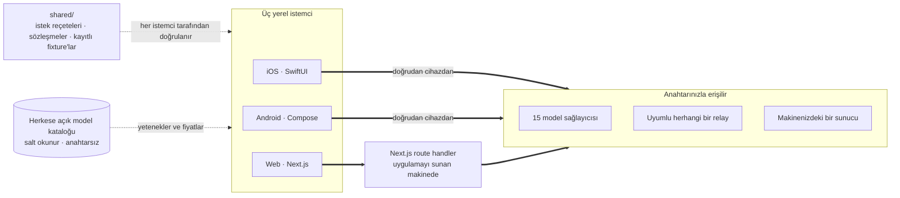

<div align="center">


# Oriveo

**Her model, tek uygulama.**

iOS, Android ve web için açık kaynaklı, kendi anahtarınızı getirdiğiniz yapay zekâ sohbeti.
Hesap yok, abonelik yok, sizinle model arasında bize ait bir sunucu yok.

<a href="../../LICENSE"></a>
<a href="ios.md"></a>
<a href="android.md"></a>
<a href="web.md"></a>


<a href="https://oriveoai.com">Web sitesi</a> &nbsp;·&nbsp;
<a href="#başlarken">Başlarken</a> &nbsp;·&nbsp;
<a href="#mimari">Mimari</a> &nbsp;·&nbsp;
<a href="#community-edition-ve-oriveo">Sürümler</a> &nbsp;·&nbsp;
<a href="#sss">SSS</a> &nbsp;·&nbsp;
<a href="../../CONTRIBUTING.md">Katkıda bulunma</a>

<sub>

<a href="../../README.md">English</a> ·
<a href="../ar/README.md">العربية</a> ·
<a href="../de/README.md">Deutsch</a> ·
<a href="../es/README.md">Español</a> ·
<a href="../fr/README.md">Français</a> ·
<a href="../hi/README.md">हिन्दी</a> ·
<a href="../id/README.md">Indonesia</a> ·
<a href="../ja/README.md">日本語</a> ·
<a href="../ko/README.md">한국어</a> ·
<a href="../pt-BR/README.md">Português</a> ·
<a href="../ru/README.md">Русский</a> ·
<a href="../th/README.md">ไทย</a> ·
**Türkçe** ·
<a href="../vi/README.md">Tiếng Việt</a> ·
<a href="../zh-Hans/README.md">简体中文</a> ·
<a href="../zh-Hant/README.md">繁體中文</a>

</sub>

</div>

---

## Oriveo nedir?

Oriveo Community Edition; iOS, Android ve web için kendi anahtarınızı getirdiğiniz (BYOK) bir yapay
zekâ sohbet istemcisidir. Zaten sahip olduğunuz API anahtarlarını siz verirsiniz, istemci de
sağlayıcıyla bu anahtarlarla konuşur. Oriveo hesabı yok, abonelik yok, analitik yok.

**15 model sağlayıcısıyla** doğrudan konuşur — OpenAI, Anthropic, Google Gemini, OpenRouter,
DeepSeek, Grok, Mistral, Groq, Together AI, Fireworks AI, MiniMax, Z.ai, Qwen, Kimi ve SiliconFlow —
ayrıca yönlendirdiğiniz **OpenAI, Anthropic veya Gemini uyumlu her endpoint** ile de: kendi
makinenizde çalışan llama.cpp, Ollama, LM Studio veya vLLM dahil.

| | |
|---|---|
| **Sağlayıcılar** | 15 yerleşik, ayrıca özel relay endpoint'leri ve yerel model sunucuları |
| **İstemciler** | iOS (SwiftUI) · Android (Jetpack Compose) · Web (Next.js) |
| **Arayüz dilleri** | 16 |
| **Hesap gerekiyor mu** | Hayır |
| **Kendi adına yaptığı çağrılar** | Bir tane: salt okunur bir model kataloğu, anahtar ve tanımlayıcı eklenmeden |
| **Lisans** | AGPL-3.0-or-later |

## Neden var?

Bir sohbet istemcisi, sizinle parasını ödediğiniz modelin arasına girmemeli.

- **Sizin anahtarlarınız, sizin faturanız.** Sağlayıcının liste fiyatını ödersiniz. Hiçbir şeye zam
  yapılmaz, sayaç takılmaz, yeniden satılmaz.
- **Varsayılan olarak yerel.** Sohbetler, notlar, klasörler, skill'ler ve ekler cihazda durur.
  İstediğiniz zaman bir dosyaya aktarın; erişimini kaybedebileceğiniz bir bulut kopyası yok.
- **Tek davranış, üç istemci.** Belirli bir sağlayıcı, transport ve yetenek için bir isteğin nasıl
  kurulacağı [`shared/`](shared.md) içinde bir kez tanımlanır ve üç istemci de aynı JSON
  fixture'larına karşı doğrulama yapar. Bir sağlayıcı tuhaflığı üç kez değil, bir kez düzeltilir.
- **Yaptığı tek çağrı konusunda dürüst.** Uygulama, bugün çıkan bir modelin uygulama güncellemesi
  olmadan çalışması için herkese açık bir model kataloğu çeker. Salt okunurdur, anahtar ve
  tanımlayıcı taşımaz ve onu kendi sunucunuza yönlendirebilirsiniz.

## Özellikler

- **Sohbet** — streaming, akıl yürütme blokları, kaynak atıfları, ekler (görsel, PDF, Office, EPUB,
  HTML, düz metin), seçili bir yeri alıntılama, yeniden deneme, yeniden üretme, yarıda kesilen bir
  yanıtı sürdürme
- **Sağlayıcılar** — 15 yerleşik, her biri kendi anahtarınızla; sağlayıcı başına endpoint, model ve
  parametre geçersiz kılmaları
- **Relay** — OpenAI, Anthropic veya Gemini uyumlu her endpoint; yerel ağınızdakiler dahil
- **Yerel model sunucuları** — llama.cpp, Ollama, LM Studio, vLLM; yerel ağda keşifle birlikte
- **Abonelikle giriş** — API anahtarı yerine hâlihazırda sahip olduğunuz bir Codex veya Grok
  aboneliğini kullanın
- **Skills** — kendi modeli, parametreleri ve referans belgeleri olan, yeniden kullanılabilir sistem
  prompt'ları
- **Notlar ve klasörler** — bir yanıtı not olarak kaydedin, sohbetleri düzenleyin, tam metin arama
- **Çapraz kontrol** — aynı soruyu ikinci bir modele yeniden sorun ve iki yanıtı yan yana tutun
- **Maliyet** — mesaj ve sağlayıcı başına harcama; her yanıtın gerçekte bildirdiği değerlerden
  cihazda hesaplanır, önbellek indirim kademeleri dahil
- **Görsel üretimi** — sağlayıcının desteklediği yerlerde
- **Yedekleme** — her şeyi bir dosyaya aktarın, isterseniz seçtiğiniz bir parolayla şifreleyin
- **16 arayüz dili**, Arapça için tam sağdan sola yerleşim dahil

## Community Edition ve Oriveo

Bu depo, [AGPL-3.0-or-later](../../LICENSE) altında lisanslanan **Oriveo Community Edition**'dır.
App Store'daki ve Google Play'deki uygulamalar ile barındırılan web uygulaması ise **Oriveo**'dur —
aynı istemcilerden üretilmiş, üstüne bir hesap katmanı eklenmiş, ayrı ve tescilli bir ürün.

| | Community Edition | Oriveo |
|---|---|---|
| Kaynak kod | Bu depo, AGPL-3.0-or-later | Tescilli |
| Kendi sağlayıcı anahtarlarınızla sohbet | Evet | Evet |
| Relay ve yerel model sunucuları | Evet | Evet |
| Notlar, klasörler, skill'ler, ekler | Evet, sınırsız | Evet |
| Cihaz üzerinde maliyet takibi | Evet | Evet |
| Hesap | Yok | Oriveo hesabı |
| Depolama | Cihazda; elle dışa aktarma ve geri yükleme | Local-first, ayrıca cihazlar arası bulut senkronizasyonu |
| Kullanım analizleri ve bütçe uyarıları | — | Evet |
| Parasını Oriveo'nun ödediği modeller | — | Evet |
| Analitik ve çökme raporlama | Yok | Evet |

Community Edition derlemeleri `ai.oriveo.community` tanımlayıcı önekini kullanır; böylece bir mağaza
derlemesinin yanında durabilir, ikisi ne keychain'i ne güncelleme kanalını ne de yerel veriyi
paylaşır. Bu sürümün neyi kabul edip neyi etmeyeceği [COMMUNITY.md](../../COMMUNITY.md) içinde
yazılıdır.

**Oriveo, tam ürün:**
[iPhone ve iPad](https://apps.apple.com/app/oriveo/id6775370458) &nbsp;·&nbsp;
[Android](https://play.google.com/store/apps/details?id=com.kenny.oriveo) &nbsp;·&nbsp;
[Web](https://app.oriveoai.com) &nbsp;·&nbsp;
[oriveoai.com](https://oriveoai.com)

## Sağlayıcılar

Aşağıdaki her sağlayıcıya, kendi oluşturduğunuz bir anahtarla erişilir.

| Sağlayıcı | Anahtarı nereden alırsınız |
|---|---|
| OpenAI | [platform.openai.com](https://platform.openai.com/api-keys) |
| Anthropic | [console.anthropic.com](https://console.anthropic.com/settings/keys) |
| Google Gemini | [aistudio.google.com](https://aistudio.google.com/apikey) |
| OpenRouter | [openrouter.ai](https://openrouter.ai/keys) |
| DeepSeek | [platform.deepseek.com](https://platform.deepseek.com/api_keys) |
| Grok | [console.x.ai](https://console.x.ai/) |
| Mistral | [console.mistral.ai](https://console.mistral.ai/api-keys) |
| Groq | [console.groq.com](https://console.groq.com/keys) |
| Together AI | [api.together.xyz](https://api.together.xyz/settings/api-keys) |
| Fireworks AI | [fireworks.ai](https://fireworks.ai/api-keys) |
| MiniMax | [platform.minimax.io](https://platform.minimax.io/docs/guides/quickstart-preparation) |
| Z.ai | [open.bigmodel.cn](https://open.bigmodel.cn/usercenter/apikeys) |
| Qwen | [bailian.console.alibabacloud.com](https://bailian.console.alibabacloud.com/?apiKey=1#/api-key) |
| Kimi | [platform.kimi.ai](https://platform.kimi.ai/console/api-keys) |
| SiliconFlow | [cloud.siliconflow.cn](https://cloud.siliconflow.cn/account/ak) |
| **Relay** | OpenAI, Anthropic veya Gemini uyumlu her endpoint; kendi makinenizdekiler dahil |

## Mimari

Üç yerel istemci, bir model sağlayıcısıyla nasıl konuşulacağının tek bir tanımı.



Her istemci kendi arayüzüne, depolamasına ve gezinmesine sahiptir ve ortak sözleşmelerle tam olarak
tek bir dikişte buluşur: *bu model, bu yetenek* ikilisini bir HTTP isteğine çeviren katmanda.

Bilinmeye değer tek asimetri web istemcisidir. Sağlayıcı API'leri CORS başlıkları göndermez, bu
yüzden bir tarayıcı onları doğrudan çağıramaz; dolayısıyla 15 resmi sağlayıcıya giden istekler,
uygulamayı hangi makine sunuyorsa orada çalışan bir Next.js route handler'ından geçer — yerelde
çalıştırdığınızda bu sizin makinenizdir. iOS ve Android istemcilerinde böyle bir kısıt yoktur; onlar
doğrudan sağlayıcıya gider. Kendi ağınızdaki relay endpoint'leri de tarayıcıdan doğrudan çağrılır.

**Her istemcinin mimarisi:**

| | Teknoloji | README |
|---|---|---|
| **iOS** | UIKit sohbet dökümlü SwiftUI, GRDB | [ios/README.md](ios.md) |
| **Android** | Jetpack Compose, Room, Koin, Ktor/OkHttp | [android/README.md](android.md) |
| **Web** | Next.js App Router, React, Zustand, TypeScript | [web/README.md](web.md) |
| **Shared** | Sözleşmeler, kayıtlı fixture'lar ve Swift protokol çekirdeği | [shared/README.md](shared.md) |

## Başlarken

<details open>
<summary><b>Web</b> — denemenin en hızlı yolu</summary>

<br>

Node 22 gerekir (bkz. [`web/.nvmrc`](../../web/.nvmrc)).

```bash
cd web
npm install
npm run dev:app        # http://localhost:3001
```

İlk ekran bir sağlayıcı API anahtarı ister. Başka hiçbir şey gerekmez.
Daha fazla komut ve yapılandırma: [web/README.md](web.md).

</details>

<details>
<summary><b>iOS</b> — kendi iPhone'unuzda derleyip çalıştırın</summary>

<br>

Xcode 26 kurulu bir Mac ve iOS 18 veya sonrasını çalıştıran bir cihaz gerekir. Ücretsiz bir Apple
Developer hesabı yeterlidir — uygulama ücretli hiçbir capability kullanmaz.

1. `ios/Oriveo/Oriveo.xcodeproj` dosyasını açın
2. `Oriveo` scheme'ini seçin
3. Signing &amp; Capabilities altında kendi Team'inizi seçin
4. Çalıştırın

Xcode projeyi açmayı reddederse ne yapmanız gerektiği dahil, tam anlatım:
[ios/README.md](ios.md).

</details>

<details>
<summary><b>Android</b> — APK'yı derleyin</summary>

<br>

JDK 17 veya sonrası ile Android SDK gerekir. Derleme AGP 9.3, Gradle 9.5 ve Kotlin 2.3 kullanır,
dolayısıyla Android Studio bunları senkronize edebilen bir sürüm olmalıdır; komut satırından yalnızca
JDK ve SDK yeterlidir.

```bash
cd android
./gradlew :app:assembleDebug
```

Model kataloğunu kendi sunucunuzdan sunma: [android/README.md](android.md).

</details>

## Gizlilik

- **Sağlayıcı anahtarları** platformun kendi olanağıyla saklanır — iOS Keychain, Android Keystore
  (`EncryptedSharedPreferences`) veya tarayıcının IndexedDB'si — ve yalnızca ait oldukları
  sağlayıcıya erişmek için kullanılır. Web'de şifrelenmeden saklanırlar; bu, tarayıcı tabanlı BYOK
  istemcilerinin genelde kullandığı modeldir. En güçlü garanti için iOS veya Android istemcisini
  kullanın.
- **Sohbetler, notlar, klasörler, skill'ler ve ekler** cihazda saklanır. Hiçbir yere hiçbir şey
  yüklenmez.
- **Hesap yok, analitik yok, çökme raporlama yok.** Giriş yapılacak bir yer yok, eve telefon eden bir
  şey de yok.
- **iOS ve Android'de sohbet istekleri doğrudan cihazdan sağlayıcıya gider.** Web'de, sağlayıcı
  API'leri doğrudan tarayıcı çağrılarına izin vermediği için istekler uygulamayı sunan Next.js
  sunucusundan geçer; o sunucu anahtarları veya mesajları saklamaz ve uygulamayı yerelde
  çalıştırdığınızda o sunucu sizin makinenizdir.
- **Kendimiz için tek bir istek:** salt okunur bir model kataloğu; anahtar, sohbet ve tanımlayıcı
  eklenmeden çekilir, böylece bugün çıkan bir model yeni bir derleme gerektirmeden çalışır. Kendiniz
  sunmayı tercih ederseniz onu kendi sunucunuza yönlendirin.

## SSS

<details>
<summary><b>BYOK ne demek?</b></summary>

<br>

Bring your own key: kendi anahtarını getir. Sağlayıcının kendi konsolunda — OpenAI, Anthropic,
Google vb. — bir API anahtarı oluşturur ve onu Oriveo'ya yapıştırırsınız. İstekleri o sağlayıcı,
kendi liste fiyatı üzerinden faturalandırır. Oriveo istemcidir; bayi değildir ve pay almaz.

</details>

<details>
<summary><b>Sohbetlerim bir Oriveo sunucusundan geçiyor mu?</b></summary>

<br>

Hayır. iOS ve Android'de istemci sağlayıcı endpoint'ini doğrudan çağırır. Web'de istek, uygulamayı
sunan Next.js sunucusundan geçer — yerelde çalıştırdığınızda bu sizin makinenizdir — çünkü
tarayıcılar sağlayıcı API'lerini doğrudan çağıramaz. Bu yolların hiçbirinde Oriveo'nun işlettiği bir
sunucu yoktur. Oriveo'nun kendi adına yaptığı tek istek, herkese açık model kataloğunun salt okunur
biçimde çekilmesidir; bu istek anahtar, sohbet ve tanımlayıcı taşımaz.

</details>

<details>
<summary><b>Kendi makinemde çalışan bir modeli kullanabilir miyim?</b></summary>

<br>

Evet. OpenAI, Anthropic veya Gemini uyumlu herhangi bir sunucuyu — llama.cpp, Ollama, LM Studio,
vLLM ya da bu protokollerden birini konuşan başka bir şeyi — gösteren bir Relay bağlantısı ekleyin.
Android ve web istemcileri böyle bir sunucuyu yerel ağda keşfedebilir de. Yerel HTTP hiçbir kimlik
bilgisi kullanmaz ve ağınızdan asla çıkmaz.

</details>

<details>
<summary><b>App Store'daki uygulamadan farkı ne?</b></summary>

<br>

Mağazadaki uygulamalar Oriveo'dur: hesap, cihazlar arası bulut senkronizasyonu, kullanım analizleri
ve parasını Oriveo'nun ödediği modelleri ekleyen tescilli bir ürün. Community Edition ise bunların
hiçbiri olmadan aynı üç istemcidir: hesap yok, senkronizasyon servisi yok, faturalandırma yok,
analitik yok. Tam karşılaştırma için bkz.
[Community Edition ve Oriveo](#community-edition-ve-oriveo).

</details>

<details>
<summary><b>macOS istemcisi var mı?</b></summary>

<br>

Bu depoda yok. Bu arada web istemcisi herhangi bir tarayıcıda masaüstü uygulaması gibi gayet iyi
çalışır ve iOS derlemesi Apple silicon Mac'lerde koşar.

</details>

<details>
<summary><b>Arayüz hangi dillerde mevcut?</b></summary>

<br>

On altı dilde: Arapça, Almanca, İngilizce, İspanyolca, Fransızca, Hintçe, Endonezce, Japonca,
Korece, Brezilya Portekizcesi, Rusça, Tayca, Türkçe, Vietnamca, Basitleştirilmiş Çince ve Geleneksel
Çince. Arapça tam sağdan sola yerleşim alır.

</details>

## Depo yapısı

```
ios/       iOS client (SwiftUI)
android/   Android client (Jetpack Compose)
web/       Web client (Next.js)
macos/     Reserved for a macOS client
shared/    Cross-client contracts, recorded fixtures, and the Swift wire kernel
```

## Katkıda bulunma

Hata bildirimleri ve pull request'ler memnuniyetle karşılanır.
[CONTRIBUTING.md](../../CONTRIBUTING.md) her istemcinin nasıl derleneceğini ve iyi bir pull
request'in neye benzediğini anlatır; [COMMUNITY.md](../../COMMUNITY.md) ise bu sürümün ne için
olduğunu ve ne kadar iyi yazılmış olursa olsun kabul edilmeyecek birkaç tür değişikliği açıklar.

Bir güvenlik sorunu mu buldunuz? Lütfen herkese açık bir issue açmayın —
[SECURITY.md](../../SECURITY.md) bunu nasıl gizlice bildireceğinizi ve bu projenin neyi güvenlik
açığı sayıp neyi saymadığını anlatır. Katılan herkesin
[davranış kurallarına](../../CODE_OF_CONDUCT.md) uyması beklenir.

## Lisans

[AGPL-3.0-or-later](../../LICENSE). Katkılar aynı lisans altında kabul edilir.
