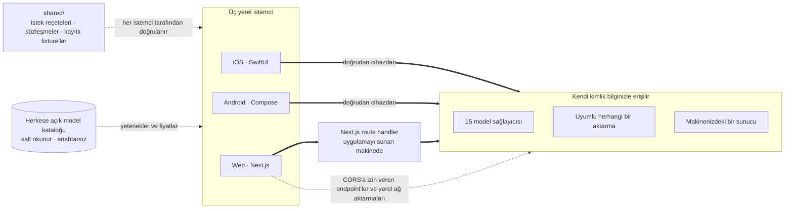

<div align="center">


# Oriveo Community Edition

**Her model, tek uygulama.**

iOS, Android ve web için açık kaynaklı, kendi anahtarınızı getirdiğiniz yapay zekâ sohbeti;
yerel bir macOS istemcisi de geliştirme aşamasında.
Hesap yok, abonelik yok, sohbet istek yolunda bize ait bir servis yok.

<a href="../../LICENSE"></a>
<a href="ios.md"></a>
<a href="android.md"></a>
<a href="web.md"></a>
<a href="macos.md"></a>
<a href="https://github.com/oriveo/oriveo/releases/latest"></a>
<a href="https://github.com/oriveo/oriveo/stargazers"></a>

**Oriveo'yu edinin:**
<a href="https://oriveoai.com"><b>oriveoai.com</b></a> &nbsp;·&nbsp;
<a href="https://apps.apple.com/app/oriveo/id6775370458">App Store</a> &nbsp;·&nbsp;
<a href="https://play.google.com/store/apps/details?id=com.kenny.oriveo">Google Play</a> &nbsp;·&nbsp;
<a href="https://app.oriveoai.com">Web uygulaması</a>

<sub>Mağaza derlemeleri, ticari sürüm olan <b>Oriveo</b>'dur. Bu depo ise kaynaktan derlenen <a href="#community-edition-ve-oriveo">Community Edition</a>'dır.</sub>

<a href="#başlarken">Kaynaktan derleme</a> &nbsp;·&nbsp;
<a href="#mimari">Mimari</a> &nbsp;·&nbsp;
<a href="#community-edition-ve-oriveo">Sürümler</a> &nbsp;·&nbsp;
<a href="#sss">SSS</a> &nbsp;·&nbsp;
<a href="../../CONTRIBUTING.md">Katkıda bulunma</a>

<sub>

<a href="../../README.md">English</a> ·
<a href="../ar/README.md">العربية</a> ·
<a href="../de/README.md">Deutsch</a> ·
<a href="../es/README.md">Español</a> ·
<a href="../fr/README.md">Français</a> ·
<a href="../hi/README.md">हिन्दी</a> ·
<a href="../id/README.md">Indonesia</a> ·
<a href="../ja/README.md">日本語</a> ·
<a href="../ko/README.md">한국어</a> ·
<a href="../pt-BR/README.md">Português</a> ·
<a href="../ru/README.md">Русский</a> ·
<a href="../th/README.md">ไทย</a> ·
**Türkçe** ·
<a href="../vi/README.md">Tiếng Việt</a> ·
<a href="../zh-Hans/README.md">简体中文</a> ·
<a href="../zh-Hant/README.md">繁體中文</a>

</sub>

&nbsp;
&nbsp;


<sub>Kullandığınız her sağlayıcı ve her birinin maliyeti · ilkini kontrol eden ikinci bir model · not olarak saklanan bir yanıt</sub>

</div>

---

## Oriveo nedir?

Oriveo Community Edition; iOS, Android ve web için açık kaynaklı (open-source), kendi anahtarınızı
getirdiğiniz (bring-your-own-key, BYOK), çok modelli (multi-model) bir yapay zekâ sohbet istemcisidir
(AI chat client); yerel bir macOS istemcisi de geliştirme aşamasındadır. Barındırılan bir ChatGPT
veya Claude planına local-first bir alternatiftir; modelin önünde duran her ne varsa ona abonelik
ödemek yerine parayı doğrudan model sağlayıcısına vermeyi yeğleyenler içindir. Zaten sahip
olduğunuz API anahtarlarını siz verirsiniz, istemci sağlayıcıyla bu anahtarlarla konuşur ve web
istemcisini dilediğiniz gibi kendiniz barındırırsınız (self-host) — Oriveo hesabı yok, bize geri
bilgi gönderen hiçbir şey yok.

**15 model sağlayıcısıyla** doğrudan konuşur — OpenAI, Anthropic, Google Gemini, OpenRouter,
DeepSeek, Grok, Mistral, Groq, Together AI, Fireworks AI, MiniMax, Z.ai, Qwen, Kimi (Moonshot) ve
SiliconFlow — ayrıca yönlendirdiğiniz **OpenAI, Anthropic veya Gemini uyumlu her endpoint** ile de:
kendi makinenizde çalışan llama.cpp, Ollama, LM Studio veya vLLM dahil. Tek bir LLM istemcisi (LLM
client), tek bir sohbet birikimi, yanıtı hangi model verirse versin.

<table>
<tr>
<td width="33%" valign="top"><b>15 sağlayıcı</b><br>Ayrıca aktarma endpoint'leri ve yerel model sunucuları.</td>
<td width="33%" valign="top"><b>Varsayılan olarak yerel</b><br>Sohbetler, notlar, klasörler, yetenekler ve ekler cihazda kalır.</td>
<td width="33%" valign="top"><b>Tek davranış, üç istemci</b><br><code>shared/</code> içinde tek bir tanım, üç test paketi onu doğrular.</td>
</tr><tr>
<td valign="top"><b>Hesap yok</b><br>Bize geri bilgi gönderen bir şey yok.</td>
<td valign="top"><b>Kendiniz barındırın</b><br>Web istemcisi sizin makinenizde çalışır.</td>
<td valign="top"><b>16 dil</b><br>Arapça için tam sağdan sola yerleşim.</td>
</tr></table>

## Neden var?

Parasını ödediğiniz modele kimse sayaç takamamalı, onun kaydını tutamamalı, üstüne zam yapamamalı.

- **Sizin anahtarlarınız, sizin faturanız.** Sağlayıcının liste fiyatını ödersiniz. Hiçbir şeye zam
  yapılmaz, sayaç takılmaz, yeniden satılmaz.
- **Varsayılan olarak yerel.** Sohbetler, notlar, klasörler, yetenekler ve ekler cihazda durur.
  İstediğiniz zaman bir dosyaya aktarın; erişimini kaybedebileceğiniz bir bulut kopyası yok.
- **Tek davranış, üç istemci.** Belirli bir sağlayıcı, transport ve capability için bir isteğin nasıl
  kurulacağı [`shared/`](shared.md) içinde bir kez yazıya dökülür ve üç istemci de aynı JSON
  fixture'larına karşı doğrulama yapar. O verinin içinde yaşayan bir tuhaflık bir kez düzeltilir;
  bir ayrıştırıcının içinde yaşayan tuhaflık ise aynı anda üç test paketi tarafından yakalanır.
- **Çektiği tek şey.** Herkese açık, salt okunur bir model kataloğu; böylece bugün çıkan bir model
  uygulama güncellemesi olmadan çalışır — ne anahtar, ne bizim eklediğimiz bir tanımlayıcı, üstelik
  kendi sunucunuza yönlendirilebilir.

## Özellikler

- **Sohbet** — streaming, akıl yürütme blokları, kaynak atıfları, ekler (görsel ve video, PDF,
  Office (docx, xlsx, pptx), OpenDocument, EPUB, RTF, HTML ve her türlü düz metin ya da kaynak kod
  dosyası), seçili bir yeri alıntılama, yeniden deneme, yeniden üretme, yarıda kesilen bir yanıtı
  sürdürme
- **Sağlayıcılar** — 15 yerleşik, her biri kendi anahtarınızla; sağlayıcı başına model ve üretim
  parametresi geçersiz kılmaları, ayrıca sağlayıcı sunuyorsa bölgesel endpoint seçimi
- **Aktarma hizmeti (Relay)** — OpenAI, Anthropic veya Gemini uyumlu her endpoint, ayrıca
  llama.cpp'nin kendi API'si; yerel ağınızdakiler dahil
- **Yerel model sunucuları** — llama.cpp, Ollama, LM Studio, vLLM, Open WebUI; iOS ve Android
  bunları yerel ağda, motor kendini duyuruyorsa mDNS ile, duyurmuyorsa alışılmış portları yoklayarak
  bulur
- **Abonelikle giriş** — API anahtarı yerine hâlihazırda sahip olduğunuz bir ChatGPT veya Grok
  aboneliğini, her sağlayıcının kendi cihaz yetkilendirme akışı üzerinden kullanın
- **Yetenekler** — kendi modeli, akıl yürütme ayarı ve referans belgeleri olan, yeniden
  kullanılabilir sistem prompt'ları
- **Notlar ve klasörler** — bir yanıtı not olarak kaydedin, sohbetleri düzenleyin, ikisinde birlikte
  arama yapın
- **Başka modelle kontrol et** — bir yanıtı incelemesi için ikinci bir modele verin ve ikisini bir
  arada tutun
- **Maliyet** — mesaj ve sağlayıcı başına harcama; her yanıtın gerçekte bildirdiği değerlerden
  cihazda hesaplanır, önbellek okuma ve önbellek yazma kademeleri dahil
- **Görsel üretimi** — sağlayıcının desteklediği yerlerde
- **Yedekleme** — her şeyi bir dosyaya aktarın; içindeki sağlayıcı anahtarları, dahil etmeyi
  seçerseniz, sizin belirlediğiniz bir parolayla şifrelenir
- **16 arayüz dili**, Arapça için tam sağdan sola yerleşim dahil

## Community Edition ve Oriveo

Bu depo, [AGPL-3.0-or-later](../../LICENSE) altında lisanslanan **Oriveo Community Edition**'dır.
App Store'daki ve Google Play'deki uygulamalar ile barındırılan web uygulaması ise **Oriveo**'dur —
üstüne bir hesap katmanı ekleyen, ayrı ve tescilli bir üründür.

| | Community Edition | Oriveo |
|---|---|---|
| Kaynak kod | Bu depo, AGPL-3.0-or-later | Tescilli |
| Kendi sağlayıcı anahtarlarınızla sohbet | Evet | Evet |
| Aktarma hizmeti ve yerel model sunucuları | Evet | Evet |
| Notlar, klasörler, yetenekler, ekler | Evet | Evet |
| Cihaz üzerinde maliyet takibi | Evet | Evet |
| Hesap | Yok | Oriveo hesabı |
| Depolama | Cihazda; elle dışa aktarma ve geri yükleme | Local-first, ayrıca cihazlar arası bulut senkronizasyonu |
| Kullanım analizleri ve bütçe uyarıları | — | Evet |
| Parasını Oriveo'nun ödediği modeller | — | Evet |
| Analitik ve çökme raporlama | Yok. Web paketindeki Sentry, kendi DSN'iniz olmadan sessiz kalır | Evet |

Community Edition derlemeleri `ai.oriveo.community` tanımlayıcı önekini kullanır; böylece bir mağaza
derlemesiyle aynı cihazda durabilir, ikisi ne keychain'i ne de herhangi bir yerel veriyi paylaşır. Bu
sürümün neyi kabul edip neyi etmeyeceği [COMMUNITY.md](../../COMMUNITY.md) içinde yazılıdır.

**Oriveo, tam ürün:** [iPhone ve iPad](https://apps.apple.com/app/oriveo/id6775370458) ·
[Android](https://play.google.com/store/apps/details?id=com.kenny.oriveo) · [Web](https://app.oriveoai.com) · [oriveoai.com](https://oriveoai.com)

## Sağlayıcılar

Aşağıdaki her sağlayıcıya, kendi oluşturduğunuz bir anahtarla erişilir. Bunlardan ikisine, anahtar
yerine hâlihazırda sahip olduğunuz bir abonelikle giriş yaparak da erişilebilir: bir ChatGPT planıyla
OpenAI, ve Grok.

| Sağlayıcı | Anahtarı nereden alırsınız |
|---|---|
| OpenAI | [platform.openai.com](https://platform.openai.com/api-keys) |
| Anthropic | [platform.claude.com](https://platform.claude.com/settings/keys) |
| Google Gemini | [aistudio.google.com](https://aistudio.google.com/apikey) |
| OpenRouter | [openrouter.ai](https://openrouter.ai/keys) |
| DeepSeek | [platform.deepseek.com](https://platform.deepseek.com/api_keys) |
| Grok | [console.x.ai](https://console.x.ai/) |
| Mistral | [console.mistral.ai](https://console.mistral.ai/api-keys) |
| Groq | [console.groq.com](https://console.groq.com/keys) |
| Together AI | [api.together.xyz](https://api.together.xyz/settings/api-keys) |
| Fireworks AI | [fireworks.ai](https://fireworks.ai/api-keys) |
| MiniMax | [platform.minimax.io](https://platform.minimax.io/docs/guides/quickstart-preparation) |
| Z.ai | [open.bigmodel.cn](https://open.bigmodel.cn/usercenter/apikeys) |
| Qwen | [bailian.console.alibabacloud.com](https://bailian.console.alibabacloud.com/?apiKey=1#/api-key) |
| Kimi (Moonshot) | [platform.kimi.ai](https://platform.kimi.ai/console/api-keys) |
| SiliconFlow | [cloud.siliconflow.cn](https://cloud.siliconflow.cn/account/ak) |
| **Aktarma hizmeti** | OpenAI, Anthropic veya Gemini uyumlu her endpoint, ayrıca llama.cpp'nin kendi API'si; kendi makinenizdekiler dahil |

## Mimari

Üç yerel istemci, bir model sağlayıcısıyla nasıl konuşulacağının tek bir tanımı.



Her istemci kendi arayüzüne, depolamasına ve gezinmesine sahiptir ve ortak sözleşmelerle tam olarak
tek bir dikişte buluşur: *bu model, bu capability* ikilisini bir HTTP isteğine çeviren katmanda.

Bilinmeye değer tek asimetri web istemcisidir. Sağlayıcı API'lerinin çoğu CORS başlığı göndermez,
bu yüzden bir tarayıcı onları doğrudan çağıramaz. O istekler, uygulamayı hangi makine sunuyorsa
orada çalışan bir Next.js route handler'ından geçer — yerelde çalıştırdığınızda bu sizin
makinenizdir. Tarayıcıya izin veren bir avuç endpoint (Kimi'nin Çin endpoint'i ile OpenRouter,
SiliconFlow, DeepSeek ve Kimi'nin bakiye endpoint'leri) ve kendi ağınızdaki aktarmalar doğrudan
çağrılır. iOS ve Android istemcilerinde böyle bir kısıt yoktur; onlar her zaman doğrudan sağlayıcıya
gider.

**Her istemcinin mimarisi:**

| | Teknoloji | README |
|---|---|---|
| **iOS** | UIKit sohbet dökümlü SwiftUI, GRDB | [ios.md](ios.md) |
| **Android** | Jetpack Compose, Room, Koin, Ktor/OkHttp | [android.md](android.md) |
| **Web** | Next.js App Router, React, Zustand, TypeScript | [web.md](web.md) |
| **macOS** | Geliştirme aşamasında, önümüzdeki aylarda geliyor | [macos.md](macos.md) |
| **Shared** | Sözleşmeler, kayıtlı fixture'lar ve Swift protokol çekirdeği | [shared.md](shared.md) |

## Başlarken

Burada önceden derlenmiş ikili dosya yok — APK yok, `.ipa` yok. Community Edition, kendinizin
derlediği kaynak koddur. Çalışan bir uygulamaya giden en kısa yol web istemcisidir.

<details open>
<summary><b>Web</b> — denemenin en hızlı yolu</summary>

<br>

Node 22.22.2 veya sonraki bir 22.x sürümü gerekir (bkz. [`web/.nvmrc`](../../web/.nvmrc)); Node 23+ desteklenmez.

```bash
cd web
npm install
npm run dev:app        # http://localhost:3001
```

İlk ekran bir sağlayıcı API anahtarı ister. Başka hiçbir şey gerekmez.
Daha fazla komut ve yapılandırma: [web.md](web.md).

</details>

<details>
<summary><b>iOS</b> — kendi iPhone'unuzda derleyip çalıştırın</summary>

<br>

Xcode 26 kurulu bir Mac ve iOS 18 veya sonrasını çalıştıran bir cihaz gerekir. Ücretsiz bir Apple
Developer hesabı yeterlidir — uygulama ücretli hiçbir capability kullanmaz.

1. `ios/Oriveo/Oriveo.xcodeproj` dosyasını açın
2. `Oriveo` scheme'ini seçin
3. Signing &amp; Capabilities altında kendi Team'inizi seçin
4. Xcode `ai.oriveo.community` kaydını yapamıyorsa, bundle identifier'ı ekibinizin sahip olduğu bir tanımlayıcıyla değiştirin
5. Çalıştırın

Xcode projeyi açmayı reddederse ne yapmanız gerektiği dahil, tam anlatım:
[ios.md](ios.md).

</details>

<details>
<summary><b>Android</b> — APK'yı derleyin</summary>

<br>

JDK 21 ile Android SDK gerekir. Derleme AGP 9.3, Gradle 9.5 ve Kotlin 2.3 kullanır, dolayısıyla
Android Studio bunları senkronize edebilen bir sürüm olmalıdır. Komut satırından yalnızca JDK ve SDK
yeterlidir.

```bash
cd android
./gradlew :app:assembleDebug
```

Model kataloğunu kendi sunucunuzdan sunma: [android.md](android.md).

</details>

## Gizlilik

- **Sağlayıcı anahtarları** iOS'ta Keychain'e, Android'de ise Android Keystore'da tutulan bir
  anahtarın altında `EncryptedSharedPreferences`'a gider. Tarayıcının eşdeğer bir olanağı yoktur, bu
  yüzden web'de şifrelenmeden IndexedDB'de dururlar — bu, tarayıcı tabanlı BYOK istemcilerinin
  genelde kullandığı modeldir. En güçlü garanti için iOS veya Android istemcisini kullanın.
- **Sohbetler, notlar, klasörler, yetenekler ve ekler** cihazda saklanır. Hiçbir yere hiçbir şey
  yüklenmez.
- **Hesap yok, analitik yok.** Giriş yapılacak bir yer yok ve ne yaptığınızı sayan bir şey de yok.
  Web paketinde hata raporlama için Sentry vardır. `NEXT_PUBLIC_SENTRY_DSN` değerini kendi
  projenize ayarlayana kadar sessiz kalır, ayarlarsanız da yığın izlerinin yanı sıra oturum
  kayıtlarını yakalayacak biçimde yapılandırılmıştır. iOS ve Android istemcilerinde hiçbir
  raporlama SDK'sı yoktur.
- **iOS ve Android'de sohbet istekleri doğrudan cihazdan sağlayıcıya gider.** Web'de, sağlayıcı
  API'lerinin çoğu doğrudan tarayıcı çağrısına izin vermediği için isteklerin çoğu uygulamayı sunan
  Next.js sunucusundan geçer. O sunucu anahtarları veya mesajları saklamaz ve uygulamayı yerelde
  çalıştırdığınızda o sunucu sizin makinenizdir.
- **Kendimiz için iki istek:** salt okunur bir model kataloğu, iki çağrıda okunur. Biri her modele
  nasıl seslenilmesi gerektiğini kapsar; diğeri tek tek modellere ilişkin bilgileri ve iOS bunu
  yalnızca bir abonelik girişinden sonra okur. İkisi sayesinde bugün çıkan bir model yeni bir derleme
  gerektirmeden çalışır. İkisi de ne anahtar, ne sohbet, ne de bizim eklediğimiz bir tanımlayıcı
  taşır. Sunucu yalnızca platformun varsayılan User-Agent'ını görür ve istemcinin geri gönderdiği tek
  şey, kataloğun kendi `ETag`'idir; `If-None-Match` olarak. Web istemcisi
  (`NEXT_PUBLIC_BACKEND_URL`) ve Android derlemesi (`-PORIVEO_METADATA_BASE_URL`) kendi sunucunuza
  yönlendirilebilir; iOS'ta bu geçersiz kılma yalnızca Debug derlemesine ait bir kolaylıktır.

## SSS

<details>
<summary><b>Oriveo; OpenAI, Claude, Gemini ve OpenRouter için bir BYOK istemcisi mi?</b></summary>

<br>

Bring your own key: kendi anahtarını getir. Sağlayıcının kendi konsolunda — OpenAI, Anthropic,
Google vb. — bir API anahtarı oluşturur ve onu Oriveo'ya yapıştırırsınız. İstekleri o sağlayıcı,
kendi liste fiyatı üzerinden faturalandırır. Oriveo istemcidir; bayi değildir ve pay almaz.

</details>

<details>
<summary><b>Oriveo ücretsiz, açık kaynaklı bir ChatGPT alternatifi mi?</b></summary>

<br>

İstemci öyle: açık kaynak, abone olunacak bir şey yok ve hiçbir parçası bir ödemenin arkasında
tutulmuyor. Ödediğiniz şey, yaptığınız istekler için model sağlayıcısının kendi liste fiyatıdır;
faturayı o çıkarır, anahtarın bağlı olduğu hesaba. Oriveo o faturayı hiç görmez.

</details>

<details>
<summary><b>Sohbetlerim bir Oriveo sunucusundan geçiyor mu?</b></summary>

<br>

Hayır. iOS ve Android sağlayıcıyı doğrudan çağırır. Web'de isteklerin çoğu, uygulamayı sunan Next.js
sunucusundan geçer — yerelde çalıştırdığınızda bu sizin makinenizdir — çünkü sağlayıcı API'lerinin
çoğu tarayıcı çağrısını reddeder. Sohbet yolunda bizim işlettiğimiz hiçbir sunucu yoktur. Bkz.
[Gizlilik](#gizlilik).

</details>

<details>
<summary><b>Ollama, LM Studio veya llama.cpp ile çalışır mı?</b></summary>

<br>

Evet. OpenAI, Anthropic veya Gemini uyumlu herhangi bir sunucuyu — llama.cpp, Ollama, LM Studio,
vLLM, Open WebUI ya da bu protokollerden birini konuşan başka bir şeyi — gösteren bir aktarma
hizmeti bağlantısı ekleyin. iOS ve Android istemcileri böyle bir sunucuyu yerel ağda, motor kendini
duyuruyorsa mDNS ile, duyurmuyorsa alışılmış portları yoklayarak bulur; web istemcisi her motorun
alışılmış adresini önerir. Yerel HTTP hiçbir kimlik bilgisi kullanmaz ve ağınızdan asla çıkmaz.

</details>

<details>
<summary><b>Oriveo'yu kendim barındırabilir miyim?</b></summary>

<br>

Evet. Projede sunucu tarafı olan tek parça web istemcisidir ve ne anahtar ne de mesaj saklar. Onu
kendi donanımınızdaki bir model sunucusuna yönlendirin, kataloğu `NEXT_PUBLIC_BACKEND_URL` (web) veya
`-PORIVEO_METADATA_BASE_URL` (Android) ile kendiniz barındırın; hiçbir şey ağınızın dışına uzanmaz.
iOS'ta bu geçersiz kılma yalnızca Debug derlemelerinde vardır. Bkz. [Gizlilik](#gizlilik).

</details>

<details>
<summary><b>Community Edition, App Store'daki Oriveo uygulamasından nasıl farklı?</b></summary>

<br>

Mağazadaki uygulamalar Oriveo'dur: hesap, cihazlar arası bulut senkronizasyonu, kullanım analizleri
ve parasını Oriveo'nun ödediği modelleri ekleyen tescilli bir ürün. Community Edition'da bunların
hiçbiri yoktur. Tam karşılaştırma için bkz.
[Community Edition ve Oriveo](#community-edition-ve-oriveo).

</details>

<details>
<summary><b>macOS uygulaması var mı?</b></summary>

<br>

Yerel bir macOS istemcisi geliştirme aşamasında ve önümüzdeki aylarda gelecek; [`macos/`](macos.md)
onun ineceği yer. O zamana kadar web istemcisi herhangi bir tarayıcıda iyi bir masaüstü uygulaması
olur ve iOS derlemesi doğrudan Xcode'dan bir Apple silicon Mac'te çalışır. Sağlayıcılarla konuşan
Swift paketi macOS 15'i zaten bildiriyor; yani bir Mac istemcisinin ihtiyaç duyduğu protokol katmanı
bugün test altında.

</details>

<details>
<summary><b>Arayüz hangi dillerde mevcut?</b></summary>

<br>

On altı dilde: Arapça, Almanca, İngilizce, İspanyolca, Fransızca, Hintçe, Endonezce, Japonca,
Korece, Brezilya Portekizcesi, Rusça, Tayca, Türkçe, Vietnamca, Basitleştirilmiş Çince ve Geleneksel
Çince. Arapça tam sağdan sola yerleşim alır.

</details>

## Depo yapısı

```
ios/           iOS istemcisi (SwiftUI)
android/       Android istemcisi (Jetpack Compose)
web/           Web istemcisi (Next.js)
macos/         macOS istemcisi — geliştirme aşamasında, önümüzdeki aylarda
shared/        İstemciler arası sözleşmeler, kayıtlı fixture'lar ve Swift protokol çekirdeği
readme_i18n/   Bu README'lerin on beş dildeki karşılıkları
docs/assets/   README'lerin kullandığı görseller
llms.txt       Bu belgelerin makine tarafından okunabilir dizini
.github/       Issue ve pull request şablonları
```

## Katkıda bulunma

Hata bildirimleri ve pull request'ler memnuniyetle karşılanır.
[CONTRIBUTING.md](../../CONTRIBUTING.md) her istemcinin nasıl derleneceğini ve iyi bir pull
request'in neye benzediğini anlatır. [COMMUNITY.md](../../COMMUNITY.md) ise bu sürümün ne için
olduğunu ve ne kadar iyi yazılmış olursa olsun kabul edilmeyecek birkaç tür değişikliği açıklar.

Bir güvenlik sorunu mu buldunuz? Lütfen herkese açık bir issue açmayın —
[SECURITY.md](../../SECURITY.md) bunu nasıl gizlice bildireceğinizi ve bu projenin neyi güvenlik
açığı sayıp neyi saymadığını anlatır. Katılan herkesin
[davranış kurallarına](../../CODE_OF_CONDUCT.md) uyması beklenir.

## Lisans

[AGPL-3.0-or-later](../../LICENSE). Katkılar aynı lisans altında kabul edilir.

Sağlayıcı adları ve logoları kendi sahiplerine aittir ve burada yalnızca bu istemcinin
yönlendirilebileceği servisleri belirtmek için yer alır. Bu deponun lisansı onları kapsamaz ve
buradaki varlıkları kimsenin onayı anlamına gelmez. İstemcilerin birlikte paketlediği yazı tipleri ve
kütüphaneler ile bunların tabi olduğu koşullar
[THIRD-PARTY-NOTICES.md](../../THIRD-PARTY-NOTICES.md) içinde listelenmiştir.
