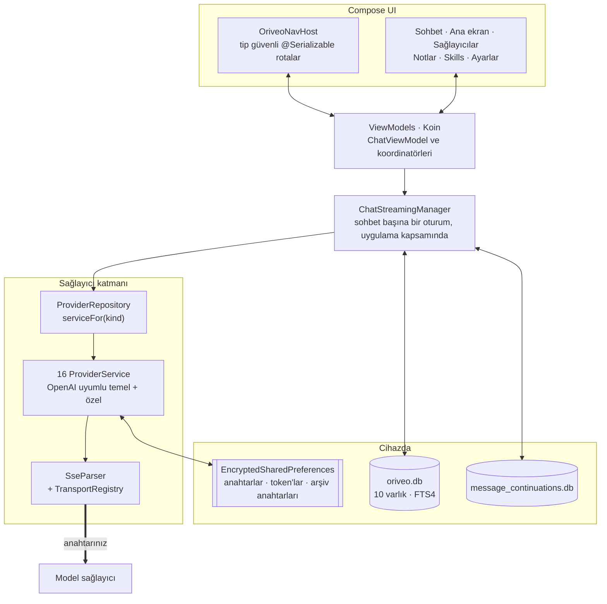

<div align="center">

# Android için Oriveo

**Zaten parasını ödediğiniz yapay zekâ modelleri için yerel bir Jetpack Compose sohbet istemcisi.**

<a href="../../LICENSE"></a>


<sub>

<a href="../../android/README.md">English</a> ·
<a href="../ar/android.md">العربية</a> ·
<a href="../de/android.md">Deutsch</a> ·
<a href="../es/android.md">Español</a> ·
<a href="../fr/android.md">Français</a> ·
<a href="../hi/android.md">हिन्दी</a> ·
<a href="../id/android.md">Indonesia</a> ·
<a href="../ja/android.md">日本語</a> ·
<a href="../ko/android.md">한국어</a> ·
<a href="../pt-BR/android.md">Português</a> ·
<a href="../ru/android.md">Русский</a> ·
<a href="../th/android.md">ไทย</a> ·
**Türkçe** ·
<a href="../vi/android.md">Tiếng Việt</a> ·
<a href="../zh-Hans/android.md">简体中文</a> ·
<a href="../zh-Hant/android.md">繁體中文</a>

</sub>

</div>

---

Oriveo Android istemcisi, kendi anahtarınızı getirdiğiniz bir yapay zekâ sohbet uygulamasıdır. Zaten
sahip olduğunuz API anahtarlarını eklersiniz, uygulama da her sağlayıcıyla doğrudan telefondan
konuşur. Sohbetler, notlar, klasörler ve skill'ler cihazda Room içinde saklanır; API anahtarları,
Android Keystore'da tutulan bir anahtarla şifrelenir. Hesap da yok, giriş de.

Bu, [Oriveo Community Edition](README.md)'ın bir parçasıdır — bir model sağlayıcısıyla nasıl
konuşulacağına dair tek bir tanımı paylaşan üç istemci.

## Mimari



Bu diyagramdaki üç şey rastgele oluşmuş yapı değil, bilinçli tasarım kararlarıdır.

**Akış, ekranın üstünde yaşar.** `ChatStreamingManager`, bir `ConcurrentHashMap` içinde sohbet
kimliği başına bir `StreamingSession` tutar; her birinin kendi uygulama kapsamlı
`CoroutineScope(SupervisorJob() + Dispatchers.IO)` nesnesi vardır. Bir sohbetten çıkmak yanıtı iptal
etmez ve `StreamingTokenBuffer` kısmi metni düzenli aralıklarla SQLite'a yazar; böylece yanıtın
ortasında uygulamayı öldürmek, o ana kadar gelenleri kaybettirmez.

**Bir değil, iki veritabanı.** `oriveo.db`; sohbetleri, mesajları, ekleri, notları, klasörleri,
skill'leri ve model kataloğu önbelleğini tutar. `message_continuations.db` ise sağlayıcıya ait
opak devam durumunu tutan, fiziksel olarak ayrı bir dosyadır — tam olarak `backup_rules.xml` ve
`data_extraction_rules.xml` onu bulut yedeğinin ve cihaz aktarımının dışında bırakabilsin diye. Başka
bir cihaza geri yüklenmiş bir devam token'ı en iyi ihtimalle anlamsızdır.

**İkiliden yeni bir katalog bozulmaz, yalnızca geriler.** `TransportKind`, hoşgörülü bir
deserializer'a sahip kapalı bir enum'dur: bilinmeyen bir transport dizgesi `null` olarak çözülür,
`TransportRegistry` strateji döndürmez ve model seçiciden filtrelenir. Alternatif — katı bir enum —
katalogun tamamının ayrıştırılmasını düşürür ve diğer bütün modelleri de beraberinde götürürdü.

## Bir modelin neye izni var

İstemci, bir modelin yeteneklerini adından asla tahmin etmez. Katalogdan bir yetenek çalışma zamanı
okur: belirli bir sağlayıcı, transport ve yetenek için isteğe tam olarak hangi JSON pointer'ların
yazılacağını anlatan reçeteler. `ProviderRecipeRequestCompiler`, reçeteyi kendine ait bir gövde
delta'sına derlemeden önce sağlayıcı, yetenek ve transport ile uyumunu doğrular; uymuyorsa kimsenin
gözden geçirmediği bir isteği sessizce üretmek yerine adı konmuş bir gerekçeyle reddeder
(`recipe_not_found`, `transport_mismatch`, `model_route_must_not_patch_body`).

Dönüşte `CapabilityEvidenceFacade`, bir yetenek hakkında gerçekte bilinenleri kaynağa göre sıralar —
`operator_override` > `server_typed` > `server_profile` > `model_facts` > `relay_verification` >
`relay_declaration` > `legacy_metadata`. Bir yeteneği *observed* olarak yalnızca akış ayrıştırıcısı
işaretleyebilir; niyet, reçeteler, HTTP 200 ve bir tool bildirimi açıkça sayılmaz. Mesaj başına sonuç
kalıcı olarak saklanır; böylece arayüz *istenen* ile *doğrulanan* arasında ayrım yapabilir.

Geçersiz kılmalar, yedi kapsam boyunca son yazan kazanır kuralıyla, şu öncelik sırasıyla çözülür:
`single_send` > `conversation_connection_model` > `skill_agent` > `connection_model` > `connection` >
`provider_recipe` > `provider_default`.

## Depolama ve sırlar

| Ne | Nerede |
|---|---|
| Sohbetler, mesajlar, ekler, notlar, klasörler, skill'ler | Room, `oriveo.db` |
| Notlar üzerinde tam metin arama | FTS4 sanal tablosu |
| Model kataloğu önbelleği | `oriveo.db` içinde tek bir satır, parça parça geri okunur |
| Sağlayıcı devam durumu | `message_continuations.db`, yedeğin dışında |
| Sağlayıcı API anahtarları | `EncryptedSharedPreferences`, AES-256-GCM, ana anahtar Keystore'da |
| Abonelik OAuth token'ları | ikinci, ayrı bir şifreli tercihler dosyası |
| Yedek arşivi anahtarları | üçüncüsü |
| Ek blob'ları | diskteki dosyalar, id ile referanslanır |

Üç şifreli tercihler dosyası, kolaylık olsun diye birleştirilmek yerine ömürlerine ve etki
yarıçaplarına göre ayrılmıştır. Her birinin bir kurtarma yolu vardır: bozuk bir dosya
(`AEADBadTagException`, `VERIFICATION_FAILED`) tespit edilir, silinir ve yeniden oluşturulur; her
açılışta uygulamayı çökertmek yerine.

Üçü de, devam veritabanıyla birlikte, Android bulut yedeğinin ve cihaz aktarımının dışında
tutulur. Bu bir gözden kaçırma değil, onları Keystore'a bağlamanın doğal sonucudur — şifreli metin
yeni cihazda zaten çözülemezdi. **Yeni bir telefona geçtikten sonra API anahtarlarınızı yeniden
girer ve varsa sağlayıcı aboneliklerinize yeniden giriş yaparsınız**; sohbetler ve notlar normal
şekilde gelir.

Kendiniz dışa aktardığınız yedek arşivleri ayrıca şifrelenir: sizin seçtiğiniz bir parolayla,
600.000 yinelemeli PBKDF2-HMAC-SHA256 ve AES-GCM kullanılarak.

## Kendi ağınızdaki bir model sunucusuna erişmek

Manifest `android:usesCleartextTraffic="true"` ayarını bilinçli olarak yapar: yerel model
sunucuları — llama.cpp, Ollama, LM Studio, vLLM — kendi makinenizde ya da yerel ağınızda düz HTTP
konuşur ve genellikle sertifikaları yoktur.

Asıl sınır manifest'te değil kodda; başka türlü de olamazdı. `RelayEndpointPolicy` sunucu adını
çözer, çözülen adreslerin **hepsinin** özel olmasını şart koşar (loopback, RFC 1918, link-local,
unique-local ve VPN kipinde CGNAT aralığı), genel ve özel adreslerin karışımına çözülen bir sunucuyu
reddeder, çözülen adres kümesini DNS rebinding'e karşı sabitler ve gönderim anında yeniden doğrular,
kimlik bilgisi taşıyan hiçbir düz metin isteğine izin vermez ve origin değiştiren veya şema değiştiren
yönlendirmeleri engeller.

Bir Android network security config bu kümeyi ifade edemez: yalnızca sunucu adına göre eşleşir, adres
aralıkları için bir söz dizimi yoktur ve buradaki adresler çalışma zamanında kullanıcının kendi
ağından gelir. Ayrıca bir config kesinlikle daha zayıf kalırdı, çünkü bir adın hangi adrese
çözüldüğünü hiç görmez.

## Model kataloğu

Uygulama, bugün çıkan bir modelin uygulama güncellemesi olmadan çalışması için model yeteneklerini ve
fiyatlarını herkese açık bir katalogdan okur. Bu, kimlik bilgisi taşımayan ve tanımlayıcı
eklenmemiş düz bir HTTPS `GET`'tir; sohbet istekleri onun yakınından bile geçmez. Yalnızca iki
endpoint istenir:

```
GET {base}/api/metadata?view=lean
GET {base}/api/metadata/model-facts
```

Temel URL, varsayılanı `https://api.oriveoai.com` olan bir derleme zamanı özelliğidir:

```bash
./gradlew :app:assembleDebug -PORIVEO_METADATA_BASE_URL=https://your.host
```

Yanıtlar ETag ile yeniden doğrulanır ve `oriveo.db` içinde önbelleğe alınır; böylece bir çekme bir
kez başarılı olduktan sonra, katalog daha sonra erişilemez hâle geldiğinde uygulama önbellekteki
kopyayla çalışmaya devam eder.

> [!IMPORTANT]
> Boş bir değerle derlemek (`-PORIVEO_METADATA_BASE_URL=`) katalog çekmeyi tamamen kapatır ve
> **APK'nın içinde paketlenmiş bir anlık görüntü yoktur**. Böyle bir derlemenin temiz kurulumunda:
>
> - 15 yerleşik sağlayıcının hiçbiri model listesi alamaz ve uygulama sağlayıcıdan liste istemez —
>   tek kaynak katalogdur;
> - hata **sessizdir**. Anahtar eklemek yine başarılı olduğunu bildirir, model seçici ise hiçbir
>   açıklama olmadan boş kalır;
> - **OpenAI kullanılamaz hâle gelir**, çünkü o sağlayıcı için elle model girişi engellidir;
> - Relay endpoint'leri ve yerel model sunucuları tam olarak çalışmayı sürdürür ve bozulmayan tek
>   yol onlardır.
>
> Çevrimdışı bir derleme istiyorsanız, değeri boşaltmak yerine kataloğu kendiniz sunun ve derlemeyi
> ona yönlendirin.

## Proje yapısı

```
android/
  app/src/main/java/ai/oriveo/community/
    core/
      provider/    every provider service, transports, relay, capability recipes
      data/        Room entities, DAOs, repositories, backup, catalog client
      model/       domain models and the capability/preference resolvers
      attachments/ routing, budgets, per-format text extraction
      security/    SecureKeyStore, BackupCrypto, external-URL policy
      streaming/   ChatStreamingManager
      navigation/  AppRoute, OriveoNavHost
    feature/       one package per screen
    ui/            shared components, Markdown + LaTeX renderer, theme
    di/            Koin modules
  benchmark/       macrobenchmark suite (cold start, model picker)
```

## Derleme

Gereksinimler: **JDK 17 veya sonrası** ve Android SDK. Derleme AGP 9.3, Gradle 9.5 ve Kotlin 2.3
kullanır; dolayısıyla Android Studio AGP 9.3'ü senkronize edebilen bir sürüm olmalıdır. Komut
satırından yalnızca JDK ve SDK yeterlidir.

```bash
./gradlew :app:assembleDebug
./gradlew :app:testDebugUnitTest
```

Derleme `minSdk 26`, `targetSdk 36`, `compileSdk 37` hedefler. `local.properties` (SDK yolunuz)
Android Studio tarafından üretilir ve depoya işlenmez. Yayın imzalaması
[SIGNING.md](../../android/SIGNING.md) içinde anlatılır.

> [!NOTE]
> Gradle daemon'ı bir Java 21 toolchain'i üzerinde çalışır (`gradle/gradle-daemon-jvm.properties`)
> ve eşleşme tam olarak 21 iledir, "21 veya daha yenisi" ile değil. Başka herhangi bir JDK kuruluysa
> Gradle ilk derlemede kendisi için bir JDK 21 indirir ve bunun için ağ erişimi gerekir; JDK 21'i
> kendiniz kurarsanız bu indirme olmaz. `org.gradle.java.installations.auto-download=false`
> ayarladıysanız bu indirme gerçekleşemez ve derleme
> `Toolchain auto-provisioning is not enabled.` hatasıyla başarısız olur — tek başına JDK 17'nin
> gerçekten yetmediği tek durum budur. Derleme her hâlükârda Java 17'yi hedefler.

Birim testi paralelliği sabit bir sayı yerine makinenin CPU sayısı ve fiziksel belleğinden türetilir;
böylece test paketi hem bir dizüstünde hem de büyük bir iş istasyonunda makul davranır.

## Bağımlılıklar

| Kütüphane | Sürüm | Ne için |
|---|---|---|
| Jetpack Compose BOM | 2026.08.00 | UI, Material 3 |
| Room | 2.8.4 | SQLite, DAO'lar, FTS4 |
| Koin | 4.2.2 | bağımlılık enjeksiyonu |
| Ktor client (OkHttp motoru) | 3.5.2 | sağlayıcı HTTP ve SSE |
| kotlinx.serialization | 1.11.0 | JSON |
| navigation-compose | 2.9.6 | tip güvenli rotalar |
| androidx.security-crypto | 1.1.0 | `EncryptedSharedPreferences` |
| haze | 1.7.3 | arka plan bulanıklığı |
| PDFBox-Android, jsoup | 2.0.27.0, 1.23.2 | eklerden metin çıkarma |
| jlatexmath-android | 0.2.0 | LaTeX render'ı |

Tam sürümler [`gradle/libs.versions.toml`](../../android/gradle/libs.versions.toml) içinde
sabitlenmiştir.

## Testler

```bash
./gradlew :app:testDebugUnitTest
```

319 dosyada yaklaşık 3.000 birim testi; JUnit 4, MockK, Turbine, `kotlinx-coroutines-test` ve
Ktor'un mock engine'i ile. Kapsam, hataların en pahalıya patladığı yerlerde en yoğundur: sağlayıcı
başına istek biçimi, SSE ayrıştırma, transport seçimi, relay sondalama ve güvenlik kipleri, yetenek
reçetesi yürütme, katalog önbellekleme ve sözleşme sürümü işleme, Room kalıcılığı ve yedekleme
gidiş-dönüşleri.

> [!IMPORTANT]
> Yaklaşık 38 test paketi, çalışma dizininden yukarı çıkarak `shared/` içinden sözleşme fixture'ları
> yükler; dolayısıyla **testler yalnızca deponun tamamı elinizdeyken geçer** — tek başına `android/`
> klasörünü dışarı kopyalamak işe yaramaz.

Ayrıca üç enstrümanlı test vardır — bir yerel motor yayın matrisi, bir düz metin soket testi ve bir
keystore yalıtım testi. Bunlar kendi kendine yeterli değildir: yerel motor testleri, ağınızda
gerçekten çalışan bir model sunucusunu adlandıran enstrümantasyon argümanlarına ihtiyaç duyar, bu
yüzden `connectedAndroidTest` kutudan çıktığı gibi geçmez. Pull request için kapı, birim test
paketidir.

`:benchmark` modülü, soğuk açılış ve model seçici için makrobenchmark'ları barındırır.
Kendi kendini enstrümante eden `com.android.test` kullanan ayrı bir Gradle modülüdür ve `:app`
modülünün özel `benchmark` derleme tipini sürer.

Her iki veritabanı da `version = 1` düzeyindedir ve henüz migration yoktur; şemalar
`app/schemas/` altına dışa aktarılır ve depoya işlenir — ilk migration'ın `2.json` dosyası da oraya
düşecektir.

## Yerelleştirme

On altı dil: `values/` (kaynak dil İngilizce) artı on beş `values-*` dizini, her birinde yaklaşık
1.700 metin ve her dilde birebir aynı anahtar kümesi. Uygulama içi dil değiştirme
`AppLanguageManager` ve `android:localeConfig` üzerinden yürür. Bundle'da dil bölmeleri kapalıdır;
böylece tek bir artefakt bütün çevirileri taşır.

## Katkıda bulunma

Bkz. [CONTRIBUTING.md](../../CONTRIBUTING.md). Projenin çalışma dili İngilizcedir: kaynak kod,
yorumlar, testler ve commit mesajları. Arayüz metinleri çevrilir — yeni bir metni önce `values/`
içine ekleyin, diğer diller sonra gelsin. Pull request açmadan önce birim testlerini çalıştırın.

## Lisans

[AGPL-3.0-or-later](../../LICENSE).
