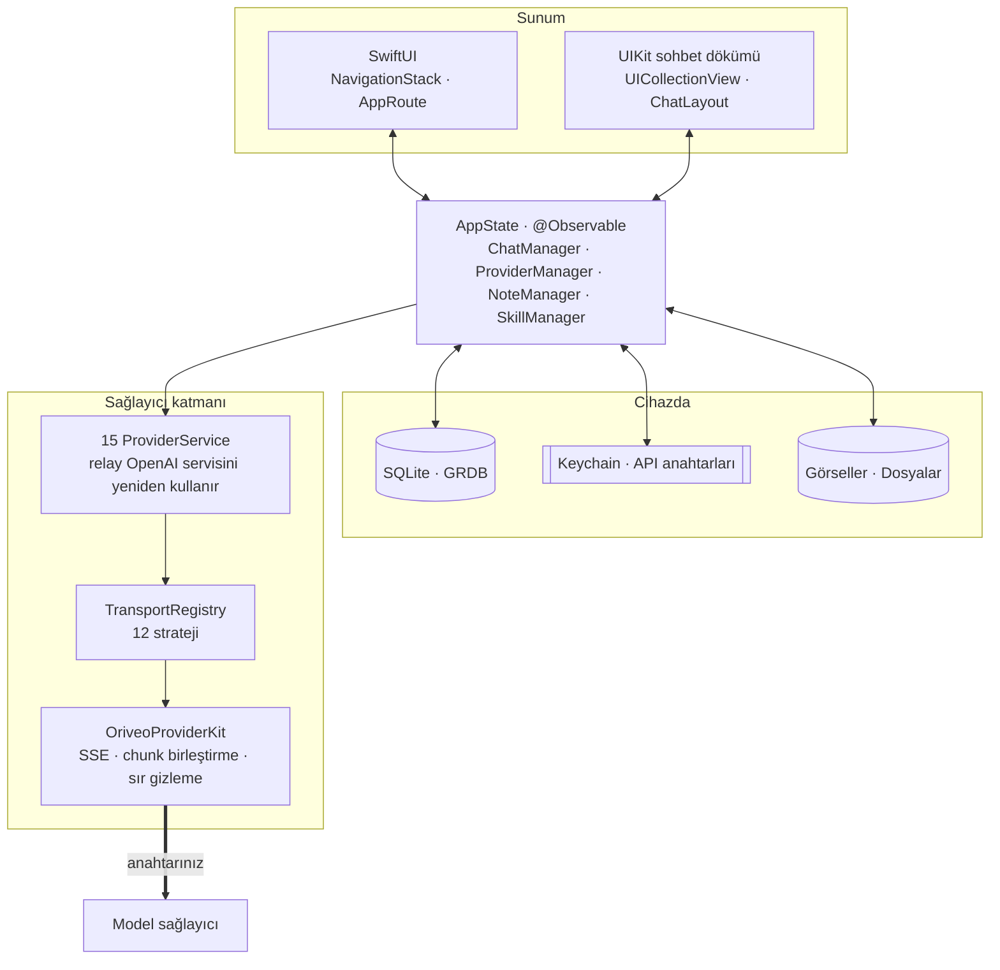
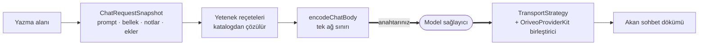

<div align="center">

# iOS için Oriveo

**Zaten parasını ödediğiniz yapay zekâ modelleri için yerel bir SwiftUI sohbet istemcisi.**

<a href="../../LICENSE"></a>


<sub>

<a href="../../ios/README.md">English</a> ·
<a href="../ar/ios.md">العربية</a> ·
<a href="../de/ios.md">Deutsch</a> ·
<a href="../es/ios.md">Español</a> ·
<a href="../fr/ios.md">Français</a> ·
<a href="../hi/ios.md">हिन्दी</a> ·
<a href="../id/ios.md">Indonesia</a> ·
<a href="../ja/ios.md">日本語</a> ·
<a href="../ko/ios.md">한국어</a> ·
<a href="../pt-BR/ios.md">Português</a> ·
<a href="../ru/ios.md">Русский</a> ·
<a href="../th/ios.md">ไทย</a> ·
**Türkçe** ·
<a href="../vi/ios.md">Tiếng Việt</a> ·
<a href="../zh-Hans/ios.md">简体中文</a> ·
<a href="../zh-Hant/ios.md">繁體中文</a>

</sub>

</div>

---

Oriveo iOS istemcisi, kendi anahtarınızı getirdiğiniz bir yapay zekâ sohbet uygulamasıdır. Zaten
sahip olduğunuz API anahtarlarını eklersiniz, uygulama da her sağlayıcıyı doğrudan telefondan
çağırır. Sohbetler, mesajlar, notlar ve not klasörleri cihaz üzerindeki bir SQLite veritabanında
yaşar; ek blob'ları onun yanındaki dosyalardır; yetenekler, tercihler, sağlayıcı listesi ve sohbet
klasörleri ise cihaz üzerinde JSON'dur. API anahtarları iOS Keychain'e gider.

Oriveo hesabı yok: hiçbir şey yüklenmez ve giriş yapılacak bir yer de yok. İki sağlayıcı, anahtar
yapıştırmak yerine zaten sahip olduğunuz bir abonelikle giriş yapmayı gerçekten sunuyor — ChatGPT ve
Grok — ve o giriş OpenAI ile xAI'ye gider, bize değil.

Bu, [Oriveo Community Edition](README.md)'ın bir parçasıdır — bir model sağlayıcısıyla nasıl
konuşulacağına dair tek bir tanımı paylaşan üç istemci.

## Mimari



Bu diyagramla ilgili üç şeyi açıkça söylemekte fayda var.

**Sohbet dökümü UIKit, gerisi SwiftUI.** `ChatView`, [ChatLayout](https://github.com/ekazaev/ChatLayout)
tarafından sürülen bir `UICollectionView`'ın etrafına bir
`ChatListViewControllerRepresentable` gömer. Geri kalan her şey — gezinme, ayarlar, sağlayıcı
kurulumu, notlar, yetenekler — SwiftUI'dır. Bu ayrım var, çünkü token hızında akan bir sohbet dökümü
ölçüm ve yeniden kullanım üzerinde hücre düzeyinde denetim ister; SwiftUI'ın diffing'i bunu vermez.
Sınırı [`Features/Chat/ARCHITECTURE.md`](../../ios/Oriveo/Oriveo/Features/Chat/ARCHITECTURE.md)
belgeliyor.

**Bu dökümü üç ayrı yol günceller** ve bu bilinçlidir:

| Yol | Ne taşır | Neden |
|---|---|---|
| `@Observable AppState` | yapısal değişiklikler — bir mesaj belirir, sohbet değişir | SwiftUI'a doğal, düşük frekanslı olaylar için ucuz |
| GRDB `ValueObservation` | SQLite'tan geri okunan kalıcı durum | yazmadan sonra tek doğruluk kaynağı, yeniden başlatmayı atlatır |
| Sohbet başına Combine `PassthroughSubject` | akan metin ve akıl yürütme delta'ları | token hızında SwiftUI diffing'ini tümüyle atlar |

**Sağlayıcı desteği tek bir enum değil, dört bağımsız eksendir.** `ProviderKind` (16 durum: on beş sağlayıcı
artı relay) *kullanıcının neyi yapılandırdığıdır*. `ProviderServiceProtocol` *çağrı yüzeyidir*. `TransportKind`
(12 durum) *gerçekte hangi ağ protokolünün konuşulduğudur* — ve **model başına, katalogdan** çözülür,
yani aynı anahtarın arkasındaki iki model birbiriyle anlaşmayabilir. `RelayKind`, kullanıcının
verdiği endpoint'leri kapsar. Yeni bir modelin yeni bir derleme olmadan çalışabilmesi, tam da bu
dördünün ayrı tutulmasından gelir.

### Bir mesaj nasıl gönderilir



`BaseAPIService.encodeChatBody`, OpenAI uyumlu bir isteğin bayta dönüşmeden önceki son durağıdır —
on altı durumun on ikisi buradan geçer, dolayısıyla bir yetenek reçetesi, üretim parametresi ya
da özel alan on iki yerde değil tek bir yerde test edilebilir. OpenAI, Anthropic ve Gemini kendi
biçimlerini konuşur ve kendi servislerinde serileştirir; o noktaların her biri kendi istek-biçimi
test paketiyle kapsanır.

## Bir modelin neye izni var

İstemci, bir modelin yeteneklerini adından asla tahmin etmez. Bir **yetenek çalışma zamanı** okur —
belirli bir sağlayıcı, transport ve yetenek için isteğe tam olarak hangi JSON pointer'ların
yazılacağını anlatan reçeteler kümesi. Bu reçeteler
[`shared/capabilityrecipe`](../../shared/capabilityrecipe/) içinde durur ve
`CapabilityRecipeRequestCompiler` tarafından uygulanır.

Dönüş yolunda `CapabilityExecutionRuntime` gerçekte ne olduğunu kaydeder. Bir yeteneği *observed*
seviyesine yalnızca seçili bir üretim akış ayrıştırıcısı yükseltebilir. HTTP 200, boş olmayan bir
yanıt ve istekteki bir tool bildirimi açıkça kanıt **değildir**. Nihai durum mesaj başına saklanır;
böylece arayüz, bir denetimin istendiğini ama hiç doğrulanmadığını söyleyebilir, sessizce işe
yaramış gibi göstermez.

## Depolama

```
Application Support/Oriveo/
  active-uid                     # storage partition, "guest" by default
  users/<uid>/
    oriveo.sqlite                # conversations, messages, notes and folders, catalog cache
    Images/  Files/              # attachment blobs, referenced by id
    session-snapshot.json        # preferences, provider list, folders, last used model
```

- **GRDB üzerinden SQLite**; WAL açık, foreign key'ler açık ve her şema değişikliğini kapsayan bir
  `DatabaseMigrator` ile. Mesajlar ve notlar üzerindeki tam metin arama, trigram tokenizer'lı FTS5
  kullanır.
- **API anahtarları Keychain'de yaşar**, sağlayıcı ve bölüm anahtarlarıyla saklanır ve oturum
  anlık görüntüsü yazılmadan önce oradan temizlenir. Yetenekler ayrı olarak, `UserDefaults` içinde
  JSON olarak saklanır.
- **Ek blob'ları satır değil, diskteki dosyalardır**; böylece büyük bir PDF veritabanını asla
  şişirmez.

Bir yedek, `data.json` ile birlikte görsel dosyalarını taşıyan bir `.oriveo` ZIP'idir. İsteğe bağlı
parola arşivi şifrelemez: yalnızca içindeki sağlayıcı API anahtarlarını şifreler (AES-GCM, anahtar
600.000 tur PBKDF2-HMAC-SHA256 ile türetilir). Sohbetler, notlar, yetenekler ve tercihler her durumda
arşivde düz JSON olarak durur; yani bir yedek dosyasını, eline geçen herkesin okuyabileceği bir şey
olarak görün.

## Model kataloğu

Soğuk açılışta uygulama, `https://api.oriveoai.com/api/metadata?view=lean` adresine kimlik
doğrulamasız ve ETag koşullu bir `GET` isteği yapar. Bu istek herkese açık model kataloğunu çeker:
hangi modeller var, her biri neyi destekliyor, akıl yürütme denetimleri nasıl adlandırılmış ve
maliyeti ne. Ne anahtar, ne sohbet, ne de tanımlayıcı eklenir; yanıt SQLite'ta önbelleğe alınır,
böylece katalog erişilemez olduğunda uygulama önbellekteki kopyayla çalışır. İkinci bir endpoint,
`/api/metadata/model-facts`, yalnızca bir ChatGPT veya Grok aboneliğiyle giriş yaptıktan sonra
okunur; o aboneliğin modellerinin neler yapabildiğini öğrenmek için.

Uygulamanın kendi adına yaptığı istekler bunlardır. Geri kalan her şey, sizin yapılandırdığınız bir
sağlayıcıya, sizin anahtarınızla gider.

Kataloğu kendi sunucunuza yönlendirmek bir **Debug derlemesi kolaylığıdır** ve
`Oriveo/Core/Providers/BackendURLResolver.swift` içinde şu sırayla çözülür:

1. scheme'in Run action'ında ayarlanan `ORIVEO_METADATA_BASE_URL` ortam değişkeni; sonra
2. `ios/Oriveo/Config/Info.plist` içindeki `ORIVEO_METADATA_BASE_URL` dizesi — anahtar zaten orada ve
   boş, yani doldurmanız yeterli; sonra
3. `https://api.oriveoai.com`.

Bilinmesi gereken iki şey var. Bir Release derlemesi ikisini de yok sayar ve her zaman yayınlanmış
kataloğu kullanır; bunu değiştirmek `BackendURLResolver`'ı düzenlemek demektir. Ayrıca test bundle'ı
çalışırken veya `CI=true` ile, özel bir adresi (localhost, `10/8`, `192.168/16`, `172.16/12`,
`.local`, link-local IPv6) gösteren bir geçersiz kılma yok sayılır; böylece geride kalmış bir yerel
sunucu, test paketini o an hangi makinenin başında oturuyorsanız ona bağımlı kılamaz.

## Proje yapısı

```
ios/Oriveo/
  Config/Info.plist    the app's Info.plist; GENERATE_INFOPLIST_FILE is off
  Oriveo.xcodeproj/
  Oriveo/
    Core/
      Providers/       15 provider services, transports, capability runtime, catalog client
      State/           AppState and the managers it owns
      Database/        GRDB pool, schema, migrator, stores, observations
      Models/          domain types
      Attachments/     import limits, budgets, per-format text extraction
      Tools/           tool-call loop and per-protocol adapters
      Cache/ Localization/ Observability/ Reachability/ Routing/ Usage/
    Features/
      App/             root view and tab shell
      Chat/            transcript, composer, model controls, cross-check, export
      Providers/       setup, detail, relay, local engines, subscription sign-in
      Home/ Notes/ Skills/ Settings/ Backup/ Onboarding/
    Shared/Components/ shared views
    DesignSystem/      theme, colour, haptics
    Preview/           sample data for SwiftUI previews
    *.xcstrings        ten string catalogs
    Assets.xcassets · PrivacyInfo.xcprivacy · Oriveo.entitlements
  OriveoTests/
```

## Derleme ve çalıştırma

**Xcode 26**'ya, donanımda çalıştırmak için de **iOS 18 veya sonrasını** çalıştıran bir cihaza
ihtiyacınız var. Ücretsiz bir Apple Developer hesabı yeterlidir: entitlements dosyası boştur ve
uygulama ücretli hiçbir capability kullanmaz — push yok, iCloud yok, app group yok, associated
domain yok.

Proje biçiminin ve Swift tools sürümünün fiilen dayattığı alt sınır Xcode 16.3'tür, ama target
`SWIFT_APPROACHABLE_CONCURRENCY` ve `SWIFT_DEFAULT_ACTOR_ISOLATION = MainActor` ayarlarını yapar ve
daha eski Xcode sürümleri bunları söylemeden yok sayar. Actor izolasyonunun sessizce değişmesi bunu
öğrenmenin kötü bir yoludur; o yüzden Xcode 26 ile derleyin.

1. `ios/Oriveo/Oriveo.xcodeproj` dosyasını açın
2. `Oriveo` scheme'ini seçin
3. **Signing & Capabilities** altında kendi Team'inizi seçin
4. Xcode `ai.oriveo.community` kaydını yapamıyorsa, bundle identifier'ı ekibinizin sahip olduğu bir
   değerle değiştirin
5. iPhone'unuzu bağlayın, Geliştirici Modu'nu açın, bilgisayara güvenin ve çalıştırın

Bunun yerine Simulator için derlemek isterseniz herhangi bir iPhone simülatörünü seçip çalıştırın.
Paket bağımlılıkları, depoya işlenmiş `Package.resolved` dosyasından çözülür.

**Apple silicon bir Mac'te** iPhone derlemesi doğal olarak da çalışır: **My Mac (Designed for iPad)**
hedefini seçin. Mac Catalyst etkin değildir — proje hiçbir zaman ona dahil olmaz ve
`TARGETED_DEVICE_FAMILY` `1,2` olarak kalır — yani bu bir Mac uygulaması değil, iPad uyumluluk
çalışma zamanı altındaki iOS uygulamasıdır ve kamera çekimi gibi yalnızca cihazda olan yollar, bir
Mac'te nasıl davranıyorlarsa öyle davranır.

Proje dosyası, dosya sistemiyle senkron gruplar ve `objectVersion = 77` kullanır; bu yüzden daha eski
bir Xcode dosyayı açmayı reddedebilir. Proje biçimini düzenlemek yerine Xcode'u güncelleyin.

> [!NOTE]
> Uygulama target'ı Swift 5 dil kipinde derlenir; yerel `OriveoProviderKit` paketi
> `swift-tools-version: 6.1` bildirir ve Swift 6 dil kipinde derlenir.

## Bağımlılıklar

| Paket | Sürüm | Ne için |
|---|---|---|
| [GRDB.swift](https://github.com/groue/GRDB.swift) | 7.11.1 | SQLite erişimi, migration'lar, `ValueObservation` |
| [ChatLayout](https://github.com/ekazaev/ChatLayout) | 2.4.3 | sohbet dökümünün collection view yerleşimi |
| [swift-markdown-ui](https://github.com/gonzalezreal/swift-markdown-ui) | 2.4.1 | Markdown render'ı |
| [SwiftMath](https://github.com/mgriebling/SwiftMath) | 1.7.3 | LaTeX render'ı |
| [ZIPFoundation](https://github.com/weichsel/ZIPFoundation) | 0.9.20 | yedek arşivleri, Office/EPUB/ODF çıkarımı |
| `OriveoProviderKit` | yerel | sağlayıcı ağ çekirdeği, [`shared/`](shared.md) içinde |

`Package.resolved`, swift-markdown-ui'ın getirdiği iki geçişli bağımlılığı da sabitler:
[NetworkImage](https://github.com/gonzalezreal/NetworkImage) 6.0.1 ve
[swift-cmark](https://github.com/swiftlang/swift-cmark) 0.8.0. Her doğrudan bağımlılık MIT
lisanslıdır, swift-cmark ise BSD-2-Clause; hepsi AGPL-3.0-or-later ile uyumlu.

## Testler

Xcode'da `Oriveo` scheme'inin test action'ını (⌘U) çalıştırın veya depo kökünden:

```bash
xcodebuild test -project ios/Oriveo/Oriveo.xcodeproj -scheme Oriveo \
  -destination 'platform=iOS Simulator,name=iPhone 16'
```

Gerçekten sahip olduğunuz bir simülatörü yazın; aynı proje ve scheme ile
`xcodebuild -showdestinations`, bu checkout'un derleyebileceği her şeyi listeler.

> [!IMPORTANT]
> Test target'ı, `#filePath` konumundan yukarı doğru çıkarak `shared/` dizinini bulur ve sözleşme
> fixture'larını oradan okur; dolayısıyla **testler yalnızca deponun tamamı elinizdeyken geçer** —
> tek başına `ios/` klasörünü dışarı kopyalamak işe yaramaz.

Test paketi geniş: 275 dosyada yaklaşık 2.900 [Swift
Testing](https://github.com/swiftlang/swift-testing) vakası ve 76 XCTest vakası. Sağlayıcı başına
istek biçimini, kaydedilmiş upstream SSE yeniden oynatımını, relay ve yerel motor politikasını,
sohbet dökümü ölçümünü ve akış davranışını, depolamayı ve yedekleme gidiş-dönüşlerini kapsar.

`shared/OriveoProviderKit`'in kendi test paketi vardır:

```bash
cd shared/OriveoProviderKit && swift test
```

## Yerelleştirme

On altı dil, Xcode String Catalog (`.xcstrings`) olarak saklanıyor — on katalog, yaklaşık 1.340
anahtar, kaynak dil İngilizce. `shouldTranslate: false` işaretli birkaçı dışında her anahtar on altı
dile de çevrilmiştir: ürün adı, noktalama, biçim iskeletleri ve yerelleştirilmesi yanlış olacak
protokol değerleri. Metinler, kullanıcının uygulama içi dil ayarına göre seçilen bir `.lproj`
bundle'ı üzerinden `L10n.tr(_:table:)` ile çözülür; bu yüzden dil değiştirmek uygulamayı yeniden
başlatmadan etkili olur. Arapça için sağdan sola yerleşim açıkça ele alınır.

## Katkıda bulunma

Bkz. [CONTRIBUTING.md](../../CONTRIBUTING.md). Davranış değişikliğiyle birlikte bir test ekleyin;
sağlayıcı protokolü düzeltmelerinde elle yazılmış bir mock yerine `shared/test-fixtures` altındaki
kayıtlı bir fixture'ı tercih edin ve hangi sağlayıcı ile hangi modele karşı test ettiğinizi belirtin.

## Lisans

[AGPL-3.0-or-later](../../LICENSE).
