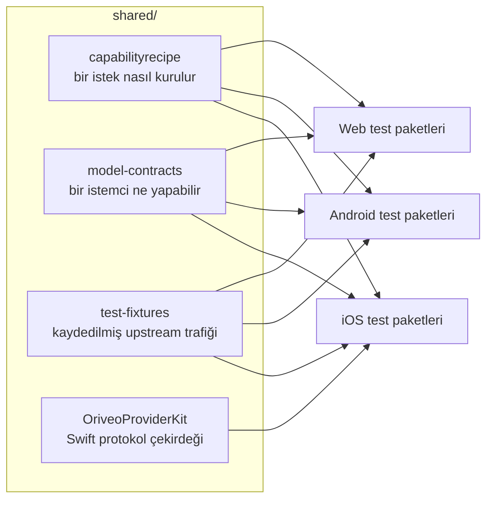

<div align="center">

# Ortak sözleşmeler

**Bir model sağlayıcısıyla nasıl konuşulacağının tek bir tanımı, üç istemcinin de doğruladığı.**

<a href="../../LICENSE"></a>


<sub>

<a href="../../shared/README.md">English</a> ·
<a href="../ar/shared.md">العربية</a> ·
<a href="../de/shared.md">Deutsch</a> ·
<a href="../es/shared.md">Español</a> ·
<a href="../fr/shared.md">Français</a> ·
<a href="../hi/shared.md">हिन्दी</a> ·
<a href="../id/shared.md">Indonesia</a> ·
<a href="../ja/shared.md">日本語</a> ·
<a href="../ko/shared.md">한국어</a> ·
<a href="../pt-BR/shared.md">Português</a> ·
<a href="../ru/shared.md">Русский</a> ·
<a href="../th/shared.md">ไทย</a> ·
**Türkçe** ·
<a href="../vi/shared.md">Tiếng Việt</a> ·
<a href="../zh-Hans/shared.md">简体中文</a> ·
<a href="../zh-Hant/shared.md">繁體中文</a>

</sub>

</div>

---

"Sağlayıcıyı çağır" işini her biri kendi başına uygulayan üç istemci zamanla birbirinden uzaklaşır.
Sessizce uzaklaşırlar, en son kimin test ettiği istemcinin yönüne doğru; ve bu kayma, bir platformda
tekrarlanan, diğerlerinde tekrarlanmayan bir hata olarak yüzeye çıkar.

`shared/` bunun cevabıdır: davranış bir kez veri olarak yazılır ve her istemcinin test paketi aynı
dosyalara karşı doğrulama yapar. Bir sağlayıcı tuhaflığı bir kez düzeltilir. Bir sözleşme değişikliği,
iki platformda yayına çıkıp üçüncüsünü kırmak yerine üç test paketini aynı anda düşürür.



## capabilityrecipe

Reçete kaydı. Belirli bir sağlayıcı, transport ve yetenek için — web araması, akıl yürütme çabası,
görsel üretimi — giden isteğe tam olarak hangi JSON pointer'ların yazılacağını ve yanıtın nasıl geri
okunacağını söyler.

Bugün çıkan bir modelin istemci güncellemesi olmadan çalışmasını sağlayan budur; hiçbir istemcinin
bir yeteneği model adından tahmin etmemesinin nedeni de budur. Reçetelerin kendisi
`capability_runtime.v1.json` içinde taşınır; `capability_result_definitions.v1.json` ve
`capability_custom_controls.v2.json` ise sonuçların ve kullanıcıya görünen denetimlerin nasıl
yorumlanacağını tanımlar.

Her reçete bir `executionKind` bildirir — `request_overlay`, `server_tool`, `client_tool_loop`,
`endpoint_route`, `model_route` — ve her istemcinin derleyicisi, reçeteyi uygulamadan önce
sağlayıcı, yetenek ve transport ile eşleştiğini doğrular; eşleşmiyorsa kimsenin gözden geçirmediği
bir isteği göndermek yerine adı konmuş bir gerekçeyle reddeder.

## model-contracts

İstemciler arası davranışı sabitleyen JSON fixture'ları: belirli bir sağlayıcı ve yetenek için bir
isteğin nasıl görünmesi gerektiği, üretim parametrelerinin nasıl çözüldüğü ve geçersiz kılmaların
nasıl katmanlandığı, bir istemcinin hangi yetenek durumlarını sunabileceği ve model kataloğu ile
kanıtlarının nasıl tüketildiği.

Her istemcinin testleri bunları doğrudan yükler; dolayısıyla buradaki bir değişiklik aynı anda üç
istemcinin birden değişmesidir.

## test-fixtures

Altın test verisi: kaydedilmiş upstream tool call trafiği, relay yönlendirme ve keşif senaryoları,
model facts ve yetenek kanıtı anlık görüntüleri ve yerel motor senaryoları.

`.sse` dosyaları **gerçekten yakalanmış upstream trafiğidir** ve bayt bayt dokunulmadan bırakılır.
Elle yazılmış bir mock, sağlayıcının ne yaptığına dair inancınızı kodlar; kaydedilmiş bir akış ise
onun gerçekte ne yaptığını kodlar — o salı günü gönderdiği bozuk chunk dahil. Bir sağlayıcı protokolü
düzeltmesinin teste ihtiyacı olduğunda, bir kayıt bir mock'tan daha değerlidir.

## OriveoProviderKit

Sağlayıcı ağ protokolü çekirdeğini barındıran bir Swift paketi: SSE satır birleştirme,
OpenAI uyumlu chunk ayrıştırma, tool adı kodlama, kimlik bilgisi gizleme, upstream hata
sınıflandırma, thinking etiketi ayrıştırma, akış hâlinde JSON yolu çıkarma ve sağlayıcı başına
tuhaflık profilleri.

Kapsamı bilinçli olarak dar çizilmiştir. **İçeride:** yalnızca Foundation'a dayanan ağ bilgisi.
**Dışarıda:** uygulama modelleri, arayüz, veritabanı, telemetri, yerelleştirme. Her Apple istemcisi
onun etrafında ince bir bağlayıcı tutar; böylece ağ davranışının tam olarak tek bir uygulaması olur.

```bash
cd shared/OriveoProviderKit && swift build && swift test
```

- Platformlar: iOS 18+, macOS 15+ · `swift-tools-version: 6.1`
- `ProviderWireProfile`, tek bir OpenAI uyumlu birleştiricinin hâlâ ihtiyaç duyduğu, satıcıya özgü
  artık tuhaflıkları taşır — akıl yürütme metninin nereden geldiği, önbelleğe alınmış token
  sayılarının nerede durduğu, prompt token'larının önbellek isabetlerini zaten içerip içermediği.
  *Baytların nasıl geldiğini* tarif eder, *bir modelin ne yapabileceğini* asla; o, reçetelerin işidir.

## Bu dosyalar üzerinde çalışmak

Buradaki bir değişiklik, her istemcide bir değişikliktir. Yalnızca içinde çalıştığınız istemcinin
değil, dokunduğunuz dosyayı okuyan her istemcinin sözleşme test paketlerini çalıştırın:

```bash
cd web && npm run test:run
cd shared/OriveoProviderKit && swift test
# plus the iOS and Android suites — see their READMEs
```

Hem iOS hem de Android test paketleri bu dizini, test dosyasından yukarı çıkıp `shared/` dizinini
bulana kadar arayarak konumlandırır; web test paketleri ise onu workspace'e göre çözer. Bu yüzden
hepsi deponun tam bir kopyasını gerektirir.

## Lisans

[AGPL-3.0-or-later](../../LICENSE).
