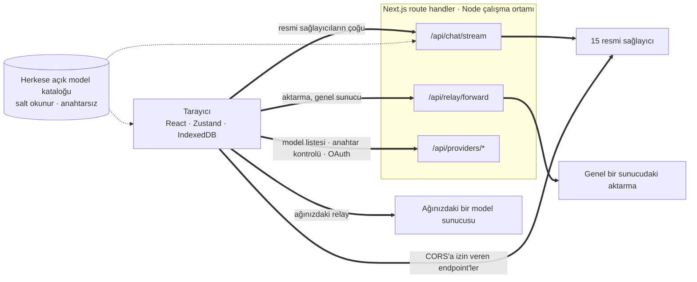
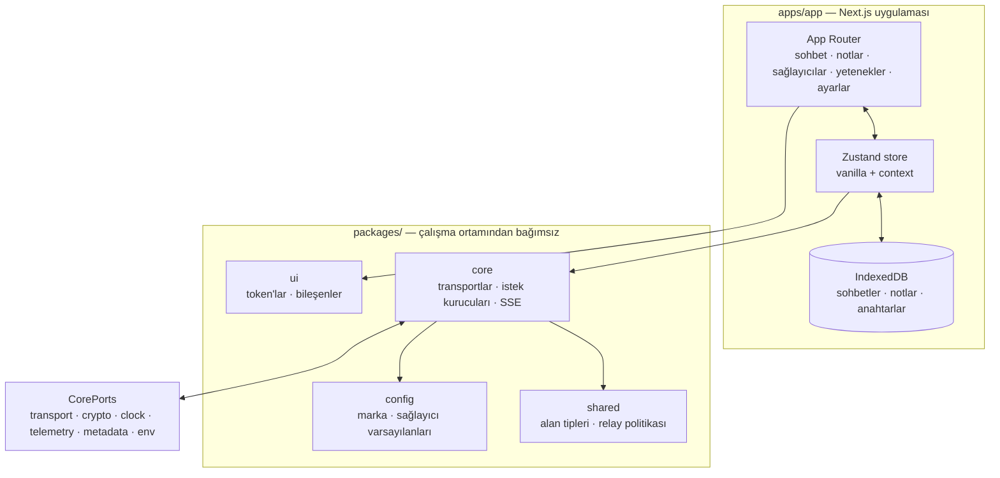

<div align="center">

# Web için Oriveo

**Zaten parasını ödediğiniz yapay zekâ modelleri için bir Next.js sohbet istemcisi.**

<a href="../../LICENSE"></a>


<sub>

<a href="../../web/README.md">English</a> ·
<a href="../ar/web.md">العربية</a> ·
<a href="../de/web.md">Deutsch</a> ·
<a href="../es/web.md">Español</a> ·
<a href="../fr/web.md">Français</a> ·
<a href="../hi/web.md">हिन्दी</a> ·
<a href="../id/web.md">Indonesia</a> ·
<a href="../ja/web.md">日本語</a> ·
<a href="../ko/web.md">한국어</a> ·
<a href="../pt-BR/web.md">Português</a> ·
<a href="../ru/web.md">Русский</a> ·
<a href="../th/web.md">ไทย</a> ·
**Türkçe** ·
<a href="../vi/web.md">Tiếng Việt</a> ·
<a href="../zh-Hans/web.md">简体中文</a> ·
<a href="../zh-Hant/web.md">繁體中文</a>

</sub>

</div>

---

Oriveo web istemcisi, Next.js ile yapılmış, kendi anahtarınızı getirdiğiniz bir yapay zekâ sohbet
uygulamasıdır. Sohbetler, notlar, klasörler, yetenekler ve sağlayıcı anahtarlarınız tarayıcının kendi
deposunda yaşar. Hesap da yok, giriş de.

Bu, [Oriveo Community Edition](README.md)'ın bir parçasıdır — bir model sağlayıcısıyla nasıl
konuşulacağına dair tek bir tanımı paylaşan üç istemci.

## Hızlı başlangıç

Node 22.22.2 veya sonraki bir 22.x sürümü gerekir (bkz. [`.nvmrc`](../../web/.nvmrc)); `engines`
alanı `^22.22.2` olduğundan Node 23+ desteklenmez. npm onunla birlikte gelir; başka bir paket
yöneticisine gerek yoktur.

```bash
npm install
npm run dev:app     # http://localhost:3001
```

İlk ekran bir sağlayıcı API anahtarı ister. Sohbete başlamak için başka hiçbir şey gerekmez.

## Bir istek gerçekte nasıl yol alır

Her şeyden önce okunmaya değer kısım burasıdır, çünkü web istemcisi, bir isteğin istemciden
sağlayıcıya genellikle doğrudan gitmediği **tek** yerdir.



**Bu dolambaç neden var.** Sağlayıcı API'lerinin çoğu CORS başlığı göndermez, bu yüzden bir tarayıcı
`api.openai.com` ve benzerlerini doğrudan çağıramaz — preflight başarısız olur. Tarayıcıda çalışan
her BYOK istemcisinin bunu bir biçimde çözmesi gerekir; bu istemci, Node çalışma ortamında çalışan
Next.js route handler'ları üzerinden iletir. `npm run dev:app` çalıştırdığınızda o handler'lar sizin
makinenizdedir. Uygulamayı bir yere dağıttığınızda ise dağıttığınız makinededir.

Tek bir handler yok: sohbet akışı, relay iletici, görsel üretimi, model listesi, anahtar doğrulama
ve Grok ile ChatGPT cihaz girişi takasları toplamda on iki route dosyası eder. Anahtar doğrulama
burada önemlidir — anahtarı kendi sunucunuza gönderir, o da onunla sağlayıcıyı yoklar.

Birkaç endpoint tarayıcıya *izin verir* ve bunlar arada hiçbir sunucu olmadan doğrudan çağrılır:
sohbet için Kimi'nin Çin endpoint'i (`api.moonshot.cn`) ve OpenRouter, SiliconFlow, DeepSeek ile
Kimi'nin bakiye endpoint'leri.

**Handler ne yapar, ne yapmaz.** İsteğin biçimini doğrular ve boyutunu sınırlar, sohbet ve relay
trafiğine IP başına hız sınırı uygular, özel veya link-local adreslere çözülen URL'leri reddeder,
sağlayıcıya özgü gövdeyi kurar ve yanıtı akış hâlinde geri verir. `app/api` altında hiçbir yerde
veritabanı, dosya sistemine yazma ya da istek gövdesi günlükleme yoktur — anahtarınız ve
mesajlarınız iletilir ve unutulur. Route, her ziyaretçinin paylaştığı tek bir süreç olduğu için özel
bir test (`server-never-learns.test.ts`), bir kullanıcının reddedilen bir parametresini önbelleğe
alıp başkasının isteğine uygulamadığını sabitler.

Aktarma hizmeti (Relay) ileticisi ayrıca DNS'i çözdüğü adrese sabitler, yanıt boyutunu sınırlar, her zaman aşımına sınır
koyar, yönlendirmeleri aynı origin ile sınırlar ve hop-by-hop başlıkları geçirmeyi reddeder.

**Yerel endpoint'ler bunu tümüyle atlar.** Özel bir adreste, `.local` bir adda, `localhost`'ta ya da
yerel HTTP veya özel VPN kipinde yapılandırılmış bir relay, `credentials: 'omit'` ve
`targetAddressSpace: 'local'` ile **doğrudan tarayıcıdan** çağrılır. Yerel ağ trafiğiniz ağınızdan
çıkmaz ve uygulamanın sunucusundan da geçmez.

## Mimari



`packages/core`, sağlayıcı protokolü bilgisinin her baytını barındırır ve tarayıcı global'lerinden
bilinçli olarak uzak tutulur — eslint, onun içinde `window`,
`document`, `fetch`, `crypto`, `localStorage`, `sessionStorage` ve `indexedDB` kullanımını yasaklar.
Ortamdan ihtiyaç duyduğu her şey `CorePorts` üzerinden gelir. Aynı kodun bir tarayıcıda, bir Node
route handler'ında ve DOM'suz bir testte çalışabilmesini sağlayan da budur.

Sağlayıcı desteği iki bağımsız eksendir. `providerKind` bir **istek kurucusu** seçer (gövdenin bu
sağlayıcı için nasıl göründüğü). `model.transport` ise on iki seçenek arasından bir **transport
stratejisi** seçer (hangi ağ protokolünün konuşulduğu) ve bu, sağlayıcı başına değil, katalogdan
model başına çözülür — yani aynı anahtarın arkasındaki iki model birbiriyle anlaşmayabilir. Bir
strateji tam olarak üç metot uygular: `buildRequestBody`, `parseStreamChunk`, `parseError`.

## Workspace'ler

```
apps/app/               the Next.js application
packages/core/          provider protocols: transports, request builders, SSE parsing
packages/shared/        domain types, relay policy, helpers
packages/ui/            design tokens and shared components
packages/config/        brand and provider defaults
```

Stil, `packages/ui` içindeki tek bir custom property token sayfası üzerine kurulu CSS Modules ile
yapılır; utility-class çerçevesi yoktur.


Aynı türden bir dikiş daha var. `apps/app/lib/core/sync-port.ts`, bir senkronizasyon arka ucunun uygulayacağı
arayüzü bildirir ve her çağrı yeri ona optional chaining ile erişir. Böyle bir arka uç kurulmadığı
için `getSyncAdapter()` `null` döner ve verilerinizin tek kopyası IndexedDB olarak kalır — "hesap
yok, giriş yok" pratikte tam olarak bu demektir.

## Depolama

Her şey bölümlere ayrılmıştır ve varsayılanı `guest` olan etkin bir id ile anahtarlanır.

| Ne | Nerede |
|---|---|
| Sohbetler, mesajlar, klasörler, notlar, sağlayıcılar | IndexedDB `oriveo--{id}`, 8 object store |
| Model kataloğu anlık görüntüsü (~3 MB) ve model facts | IndexedDB blob deposu, bilinçli olarak localStorage değil |
| Tercihler ve model denetim tabloları | `localStorage`, hata fırlattığı görülen yolları `safeLocalStorage` sarmalar |
| Üretilen ve eklenen görseller | ayrı bir IndexedDB veritabanı |

Zevkten değil, gerçek arızalardan gelen iki ayrıntı. Katalog anlık görüntüsü IndexedDB'de yaşıyor,
çünkü ~3 MB boyutuyla bir tarayıcı origin'inin 5 MB'lık localStorage kotasının büyük kısmını
yiyordu. Ve her localStorage erişimi `safeLocalStorage` üzerinden geçiyor, çünkü tarayıcı site
verilerini engelleyecek şekilde yapılandırıldığında `window.localStorage` *getter'ının kendisi*
`SecurityError` fırlatıyor — çıplak bir okuma, sizin `try` bloğunuz daha çalışmadan sayfayı
çökertiyor.

> [!IMPORTANT]
> Web'de sağlayıcı anahtarları IndexedDB'de **şifrelenmeden** saklanır — bu, tarayıcı tabanlı BYOK
> istemcilerinin genelde kullandığı modeldir, çünkü bir tarayıcının onları koyacak daha iyi bir yeri
> yoktur. En güçlü garanti için, sistem keychain'inin ya da keystore'unun anahtarları şifrelediği
> iOS veya Android istemcisini kullanın. Yedek arşivleri ayrı bir konudur: bir parola
> seçtiğinizde onlar AES-256-GCM ve 600.000 yinelemeli PBKDF2-SHA-256 ile şifrelenir.

## Model kataloğu

Her sağlayıcının hangi modelleri sunduğu ve her modelin neyi desteklediği, açılışta çekilen salt
okunur bir katalogdan gelir. Tam olarak iki endpoint istenir; ikisi de `GET`, ikisi de ETag koşullu
ve hiçbiri API anahtarı, sohbet veya herhangi bir kullanıcı tanımlayıcısı taşımaz:

```
GET {backend}/api/metadata?view=lean
GET {backend}/api/metadata/model-facts
```

Varsayılan backend `https://api.oriveoai.com` adresidir. Kataloğu kendiniz sunmak için
`NEXT_PUBLIC_BACKEND_URL` değerini kendi sunucunuza yönlendirin. Yanıt IndexedDB'de 24 saat
önbelleğe alınır ve `If-None-Match` ile yeniden doğrulanır; katalog erişilemez olduğunda uygulama
önbellekteki kopyayla çalışmayı sürdürür.

## Komutlar

Bunları bu dizinden çalıştırın.

| Komut | Ne yapar |
|---|---|
| `npm run dev:app` | 3001 portunda geliştirme sunucusu |
| `npm run build:app` | üretim derlemesi |
| `npm run typecheck` | tüm workspace'lerde `tsc --noEmit` |
| `npm run test:run` | vitest, tek geçiş |
| `npm run test` | izleme kipinde vitest, workspace başına bir izleyici — tek bir workspace içinde çalıştırmak yeğlenir |
| `npm run lint` | `apps/` ve `packages/` üzerinde eslint |

`npm start --workspace @oriveo/app`, bitmiş bir derlemeyi 3001 portunda sunar.

Tek bir test dosyasını çalıştırmak için bunu, dosyanın ait olduğu workspace içinden yapın; birkaç
test paketi fixture'ları çalışma dizinine göre çözer:

```bash
cd apps/app && npx vitest run lib/core/chat/__tests__/stream-options.test.ts
```

## Yapılandırma

Her şey isteğe bağlıdır. [`.env.example`](../../web/.env.example) dosyasını `.env.local` olarak
kopyalayın ve yalnızca ihtiyacınız olanı ayarlayın; kodun okuduğu her değişken orada listelenmiş ve
açıklanmıştır.

### Hata raporlama

Uygulama Sentry SDK'sını paketler. **DSN olmadan atıldır** — `NEXT_PUBLIC_SENTRY_DSN` yoksa taşıma
yok, olay yok, hiçbir yere hiçbir şey gönderilmez; bu depodan yapılan bir derlemenin varsayılanı da
budur. Bir DSN ayarlarsanız hata raporlaması, %10 performans izleme ve %1 oturum tekrarı elde
edersiniz; üstelik bir olay tarayıcıdan çıkmadan önce sağlayıcı anahtarlarını, endpoint'leri ve
mesaj içeriğini temizleyen hook'larla birlikte. Burada olmasının nedeni bu derlemenin eve telefon
etmesi değil, hata raporlaması isteyen bir dağıtımın buna sahip olabilmesidir.

## Kendi sunucunuzda barındırma

Dockerfile yok, dağıtım betiği yok; uygulama sıradan bir Next.js sunucusudur.

```bash
npm ci
npm run build:app
npm start --workspace @oriveo/app     # 127.0.0.1:3001
```

Onu bir ters proxy'nin arkasına koymadan önce bilinmeye değer üç şey var.

`npm start`, `127.0.0.1` adresine bağlanır; dolayısıyla proxy'nin aynı makinede çalışması ya da bağlanma
adresinin değiştirilmesi gerekir.

`NEXT_PUBLIC_APP_URL` değerini, gerçekten hizmet verdiğiniz origin'e ayarlayın. Canonical bağlantılar,
sitemap ve sosyal önizleme görseli hep ona göre çözülür ve varsayılanı geliştirme portudur.

`TRUSTED_PROXY_HOP_COUNT` değerini, uygulamanın önündeki proxy sayısına ayarlayın. Sohbet hız
sınırlayıcı, istemci adresini `X-Forwarded-For` başlığının *sağından* o kadar atlama sayarak okur —
asla solundan, çünkü solu istemci denetler ve uydurabilir. Varsayılan olan 1, tek bir proxy için
doğrudur; iki proxy varken onu fazla düşük bırakırsanız her ziyaretçi tek bir hız sınırı kovasını
paylaşır, çünkü okunan adres sizin kendi iç proxy'nizin adresidir.

Uygulama HSTS, `X-Content-Type-Options`, `X-Frame-Options`, `Referrer-Policy`, `Permissions-Policy` ve
`Cross-Origin-Opener-Policy` başlıklarını `next.config.ts` içinden zaten gönderir; proxy'nin bunları
eklemesi gerekmez. TLS sonlandırma ve istek boyutu sınırları proxy'nin işidir.

Bilinçli karar vermeye değer son bir şey: dağıtıma erişebilen herkes, onun route handler'larını
kullanarak kendi verdiği bir anahtarla bir sağlayıcıyı çağırabilir. Handler'lar kendilerine ait
anahtar tutmaz ve hiçbir şey saklamaz, ama dışa doğru bir HTTP yoludur; bu yüzden herkese açık
erişilebilir bir dağıtım, başka herhangi bir dahili araca uygulayacağınız erişim denetiminin arkasında
durmalıdır.

## Bağımlılıklar

| Paket | Sürüm | Ne için |
|---|---|---|
| [Next.js](https://nextjs.org) | 16.3.3 | App Router, route handler'lar, derleme |
| [React](https://react.dev) | 19.2.8 | arayüz |
| [vitest](https://vitest.dev) | 4.1.11 | test koşucusu |
| [zustand](https://zustand.docs.pmnd.rs) | 5.0.15 | istemci tarafı state |
| [next-intl](https://next-intl.dev) | 4.14.1 | yerelleştirme |
| [@sentry/nextjs](https://docs.sentry.io/platforms/javascript/guides/nextjs/) | 10.72.0 | hata raporlama, DSN olmadan etkisiz |

Her bağımlılığın tam sürümü `package-lock.json` içinde sabitlenmiştir.

## Testler

460 dosyada yaklaşık 5.600 test, vitest üzerinde. En yoğun kapsam, bir hatanın en pahalıya patladığı
yerlerdedir: sağlayıcı başına istek biçimi, ağ protokolü başına transport davranışı, SSE ve proxy
chunk ayrıştırma, kullanım ve maliyet ayrıştırma, hata sınıflandırma, relay sondalama ve güvenlik
kipleri, SSRF koruması, yetenek reçetesi yürütme, katalog önbellekleme ve sözleşme sürümüne göre
geçersizleştirme, IndexedDB kalıcılığı, depolama bölümlemesi, yedekleme gidiş-dönüşleri ve route
handler'ların kendisi.

> [!IMPORTANT]
> Otuzdan fazla test paketi sözleşme fixture'larını çalışma dizinine göre `shared/` altında çözer;
> dolayısıyla **testler yalnızca deponun tamamı elinizdeyken ve onları içeren workspace'ten
> çalıştırıldığında geçer** — tek başına `web/` klasörünü dışarı kopyalamak işe yaramaz.

## Yerelleştirme

`apps/app/messages` içinde on altı dil, her birinde yaklaşık 1.800 anahtar, kaynak dil İngilizce.
Bir test dizini tarar ve herhangi bir dilin anahtar kümesi İngilizceden farklıysa başarısız olur;
böylece bir dil dosyası eklemek onu kendiliğinden kaydeder. Arapça tam sağdan sola yerleşim alır.
Dil seçimi önce açık bir `?locale=` parametresini, sonra bir çerezi, sonra `Accept-Language`
başlığını izler.

## Katkıda bulunma

Bkz. [CONTRIBUTING.md](../../CONTRIBUTING.md). `packages/core` transport önceliklidir: bir sağlayıcı
eklemek genelde yeni bir istemci değil, bir istek kurucusu ve bir yanıt adaptörüdür. Sağlayıcı
protokolü düzeltmelerinde elle yazılmış bir mock yerine `shared/test-fixtures` altındaki kayıtlı bir
fixture'ı tercih edin.

## Lisans

[AGPL-3.0-or-later](../../LICENSE).
