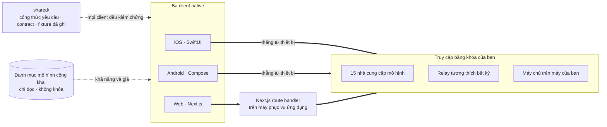

<div align="center">


# Oriveo Community Edition

**Mọi mô hình, một ứng dụng.**

Ứng dụng chat AI mã nguồn mở, dùng khóa của chính bạn, cho iOS, Android và web,
cùng một client macOS native đang được phát triển.
Không tài khoản, không thuê bao, và không có dịch vụ nào của chúng tôi trên đường đi của yêu cầu.

<a href="../../LICENSE"></a>
<a href="ios.md"></a>
<a href="android.md"></a>
<a href="web.md"></a>
<a href="macos.md"></a>


**Tải Oriveo:**
<a href="https://oriveoai.com"><b>oriveoai.com</b></a> &nbsp;·&nbsp;
<a href="https://apps.apple.com/app/oriveo/id6775370458">App Store</a> &nbsp;·&nbsp;
<a href="https://play.google.com/store/apps/details?id=com.kenny.oriveo">Google Play</a> &nbsp;·&nbsp;
<a href="https://app.oriveoai.com">Ứng dụng web</a>

<a href="#bắt-đầu">Dựng từ mã nguồn</a> &nbsp;·&nbsp;
<a href="#kiến-trúc">Kiến trúc</a> &nbsp;·&nbsp;
<a href="#community-edition-và-oriveo">Các phiên bản</a> &nbsp;·&nbsp;
<a href="#câu-hỏi-thường-gặp">Câu hỏi thường gặp</a> &nbsp;·&nbsp;
<a href="../../CONTRIBUTING.md">Đóng góp</a>

<sub>

<a href="../../README.md">English</a> ·
<a href="../ar/README.md">العربية</a> ·
<a href="../de/README.md">Deutsch</a> ·
<a href="../es/README.md">Español</a> ·
<a href="../fr/README.md">Français</a> ·
<a href="../hi/README.md">हिन्दी</a> ·
<a href="../id/README.md">Indonesia</a> ·
<a href="../ja/README.md">日本語</a> ·
<a href="../ko/README.md">한국어</a> ·
<a href="../pt-BR/README.md">Português</a> ·
<a href="../ru/README.md">Русский</a> ·
<a href="../th/README.md">ไทย</a> ·
<a href="../tr/README.md">Türkçe</a> ·
**Tiếng Việt** ·
<a href="../zh-Hans/README.md">简体中文</a> ·
<a href="../zh-Hant/README.md">繁體中文</a>

</sub>

</div>

---

## Oriveo là gì

Oriveo Community Edition là ứng dụng chat AI mã nguồn mở theo mô hình bring-your-own-key (BYOK) cho
iOS, Android và web, cùng một client macOS native đang được phát triển. Nó dành cho những người thà
trả tiền trực tiếp cho nhà cung cấp mô hình hơn là trả thuê bao cho bất cứ thứ gì đứng chắn phía
trước: bạn cung cấp khóa API mà bạn đã sở hữu, và ứng dụng dùng chính khóa đó để nói chuyện với nhà
cung cấp. Điều đó làm nó trở thành một lựa chọn ưu tiên cục bộ, đa mô hình để thay cho một gói
ChatGPT hay Claude được lưu trữ sẵn — không tài khoản Oriveo, không thuê bao, không có gì gửi dữ
liệu về cho chúng tôi, và một client web bạn có thể tự vận hành.

Ứng dụng nói chuyện trực tiếp với **15 nhà cung cấp mô hình** — OpenAI, Anthropic, Google Gemini,
OpenRouter, DeepSeek, Grok, Mistral, Groq, Together AI, Fireworks AI, MiniMax, Z.ai, Qwen,
Kimi (Moonshot) và SiliconFlow — cùng với **bất kỳ endpoint nào tương thích OpenAI, Anthropic hoặc
Gemini** mà bạn trỏ tới, kể cả llama.cpp, Ollama, LM Studio hay vLLM đang chạy trên máy của bạn.

| | |
|---|---|
| **Nhà cung cấp** | 15 nhà cung cấp tích hợp sẵn, cộng thêm endpoint relay tùy chỉnh và máy chủ mô hình cục bộ |
| **Client** | iOS (SwiftUI) · Android (Jetpack Compose) · Web (Next.js) · macOS đang được phát triển |
| **Ngôn ngữ giao diện** | 16 |
| **Cần tài khoản không** | Không |
| **Lệnh gọi ứng dụng tự thực hiện** | Đúng một việc, qua hai yêu cầu: danh mục mô hình chỉ đọc, không kèm khóa và không kèm định danh nào do chúng tôi gắn vào |
| **Giấy phép** | AGPL-3.0-or-later |

## Vì sao nó tồn tại

Không ai được phép đo đếm, ghi log hay cộng giá vào mô hình mà bạn đang trả tiền để dùng.

- **Khóa của bạn, hóa đơn của bạn.** Bạn trả đúng giá niêm yết của nhà cung cấp. Không cộng thêm,
  không đo đếm, không bán lại.
- **Mặc định là cục bộ.** Cuộc trò chuyện, ghi chú, thư mục, kỹ năng và tệp đính kèm nằm trên thiết
  bị. Xuất ra tệp bất cứ lúc nào bạn muốn; không có bản sao trên đám mây nào để bạn mất quyền truy
  cập.
- **Một hành vi, ba client.** Cách dựng một yêu cầu cho một nhà cung cấp, một transport và một khả
  năng cụ thể được ghi lại đúng một lần trong [`shared/`](shared.md), và cả ba client đều kiểm
  chứng với cùng bộ JSON fixture. Một điểm kỳ quặc nằm trong chính dữ liệu đó chỉ phải sửa một lần;
  một điểm kỳ quặc nằm trong bộ phân tích thì bị cả ba bộ test bắt cùng một lúc.
- **Thứ duy nhất mà nó tải về.** Ứng dụng đọc một danh mục mô hình công khai để một mô hình ra mắt
  hôm nay chạy được ngay mà không cần cập nhật ứng dụng. Cả hai yêu cầu của nó đều chỉ đọc, không
  kèm khóa và không kèm định danh nào do chúng tôi gắn vào, còn client web và Android thì có thể trỏ
  về host của riêng bạn.

## Tính năng

- **Chat** — streaming, khối suy luận, trích dẫn nguồn, tệp đính kèm (ảnh và video, PDF, Office
  (docx, xlsx, pptx), OpenDocument, EPUB, RTF, HTML, cùng mọi tệp văn bản thuần hay tệp mã nguồn),
  trích dẫn đoạn được chọn, thử lại, tạo lại, viết tiếp sau khi câu trả lời bị ngắt
- **Nhà cung cấp** — 15 nhà cung cấp tích hợp sẵn, mỗi nhà dùng khóa của chính bạn; ghi đè mô hình
  và tham số sinh nội dung theo từng nhà cung cấp, cùng lựa chọn endpoint theo khu vực ở nơi nhà
  cung cấp có sẵn
- **Relay** — bất kỳ endpoint nào tương thích OpenAI, Anthropic hoặc Gemini, kể cả endpoint trong
  mạng LAN của bạn
- **Máy chủ mô hình cục bộ** — llama.cpp, Ollama, LM Studio, vLLM, Open WebUI; iOS và Android dò tìm
  chúng trong mạng nội bộ qua mDNS
- **Đăng nhập bằng gói thuê bao** — dùng gói ChatGPT hay Grok bạn đã có thay cho khóa API, qua
  chính luồng xác thực thiết bị của từng nhà cung cấp
- **Kỹ năng** — các system prompt dùng lại được, kèm mô hình, thiết lập suy luận và tài liệu tham
  chiếu riêng
- **Ghi chú và thư mục** — lưu một câu trả lời thành ghi chú, sắp xếp cuộc trò chuyện, tìm kiếm
  trên cả hai
- **Đối chiếu chéo** — giao một câu trả lời cho một mô hình thứ hai xem lại và giữ cả hai cạnh nhau
- **Chi phí** — mức chi theo từng tin nhắn và từng nhà cung cấp, tính ngay trên thiết bị từ những
  gì mỗi phản hồi thực sự báo về, bao gồm cả bậc đọc cache và bậc ghi cache
- **Tạo ảnh** — ở những nơi nhà cung cấp hỗ trợ
- **Sao lưu** — xuất toàn bộ ra một tệp; các khóa nhà cung cấp trong đó, nếu bạn chọn kèm theo, sẽ
  được mã hóa bằng một mật khẩu của bạn
- **16 ngôn ngữ giao diện**, gồm cả bố cục phải-sang-trái đầy đủ cho tiếng Ả Rập

## Community Edition và Oriveo

Kho mã này là **Oriveo Community Edition**, phát hành theo
[AGPL-3.0-or-later](../../LICENSE). Các ứng dụng trên App Store, Google Play và ứng dụng web được
lưu trữ sẵn là **Oriveo** — một sản phẩm độc quyền riêng biệt, dựng từ chính ba client này và bổ
sung một lớp tài khoản lên trên.

| | Community Edition | Oriveo |
|---|---|---|
| Mã nguồn | Kho mã này, AGPL-3.0-or-later | Độc quyền |
| Chat bằng khóa nhà cung cấp của bạn | Có | Có |
| Relay và máy chủ mô hình cục bộ | Có | Có |
| Ghi chú, thư mục, kỹ năng, tệp đính kèm | Có | Có |
| Theo dõi chi phí ngay trên thiết bị | Có | Có |
| Tài khoản | Không | Tài khoản Oriveo |
| Lưu trữ | Trên thiết bị; xuất và khôi phục thủ công | Ưu tiên cục bộ, kèm đồng bộ đám mây giữa các thiết bị |
| Thống kê sử dụng và cảnh báo ngân sách | — | Có |
| Mô hình do Oriveo trả tiền | — | Có |
| Analytics và báo cáo sự cố | Không có. Gói web mang theo Sentry, im lặng cho tới khi bạn tự đặt một DSN của riêng mình | Có |

Các bản dựng Community Edition dùng tiền tố định danh `ai.oriveo.community`, nên một bản có thể nằm
trên cùng thiết bị với bản từ cửa hàng mà hai bên không dùng chung keychain hay bất kỳ dữ liệu cục bộ
nào. Phiên bản này chấp nhận và không chấp nhận những gì đều được ghi rõ trong
[COMMUNITY.md](../../COMMUNITY.md).

**Oriveo, sản phẩm đầy đủ:**
[iPhone và iPad](https://apps.apple.com/app/oriveo/id6775370458) &nbsp;·&nbsp;
[Android](https://play.google.com/store/apps/details?id=com.kenny.oriveo) &nbsp;·&nbsp;
[Web](https://app.oriveoai.com) &nbsp;·&nbsp;
[oriveoai.com](https://oriveoai.com)

## Nhà cung cấp

Mọi nhà cung cấp bên dưới đều được truy cập bằng khóa do chính bạn tạo ra. Hai trong số đó cũng có
thể truy cập bằng cách đăng nhập vào một gói thuê bao bạn đã có, thay cho khóa: OpenAI với một gói
ChatGPT, và Grok.

| Nhà cung cấp | Lấy khóa ở đâu |
|---|---|
| OpenAI | [platform.openai.com](https://platform.openai.com/api-keys) |
| Anthropic | [platform.claude.com](https://platform.claude.com/settings/keys) |
| Google Gemini | [aistudio.google.com](https://aistudio.google.com/apikey) |
| OpenRouter | [openrouter.ai](https://openrouter.ai/keys) |
| DeepSeek | [platform.deepseek.com](https://platform.deepseek.com/api_keys) |
| Grok | [console.x.ai](https://console.x.ai/) |
| Mistral | [console.mistral.ai](https://console.mistral.ai/api-keys) |
| Groq | [console.groq.com](https://console.groq.com/keys) |
| Together AI | [api.together.xyz](https://api.together.xyz/settings/api-keys) |
| Fireworks AI | [fireworks.ai](https://fireworks.ai/api-keys) |
| MiniMax | [platform.minimax.io](https://platform.minimax.io/docs/guides/quickstart-preparation) |
| Z.ai | [open.bigmodel.cn](https://open.bigmodel.cn/usercenter/apikeys) |
| Qwen | [bailian.console.alibabacloud.com](https://bailian.console.alibabacloud.com/?apiKey=1#/api-key) |
| Kimi (Moonshot) | [platform.kimi.ai](https://platform.kimi.ai/console/api-keys) |
| SiliconFlow | [cloud.siliconflow.cn](https://cloud.siliconflow.cn/account/ak) |
| **Relay** | Bất kỳ endpoint nào tương thích OpenAI, Anthropic hoặc Gemini, kể cả endpoint trên máy bạn |

## Kiến trúc

Ba client native, một định nghĩa duy nhất về cách nói chuyện với nhà cung cấp mô hình.



Mỗi client sở hữu giao diện, kho lưu trữ và điều hướng riêng, và chỉ gặp các contract dùng chung tại
đúng một đường ghép: lớp biến *mô hình này, khả năng này* thành một yêu cầu HTTP.

Điểm bất đối xứng duy nhất đáng biết là client web. Phần lớn API của các nhà cung cấp không gửi
header CORS, nên trình duyệt không thể gọi thẳng; những yêu cầu đó đi qua một Next.js route handler
chạy trên chính máy đang phục vụ ứng dụng — là máy của bạn, khi bạn chạy nó cục bộ. Số ít endpoint
có cho phép trình duyệt (endpoint Trung Quốc của Kimi, endpoint số dư của vài nhà cung cấp)
cùng với các relay nằm trong mạng của bạn thì được gọi trực tiếp. Client iOS và Android không vướng
ràng buộc đó nên luôn đi thẳng tới nhà cung cấp.

**Kiến trúc của từng client:**

| | Ngăn xếp | README |
|---|---|---|
| **iOS** | SwiftUI với transcript bằng UIKit, GRDB | [ios/README.md](ios.md) |
| **Android** | Jetpack Compose, Room, Koin, Ktor/OkHttp | [android/README.md](android.md) |
| **Web** | Next.js App Router, React, Zustand, TypeScript | [web/README.md](web.md) |
| **macOS** | Đang được phát triển, sẽ có trong vài tháng tới | [macos/README.md](macos.md) |
| **Shared** | Contract, fixture đã ghi và Swift wire kernel | [shared/README.md](shared.md) |

## Bắt đầu

Ở đây không có bản dựng sẵn nào — không APK, không `.ipa`, không release. Community Edition là mã
nguồn để bạn tự dựng, còn các ứng dụng trên cửa hàng là sản phẩm kia. Client web là con đường ngắn
nhất để có một ứng dụng chạy được.

<details open>
<summary><b>Web</b> — cách nhanh nhất để thử</summary>

<br>

Cần Node 22.22 trở lên (xem [`web/.nvmrc`](../../web/.nvmrc)).

```bash
cd web
npm install
npm run dev:app        # http://localhost:3001
```

Màn hình đầu tiên hỏi khóa API của một nhà cung cấp. Không cần gì thêm.
Thêm lệnh và cấu hình: [web/README.md](web.md).

</details>

<details>
<summary><b>iOS</b> — dựng và chạy trên chính iPhone của bạn</summary>

<br>

Cần một máy Mac có Xcode 26 và một thiết bị chạy iOS 18 trở lên. Tài khoản Apple Developer miễn phí
là đủ — ứng dụng không dùng capability trả phí nào.

1. Mở `ios/Oriveo/Oriveo.xcodeproj`
2. Chọn scheme `Oriveo`
3. Trong Signing &amp; Capabilities, chọn Team của bạn
4. Nhấn Run

Hướng dẫn đầy đủ, gồm cả việc phải làm khi Xcode không chịu mở dự án:
[ios/README.md](ios.md).

</details>

<details>
<summary><b>Android</b> — dựng file APK</summary>

<br>

Cần JDK 21 và Android SDK. Bản dựng dùng AGP 9.3, Gradle 9.5 và Kotlin 2.3, nên Android Studio
phải là bản có thể sync được chúng; còn từ dòng lệnh thì chỉ cần JDK và SDK.

```bash
cd android
./gradlew :app:assembleDebug
```

Tự phục vụ danh mục mô hình từ host của bạn: [android/README.md](android.md).

</details>

## Quyền riêng tư

- **Khóa nhà cung cấp** đi vào iOS Keychain, còn trên Android thì vào `EncryptedSharedPreferences`
  dưới một khóa do Android Keystore giữ. Trình duyệt không có cơ chế tương đương, nên trên web khóa
  nằm không mã hóa trong IndexedDB — đúng như cách các client BYOK chạy trong trình duyệt vẫn làm.
  Muốn đảm bảo mạnh nhất thì hãy dùng client iOS hoặc Android.
- **Cuộc trò chuyện, ghi chú, thư mục, kỹ năng và tệp đính kèm** được lưu trên thiết bị. Không có gì
  được tải lên bất cứ đâu.
- **Không tài khoản, và không có analytics.** Không có gì để đăng nhập, và không có gì đếm những
  việc bạn làm. Gói web có kèm Sentry để báo lỗi; nó im lặng cho tới khi bạn đặt
  `NEXT_PUBLIC_SENTRY_DSN` trỏ về một dự án của riêng mình, và nếu bạn làm vậy thì nó được cấu hình
  để thu cả bản ghi lại phiên bên cạnh stack trace. Client iOS và Android không chứa bất kỳ SDK báo
  cáo nào.
- **Trên iOS và Android, yêu cầu chat đi thẳng từ thiết bị tới nhà cung cấp.** Trên web, phần lớn
  chúng đi qua máy chủ Next.js đang phục vụ ứng dụng, vì phần lớn API của các nhà cung cấp không cho
  phép trình duyệt gọi trực tiếp; máy chủ đó không lưu lại khóa hay tin nhắn, và khi bạn chạy ứng
  dụng cục bộ thì đó chính là máy của bạn.
- **Hai yêu cầu của riêng chúng tôi:** một danh mục mô hình chỉ đọc, đọc qua hai lượt gọi — một
  lượt cho biết mỗi mô hình muốn được gọi ra sao, một lượt cho các dữ kiện về từng mô hình, mà iOS
  chỉ đọc lượt sau này sau khi đăng nhập bằng gói thuê bao — để một mô hình ra mắt hôm nay chạy được
  ngay mà không cần bản dựng mới. Không lượt nào kèm khóa, kèm cuộc
  trò chuyện hay kèm định danh nào do chúng tôi gắn vào. Client web (`NEXT_PUBLIC_BACKEND_URL`) và
  bản dựng Android (`-PORIVEO_METADATA_BASE_URL`) có thể trỏ về host của riêng bạn; trên iOS, tùy
  chọn ghi đè đó chỉ là một tiện lợi của bản dựng Debug.

## Câu hỏi thường gặp

<details>
<summary><b>BYOK nghĩa là gì?</b></summary>

<br>

Bring your own key — mang khóa của chính bạn. Bạn tạo một khóa API trong console của nhà cung cấp —
OpenAI, Anthropic, Google, v.v. — rồi dán vào Oriveo. Các yêu cầu được chính nhà cung cấp đó tính
tiền theo giá niêm yết của họ. Oriveo là client; nó không phải đại lý bán lại và không ăn phần trăm.

</details>

<details>
<summary><b>Nó có miễn phí không?</b></summary>

<br>

Client thì miễn phí. Nó là mã nguồn mở theo AGPL-3.0-or-later, không có gì để đăng ký thuê bao, và
không phần nào bị giữ lại sau một khoản thanh toán. Cái bạn trả là giá niêm yết của chính nhà cung
cấp mô hình cho những yêu cầu bạn gửi, do họ tính tiền, trên tài khoản mà khóa thuộc về. Oriveo
không bao giờ nhìn thấy hóa đơn đó.

</details>

<details>
<summary><b>Cuộc trò chuyện của tôi có đi qua máy chủ của Oriveo không?</b></summary>

<br>

Không. Trên iOS và Android, client gọi thẳng endpoint của nhà cung cấp. Trên web, phần lớn yêu cầu
đi qua máy chủ Next.js đang phục vụ ứng dụng — chính là máy của bạn khi bạn chạy cục bộ — vì phần
lớn API của các nhà cung cấp từ chối lời gọi trực tiếp từ trình duyệt; số ít cho phép thì được gọi
thẳng. Cả hai đường đi đều không có máy chủ nào do Oriveo vận hành. Thứ duy nhất Oriveo tự tải
về là danh mục mô hình công khai, qua hai yêu cầu chỉ đọc không kèm khóa, không kèm cuộc trò chuyện
và không kèm định danh nào do chúng tôi gắn vào.

</details>

<details>
<summary><b>Tôi có dùng được mô hình chạy trên máy của mình không?</b></summary>

<br>

Có. Thêm một kết nối Relay trỏ tới bất kỳ máy chủ nào tương thích OpenAI, Anthropic hoặc Gemini —
llama.cpp, Ollama, LM Studio, vLLM, Open WebUI, hay bất cứ thứ gì nói được một trong các giao thức
đó. Client iOS và Android có thể dò tìm một máy chủ như vậy trong mạng nội bộ qua mDNS; còn client
web gợi ý địa chỉ thường dùng của từng engine rồi tự thăm dò. HTTP cục bộ không dùng thông tin xác
thực nào và không bao giờ rời khỏi mạng của bạn.

</details>

<details>
<summary><b>Tôi có thể tự chạy toàn bộ không?</b></summary>

<br>

Được. Client web là một ứng dụng Next.js do bạn tự dựng và tự phục vụ từ máy của mình; nó là phần
duy nhất của dự án có phía máy chủ, và nó không lưu khóa cũng không lưu tin nhắn. Trỏ nó tới một máy
chủ mô hình trên phần cứng của bạn thì không yêu cầu nào rời khỏi mạng của bạn. Danh mục mô hình
cũng có thể tự vận hành: đưa cho bản dựng web một `NEXT_PUBLIC_BACKEND_URL` của riêng bạn, hoặc cho
bản dựng Android một `-PORIVEO_METADATA_BASE_URL`, và trong ứng dụng sẽ không còn gì vươn ra ngoài
mạng của bạn nữa.

</details>

<details>
<summary><b>Nó khác gì với ứng dụng trên App Store?</b></summary>

<br>

Ứng dụng trên cửa hàng là Oriveo, một sản phẩm độc quyền bổ sung tài khoản, đồng bộ đám mây giữa các
thiết bị, thống kê sử dụng và các mô hình do Oriveo trả tiền. Community Edition là đúng ba client đó
nhưng không có bất kỳ thứ nào kể trên: không tài khoản, không dịch vụ đồng bộ, không thanh toán,
và không có gì gửi dữ liệu về cho chúng tôi. Xem bảng so sánh đầy đủ tại
[Community Edition và Oriveo](#community-edition-và-oriveo).

</details>

<details>
<summary><b>Có client cho macOS không?</b></summary>

<br>

Một client macOS native đang được phát triển và sẽ ra mắt trong vài tháng tới; `macos/` là nơi nó
sẽ nằm. Trong lúc chờ, client web dùng như một ứng dụng desktop trên trình duyệt bất kỳ vẫn rất tốt,
và bản dựng iOS chạy trên một máy Mac dùng Apple silicon ngay từ Xcode. Gói Swift lo việc nói chuyện
với các nhà cung cấp đã khai báo macOS 15 là một nền tảng được hỗ trợ, nên lớp giao thức mà một
client cho Mac cần đã được viết và đang được kiểm thử ngay hôm nay. Xem [macos/README.md](macos.md).

</details>

<details>
<summary><b>Giao diện có những ngôn ngữ nào?</b></summary>

<br>

Mười sáu: Ả Rập, Đức, Anh, Tây Ban Nha, Pháp, Hindi, Indonesia, Nhật, Hàn, Bồ Đào Nha (Brazil), Nga,
Thái, Thổ Nhĩ Kỳ, Việt, Trung giản thể và Trung phồn thể. Tiếng Ả Rập có bố cục phải-sang-trái đầy
đủ.

</details>

## Cấu trúc kho mã

```
ios/           iOS client (SwiftUI)
android/       Android client (Jetpack Compose)
web/           Web client (Next.js)
macos/         macOS client — in development, arriving in the coming months
shared/        Cross-client contracts, recorded fixtures, and the Swift wire kernel
readme_i18n/   These READMEs in fifteen more languages
docs/assets/   Images used by the READMEs
```

## Đóng góp

Rất hoan nghênh báo lỗi và pull request. [CONTRIBUTING.md](../../CONTRIBUTING.md) nói về cách dựng
từng client và thế nào là một pull request tốt; [COMMUNITY.md](../../COMMUNITY.md) mô tả phiên bản
này sinh ra để làm gì, cùng vài loại thay đổi sẽ không được chấp nhận dù viết hay đến đâu.

Phát hiện một vấn đề bảo mật? Xin đừng mở issue công khai — [SECURITY.md](../../SECURITY.md) hướng
dẫn cách báo cáo riêng tư, và nói rõ dự án này coi điều gì là lỗ hổng và điều gì thì không. Mọi
người tham gia đều cần tuân theo [quy tắc ứng xử](../../CODE_OF_CONDUCT.md).

## Giấy phép

[AGPL-3.0-or-later](../../LICENSE). Các đóng góp cũng được nhận theo cùng giấy phép này.

Tên và logo của các nhà cung cấp thuộc về chủ sở hữu tương ứng và xuất hiện ở đây chỉ để chỉ rõ
những dịch vụ mà client này có thể được trỏ tới. Chúng không thuộc phạm vi giấy phép của kho mã này,
và sự hiện diện của chúng không phải là một sự bảo chứng từ bất kỳ ai. Các phông chữ và thư viện mà
các client đóng gói kèm, cùng những điều khoản áp dụng cho chúng, được liệt kê trong
[THIRD-PARTY-NOTICES.md](../../THIRD-PARTY-NOTICES.md).
