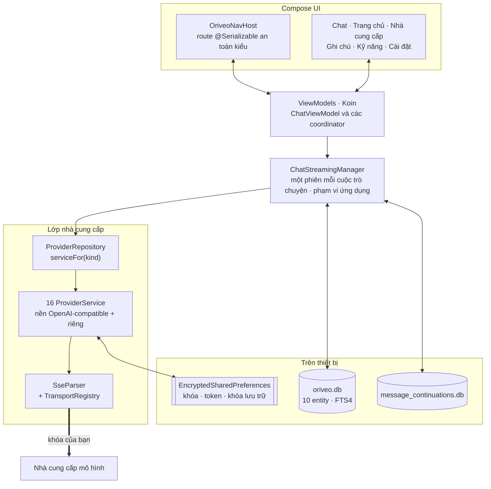

<div align="center">

# Oriveo cho Android

**Một client chat Jetpack Compose native cho những mô hình AI bạn vốn đã trả tiền để dùng.**

<a href="../../LICENSE"></a>


<sub>

<a href="../../android/README.md">English</a> ·
<a href="../ar/android.md">العربية</a> ·
<a href="../de/android.md">Deutsch</a> ·
<a href="../es/android.md">Español</a> ·
<a href="../fr/android.md">Français</a> ·
<a href="../hi/android.md">हिन्दी</a> ·
<a href="../id/android.md">Indonesia</a> ·
<a href="../ja/android.md">日本語</a> ·
<a href="../ko/android.md">한국어</a> ·
<a href="../pt-BR/android.md">Português</a> ·
<a href="../ru/android.md">Русский</a> ·
<a href="../th/android.md">ไทย</a> ·
<a href="../tr/android.md">Türkçe</a> ·
**Tiếng Việt** ·
<a href="../zh-Hans/android.md">简体中文</a> ·
<a href="../zh-Hant/android.md">繁體中文</a>

</sub>

</div>

---

Client Android của Oriveo là một ứng dụng chat AI theo mô hình bring-your-own-key. Bạn thêm những
khóa API mà bạn đã sở hữu, và ứng dụng nói chuyện thẳng với từng nhà cung cấp ngay từ điện thoại.
Cuộc trò chuyện, ghi chú, thư mục và kỹ năng được lưu trên thiết bị bằng Room; khóa API được mã hóa
bằng một khóa nằm trong Android Keystore. Không có tài khoản và không cần đăng nhập.

Đây là một phần của [Oriveo Community Edition](README.md) — ba client dùng chung một định nghĩa duy
nhất về cách nói chuyện với nhà cung cấp mô hình.

## Kiến trúc



Ba điều trong sơ đồ này là quyết định thiết kế có chủ đích, chứ không phải cấu trúc ngẫu nhiên.

**Streaming sống ở tầng trên màn hình.** `ChatStreamingManager` giữ một `StreamingSession` cho mỗi
id cuộc trò chuyện trong một `ConcurrentHashMap`, mỗi phiên có
`CoroutineScope(SupervisorJob() + Dispatchers.IO)` phạm vi ứng dụng của riêng nó. Rời khỏi một cuộc
chat không hủy câu trả lời, và `StreamingTokenBuffer` định kỳ đẩy phần văn bản đã có xuống SQLite,
nên tắt ứng dụng giữa chừng cũng không làm mất những gì đã về tới.

**Hai cơ sở dữ liệu, không phải một.** `oriveo.db` chứa cuộc trò chuyện, tin nhắn, tệp đính kèm, ghi
chú, thư mục, kỹ năng và bộ đệm danh mục mô hình. `message_continuations.db` là một tệp tách rời về
mặt vật lý, chứa trạng thái continuation mờ đục của nhà cung cấp, chính là để `backup_rules.xml` và
`data_extraction_rules.xml` có thể loại nó khỏi sao lưu đám mây và chuyển máy — một token
continuation được khôi phục sang máy khác, may lắm cũng chỉ là vô nghĩa.

**Một danh mục mới hơn bản binary sẽ suy giảm chứ không vỡ.** `TransportKind` là một enum đóng với
bộ deserializer dễ tính: một chuỗi transport lạ sẽ giải mã thành `null`, `TransportRegistry` không
trả về chiến lược nào, và mô hình đó bị lọc khỏi danh sách chọn. Phương án còn lại — một enum
nghiêm ngặt — sẽ làm hỏng việc phân tích toàn bộ danh mục và kéo theo mọi mô hình khác cùng chết.

## Mô hình được phép làm gì

Client không bao giờ đoán khả năng của một mô hình từ tên của nó. Nó đọc một capability runtime từ
danh mục: các công thức mô tả, với một nhà cung cấp, một transport và một khả năng cụ thể, chính xác
những JSON pointer nào cần ghi vào yêu cầu. `ProviderRecipeRequestCompiler` kiểm chứng công thức đó
với nhà cung cấp, khả năng và transport trước khi biên dịch nó thành một body delta có chủ sở hữu rõ
ràng, và từ chối kèm một lý do có tên (`recipe_not_found`, `transport_mismatch`,
`model_route_must_not_patch_body`) thay vì lặng lẽ tạo ra một yêu cầu chẳng ai xem qua.

Ở chiều về, `CapabilityEvidenceFacade` xếp hạng những gì thực sự biết được về một khả năng theo
nguồn — `operator_override` > `server_typed` > `server_profile` > `model_facts` >
`relay_verification` > `relay_declaration` > `legacy_metadata`. Chỉ bộ phân tích luồng mới được đánh
dấu một khả năng là *observed*; ý định, công thức, một HTTP 200 và một khai báo công cụ đều không
được tính, điều này được nói rõ. Kết quả theo từng tin nhắn được lưu lại, nên giao diện phân biệt
được *đã yêu cầu* với *đã xác nhận*.

Các mức ghi đè được giải quyết theo nguyên tắc ghi sau thắng, trên bảy phạm vi, theo thứ tự ưu tiên:
`single_send` > `conversation_connection_model` > `skill_agent` > `connection_model` >
`connection` > `provider_recipe` > `provider_default`.

## Lưu trữ và bí mật

| Cái gì | Ở đâu |
|---|---|
| Cuộc trò chuyện, tin nhắn, tệp đính kèm, ghi chú, thư mục, kỹ năng | Room, `oriveo.db` |
| Tìm kiếm toàn văn trên ghi chú | bảng ảo FTS4 |
| Bộ đệm danh mục mô hình | một hàng duy nhất trong `oriveo.db`, đọc lại theo từng chunk |
| Trạng thái continuation của nhà cung cấp | `message_continuations.db`, loại khỏi sao lưu |
| Khóa API của nhà cung cấp | `EncryptedSharedPreferences`, AES-256-GCM, master key giữ trong Keystore |
| Token OAuth của gói thuê bao | một tệp preferences mã hóa thứ hai, tách riêng |
| Khóa của kho lưu trữ sao lưu | một tệp thứ ba |
| Tệp đính kèm | các tệp trên đĩa, tham chiếu bằng id |

Ba tệp preferences được mã hóa này tách theo vòng đời và bán kính thiệt hại chứ không gộp lại cho
tiện. Mỗi tệp có một đường phục hồi riêng: một tệp hỏng (`AEADBadTagException`,
`VERIFICATION_FAILED`) sẽ được phát hiện, xóa đi và tạo lại, thay vì làm ứng dụng sập mỗi lần mở.

Cả ba tệp đó, cùng với cơ sở dữ liệu continuation, đều bị loại khỏi sao lưu đám mây và chuyển máy
của Android. Đó là hệ quả của việc gắn chúng với Keystore chứ không phải một sơ suất — dù sao thì
bản mã cũng không giải được trên máy mới. **Sau khi chuyển sang điện thoại mới, bạn nhập lại khóa
API và đăng nhập lại vào mọi gói thuê bao của nhà cung cấp**; cuộc trò chuyện và ghi chú thì chuyển
sang bình thường.

Các bản sao lưu do bạn tự xuất ra được mã hóa riêng, bằng PBKDF2-HMAC-SHA256 với 600.000 vòng lặp và
AES-GCM, dùng mật khẩu do bạn chọn.

## Kết nối tới máy chủ mô hình trong mạng của bạn

Manifest đặt `android:usesCleartextTraffic="true"` một cách có chủ đích: các máy chủ mô hình cục bộ —
llama.cpp, Ollama, LM Studio, vLLM — nói HTTP thuần trên chính máy bạn hoặc trong mạng LAN, và
thường không có chứng chỉ.

Ranh giới thật nằm trong mã nguồn chứ không phải trong manifest, vì buộc phải như vậy.
`RelayEndpointPolicy` phân giải host, đòi **mọi** địa chỉ phân giải được đều phải là địa chỉ riêng
tư (loopback, RFC 1918, link-local, unique-local, và dải CGNAT khi ở chế độ VPN), từ chối một host
phân giải ra hỗn hợp cả địa chỉ công khai lẫn riêng tư, ghim tập địa chỉ đã phân giải để chống DNS
rebinding rồi kiểm chứng lại vào lúc gửi, từ chối mọi yêu cầu không mã hóa có mang theo thông tin
xác thực, và chặn các chuyển hướng khác origin hoặc đổi scheme.

Một network security config của Android không thể diễn đạt được tập điều kiện đó: nó chỉ khớp theo
tên host, không có cú pháp cho dải địa chỉ, và các địa chỉ ở đây đến từ chính mạng của người dùng
lúc chạy. Một config cũng yếu hơn hẳn, vì nó không bao giờ nhìn thấy một cái tên đã phân giải ra địa
chỉ nào.

## Danh mục mô hình

Ứng dụng đọc khả năng và giá của các mô hình từ một danh mục công khai, để một mô hình ra mắt hôm
nay chạy được ngay mà không cần cập nhật ứng dụng. Đó là một lệnh `GET` HTTPS thuần túy, không kèm
thông tin xác thực và không kèm định danh, còn các yêu cầu chat thì chẳng bao giờ đi gần nó. Chỉ có
hai endpoint được gọi:

```
GET {base}/api/metadata?view=lean
GET {base}/api/metadata/model-facts
```

URL cơ sở là một thuộc tính lúc dựng, mặc định là `https://api.oriveoai.com`:

```bash
./gradlew :app:assembleDebug -PORIVEO_METADATA_BASE_URL=https://your.host
```

Phản hồi được tái kiểm chứng bằng ETag và lưu đệm trong `oriveo.db`, nên một khi đã tải thành công
một lần, ứng dụng vẫn chạy từ bản đệm khi về sau không với tới được danh mục.

> [!IMPORTANT]
> Dựng với giá trị rỗng (`-PORIVEO_METADATA_BASE_URL=`) sẽ tắt hẳn việc tải danh mục, và **không có
> bản snapshot nào được đóng gói trong APK**. Khi cài mới một bản dựng như vậy:
>
> - không nhà cung cấp nào trong số 15 nhà tích hợp sẵn có danh sách mô hình, và ứng dụng cũng không
>   đi hỏi nhà cung cấp — danh mục là nguồn duy nhất;
> - lỗi này **im lặng**. Thêm khóa vẫn báo thành công, còn danh sách chọn mô hình thì đơn giản là
>   rỗng, không một lời giải thích;
> - **OpenAI trở nên không dùng được**, vì việc nhập mô hình thủ công bị chặn với nhà cung cấp đó;
> - các endpoint Relay và máy chủ mô hình cục bộ vẫn hoạt động đầy đủ, và là đường duy nhất còn
>   nguyên vẹn.
>
> Nếu bạn muốn một bản dựng offline, hãy tự phục vụ danh mục và trỏ bản dựng về đó, thay vì bỏ trống
> giá trị.

## Cấu trúc dự án

```
android/
  app/src/main/java/ai/oriveo/community/
    core/
      provider/    every provider service, transports, relay, capability recipes
      data/        Room entities, DAOs, repositories, backup, catalog client
      model/       domain models and the capability/preference resolvers
      attachments/ routing, budgets, per-format text extraction
      security/    SecureKeyStore, BackupCrypto, external-URL policy
      streaming/   ChatStreamingManager
      navigation/  AppRoute, OriveoNavHost
    feature/       one package per screen
    ui/            shared components, Markdown + LaTeX renderer, theme
    di/            Koin modules
  benchmark/       macrobenchmark suite (cold start, model picker)
```

## Dựng

Yêu cầu: **JDK 17 trở lên** và Android SDK. Bản dựng dùng AGP 9.3, Gradle 9.5 và Kotlin 2.3, nên
Android Studio phải là bản có thể sync được AGP 9.3; còn từ dòng lệnh thì chỉ cần JDK và SDK.

```bash
./gradlew :app:assembleDebug
./gradlew :app:testDebugUnitTest
```

Bản dựng nhắm `minSdk 26`, `targetSdk 36`, `compileSdk 37`. Tệp `local.properties` (đường dẫn SDK
của bạn) do Android Studio sinh ra và không được commit. Việc ký bản release được mô tả trong
[SIGNING.md](../../android/SIGNING.md).

> [!NOTE]
> Gradle daemon chạy trên toolchain Java 21 (`gradle/gradle-daemon-jvm.properties`), và điều kiện
> khớp là đúng 21, không phải "21 trở lên". Nếu bạn cài một JDK khác, Gradle sẽ tự tải một JDK 21
> cho riêng nó ở lần dựng đầu tiên, việc này cần mạng; tự cài JDK 21 sẽ tránh được. Nếu bạn đã đặt
> `org.gradle.java.installations.auto-download=false`, việc tải đó không thể xảy ra và bản dựng sẽ
> thất bại với `Toolchain auto-provisioning is not enabled.` — đó là trường hợp duy nhất mà chỉ mỗi
> JDK 17 thực sự là không đủ. Dù theo đường nào thì việc biên dịch vẫn nhắm Java 17.

Mức song song khi chạy unit test được suy ra từ số CPU và bộ nhớ vật lý của máy chứ không viết cứng,
nên bộ test cư xử hợp lý cả trên laptop lẫn trên một workstation lớn.

## Phụ thuộc

| Thư viện | Phiên bản | Dùng để |
|---|---|---|
| Jetpack Compose BOM | 2026.08.00 | giao diện, Material 3 |
| Room | 2.8.4 | SQLite, DAO, FTS4 |
| Koin | 4.2.2 | dependency injection |
| Ktor client (OkHttp engine) | 3.5.2 | HTTP và SSE tới nhà cung cấp |
| kotlinx.serialization | 1.11.0 | JSON |
| navigation-compose | 2.9.6 | route an toàn kiểu |
| androidx.security-crypto | 1.1.0 | `EncryptedSharedPreferences` |
| haze | 1.7.3 | làm mờ nền |
| PDFBox-Android, jsoup | 2.0.27.0, 1.23.2 | bóc tách văn bản từ tệp đính kèm |
| jlatexmath-android | 0.2.0 | kết xuất LaTeX |

Các phiên bản chính xác được ghim trong
[`gradle/libs.versions.toml`](../../android/gradle/libs.versions.toml).

## Kiểm thử

```bash
./gradlew :app:testDebugUnitTest
```

Khoảng 3.000 unit test trải trên 319 tệp, dùng JUnit 4, MockK, Turbine,
`kotlinx-coroutines-test` và mock engine của Ktor. Độ bao phủ dày nhất ở chỗ mà sai lầm tốn kém
nhất: hình dạng yêu cầu theo từng nhà cung cấp, phân tích SSE, chọn transport, dò relay và các chế
độ bảo mật, thực thi capability recipe, lưu đệm danh mục và xử lý phiên bản contract, lưu trữ bằng
Room, và các vòng sao lưu — khôi phục.

> [!IMPORTANT]
> Khoảng 38 bộ test nạp contract fixture từ `shared/` bằng cách đi ngược lên từ thư mục làm việc,
> nên **các bài test chỉ chạy đúng khi bạn checkout toàn bộ kho mã** — sao chép riêng thư mục
> `android/` ra sẽ không hoạt động.

Ngoài ra còn ba bài instrumented test — một ma trận release cho engine cục bộ, một bài test socket
không mã hóa, và một bài test cô lập keystore. Chúng không tự đứng một mình: các bài về engine cục
bộ cần tham số instrumentation trỏ tới một máy chủ mô hình đang chạy thật trong mạng của bạn, nên
`connectedAndroidTest` không chạy trót lọt ngay từ đầu. Cửa chốt cho một pull request là bộ unit
test.

Module `:benchmark` chứa các macrobenchmark cho khởi động nguội và danh sách chọn mô hình. Đó là một
module Gradle riêng dùng `com.android.test` với self-instrumentation, và nó điều khiển một build
type `benchmark` riêng của `:app`.

Cả hai cơ sở dữ liệu đều ở `version = 1` và chưa có migration nào; schema được xuất ra `app/schemas/`
và đã commit, đó cũng là nơi tệp `2.json` của migration đầu tiên sẽ nằm.

## Bản địa hóa

Mười sáu ngôn ngữ: `values/` (tiếng Anh, nguồn) cộng mười lăm thư mục `values-*`, mỗi thư mục khoảng
1.700 chuỗi, và mọi locale đều giữ đúng cùng một tập khóa. Việc đổi ngôn ngữ trong ứng dụng đi qua
`AppLanguageManager` và `android:localeConfig`. Cơ chế tách gói theo ngôn ngữ bị tắt trong bundle,
nên một artifact duy nhất mang theo mọi bản dịch.

## Đóng góp

Xem [CONTRIBUTING.md](../../CONTRIBUTING.md). Ngôn ngữ làm việc của dự án là tiếng Anh: mã nguồn,
chú thích, test và thông điệp commit. Chuỗi giao diện thì được dịch — hãy thêm chuỗi mới vào
`values/` trước và để các locale khác theo sau. Chạy unit test trước khi mở pull request.

## Giấy phép

[AGPL-3.0-or-later](../../LICENSE).
