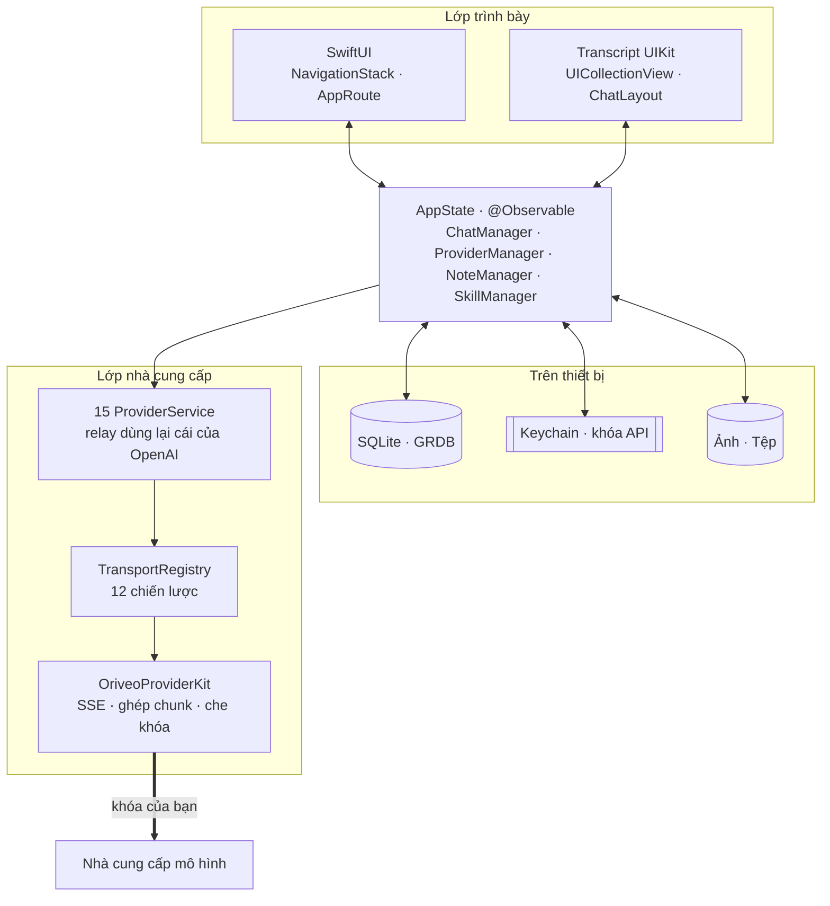
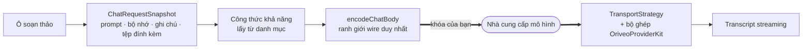

<div align="center">

# Oriveo cho iOS

**Một client chat SwiftUI native cho những mô hình AI bạn vốn đã trả tiền để dùng.**

<a href="../../LICENSE"></a>


<sub>

<a href="../../ios/README.md">English</a> ·
<a href="../ar/ios.md">العربية</a> ·
<a href="../de/ios.md">Deutsch</a> ·
<a href="../es/ios.md">Español</a> ·
<a href="../fr/ios.md">Français</a> ·
<a href="../hi/ios.md">हिन्दी</a> ·
<a href="../id/ios.md">Indonesia</a> ·
<a href="../ja/ios.md">日本語</a> ·
<a href="../ko/ios.md">한국어</a> ·
<a href="../pt-BR/ios.md">Português</a> ·
<a href="../ru/ios.md">Русский</a> ·
<a href="../th/ios.md">ไทย</a> ·
<a href="../tr/ios.md">Türkçe</a> ·
**Tiếng Việt** ·
<a href="../zh-Hans/ios.md">简体中文</a> ·
<a href="../zh-Hant/ios.md">繁體中文</a>

</sub>

</div>

---

Client iOS của Oriveo là một ứng dụng chat AI theo mô hình bring-your-own-key. Bạn thêm những khóa
API mà bạn đã sở hữu, và ứng dụng gọi thẳng từng nhà cung cấp ngay từ điện thoại. Cuộc trò chuyện,
tin nhắn, ghi chú và thư mục ghi chú nằm trong một cơ sở dữ liệu SQLite trên thiết bị; phần nội dung
nhị phân của tệp đính kèm là các tệp nằm cạnh nó; còn kỹ năng, tùy chọn, danh sách nhà cung cấp và
thư mục cuộc trò chuyện là JSON trên thiết bị. Khóa API đi vào iOS Keychain.

Không có tài khoản Oriveo: không có gì được tải lên, và cũng không có gì để đăng nhập. Đúng là có hai
nhà cung cấp cho phép đăng nhập bằng một gói thuê bao bạn đã có thay vì dán khóa vào — ChatGPT và
Grok — và lượt đăng nhập đó đi tới OpenAI và xAI, không phải tới chúng tôi.

Đây là một phần của [Oriveo Community Edition](README.md) — ba client dùng chung một định nghĩa duy
nhất về cách nói chuyện với nhà cung cấp mô hình.

## Kiến trúc



Có ba điều trong sơ đồ này đáng nói thẳng ra.

**Transcript là UIKit, phần còn lại là SwiftUI.** `ChatView` nhúng một
`ChatListViewControllerRepresentable` bọc quanh một `UICollectionView` do
[ChatLayout](https://github.com/ekazaev/ChatLayout) điều khiển. Mọi thứ khác — điều hướng, cài đặt,
thiết lập nhà cung cấp, ghi chú, kỹ năng — đều là SwiftUI. Sự tách đôi này tồn tại vì một transcript
streaming ở tốc độ token cần mức kiểm soát đo đạc và tái sử dụng ở từng cell mà cơ chế diffing của
SwiftUI không cho được. Ranh giới đó được ghi lại trong
[`Features/Chat/ARCHITECTURE.md`](../../ios/Oriveo/Oriveo/Features/Chat/ARCHITECTURE.md).

**Có ba đường độc lập cùng cập nhật transcript đó**, và đó là chủ ý.

| Đường đi | Mang gì | Vì sao |
|---|---|---|
| `@Observable AppState` | thay đổi về cấu trúc — một tin nhắn xuất hiện, một cuộc trò chuyện được chuyển | thuần SwiftUI, rẻ với những sự kiện tần suất thấp |
| GRDB `ValueObservation` | trạng thái bền vững đọc ngược lại từ SQLite | một nguồn sự thật duy nhất sau khi ghi, còn nguyên sau khi khởi động lại |
| Combine `PassthroughSubject` cho mỗi cuộc trò chuyện | văn bản streaming và các delta suy luận | né hoàn toàn diffing của SwiftUI ở tốc độ token |

**Hỗ trợ nhà cung cấp là bốn trục độc lập, không phải một enum.** `ProviderKind` (16 trường hợp: mười lăm nhà cung
cấp cộng thêm relay) là *người dùng đã cấu hình cái gì*. `ProviderServiceProtocol` là *bề mặt gọi*. `TransportKind`
(12 trường hợp) là *giao thức wire thực sự được nói* — và nó được quyết định **theo từng mô hình,
từ danh mục**, nên hai mô hình sau cùng một khóa vẫn có thể khác nhau. `RelayKind` lo các endpoint
do người dùng tự cung cấp. Chính việc giữ chúng tách biệt là thứ khiến một mô hình mới chạy được mà
không cần bản dựng mới.

### Một tin nhắn được gửi đi như thế nào



`BaseAPIService.encodeChatBody` là chặng cuối trước khi một yêu cầu tương thích OpenAI trở thành
byte — mười hai trong số mười sáu trường hợp đi qua đó, nên một công thức khả năng, một tham số
sinh hay một trường tùy chỉnh có thể kiểm thử ở một chỗ thay vì mười hai chỗ. OpenAI, Anthropic và
Gemini nói bằng hình dạng riêng của chúng và tuần tự hóa trong service riêng của chúng; mỗi điểm đó
đều có bộ test hình dạng yêu cầu riêng.

## Mô hình được phép làm gì

Client không bao giờ đoán khả năng của một mô hình từ tên của nó. Nó đọc một **capability runtime** —
một tập công thức mô tả, với một nhà cung cấp, một transport và một khả năng cụ thể, chính xác những
JSON pointer nào cần ghi vào yêu cầu. Các công thức đó nằm trong
[`shared/capabilityrecipe`](../../shared/capabilityrecipe/) và được
`CapabilityRecipeRequestCompiler` áp dụng.

Ở chiều về, `CapabilityExecutionRuntime` ghi lại điều thực sự đã xảy ra. Chỉ một bộ phân tích luồng
trên đường chạy production đã được chọn mới có quyền nâng một khả năng lên mức *observed*. Một HTTP
200, một câu trả lời không rỗng, và một khai báo công cụ trong yêu cầu đều **không phải bằng chứng**,
điều này được nói rõ. Trạng thái cuối được lưu theo từng tin nhắn, nên giao diện có thể nói cho bạn
biết rằng một điều khiển đã được yêu cầu nhưng chưa bao giờ được xác nhận, thay vì lặng lẽ ngụ ý
rằng nó đã hoạt động.

## Lưu trữ

```
Application Support/Oriveo/
  active-uid                     # storage partition, "guest" by default
  users/<uid>/
    oriveo.sqlite                # conversations, messages, notes and folders, catalog cache
    Images/  Files/              # attachment blobs, referenced by id
    session-snapshot.json        # preferences, provider list, folders, last used model
```

- **SQLite thông qua GRDB** với WAL, bật khóa ngoại, và một `DatabaseMigrator` bao trọn mọi thay đổi
  schema. Tìm kiếm toàn văn trên tin nhắn và ghi chú dùng FTS5 với bộ tách từ trigram.
- **Khóa API nằm trong Keychain**, đánh chỉ mục theo nhà cung cấp và phân vùng, và bị xóa trắng khỏi
  session snapshot trước khi snapshot được ghi xuống. Kỹ năng được lưu riêng dưới dạng JSON trong
  `UserDefaults`.
- **Tệp đính kèm là các tệp trên đĩa**, không phải hàng trong bảng, nên một file PDF lớn không bao
  giờ làm phình cơ sở dữ liệu.

Một bản sao lưu là một tệp ZIP `.oriveo` chứa `data.json` cùng các tệp ảnh. Mật khẩu tùy chọn không mã
hóa cả kho lưu trữ: nó chỉ mã hóa các khóa API của nhà cung cấp nằm bên trong (AES-GCM, với khóa được
dẫn xuất bằng PBKDF2-HMAC-SHA256 qua 600.000 vòng). Dù có mật khẩu hay không, cuộc trò chuyện, ghi
chú, kỹ năng và tùy chọn vẫn là JSON thuần trong kho lưu trữ, nên hãy coi một tệp sao lưu là thứ mà
bất cứ ai có nó đều đọc được.

## Những yêu cầu ứng dụng tự thực hiện

Khi khởi động nguội, ứng dụng phát một yêu cầu `GET` không cần xác thực, có điều kiện ETag, tới
`https://api.oriveoai.com/api/metadata?view=lean`. Nó tải danh mục mô hình công khai: có những mô
hình nào, mỗi mô hình hỗ trợ gì, các điều khiển suy luận của nó tên là gì, và giá bao nhiêu. Không
kèm khóa, không kèm cuộc trò chuyện và không kèm định danh, và phản hồi được lưu đệm trong SQLite nên
ứng dụng vẫn chạy từ bản đệm khi không với tới được danh mục. Một endpoint thứ hai,
`/api/metadata/model-facts`, chỉ được đọc sau khi bạn đăng nhập bằng gói thuê bao ChatGPT hoặc Grok,
để biết các mô hình của gói đó làm được những gì.

Đó là toàn bộ những yêu cầu ứng dụng thực hiện cho chính nó. Mọi thứ khác đều đi tới một nhà cung cấp
mà bạn đã cấu hình, bằng khóa của bạn.

Trỏ danh mục về host của riêng bạn là **một tiện lợi của bản dựng Debug**, được phân giải trong
`Oriveo/Core/Providers/BackendURLResolver.swift` theo thứ tự sau:

1. biến môi trường `ORIVEO_METADATA_BASE_URL`, đặt trong Run action của scheme; rồi
2. một chuỗi `ORIVEO_METADATA_BASE_URL` trong `ios/Oriveo/Config/Info.plist` — khóa này đã có ở đó và
   để rỗng, nên chỉ cần điền vào là đủ; rồi
3. `https://api.oriveoai.com`.

Có hai điều cần biết. Bản dựng Release bỏ qua cả hai và luôn dùng danh mục đã phát hành; muốn đổi
điều đó thì phải sửa `BackendURLResolver`. Và khi test bundle đang chạy, hoặc với `CI=true`, một giá
trị ghi đè trỏ tới địa chỉ riêng tư (localhost, `10/8`, `192.168/16`, `172.16/12`, `.local`, IPv6
link-local) sẽ bị bỏ qua, nên một host cục bộ còn sót lại không thể làm cho bộ test phụ thuộc vào
chiếc máy mà bạn đang ngồi trước.

## Cấu trúc dự án

```
ios/Oriveo/
  Config/Info.plist    the app's Info.plist; GENERATE_INFOPLIST_FILE is off
  Oriveo.xcodeproj/
  Oriveo/
    Core/
      Providers/       15 provider services, transports, capability runtime, catalog client
      State/           AppState and the managers it owns
      Database/        GRDB pool, schema, migrator, stores, observations
      Models/          domain types
      Attachments/     import limits, budgets, per-format text extraction
      Tools/           tool-call loop and per-protocol adapters
      Cache/ Localization/ Observability/ Reachability/ Routing/ Usage/
    Features/
      App/             root view and tab shell
      Chat/            transcript, composer, model controls, cross-check, export
      Providers/       setup, detail, relay, local engines, subscription sign-in
      Home/ Notes/ Skills/ Settings/ Backup/ Onboarding/
    Shared/Components/ shared views
    DesignSystem/      theme, colour, haptics
    Preview/           sample data for SwiftUI previews
    *.xcstrings        ten string catalogs
    Assets.xcassets · PrivacyInfo.xcprivacy · Oriveo.entitlements
  OriveoTests/
```

## Dựng và chạy

Bạn cần **Xcode 26**, và để chạy trên thiết bị thật thì cần một máy chạy **iOS 18 trở lên**. Tài
khoản Apple Developer miễn phí là đủ: tệp entitlements để rỗng và ứng dụng không dùng capability trả
phí nào — không push, không iCloud, không app group, không associated domain.

Xcode 16.3 là mức sàn mà định dạng dự án và phiên bản Swift tools thực sự đòi hỏi, nhưng target có
đặt `SWIFT_APPROACHABLE_CONCURRENCY` và `SWIFT_DEFAULT_ACTOR_ISOLATION = MainActor`, những thứ mà các
bản Xcode cũ hơn bỏ qua mà không nói gì. Để actor isolation bị đổi lặng lẽ là một cách tệ để phát
hiện ra điều đó, nên hãy dựng bằng Xcode 26.

1. Mở `ios/Oriveo/Oriveo.xcodeproj`
2. Chọn scheme `Oriveo`
3. Trong **Signing & Capabilities**, chọn Team của bạn
4. Nếu Xcode không đăng ký được `ai.oriveo.community`, hãy đổi bundle identifier sang một định danh
   mà nhóm của bạn sở hữu
5. Cắm iPhone, bật Developer Mode, tin cậy máy tính, rồi nhấn Run

Nếu muốn dựng cho Simulator, chọn bất kỳ simulator iPhone nào rồi nhấn Run. Các phụ thuộc package
được resolve từ tệp `Package.resolved` đã commit.

**Trên một máy Mac dùng Apple silicon**, bản dựng iPhone cũng chạy native được: chọn đích **My Mac
(Designed for iPad)**. Mac Catalyst bị tắt một cách có chủ ý (`SUPPORTS_MACCATALYST = NO`), nên đây là
ứng dụng iOS chạy dưới môi trường tương thích iPad chứ không phải một ứng dụng Mac — những đường đi
chỉ có trên thiết bị, như chụp ảnh bằng camera, hành xử đúng như cách chúng hành xử trên một máy Mac.

Tệp dự án dùng `objectVersion = 77` với các nhóm đồng bộ theo hệ thống tệp, nên một bản Xcode cũ hơn
có thể từ chối mở nó. Hãy cập nhật Xcode thay vì sửa định dạng dự án.

> [!NOTE]
> Target ứng dụng biên dịch ở chế độ ngôn ngữ Swift 5; package `OriveoProviderKit` cục bộ khai báo
> `swift-tools-version: 6.1` và được dựng ở chế độ ngôn ngữ Swift 6.

## Phụ thuộc

| Package | Phiên bản | Dùng để |
|---|---|---|
| [GRDB.swift](https://github.com/groue/GRDB.swift) | 7.11.1 | truy cập SQLite, migration, `ValueObservation` |
| [ChatLayout](https://github.com/ekazaev/ChatLayout) | 2.4.3 | bố cục collection view của transcript |
| [swift-markdown-ui](https://github.com/gonzalezreal/swift-markdown-ui) | 2.4.1 | kết xuất Markdown |
| [SwiftMath](https://github.com/mgriebling/SwiftMath) | 1.7.3 | kết xuất LaTeX |
| [ZIPFoundation](https://github.com/weichsel/ZIPFoundation) | 0.9.20 | kho lưu trữ sao lưu, bóc tách Office/EPUB/ODF |
| `OriveoProviderKit` | cục bộ | nhân wire của nhà cung cấp, trong [`shared/`](shared.md) |

`Package.resolved` cũng ghim hai phụ thuộc bắc cầu mà swift-markdown-ui mang theo:
[NetworkImage](https://github.com/gonzalezreal/NetworkImage) 6.0.1 và
[swift-cmark](https://github.com/swiftlang/swift-cmark) 0.8.0. Mọi phụ thuộc trực tiếp đều dùng giấy
phép MIT còn swift-cmark là BSD-2-Clause, tất cả đều tương thích với AGPL-3.0-or-later.

## Kiểm thử

Chạy test action (⌘U) của scheme `Oriveo` trong Xcode, hoặc từ thư mục gốc của kho mã:

```bash
xcodebuild test -project ios/Oriveo/Oriveo.xcodeproj -scheme Oriveo \
  -destination 'platform=iOS Simulator,name=iPhone 16'
```

Hãy thay bằng một simulator bạn thực sự có; `xcodebuild -showdestinations` với cùng project và
scheme đó liệt kê mọi thứ mà bản checkout này dựng được.

> [!IMPORTANT]
> Target kiểm thử đọc các contract fixture từ `shared/` bằng cách đi ngược lên từ `#filePath` cho
> tới khi tìm thấy thư mục đó, nên **các bài test chỉ chạy đúng khi bạn checkout toàn bộ kho mã** —
> sao chép riêng thư mục `ios/` ra sẽ không hoạt động.

Bộ test rất lớn: khoảng 2.900 ca [Swift Testing](https://github.com/swiftlang/swift-testing) cộng
thêm 76 ca XCTest, trải trên 274 tệp. Nó bao phủ hình dạng yêu cầu theo từng nhà cung cấp, phát lại
SSE upstream đã ghi, chính sách relay và engine cục bộ, việc đo đạc transcript và hành vi streaming,
lưu trữ, và các vòng sao lưu — khôi phục.

`shared/OriveoProviderKit` có bộ test riêng:

```bash
cd shared/OriveoProviderKit && swift test
```

## Bản địa hóa

Mười sáu ngôn ngữ, lưu dưới dạng Xcode String Catalog (`.xcstrings`) — mười catalog, khoảng 1.340
khóa, tiếng Anh là nguồn. Mọi khóa đều được dịch sang cả mười sáu ngôn ngữ, trừ một số ít được đánh
dấu `shouldTranslate: false`: tên sản phẩm, dấu câu, khung định dạng và những giá trị giao thức mà
dịch đi là sai. Chuỗi được phân giải qua `L10n.tr(_:table:)` dựa trên một bundle `.lproj` chọn theo
thiết lập ngôn ngữ trong ứng dụng, nên đổi ngôn ngữ có hiệu lực ngay mà không cần khởi động lại. Bố
cục phải-sang-trái cho tiếng Ả Rập được xử lý một cách tường minh.

## Đóng góp

Xem [CONTRIBUTING.md](../../CONTRIBUTING.md). Có thay đổi hành vi thì thêm một bài test; với một bản
sửa giao thức nhà cung cấp, hãy ưu tiên một fixture đã ghi trong `shared/test-fixtures` hơn là một
mock viết tay, và nói rõ bạn đã thử với nhà cung cấp và mô hình nào.

## Giấy phép

[AGPL-3.0-or-later](../../LICENSE).
