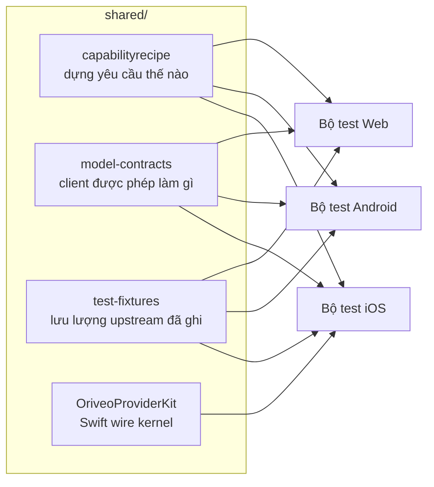

<div align="center">

# Contract dùng chung

**Một định nghĩa duy nhất về cách nói chuyện với nhà cung cấp mô hình, được cả ba client kiểm chứng.**

<a href="../../LICENSE"></a>


<sub>

<a href="../../shared/README.md">English</a> ·
<a href="../ar/shared.md">العربية</a> ·
<a href="../de/shared.md">Deutsch</a> ·
<a href="../es/shared.md">Español</a> ·
<a href="../fr/shared.md">Français</a> ·
<a href="../hi/shared.md">हिन्दी</a> ·
<a href="../id/shared.md">Indonesia</a> ·
<a href="../ja/shared.md">日本語</a> ·
<a href="../ko/shared.md">한국어</a> ·
<a href="../pt-BR/shared.md">Português</a> ·
<a href="../ru/shared.md">Русский</a> ·
<a href="../th/shared.md">ไทย</a> ·
<a href="../tr/shared.md">Türkçe</a> ·
**Tiếng Việt** ·
<a href="../zh-Hans/shared.md">简体中文</a> ·
<a href="../zh-Hant/shared.md">繁體中文</a>

</sub>

</div>

---

Ba client mà mỗi bên tự hiện thực riêng phần "gọi nhà cung cấp" thì chắc chắn sẽ trôi dạt khỏi nhau.
Chúng sẽ trôi dạt trong im lặng, theo hướng của bản mà ai đó đã thử gần nhất, và độ lệch ấy sẽ lộ ra
dưới dạng một lỗi tái hiện được trên một nền tảng nhưng không trên các nền tảng còn lại.

`shared/` là câu trả lời cho chuyện đó: hành vi được ghi lại đúng một lần dưới dạng dữ liệu, và bộ
test của từng client đều kiểm chứng với cùng những tệp ấy. Một điểm kỳ quặc nằm trong chính dữ liệu
đó chỉ phải sửa một lần. Một điểm kỳ quặc nằm trong bộ phân tích thì bị cả ba bộ test bắt cùng một
lúc, thay vì lên được hai nền tảng rồi làm hỏng nền tảng thứ ba.



## capabilityrecipe

Sổ đăng ký công thức. Với một nhà cung cấp, một transport và một khả năng cụ thể — tìm kiếm web, mức
độ suy luận, tạo ảnh — nó nói chính xác những JSON pointer nào cần ghi vào yêu cầu gửi đi, và đọc
câu trả lời ngược lại ra sao.

Đây chính là thứ khiến một mô hình ra mắt hôm nay chạy được mà không cần cập nhật client, và là lý
do không client nào phải đoán một khả năng từ tên mô hình. `capability_runtime.v1.json` mang chính
các công thức; `capability_result_definitions.v1.json` và `capability_custom_controls.v2.json` định
nghĩa cách diễn giải kết quả và các điều khiển mà người dùng nhìn thấy.

Mỗi công thức khai báo một `executionKind` — `request_overlay`, `server_tool`, `client_tool_loop`,
`endpoint_route`, `model_route` — và trình biên dịch của từng client kiểm chứng rằng công thức khớp
với nhà cung cấp, khả năng và transport trước khi áp dụng, từ chối kèm một lý do có tên thay vì gửi
đi một yêu cầu chẳng ai xem qua.

## model-contracts

Các JSON fixture ghim chặt hành vi xuyên client: một yêu cầu phải trông như thế nào với một nhà cung
cấp và một khả năng cụ thể, các tham số sinh được giải quyết ra sao và các mức ghi đè xếp chồng thế
nào, client được phép trình bày những trạng thái khả năng nào, và danh mục mô hình cùng bằng chứng
của nó được tiêu thụ ra sao.

Bộ test của từng client nạp trực tiếp các tệp này, nên một thay đổi ở đây là thay đổi cho cả ba
client cùng lúc.

## test-fixtures

Dữ liệu test chuẩn: lưu lượng gọi công cụ từ upstream đã ghi lại, các kịch bản định tuyến và dò tìm
relay, các snapshot model-facts và bằng chứng khả năng, cùng các kịch bản engine cục bộ.

Những tệp `.sse` nằm dưới `recorded/` là **lưu lượng upstream thật đã bắt được**, giữ nguyên đến
từng byte; số còn lại là fixture viết tay, ghim chặt một đường phân tích cụ thể. Khác biệt ấy có ý
nghĩa: một mock viết tay mã hóa lại điều bạn *tin rằng* nhà cung cấp làm, còn một bản ghi mã hóa lại
điều nó *thực sự đã làm*, kể cả cái chunk méo mó nó gửi đi hôm thứ Ba nọ. Khi một bản sửa giao thức
nhà cung cấp cần một bài test, hãy ưu tiên một bản ghi.

## OriveoProviderKit

Một package Swift chứa nhân giao thức wire của nhà cung cấp: ghép dòng SSE, phân tích chunk theo
chuẩn OpenAI-compatible, mã hóa tên công cụ, che thông tin xác thực, phân loại lỗi từ upstream, phân
tích thẻ thinking, trích xuất theo đường dẫn JSON trong lúc stream, và các hồ sơ kỳ quặc theo từng
nhà cung cấp.

Phạm vi của nó được vạch hẹp một cách có chủ đích. **Nằm trong:** kiến thức về wire chỉ dùng
Foundation. **Nằm ngoài:** mô hình ứng dụng, giao diện, cơ sở dữ liệu, telemetry, bản địa hóa. Mỗi
client Apple giữ một lớp ràng buộc mỏng quanh nó, để hành vi wire có đúng một hiện thực duy nhất.

```bash
cd shared/OriveoProviderKit && swift build && swift test
```

- Nền tảng: iOS 18+, macOS 15+ · `swift-tools-version: 6.1`
- `ProviderWireProfile` mang những điểm kỳ quặc còn sót lại theo từng nhà cung cấp mà một bộ ghép
  OpenAI-compatible duy nhất vẫn cần biết — văn bản suy luận đến ở đâu, số token đã cache nằm chỗ
  nào, prompt token đã bao gồm cache hit hay chưa. Nó mô tả *byte đến như thế nào*, không bao giờ mô
  tả *một mô hình làm được gì*; phần đó là việc của các công thức.

## Khi sửa những tệp này

Một thay đổi ở đây là thay đổi cho mọi client. Hãy chạy bộ test contract của từng client có đọc tệp
mà bạn vừa động vào, chứ không chỉ client bạn tình cờ đang làm việc trong đó:

Từ thư mục gốc của kho mã:

```bash
(cd web && npm run test:run)
(cd shared/OriveoProviderKit && swift test)
# plus the iOS and Android suites — see their READMEs
```

Bộ test iOS định vị thư mục này bằng cách đi ngược lên từ tệp test cho tới khi thấy `shared/`; bộ
test Android phân giải `../../shared` từ thư mục module Gradle; còn bộ test web phân giải tương đối
theo workspace. Vì vậy tất cả đều cần một bản checkout đầy đủ của kho mã.

## Giấy phép

[AGPL-3.0-or-later](../../LICENSE).
