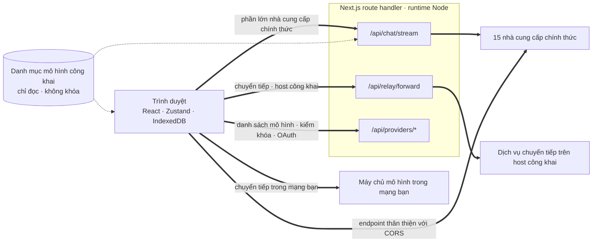
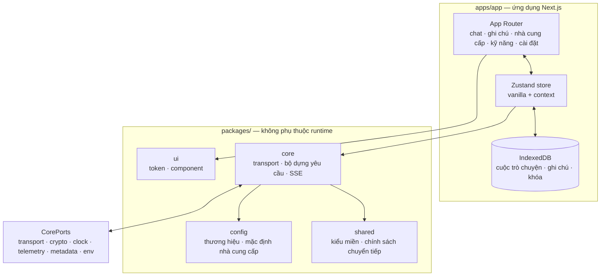

<div align="center">

# Oriveo cho Web

**Một client chat Next.js cho những mô hình AI bạn vốn đã trả tiền để dùng.**

<a href="../../LICENSE"></a>


<sub>

<a href="../../web/README.md">English</a> ·
<a href="../ar/web.md">العربية</a> ·
<a href="../de/web.md">Deutsch</a> ·
<a href="../es/web.md">Español</a> ·
<a href="../fr/web.md">Français</a> ·
<a href="../hi/web.md">हिन्दी</a> ·
<a href="../id/web.md">Indonesia</a> ·
<a href="../ja/web.md">日本語</a> ·
<a href="../ko/web.md">한국어</a> ·
<a href="../pt-BR/web.md">Português</a> ·
<a href="../ru/web.md">Русский</a> ·
<a href="../th/web.md">ไทย</a> ·
<a href="../tr/web.md">Türkçe</a> ·
**Tiếng Việt** ·
<a href="../zh-Hans/web.md">简体中文</a> ·
<a href="../zh-Hant/web.md">繁體中文</a>

</sub>

</div>

---

Client web của Oriveo là một ứng dụng chat AI theo mô hình bring-your-own-key, dựng bằng Next.js.
Cuộc trò chuyện, ghi chú, thư mục, kỹ năng và khóa nhà cung cấp của bạn đều nằm trong kho lưu trữ
của chính trình duyệt. Không có tài khoản và không cần đăng nhập.

Đây là một phần của [Oriveo Community Edition](README.md) — ba client dùng chung một định nghĩa duy
nhất về cách nói chuyện với nhà cung cấp mô hình.

## Bắt đầu nhanh

Cần Node 22.22.2 hoặc bản 22.x mới hơn (xem [`.nvmrc`](../../web/.nvmrc)); trường `engines` là
`^22.22.2`, nên Node 23 trở lên không được hỗ trợ. npm đi kèm sẵn; không cần trình quản lý gói nào
khác.

```bash
npm install
npm run dev:app     # http://localhost:3001
```

Màn hình đầu tiên hỏi khóa API của một nhà cung cấp. Không cần gì thêm để bắt đầu trò chuyện.

## Một yêu cầu thực sự đi đường nào

Đây là phần đáng đọc trước hết, vì client web là nơi duy nhất mà một yêu cầu thường **không** đi
thẳng từ client tới nhà cung cấp.



**Vì sao phải đi vòng.** Phần lớn API của các nhà cung cấp không gửi header CORS, nên trình duyệt
không thể gọi thẳng `api.openai.com` và các dịch vụ tương tự — lệnh preflight thất bại. Mọi client
BYOK chạy trong trình duyệt đều phải giải quyết chuyện này bằng cách nào đó; client này chuyển tiếp
qua các Next.js route handler chạy trong runtime Node. Khi bạn chạy `npm run dev:app`, những handler
đó nằm trên chính máy bạn. Khi bạn triển khai ứng dụng ở đâu đó, chúng nằm trên máy bạn đã triển
khai tới.

Không phải chỉ có một handler: stream chat, bộ chuyển tiếp của dịch vụ chuyển tiếp (Relay), tạo ảnh, danh sách mô hình, kiểm
chứng khóa, và hai lượt trao đổi đăng nhập theo thiết bị của Grok và ChatGPT cộng lại thành mười hai
tệp route. Kiểm chứng khóa mới là chỗ đáng lưu ý — nó gửi khóa lên chính máy chủ của bạn, rồi máy
chủ đó dùng khóa để thăm dò nhà cung cấp.

Có một vài endpoint *thực sự* cho phép trình duyệt gọi, và những endpoint đó được gọi trực tiếp,
không có máy chủ nào ở giữa: endpoint Trung Quốc của Kimi (`api.moonshot.cn`) dùng cho chat, và các
endpoint số dư của OpenRouter, SiliconFlow, DeepSeek và Kimi.

**Handler làm gì và không làm gì.** Nó kiểm chứng hình dạng của yêu cầu và giới hạn kích thước, áp
giới hạn tần suất theo từng IP cho lưu lượng chat và dịch vụ chuyển tiếp, từ chối các URL phân giải ra địa chỉ
riêng tư hoặc link-local, dựng thân yêu cầu riêng cho từng nhà cung cấp, rồi stream phản hồi trở
lại. Không có cơ sở dữ liệu nào, không có lượt ghi xuống hệ thống tệp nào và không có chỗ nào dưới
`app/api` ghi log thân yêu cầu — khóa và tin nhắn của bạn được chuyển tiếp rồi quên đi. Vì route là
một tiến trình duy nhất dùng chung cho mọi khách truy cập, có một bài test chuyên biệt
(`server-never-learns.test.ts`) ghim chặt rằng nó không bao giờ nhớ tham số đã bị từ chối của người
này rồi đem áp vào yêu cầu của người khác.

Bộ chuyển tiếp còn ghim DNS vào đúng địa chỉ nó đã phân giải, giới hạn kích thước phản hồi,
chặn trên mọi timeout, giới hạn chuyển hướng trong cùng origin, và từ chối cho đi qua các header
hop-by-hop.

**Endpoint cục bộ bỏ qua hoàn toàn bước này.** Một dịch vụ chuyển tiếp nằm trên địa chỉ riêng tư,
một tên `.local`,
`localhost`, hay được cấu hình ở chế độ local-HTTP hoặc private-VPN sẽ được gọi **trực tiếp từ trình
duyệt**, với `credentials: 'omit'` và `targetAddressSpace: 'local'`. Lưu lượng trong mạng LAN của
bạn không rời khỏi mạng, và cũng không đi qua máy chủ của ứng dụng.

## Kiến trúc



`packages/core` giữ từng byte kiến thức về giao thức của các nhà cung cấp, và được cố ý giữ sạch
khỏi mọi biến toàn cục của trình duyệt — eslint cấm dùng `window`, `document`, `fetch`, `crypto`,
`localStorage`, `sessionStorage` và `indexedDB` bên trong nó. Bất
cứ thứ gì nó cần từ môi trường đều đi vào qua `CorePorts`. Chính điều đó cho phép cùng một đoạn mã
chạy được trong trình duyệt, trong một Node route handler, và trong một bài test không có DOM.

Hỗ trợ nhà cung cấp có hai trục độc lập. `providerKind` chọn một **bộ dựng yêu cầu** (thân yêu cầu
của nhà cung cấp này trông ra sao). `model.transport` chọn một **chiến lược transport** (giao thức
wire nào được nói) trong số mười hai chiến lược, và nó được quyết định theo từng mô hình từ danh mục
chứ không theo từng nhà cung cấp — nên hai mô hình sau cùng một khóa vẫn có thể khác nhau. Một chiến
lược chỉ hiện thực đúng ba phương thức: `buildRequestBody`, `parseStreamChunk`, `parseError`.

## Các workspace

```
apps/app/               the Next.js application
packages/core/          provider protocols: transports, request builders, SSE parsing
packages/shared/        domain types, relay policy, helpers
packages/ui/            design tokens and shared components
packages/config/        brand and provider defaults
```

Phần tạo kiểu dùng CSS Modules trên một bảng token custom property duy nhất trong `packages/ui` —
không có framework utility-class nào.


Còn một đường ghép cùng loại nữa. `apps/app/lib/core/sync-port.ts` khai báo giao diện mà một backend đồng bộ
sẽ hiện thực, và mọi nơi gọi tới nó đều đi qua optional chaining. Không có gì cài một backend như
vậy, nên `getSyncAdapter()` trả về `null` và IndexedDB vẫn là bản sao duy nhất của dữ liệu của bạn —
đó chính là ý nghĩa thực tế của "không tài khoản, không đăng nhập".

## Lưu trữ

Mọi thứ đều theo từng phân vùng, đánh chỉ mục bằng một id đang hoạt động, mặc định là `guest`.

| Cái gì | Ở đâu |
|---|---|
| Cuộc trò chuyện, tin nhắn, thư mục, ghi chú, nhà cung cấp | IndexedDB `oriveo--{id}`, 8 object store |
| Snapshot danh mục mô hình (~3 MB) và model facts | blob store trong IndexedDB, cố ý không dùng localStorage |
| Tùy chọn và các bảng điều khiển mô hình | `localStorage`, với `safeLocalStorage` bọc những đường đã từng thấy ném lỗi |
| Ảnh được tạo ra và ảnh đính kèm | một cơ sở dữ liệu IndexedDB riêng |

Có hai chi tiết đến từ hỏng hóc thật chứ không phải từ sở thích. Snapshot danh mục nằm trong
IndexedDB vì với ~3 MB, nó ngốn gần hết hạn mức localStorage 5 MB của một origin trình duyệt. Và mọi
lượt truy cập localStorage đều đi qua `safeLocalStorage`, vì bản thân *getter* `window.localStorage`
ném ra `SecurityError` khi trình duyệt được cấu hình chặn dữ liệu trang — một lệnh đọc trần trụi làm
sập trang trước cả khi khối `try` của bạn kịp chạy.

> [!IMPORTANT]
> Trên web, khóa nhà cung cấp được lưu trong IndexedDB **không mã hóa** — đúng như cách các client
> BYOK chạy trong trình duyệt vẫn làm, vì trình duyệt không có chỗ nào tốt hơn để cất chúng. Muốn
> đảm bảo mạnh nhất thì hãy dùng client iOS hoặc Android, nơi keychain hoặc keystore của hệ thống mã
> hóa chúng. Các bản sao lưu lại là chuyện khác: chúng được mã hóa bằng AES-256-GCM và
> PBKDF2-SHA-256 với 600.000 vòng lặp khi bạn chọn một mật khẩu.

## Danh mục mô hình

Việc mỗi nhà cung cấp có những mô hình nào, và mỗi mô hình hỗ trợ gì, đến từ một danh mục chỉ đọc
được tải lúc khởi động. Đúng hai endpoint được gọi, cả hai đều là `GET`, cả hai đều có điều kiện
ETag, và không cái nào mang theo khóa API, cuộc trò chuyện hay bất kỳ định danh người dùng nào:

```
GET {backend}/api/metadata?view=lean
GET {backend}/api/metadata/model-facts
```

Backend mặc định là `https://api.oriveoai.com`. Trỏ `NEXT_PUBLIC_BACKEND_URL` về host của bạn nếu
muốn tự phục vụ. Phản hồi được lưu đệm 24 giờ trong IndexedDB và tái kiểm chứng bằng
`If-None-Match`; khi không với tới được danh mục, ứng dụng vẫn chạy từ bản đệm của nó.

## Lệnh

Chạy các lệnh này từ thư mục hiện tại.

| Lệnh | Làm gì |
|---|---|
| `npm run dev:app` | máy chủ phát triển ở cổng 3001 |
| `npm run build:app` | bản dựng production |
| `npm run typecheck` | `tsc --noEmit` trên mọi workspace |
| `npm run test:run` | vitest, chạy một lượt |
| `npm run test` | vitest ở chế độ watch, mỗi workspace một watcher — nên chạy bên trong một workspace duy nhất |
| `npm run lint` | eslint trên `apps/` và `packages/` |

`npm start --workspace @oriveo/app` phục vụ một bản dựng đã hoàn tất ở cổng 3001.

Muốn chạy một tệp test đơn lẻ thì hãy chạy từ workspace sở hữu nó, vì nhiều bộ test phân giải
fixture theo thư mục làm việc hiện tại:

```bash
cd apps/app && npx vitest run lib/core/chat/__tests__/stream-options.test.ts
```

## Cấu hình

Mọi thứ đều tùy chọn. Sao chép [`.env.example`](../../web/.env.example) thành `.env.local` và chỉ
đặt những gì bạn cần; mọi biến mà mã nguồn có đọc đều được liệt kê và giải thích ngay trong tệp đó.

### Báo cáo lỗi

Ứng dụng có đóng gói sẵn SDK của Sentry. Nó **trơ hoàn toàn khi không có DSN** — không có
`NEXT_PUBLIC_SENTRY_DSN` nghĩa là không có transport, không có sự kiện, không có gì được gửi đi đâu
cả, và đó chính là mặc định của một bản dựng từ kho mã này. Đặt một DSN vào thì bạn có báo cáo lỗi,
10% lượt tracing hiệu năng và 1% session replay, kèm các hook lược bỏ khóa nhà cung cấp, endpoint và
nội dung tin nhắn trước khi một sự kiện rời khỏi trình duyệt. Nó có mặt ở đây để một bản triển khai
nào muốn báo cáo lỗi thì có sẵn mà dùng, chứ không phải vì bản dựng này gọi điện về nhà.

## Tự vận hành

Không có Dockerfile và cũng không có script triển khai; ứng dụng chỉ là một máy chủ Next.js thông
thường.

```bash
npm ci
npm run build:app
npm start --workspace @oriveo/app     # 127.0.0.1:3001
```

Có ba điều đáng biết trước khi đặt nó sau một reverse proxy.

`npm start` gắn vào `127.0.0.1`, nên proxy phải chạy trên cùng máy, hoặc phải đổi địa chỉ gắn.

Đặt `NEXT_PUBLIC_APP_URL` thành đúng origin mà bạn thực sự phục vụ. Các liên kết canonical, sitemap
và ảnh xem trước khi chia sẻ đều phân giải theo nó, còn mặc định của nó là cổng phát triển.

Đặt `TRUSTED_PROXY_HOP_COUNT` thành số proxy đứng trước ứng dụng. Bộ giới hạn tốc độ của chat đọc địa
chỉ client cách bấy nhiêu chặng tính từ *bên phải* của `X-Forwarded-For` — không bao giờ tính từ bên
trái, vì bên trái do client kiểm soát và có thể giả mạo. Mặc định là 1, đúng cho trường hợp một
proxy; để nó thấp quá khi có hai proxy thì mọi khách truy cập sẽ dùng chung một xô giới hạn, vì địa
chỉ đọc được chính là của proxy nội bộ của bạn.

Ứng dụng đã tự gửi HSTS, `X-Content-Type-Options`, `X-Frame-Options`, `Referrer-Policy`,
`Permissions-Policy` và `Cross-Origin-Opener-Policy` từ `next.config.ts`, nên proxy không cần thêm
chúng. Việc kết thúc TLS và giới hạn kích thước yêu cầu là việc của proxy.

Một điều cuối cùng nên quyết định một cách có ý thức: bất cứ ai với tới được bản triển khai đều có
thể dùng các route handler của nó để gọi một nhà cung cấp bằng khóa do chính họ đưa vào. Các handler
không giữ khóa nào của riêng chúng và không lưu gì cả, nhưng chúng là một đường HTTP đi ra, nên một
bản triển khai công khai với tới được nên nằm sau đúng lớp kiểm soát truy cập mà bạn dành cho bất kỳ
công cụ nội bộ nào khác.

## Phụ thuộc

| Gói | Phiên bản | Dùng cho |
|---|---|---|
| [Next.js](https://nextjs.org) | 16.3.3 | App Router, route handler, bản dựng |
| [React](https://react.dev) | 19.2.8 | giao diện |
| [vitest](https://vitest.dev) | 4.1.11 | bộ chạy test |
| [zustand](https://zustand.docs.pmnd.rs) | 5.0.15 | trạng thái phía client |
| [next-intl](https://next-intl.dev) | 4.14.1 | bản địa hóa |
| [@sentry/nextjs](https://docs.sentry.io/platforms/javascript/guides/nextjs/) | 10.72.0 | báo lỗi, không hoạt động nếu thiếu DSN |

Phiên bản chính xác của mọi phụ thuộc được ghim trong `package-lock.json`.

## Kiểm thử

Khoảng 5.600 bài test trải trên 460 tệp, chạy bằng vitest. Độ bao phủ dày nhất ở chỗ mà sai lầm tốn
kém nhất: hình dạng yêu cầu theo từng nhà cung cấp, hành vi transport theo từng giao thức wire, phân
tích chunk của SSE và proxy, phân tích mức sử dụng và chi phí, phân loại lỗi, dò dịch vụ chuyển tiếp và các chế độ
bảo mật, lớp chắn SSRF, thực thi capability recipe, lưu đệm danh mục và việc vô hiệu hóa theo phiên
bản contract, lưu trữ trong IndexedDB, phân vùng kho lưu trữ, các vòng sao lưu — khôi phục, và chính
các route handler.

> [!IMPORTANT]
> Hơn ba mươi bộ test phân giải contract fixture nằm dưới `shared/` theo thư mục làm việc, nên
> **các bài test chỉ chạy đúng khi bạn checkout toàn bộ kho mã và chạy từ workspace sở hữu chúng** —
> sao chép riêng thư mục `web/` ra sẽ không hoạt động.

## Bản địa hóa

Mười sáu locale trong `apps/app/messages`, mỗi locale khoảng 1.800 khóa, tiếng Anh là nguồn. Một bài
test duyệt qua thư mục và báo lỗi nếu tập khóa của bất kỳ locale nào khác với tiếng Anh, nên chỉ cần
thêm một tệp locale là nó tự động được ghi danh. Tiếng Ả Rập có bố cục phải-sang-trái đầy đủ. Việc
chọn locale ưu tiên tham số `?locale=` được chỉ định rõ, rồi tới cookie, rồi tới `Accept-Language`.

## Đóng góp

Xem [CONTRIBUTING.md](../../CONTRIBUTING.md). `packages/core` lấy transport làm gốc: thêm một nhà
cung cấp thường chỉ là một bộ dựng yêu cầu và một bộ điều hợp phản hồi, chứ không phải một client
mới. Với một bản sửa giao thức nhà cung cấp, hãy ưu tiên một fixture đã ghi trong
`shared/test-fixtures` hơn là một mock viết tay.

## Giấy phép

[AGPL-3.0-or-later](../../LICENSE).
