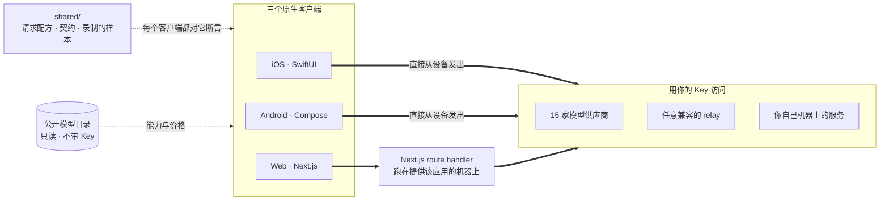

<div align="center">


# Oriveo 社区版

**所有模型，一个应用。**

开源、自带 Key 的 AI 聊天客户端，覆盖 iOS、Android 和 Web，
另有一个原生 macOS 客户端正在开发中。
不需要账号，不需要订阅，请求路径上没有我们的任何服务。

<a href="../../LICENSE"></a>
<a href="ios.md"></a>
<a href="android.md"></a>
<a href="web.md"></a>
<a href="macos.md"></a>


**获取 Oriveo：**
<a href="https://oriveoai.com"><b>oriveoai.com</b></a> &nbsp;·&nbsp;
<a href="https://apps.apple.com/app/oriveo/id6775370458">App Store</a> &nbsp;·&nbsp;
<a href="https://play.google.com/store/apps/details?id=com.kenny.oriveo">Google Play</a> &nbsp;·&nbsp;
<a href="https://app.oriveoai.com">Web 应用</a>

<a href="#开始使用">从源码构建</a> &nbsp;·&nbsp;
<a href="#架构">架构</a> &nbsp;·&nbsp;
<a href="#社区版与-oriveo">版本对比</a> &nbsp;·&nbsp;
<a href="#常见问题">常见问题</a> &nbsp;·&nbsp;
<a href="../../CONTRIBUTING.md">参与贡献</a>

<sub>

<a href="../../README.md">English</a> ·
<a href="../ar/README.md">العربية</a> ·
<a href="../de/README.md">Deutsch</a> ·
<a href="../es/README.md">Español</a> ·
<a href="../fr/README.md">Français</a> ·
<a href="../hi/README.md">हिन्दी</a> ·
<a href="../id/README.md">Indonesia</a> ·
<a href="../ja/README.md">日本語</a> ·
<a href="../ko/README.md">한국어</a> ·
<a href="../pt-BR/README.md">Português</a> ·
<a href="../ru/README.md">Русский</a> ·
<a href="../th/README.md">ไทย</a> ·
<a href="../tr/README.md">Türkçe</a> ·
<a href="../vi/README.md">Tiếng Việt</a> ·
**简体中文** ·
<a href="../zh-Hant/README.md">繁體中文</a>

</sub>

</div>

---

## Oriveo 是什么

Oriveo 社区版是一个开源、自带 Key（BYOK）的 AI 聊天客户端，支持 iOS、Android 和 Web，另有一个原生
macOS 客户端正在开发中。它是给这样一群人的：宁愿直接付钱给模型供应商，也不愿为挡在供应商前面的那一层
交订阅费。你提供自己已有的 API Key，客户端就用它直接和供应商通信。这让它成为托管版 ChatGPT 或 Claude
套餐之外一个本地优先、多模型的选择 —— 没有 Oriveo 账号，没有订阅，没有任何东西向我们回传，而 Web
客户端你可以自己托管。

它原生支持 **15 家模型供应商** —— OpenAI、Anthropic、Google Gemini、OpenRouter、DeepSeek、Grok、
Mistral、Groq、Together AI、Fireworks AI、MiniMax、Z.ai、Qwen、Kimi（Moonshot）和 SiliconFlow ——
再加上 **任何 OpenAI、Anthropic 或 Gemini 兼容的端点**，包括跑在你自己机器上的 llama.cpp、Ollama、
LM Studio 或 vLLM。

| | |
|---|---|
| **供应商** | 内置 15 家，另外还有自定义 relay 端点和本地模型服务器 |
| **客户端** | iOS（SwiftUI）· Android（Jetpack Compose）· Web（Next.js）· macOS 开发中 |
| **界面语言** | 16 种 |
| **是否需要账号** | 不需要 |
| **它为自己发起的调用** | 只有一件事，分两个请求：只读的模型目录，不带 Key，也不带任何由我们附加的标识 |
| **许可证** | AGPL-3.0-or-later |

## 为什么会有它

谁都不该有能力对你付费使用的模型计量、记录或加价。

- **你的 Key，你的账单。** 你按供应商的公开价格付费。没有加价，没有二次计量，也没有转售。
- **默认存在本地。** 对话、笔记、文件夹、Skills 和附件都留在设备上。想导出成文件随时可以；不存在
  某天丢掉访问权的云端副本。
- **一套行为，三个客户端。** 针对某个供应商、传输方式和能力该如何构造请求，只在
  [`shared/`](shared.md) 里写下一次，三个客户端都对着同一批 JSON fixture 做断言。住在这份数据里的
  怪癖修一次就够；住在解析器里的那种，会被三套测试同时抓住。
- **它唯一去取的那样东西。** App 会读取一份公开的模型目录，这样今天新发布的模型不用更新 App
  就能用。它的两个请求都是只读的，不带 Key，也不带任何由我们附加的标识；Web 和 Android 客户端可以
  指向你自己的服务器。

## 功能

- **聊天** —— 流式输出、思考过程、引用来源、附件（图片和视频、PDF、Office（docx、xlsx、pptx）、
  OpenDocument、EPUB、RTF、HTML，以及任何纯文本或源码文件）、划词引用、重试、重新生成、答案被打断
  后继续
- **供应商** —— 内置 15 家，每家用你自己的 Key；可按供应商覆盖模型和生成参数，供应商提供多个区域
  端点时还能选用哪一个
- **Relay** —— 任何 OpenAI、Anthropic 或 Gemini 兼容的端点，包括你局域网内的那一个
- **本地模型服务器** —— llama.cpp、Ollama、LM Studio、vLLM、Open WebUI；iOS 和 Android 会通过 mDNS
  在局域网内发现它们
- **订阅登录** —— 用你已有的 ChatGPT 或 Grok 订阅代替 API Key，走各家供应商自己的设备授权流程
- **Skills** —— 可复用的系统提示词，带各自的模型、思考设置和参考文档
- **笔记与文件夹** —— 把回复存成笔记、整理对话、在两者之间搜索
- **交叉验证** —— 把一份答案交给第二个模型评审，并把两者放在一起
- **花费** —— 按消息和按供应商统计支出，在设备本地根据每次响应实际上报的数据计算，包含缓存读取和
  缓存写入档位
- **图像生成** —— 供应商支持时可用
- **备份** —— 把所有内容导出成文件；其中的供应商 Key 如果你选择一并导出，会用你自己设定的密码加密
- **16 种界面语言**，包括为阿拉伯语提供的完整从右到左布局

## 社区版与 Oriveo

本仓库是 **Oriveo 社区版**，以 [AGPL-3.0-or-later](../../LICENSE) 授权。App Store、Google Play 上的
应用以及托管版 Web 应用是 **Oriveo** —— 一个独立的商业产品，用同样的客户端构建，并在上面加了一层账号
体系。

| | 社区版 | Oriveo |
|---|---|---|
| 源码 | 本仓库，AGPL-3.0-or-later | 闭源 |
| 用自己的供应商 Key 聊天 | 是 | 是 |
| Relay 和本地模型服务器 | 是 | 是 |
| 笔记、文件夹、Skills、附件 | 是 | 是 |
| 设备端花费统计 | 是 | 是 |
| 账号 | 无 | Oriveo 账号 |
| 存储 | 存在设备上；手动导出和恢复 | 本地优先，另有跨设备云同步 |
| 用量洞察与预算提醒 | — | 是 |
| 由 Oriveo 付费的模型 | — | 是 |
| 数据分析与崩溃上报 | 无。Web 包里带有 Sentry，在你自己配上 DSN 之前它一声不吭 | 有 |

社区版构建使用 `ai.oriveo.community` 作为标识符前缀，所以它可以和商店版装在同一台设备上，两者不
共享钥匙串，也不共享任何本地数据。这个版本接受什么、不接受什么，写在
[COMMUNITY.md](../../COMMUNITY.md) 里。

**Oriveo 完整版：**
[iPhone 和 iPad](https://apps.apple.com/app/oriveo/id6775370458) &nbsp;·&nbsp;
[Android](https://play.google.com/store/apps/details?id=com.kenny.oriveo) &nbsp;·&nbsp;
[Web](https://app.oriveoai.com) &nbsp;·&nbsp;
[oriveoai.com](https://oriveoai.com)

## 供应商

下面每一家都用你自己创建的 Key 访问。其中有两家也可以改用你已有的订阅登录，不必用 Key：用 ChatGPT
套餐登录的 OpenAI，以及 Grok。

| 供应商 | 去哪里拿 Key |
|---|---|
| OpenAI | [platform.openai.com](https://platform.openai.com/api-keys) |
| Anthropic | [platform.claude.com](https://platform.claude.com/settings/keys) |
| Google Gemini | [aistudio.google.com](https://aistudio.google.com/apikey) |
| OpenRouter | [openrouter.ai](https://openrouter.ai/keys) |
| DeepSeek | [platform.deepseek.com](https://platform.deepseek.com/api_keys) |
| Grok | [console.x.ai](https://console.x.ai/) |
| Mistral | [console.mistral.ai](https://console.mistral.ai/api-keys) |
| Groq | [console.groq.com](https://console.groq.com/keys) |
| Together AI | [api.together.xyz](https://api.together.xyz/settings/api-keys) |
| Fireworks AI | [fireworks.ai](https://fireworks.ai/api-keys) |
| MiniMax | [platform.minimax.io](https://platform.minimax.io/docs/guides/quickstart-preparation) |
| Z.ai | [open.bigmodel.cn](https://open.bigmodel.cn/usercenter/apikeys) |
| Qwen | [bailian.console.alibabacloud.com](https://bailian.console.alibabacloud.com/?apiKey=1#/api-key) |
| Kimi (Moonshot) | [platform.kimi.ai](https://platform.kimi.ai/console/api-keys) |
| SiliconFlow | [cloud.siliconflow.cn](https://cloud.siliconflow.cn/account/ak) |
| **Relay** | 任何 OpenAI、Anthropic 或 Gemini 兼容的端点，包括你自己机器上的那一个 |

## 架构

三个原生客户端，一份关于「怎么和模型供应商说话」的定义。



每个客户端有自己的 UI、存储和导航，只在唯一一处接缝上与共享契约相接：把*这个模型、这项能力*翻译成
一个 HTTP 请求的那一层。

唯一值得知道的不对称在 Web 客户端。多数供应商的 API 不发 CORS 头，浏览器没法直接调用它们；这些请求
会经过一个 Next.js route handler，它跑在提供该应用的那台机器上 —— 本地运行时就是你自己的机器。少数
确实允许浏览器直连的端点（Kimi 的中国区端点、几家供应商的余额端点），以及你自己网络里的 relay，
都是直连的。iOS 和 Android 客户端没有这个限制，始终直连供应商。

**各客户端的架构：**

| | 技术栈 | README |
|---|---|---|
| **iOS** | SwiftUI 加一个 UIKit 消息列表、GRDB | [ios.md](ios.md) |
| **Android** | Jetpack Compose、Room、Koin、Ktor/OkHttp | [android.md](android.md) |
| **Web** | Next.js App Router、React、Zustand、TypeScript | [web.md](web.md) |
| **macOS** | 开发中，未来几个月发布 | [macos.md](macos.md) |
| **Shared** | 契约、录制的 fixture，以及 Swift 协议内核 | [shared.md](shared.md) |

## 开始使用

这里没有预编译好的二进制文件 —— 没有 APK，没有 `.ipa`。社区版是你自己构建的源码，
商店里的应用是另一个产品。想最快跑起来，Web 客户端是最短的一条路。

<details open>
<summary><b>Web</b> —— 最快的试用方式</summary>

<br>

需要 Node 22.22 或更新版本（见 [`web/.nvmrc`](../../web/.nvmrc)）。

```bash
cd web
npm install
npm run dev:app        # http://localhost:3001
```

第一屏会问你要一个供应商的 API Key。除此之外不需要别的。
更多命令和配置见 [web.md](web.md)。

</details>

<details>
<summary><b>iOS</b> —— 在自己的 iPhone 上构建运行</summary>

<br>

需要一台装有 Xcode 26 的 Mac，以及一台 iOS 18 或更高版本的设备。免费的 Apple Developer 账号就够了
—— 这个 App 不用任何付费能力。

1. 打开 `ios/Oriveo/Oriveo.xcodeproj`
2. 选择 `Oriveo` scheme
3. 在 Signing &amp; Capabilities 里选你自己的 Team
4. 运行

完整步骤，包括 Xcode 打不开工程时该怎么办：[ios.md](ios.md)。

</details>

<details>
<summary><b>Android</b> —— 构建 APK</summary>

<br>

需要 JDK 21 以及 Android SDK。构建使用 AGP 9.3、Gradle 9.5 和 Kotlin 2.3，所以 Android Studio
得是能同步它们的版本；用命令行的话只需要 JDK 和 SDK。

```bash
cd android
./gradlew :app:assembleDebug
```

想从自己的服务器提供模型目录，见 [android.md](android.md)。

</details>

## 隐私

- **供应商 Key** 在 iOS 上交给 Keychain，在 Android 上存进 `EncryptedSharedPreferences`，加密它
  的密钥由 Android Keystore 保管。浏览器没有对等的设施，所以在 Web 上它们明文躺在 IndexedDB 里 ——
  这也是浏览器 BYOK 客户端普遍采用的方式。想要最强的保证，请用 iOS 或 Android 客户端。
- **对话、笔记、文件夹、Skills 和附件** 存在设备上。不会上传到任何地方。
- **没有账号，也没有数据分析。** 没有可登录的东西，也没有什么在统计你做了什么。Web 包里含有用于
  错误上报的 Sentry；在你把 `NEXT_PUBLIC_SENTRY_DSN` 指向你自己的项目之前，它一声不吭，而一旦你
  配上了，它除了堆栈之外还会采集会话回放。iOS 和 Android 客户端里根本没有任何上报 SDK。
- **在 iOS 和 Android 上，聊天请求从设备直达供应商。** 在 Web 上它们大多会经过提供该应用的那台
  Next.js 服务器，因为多数供应商 API 不允许浏览器直连；那台服务器不保存 Key 也不保存消息，而当你在
  本地运行时，它就是你自己的机器。
- **我们自己只发两个请求：** 一份只读的模型目录，分两次调用读取 —— 一次取每个模型希望被怎样调用，
  一次取单个模型的事实数据，而 iOS 只有在订阅登录之后才会去读后者 —— 这样今天新发布的模型不用
  重新构建就能用。两者都不带 Key、不带对话，
  也不带任何由我们附加的标识。Web 客户端（`NEXT_PUBLIC_BACKEND_URL`）和 Android 构建
  （`-PORIVEO_METADATA_BASE_URL`）可以指向你自己的服务器；在 iOS 上，这个覆盖只是 Debug 构建的
  一点便利。

## 常见问题

<details>
<summary><b>BYOK 是什么意思？</b></summary>

<br>

Bring your own key，自带 Key。你在供应商自己的控制台里创建一个 API Key —— OpenAI、Anthropic、
Google 等等 —— 然后粘贴进 Oriveo。请求由那家供应商按其公开价格计费。Oriveo 只是客户端；它不是
经销商，也不抽成。

</details>

<details>
<summary><b>它是免费的吗？</b></summary>

<br>

客户端是免费的。它以 AGPL-3.0-or-later 开源，没有任何可订阅的东西，也没有任何一部分被挡在付费之后。
你付的是模型供应商自己的公开价格，为你发出的那些请求付费，由他们按 Key 所属的那个账户计费。Oriveo
从来看不到那张账单。

</details>

<details>
<summary><b>我的对话会经过 Oriveo 的服务器吗？</b></summary>

<br>

不会。在 iOS 和 Android 上，客户端直接调用供应商端点。在 Web 上，多数请求会经过提供该应用的那台
Next.js 服务器 —— 你在本地运行时那就是你自己的机器 —— 因为多数供应商 API 不接受浏览器直连；少数
允许的则是直连。两条路径都不涉及 Oriveo 运营的服务器。Oriveo 唯一为自己去取的东西是那份公开
模型目录，通过两个只读请求读取，其中不带 Key、不带对话，也不带任何由我们附加的标识。

</details>

<details>
<summary><b>可以用跑在我自己机器上的模型吗？</b></summary>

<br>

可以。添加一个 Relay 连接，指向任何 OpenAI、Anthropic 或 Gemini 兼容的服务 —— llama.cpp、Ollama、
LM Studio、vLLM、Open WebUI，或者任何说这几种协议的东西。iOS 和 Android 客户端能通过 mDNS 在局域网
内发现这样的服务；Web 客户端会给出每个引擎常用的地址并去探测它。本地 HTTP 不使用任何凭证，流量也
不会离开你的网络。

</details>

<details>
<summary><b>我可以把整套东西都跑在自己这边吗？</b></summary>

<br>

可以。Web 客户端是一个你自己构建、自己提供服务的 Next.js 应用；它是这个项目里唯一带服务端的部分，
而它既不保存 Key 也不保存消息。把它指向你自己硬件上的模型服务，就没有任何请求会离开你的网络。模型
目录也可以自己托管：给 Web 构建配一个你自己的 `NEXT_PUBLIC_BACKEND_URL`，或者给 Android 构建配一个
`-PORIVEO_METADATA_BASE_URL`，App 里就再没有任何东西会越过你的网络往外访问。

</details>

<details>
<summary><b>它和 App Store 上的那个 App 有什么区别？</b></summary>

<br>

商店里的应用是 Oriveo，一个商业产品，额外提供账号、跨设备云同步、用量洞察，以及由 Oriveo 付费的
模型。社区版是同样的三个客户端，但没有这些：没有账号、没有同步服务、没有计费，也没有什么在向我们
回传。完整对比见[社区版与 Oriveo](#社区版与-oriveo)。

</details>

<details>
<summary><b>有 macOS 客户端吗？</b></summary>

<br>

一个原生 macOS 客户端正在开发中，会在未来几个月发布；`macos/` 就是它将来落脚的地方。在那之前，
Web 客户端在任意浏览器里都是个好用的桌面应用，而 iOS 构建可以直接从 Xcode 跑在 Apple 芯片的 Mac
上。那个负责和供应商通信的 Swift 包已经把 macOS 15 声明为支持平台，所以 Mac 客户端所需的通信层
今天已经写好，而且在测试之中。见 [macos.md](macos.md)。

</details>

<details>
<summary><b>界面支持哪些语言？</b></summary>

<br>

十六种：阿拉伯语、德语、英语、西班牙语、法语、印地语、印尼语、日语、韩语、巴西葡萄牙语、俄语、
泰语、土耳其语、越南语、简体中文和繁体中文。阿拉伯语有完整的从右到左布局。

</details>

## 仓库结构

```
ios/           iOS client (SwiftUI)
android/       Android client (Jetpack Compose)
web/           Web client (Next.js)
macos/         macOS client — in development, arriving in the coming months
shared/        Cross-client contracts, recorded fixtures, and the Swift wire kernel
readme_i18n/   These READMEs in fifteen more languages
docs/assets/   Images used by the READMEs
```

## 参与贡献

欢迎提 Bug 和 Pull Request。[CONTRIBUTING.md](../../CONTRIBUTING.md) 讲了怎么构建每个客户端，以及
一个好的 Pull Request 长什么样；[COMMUNITY.md](../../COMMUNITY.md) 说明这个版本是为什么存在的，以及
少数几类无论写得多好都不会被接受的改动。

发现安全问题了？请不要开公开 issue —— [SECURITY.md](../../SECURITY.md) 说明了怎么私下报告，以及这个
项目把什么算作漏洞、把什么不算。参与进来的每个人都要遵守[行为准则](../../CODE_OF_CONDUCT.md)。

## 许可证

[AGPL-3.0-or-later](../../LICENSE)。贡献同样以该许可证接受。

供应商名称与标志归各自所有者所有，出现在这里只是为了标明这个客户端可以指向哪些服务。它们不在本仓库
许可证的覆盖范围内，出现在这里也不代表任何人的背书。客户端打包的字体与库，以及它们各自适用的条款，
列在 [THIRD-PARTY-NOTICES.md](../../THIRD-PARTY-NOTICES.md) 里。
