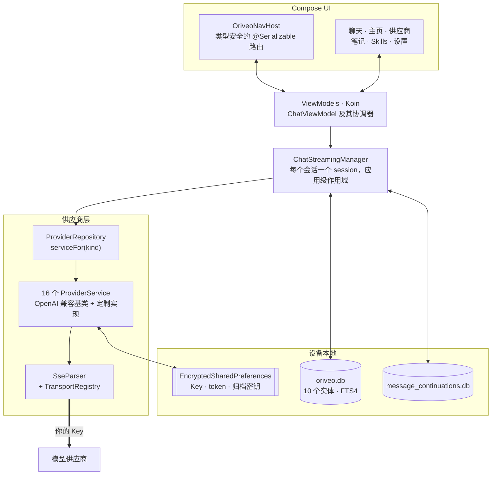

<div align="center">

# Oriveo for Android

**一个原生 Jetpack Compose 聊天客户端，用来使用你已经在付费的那些 AI 模型。**

<a href="../../LICENSE"></a>


<sub>

<a href="../../android/README.md">English</a> ·
<a href="../ar/android.md">العربية</a> ·
<a href="../de/android.md">Deutsch</a> ·
<a href="../es/android.md">Español</a> ·
<a href="../fr/android.md">Français</a> ·
<a href="../hi/android.md">हिन्दी</a> ·
<a href="../id/android.md">Indonesia</a> ·
<a href="../ja/android.md">日本語</a> ·
<a href="../ko/android.md">한국어</a> ·
<a href="../pt-BR/android.md">Português</a> ·
<a href="../ru/android.md">Русский</a> ·
<a href="../th/android.md">ไทย</a> ·
<a href="../tr/android.md">Türkçe</a> ·
<a href="../vi/android.md">Tiếng Việt</a> ·
**简体中文** ·
<a href="../zh-Hant/android.md">繁體中文</a>

</sub>

</div>

---

Oriveo Android 客户端是一个自带 Key 的 AI 聊天 App。你添加自己已有的 API Key，App 就从手机上直接和
每一家供应商通信。对话、笔记、文件夹和 Skills 用 Room 存在设备上；API Key 由一把存放在 Android
Keystore 里的密钥加密。没有账号，也不需要登录。

它是 [Oriveo 社区版](README.md) 的一部分 —— 三个客户端共用同一份「怎么和模型供应商说话」的定义。

## 架构



这张图里有三处是刻意的设计决定，不是顺手长成的结构。

**流式处理活在界面之上。** `ChatStreamingManager` 在一个 `ConcurrentHashMap` 里按会话 id 各保留一个
`StreamingSession`，每个都作为自己的 `Job` 跑在同一个应用级的
`CoroutineScope(SupervisorJob() + Dispatchers.IO)` 上 —— supervisor 正是关键所在，一条流失败不会把
其他几条一起带走。离开聊天界面不会取消这次回答，而每当 `StreamingTokenBuffer` 判断攒够了
（4,000 个字符或 60 秒），`ChatRepository` 就把部分文本刷进 SQLite，所以回答到一半杀掉 App 也不会丢掉
已经到手的内容。

**两个数据库，不是一个。** `oriveo.db` 存对话、消息、附件、笔记、文件夹、Skills 和模型目录缓存。
`message_continuations.db` 是一个物理上独立的文件，存放供应商那边不透明的续传状态，正是为了让
`backup_rules.xml` 和 `data_extraction_rules.xml` 能把它排除在云备份和设备迁移之外 —— 一个被恢复到
另一台设备上的续传 token，往好里说也是毫无意义的。

**目录比二进制新的时候是降级，不是崩掉。** `TransportKind` 是一个封闭 enum，配了一个宽容的反序列化
器：未知的 transport 字符串解码成 `null`，`TransportRegistry` 返回不出策略，于是这个模型会被从选择器
里过滤掉。另一种做法 —— 严格 enum —— 会让整份目录解析失败，把其它所有模型一起拖下水。

## 模型被允许做什么

客户端从不根据模型的名字去猜它的能力。它从目录里读取一套能力运行时：一组配方，描述在给定的供应商、
传输方式和能力下，究竟该往请求里写入哪些 JSON pointer。`ProviderRecipeRequestCompiler` 会先校验配方
与供应商、能力和传输方式是否匹配，再把它编译成一份自有的 body delta；不匹配就以一个具名理由拒绝
（`recipe_not_found`、`transport_mismatch`、`model_route_must_not_patch_body`），而不是悄悄产出一个
没人审过的请求。

回来的路上，`CapabilityEvidenceFacade` 按来源给「一项能力究竟已知什么」排序 ——
`operator_override` > `server_typed` > `server_profile` > `model_facts` > `relay_verification` >
`relay_declaration` > `legacy_metadata`。只有流解析器可以把一项能力标记为*已观测*；意图、配方、
HTTP 200 和工具声明都明确不算数。每条消息的结果都会持久化，所以 UI 能区分*已请求*和*已确认*。

覆盖项在七个作用域之间按后写优先解析，优先级从高到低为：`single_send` >
`conversation_connection_model` > `skill_agent` > `connection_model` > `connection` >
`provider_recipe` > `provider_default`。

## 存储与密钥

| 内容 | 位置 |
|---|---|
| 对话、消息、附件、笔记、文件夹、Skills | Room，`oriveo.db` |
| 笔记的全文搜索 | FTS4 虚拟表 |
| 模型目录缓存 | `oriveo.db` 里的单独一行，分块读回 |
| 供应商续传状态 | `message_continuations.db`，排除在备份之外 |
| 供应商 API Key | `EncryptedSharedPreferences`，AES-256-GCM，主密钥存在 Keystore 里 |
| 订阅 OAuth token | 第二个独立的加密偏好文件 |
| 备份归档密钥 | 第三个 |
| 附件二进制 | 磁盘上的文件，按 id 引用 |

这三个加密偏好文件是按生命周期和爆炸半径拆开的，而不是为了图省事合成一个。每一个都有恢复路径：
文件损坏（`AEADBadTagException`、`VERIFICATION_FAILED`）会被检测出来、删掉并重建，而不是让 App 每次
启动都崩。

这三个文件，以及那个续传数据库，都被排除在 Android 云备份和设备迁移之外。这是把它们绑到 Keystore 的
必然结果，不是疏漏 —— 密文换到新设备上本来也解不开。**换新手机之后，你需要重新填一遍 API Key、重新
登录各家供应商的订阅**；对话和笔记会正常迁过去。

你自己导出的归档是一个 zip，里面装着 `data.json` 加上附件文件。你设定的密码**只保护里面的供应商
API Key**：它们用 PBKDF2-HMAC-SHA256 迭代 600,000 次加 AES-GCM 加密，并作为 `data.json` 的一个字段
保存。对话、消息、笔记、文件夹、Skills、偏好设置和附件，不论如何都是以明文 JSON 和普通文件写入的，
所以要把一份归档当作「拿到这个文件的人都能读」来对待。如果你只想要自己的历史记录，就选择不带 Key
导出。

## 访问你自己网络里的模型服务器

manifest 里设了 `android:usesCleartextTraffic="true"`，这是刻意的：本地模型服务器 —— llama.cpp、
Ollama、LM Studio、vLLM —— 在你自己的机器或局域网上说的是明文 HTTP，通常也没有证书。

真正的边界在代码里，不在 manifest 里，而且只能在代码里。`RelayEndpointPolicy` 解析主机名，要求解析
出的**每一个**地址都是私有地址（回环、RFC 1918、链路本地、唯一本地，以及 VPN 模式下的 CGNAT 段），
拒绝那些解析结果里公网地址和私有地址混在一起的主机，把解析出的地址集合钉死以防 DNS 重绑定，并在发送
时再校验一次。它拒绝任何携带凭证材料的明文请求。而在发现和本地引擎那两个 client 上，重定向根本不跟
随，钉死的地址集合就是最后那道兜底。

Android 的 network security config 表达不了这套规则：它只按主机名匹配，没有描述地址段的语法，而这里
的地址是运行时从用户自己的网络来的。而且 config 严格来说更弱，因为它永远看不到一个名字解析成了哪个
地址。

## 模型目录

App 从一份公开目录里读取模型能力和价格，这样今天新发布的模型不用更新 App 就能用。它是一个普通的
HTTPS `GET`，不带凭证也不带任何标识，聊天请求根本不会靠近它。只请求两个端点：

```
GET {base}/api/metadata?view=lean
GET {base}/api/metadata/model-facts
```

base URL 是一个构建期属性，默认是 `https://api.oriveoai.com`：

```bash
./gradlew :app:assembleDebug -PORIVEO_METADATA_BASE_URL=https://your.host
```

响应会用 ETag 重新校验并缓存在 `oriveo.db` 里，所以只要成功拉取过一次，之后目录不可达时 App 仍能靠
缓存副本继续工作。

> [!IMPORTANT]
> 用空值构建（`-PORIVEO_METADATA_BASE_URL=`）会完全禁用目录拉取，而且 APK 里**不打包任何快照**。
> 这样构建出来的包，在全新安装时：
>
> - 15 家内置供应商都拿不到模型列表，而且 App 也不会转头去问供应商要 —— 目录是唯一来源；
> - 供应商详情页会显示一条「无法加载官方模型」横幅，但添加 Key 依然会报成功，模型
>   选择器只是空的；
> - **OpenAI 会变得不可用**，因为那家供应商禁止手动填写模型；
> - Relay 端点和本地模型服务器仍然完全可用，也是唯一完好的那条路径。
>
> 想要离线构建，请自己提供这份目录并让构建指向它，而不是把这个值清空。

## 工程结构

```
android/
  app/src/main/java/ai/oriveo/community/
    core/
      provider/    every provider service, transports, relay, capability recipes
      data/        Room entities, DAOs, repositories, backup, catalog client
      model/       domain models and the capability/preference resolvers
      attachments/ routing, budgets, per-format text extraction
      security/    SecureKeyStore, BackupCrypto, external-URL policy
      streaming/   ChatStreamingManager
      navigation/  AppRoute, OriveoNavHost
    feature/       one package per screen
    ui/            shared components, Markdown + LaTeX renderer, theme
    di/            Koin modules
  benchmark/       macrobenchmark suite (cold start, model picker)
```

## 构建

要求：**JDK 21** 以及 Android SDK。构建使用 AGP 9.3、Gradle 9.5 和 Kotlin 2.3，所以
Android Studio 得是能同步 AGP 9.3 的版本；用命令行的话只需要 JDK 和 SDK。

```bash
./gradlew :app:assembleDebug
./gradlew :app:testDebugUnitTest
```

构建目标是 `minSdk 26`、`targetSdk 36`、`compileSdk 37`。`local.properties`（你的 SDK 路径）由
Android Studio 生成，不会提交。发布签名见 [SIGNING.md](../../android/SIGNING.md)。

> [!NOTE]
> Gradle daemon 跑在 Java 21 工具链上（`gradle/gradle-daemon-jvm.properties`），而且匹配的是「正好
> 21」，不是「21 或更新」。装的是别的 JDK 时，Gradle 会在第一次构建时自己下一个 JDK 21，这需要
> 联网；自己装好 JDK 21 就能免掉。如果你设过 `org.gradle.java.installations.auto-download=false`，
> 这次下载就发生不了，构建会以 `Toolchain auto-provisioning is not enabled.` 失败 —— 这是唯一一种
> 只有 JDK 17 真的不够用的情况。无论哪种方式，编译目标都是 Java 17。

单元测试的并行度是从机器的 CPU 数和物理内存推导出来的，而不是写死的，所以这套测试在笔记本和大型
工作站上都表现正常。

## 依赖

| 库 | 版本 | 用途 |
|---|---|---|
| Jetpack Compose BOM | 2026.08.00 | UI，Material 3 |
| Room | 2.8.4 | SQLite、DAO、FTS4 |
| Koin | 4.2.2 | 依赖注入 |
| Ktor client（OkHttp engine） | 3.5.2 | 供应商 HTTP 和 SSE |
| kotlinx.serialization | 1.11.0 | JSON |
| navigation-compose | 2.9.6 | 类型安全路由 |
| androidx.security-crypto | 1.1.0 | `EncryptedSharedPreferences` |
| haze | 1.7.3 | 背景模糊 |
| PDFBox-Android、jsoup | 2.0.27.0、1.23.2 | 附件文本提取 |
| jlatexmath-android | 0.2.0 | LaTeX 渲染 |

确切版本锁在 [`gradle/libs.versions.toml`](../../android/gradle/libs.versions.toml) 里。

## 测试

```bash
./gradlew :app:testDebugUnitTest
```

318 个文件里大约 3,000 个单元测试，用的是 JUnit 4、MockK、Robolectric、`kotlinx-coroutines-test`
和 Ktor 的 mock engine。覆盖最密的地方也是出错代价最高的地方：每家供应商的请求形状、SSE 解析、
传输方式选择、relay 探测与安全模式、能力配方执行、目录缓存与契约版本处理、Room 持久化，以及备份的
往返一致性。

> [!IMPORTANT]
> 大约 38 个套件是从 Gradle 模块目录解析 `../../shared` 来加载契约 fixture 的，所以**测试只有在
> 完整 checkout 里才能通过** —— 把 `android/` 单独拷出来是跑不起来的。

另外还有三个插桩测试 —— 一个本地引擎的发布矩阵、一个明文 socket 测试，以及一个 keystore 隔离测试。
它们不是自包含的：本地引擎那几个需要用插桩参数指明你网络上一台真正在跑的模型服务器，所以
`connectedAndroidTest` 开箱是跑不过的。Pull Request 的门是单元测试套件。

`:benchmark` 模块放的是冷启动和模型选择器的 macrobenchmark。它是一个独立的 Gradle 模块，用
`com.android.test` 加自插桩，并驱动 `:app` 里一个专门的 `benchmark` 构建类型。

两个数据库都还在 `version = 1`，暂时没有迁移；schema 会导出到 `app/schemas/` 并提交，第一次迁移的
`2.json` 就会落在那里。

## 本地化

十六种语言：`values/`（英语，源语言）加上十五个 `values-*` 目录，每个约 1,300 条字符串，每个 locale
都持有完全相同的键集。App 内切换语言走 `AppLanguageManager` 和 `android:localeConfig`。bundle 里
禁用了按语言拆分，所以单个产物就带着全部翻译。

## 参与贡献

见 [CONTRIBUTING.md](../../CONTRIBUTING.md)。项目的工作语言是英语：源码、注释、测试和提交信息都用
英语。UI 字符串是要翻译的 —— 先把新字符串加进 `values/`，其它 locale 后面再跟上。开 Pull Request
之前请先跑单元测试。

## 许可证

[AGPL-3.0-or-later](../../LICENSE)。
