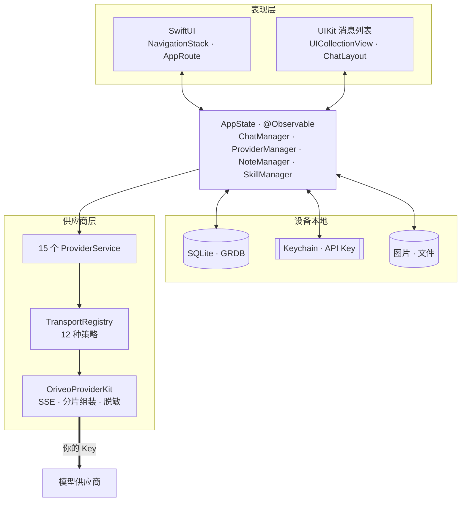
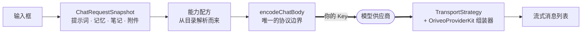

<div align="center">

# Oriveo for iOS

**一个原生 SwiftUI 聊天客户端，用来使用你已经在付费的那些 AI 模型。**

<a href="../../LICENSE"></a>


<sub>

<a href="../../ios/README.md">English</a> ·
<a href="../ar/ios.md">العربية</a> ·
<a href="../de/ios.md">Deutsch</a> ·
<a href="../es/ios.md">Español</a> ·
<a href="../fr/ios.md">Français</a> ·
<a href="../hi/ios.md">हिन्दी</a> ·
<a href="../id/ios.md">Indonesia</a> ·
<a href="../ja/ios.md">日本語</a> ·
<a href="../ko/ios.md">한국어</a> ·
<a href="../pt-BR/ios.md">Português</a> ·
<a href="../ru/ios.md">Русский</a> ·
<a href="../th/ios.md">ไทย</a> ·
<a href="../tr/ios.md">Türkçe</a> ·
<a href="../vi/ios.md">Tiếng Việt</a> ·
**简体中文** ·
<a href="../zh-Hant/ios.md">繁體中文</a>

</sub>

</div>

---

Oriveo iOS 客户端是一个自带 Key 的 AI 聊天 App。你添加自己已有的 API Key，App 就从手机上直接调用
每一家供应商。对话、笔记、文件夹、Skills 和附件以 SQLite 存在设备上；API Key 交给 iOS Keychain。
没有账号，也不需要登录。

它是 [Oriveo 社区版](README.md) 的一部分 —— 三个客户端共用同一份「怎么和模型供应商说话」的定义。

## 架构



这张图里有三件事值得直说。

**消息列表是 UIKit，其余都是 SwiftUI。** `ChatView` 内嵌了一个包着 `UICollectionView` 的
`ChatListViewControllerRepresentable`，由 [ChatLayout](https://github.com/ekazaev/ChatLayout)
驱动。其它一切 —— 导航、设置、供应商配置、笔记、Skills —— 都是 SwiftUI。之所以要拆开，是因为按 token
速率刷新的流式消息列表，需要对测量和复用做到 cell 级别的控制，而 SwiftUI 的 diff 给不了这个。
[`Features/Chat/ARCHITECTURE.md`](../../ios/Oriveo/Oriveo/Features/Chat/ARCHITECTURE.md)
记录了这条边界。

**有三条独立的路径在更新这个消息列表**，这是刻意为之：

| 路径 | 承载什么 | 为什么 |
|---|---|---|
| `@Observable AppState` | 结构性变化 —— 出现一条新消息、切换一个会话 | SwiftUI 原生，低频事件下开销很小 |
| GRDB `ValueObservation` | 从 SQLite 读回来的持久状态 | 写入之后只有一个真相来源，重启也还在 |
| 每个会话一个 Combine `PassthroughSubject` | 流式文本和思考增量 | 在 token 速率下完全绕开 SwiftUI 的 diff |

**供应商支持是四条互相独立的轴，不是一个 enum。** `ProviderKind`（16 个 case）是*用户配置了谁*。
`ProviderServiceProtocol` 是*调用面*。`TransportKind`（12 个 case）是*实际说的是哪种线上协议* ——
而且它是**按模型、从目录解析出来的**，所以同一个 Key 后面的两个模型完全可以不一致。`RelayKind` 负责
用户自己提供的端点。把它们分开，正是新模型不用重新构建就能用的原因。

### 一条消息是怎么发出去的



`BaseAPIService.encodeChatBody` 是请求体变成字节的唯一一处。每一条能力配方、每一个生成参数、每一个
自定义字段都得从这里过，这也是线上格式能在一个地方而不是十五个地方被测试的原因。

## 模型被允许做什么

客户端从不根据模型的名字去猜它的能力。它读取一套**能力运行时** —— 一组配方，描述在给定的供应商、
传输方式和能力下，究竟该往请求里写入哪些 JSON pointer。这些配方放在
[`shared/capabilityrecipe`](shared.md) 里，由 `CapabilityRecipeRequestCompiler` 应用。

回来的路上，`CapabilityExecutionRuntime` 记录实际发生了什么。只有被选定的生产流解析器才可以把一项
能力提升为*已观测*。HTTP 200、一个非空的答案，以及请求里带了工具声明，都被明确规定**不算证据**。
终态按消息保存，所以 UI 能告诉你「某个开关请求过但从未被确认」，而不是默默暗示它生效了。

## 存储

```
Application Support/Oriveo/
  active-uid                     # storage partition, "guest" by default
  users/<uid>/
    oriveo.sqlite                # conversations, messages, notes, catalog cache
    Images/  Files/              # attachment blobs, referenced by id
    session-snapshot.json        # preferences, provider list (never API keys)
```

- **通过 GRDB 使用 SQLite**，开启 WAL 和外键，并用一个 `DatabaseMigrator` 覆盖每一次 schema 变更。
  对消息和笔记的全文搜索用的是 FTS5 加 trigram 分词器。
- **API Key 存在 Keychain 里**，按供应商和分区做键，写入 session 快照之前会被抹掉。
- **附件是磁盘上的文件**，不是数据行，所以一个大 PDF 永远不会撑爆数据库。

## App 唯一为自己发起的网络请求

冷启动时 App 会向 `https://api.oriveoai.com` 发出两个未认证、带 ETag 条件的 `GET` 请求 ——
`/api/metadata?view=lean` 和 `/api/metadata/model-facts`。它们拉取公开的模型目录：有哪些模型、
每个支持什么、它的思考控制项叫什么名字，以及价格多少。不带 Key、不带对话、不带任何标识，响应会缓存
在 SQLite 里，所以目录不可达时 App 仍能靠缓存副本工作。

这是 App 唯一为自己发起的请求。其余一切都发往你配置的供应商，用你的 Key。

## 工程结构

```
ios/Oriveo/
  Oriveo.xcodeproj/
  Oriveo/
    Core/
      Providers/       15 provider services, transports, capability runtime, catalog client
      State/           AppState and the managers it owns
      Database/        GRDB pool, schema, migrator, stores, observations
      Models/          domain types
      Attachments/     import limits, budgets, per-format text extraction
      Tools/           tool-call loop and per-protocol adapters
    Features/
      Chat/            transcript, composer, model controls, export
      Providers/       setup, detail, relay, local engines, subscription sign-in
      Home/ Notes/ Skills/ Settings/ Backup/ Onboarding/
    Shared/Components/ shared views
    DesignSystem/      theme, colour, haptics
  OriveoTests/
```

## 构建与运行

你需要一台装有 **Xcode 26** 的 Mac，以及一台 **iOS 18 或更高版本**的设备。免费的 Apple Developer
账号就够了；这个 App 不用任何付费能力，并且带的是一个空的 entitlements 文件。

1. 打开 `ios/Oriveo/Oriveo.xcodeproj`
2. 选择 `Oriveo` scheme
3. 在 **Signing & Capabilities** 里选你自己的 Team
4. 如果 Xcode 无法注册 `ai.oriveo.community`，把 bundle identifier 改成你的团队拥有的那种
5. 连上 iPhone，打开开发者模式，信任这台电脑，然后运行

想改成给模拟器构建，随便选一个 iPhone 模拟器再运行。包依赖从已提交的 `Package.resolved` 解析。

工程文件用的是 `objectVersion = 77` 以及文件系统同步分组，所以更旧的 Xcode 可能拒绝打开它。请升级
Xcode，不要去改工程文件格式。

> [!NOTE]
> App target 以 Swift 5 语言模式编译，开启了 `SWIFT_APPROACHABLE_CONCURRENCY` 和
> `SWIFT_DEFAULT_ACTOR_ISOLATION = MainActor`。本地的 `OriveoProviderKit` 包声明
> `swift-tools-version: 6.1`，以 Swift 6 语言模式构建。

## 依赖

| 包 | 版本 | 用途 |
|---|---|---|
| [GRDB.swift](https://github.com/groue/GRDB.swift) | 7.11.1 | SQLite 访问、迁移、`ValueObservation` |
| [ChatLayout](https://github.com/ekazaev/ChatLayout) | 2.4.3 | 消息列表的 collection view 布局 |
| [swift-markdown-ui](https://github.com/gonzalezreal/swift-markdown-ui) | 2.4.1 | Markdown 渲染 |
| [SwiftMath](https://github.com/mgriebling/SwiftMath) | 1.7.3 | LaTeX 渲染 |
| [ZIPFoundation](https://github.com/weichsel/ZIPFoundation) | 0.9.20 | 备份归档，Office/EPUB/ODF 解析 |
| `OriveoProviderKit` | 本地 | 供应商协议内核，与 macOS 共用 |

## 测试

在 Xcode 里运行 `OriveoTests` scheme，或者从仓库根目录运行：

```bash
xcodebuild test -project ios/Oriveo/Oriveo.xcodeproj -scheme Oriveo \
  -destination 'platform=iOS Simulator,name=iPhone 17'
```

把模拟器换成你本机真有的那一个 —— `xcrun simctl list devices available` 会列出来。

> [!IMPORTANT]
> 测试 target 从 `#filePath` 一路向上找到 `shared/` 目录，再从那里读取契约 fixture。大约 29 个套件
> 依赖这一点，所以**测试只有在完整 checkout 里才能通过** —— 把 `ios/` 单独拷出来是跑不起来的。

这套测试很大：273 个文件里大约 2,900 个测试，大部分用
[Swift Testing](https://github.com/swiftlang/swift-testing)。覆盖范围包括每家供应商的请求形状、
录制的上游 SSE 回放、relay 与本地引擎策略、消息列表的测量与流式行为、存储，以及备份的往返一致性。

`shared/OriveoProviderKit` 有自己的一套：

```bash
cd shared/OriveoProviderKit && swift test
```

## 本地化

十六种语言，以 Xcode String Catalog（`.xcstrings`）保存 —— 十个 catalog，约 1,900 个键，英语是源
语言。字符串通过 `L10n.tr(_:table:)` 从一个按用户 App 内语言设置选出的 `.lproj` bundle 里解析，所以
切换语言无需重启就能生效。阿拉伯语的从右到左布局是显式处理的。

## 参与贡献

见 [CONTRIBUTING.md](../../CONTRIBUTING.md)。行为变更要配一个测试；修供应商协议问题时，优先用
`shared/test-fixtures` 下录制的 fixture 而不是手写的 mock，并说明你是对着哪家供应商、哪个模型测的。

## 许可证

[AGPL-3.0-or-later](../../LICENSE)。
