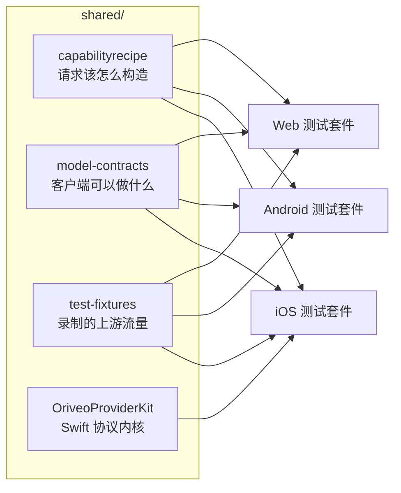

<div align="center">

# 共享契约

**一份关于「怎么和模型供应商说话」的定义，由三个客户端共同断言。**

<a href="../../LICENSE"></a>


<sub>

<a href="../../shared/README.md">English</a> ·
<a href="../ar/shared.md">العربية</a> ·
<a href="../de/shared.md">Deutsch</a> ·
<a href="../es/shared.md">Español</a> ·
<a href="../fr/shared.md">Français</a> ·
<a href="../hi/shared.md">हिन्दी</a> ·
<a href="../id/shared.md">Indonesia</a> ·
<a href="../ja/shared.md">日本語</a> ·
<a href="../ko/shared.md">한국어</a> ·
<a href="../pt-BR/shared.md">Português</a> ·
<a href="../ru/shared.md">Русский</a> ·
<a href="../th/shared.md">ไทย</a> ·
<a href="../tr/shared.md">Türkçe</a> ·
<a href="../vi/shared.md">Tiếng Việt</a> ·
**简体中文** ·
<a href="../zh-Hant/shared.md">繁體中文</a>

</sub>

</div>

---

三个客户端如果各自独立实现「调用供应商」这件事，它们一定会漂移。它们会悄悄地漂，朝着最近有人测过的
那一个的方向漂，而漂移最终会以一个「在某个平台上能复现、在另外两个上不能」的 bug 浮出水面。

`shared/` 就是对这件事的回答：行为以数据的形式写下一次，每个客户端的测试套件都对着同一批文件做断言。
供应商的怪癖修一次就够。一次契约变更会同时让三套测试变红，而不是在两个平台上顺利发布、把第三个搞坏。



## capabilityrecipe

配方注册表。对于给定的供应商、传输方式和能力 —— 联网搜索、思考强度、图像生成 —— 它精确说明该往外发的
请求里写入哪些 JSON pointer，以及该怎么把答案读回来。

正是它让今天新发布的模型不用更新客户端就能用，也正是它让任何客户端都不会从模型名字去猜能力。
`capability_runtime.v1.json` 承载配方本身；`capability_result_definitions.v1.json` 和
`capability_custom_controls.v2.json` 定义结果与面向用户的控制项该如何解读。

每条配方都声明一个 `executionKind` —— `request_overlay`、`server_tool`、`client_tool_loop`、
`endpoint_route`、`model_route` —— 每个客户端的编译器都会在应用之前校验这条配方与供应商、能力和传输
方式是否匹配，不匹配就以一个具名理由拒绝，而不是发出一个没人审过的请求。

## model-contracts

用来钉死跨客户端行为的 JSON fixture：对于给定的供应商和能力，一个请求必须长什么样；生成参数如何解析、
覆盖项如何叠加；客户端可以呈现哪些能力状态；以及模型目录及其证据该如何被消费。

每个客户端的测试都直接加载这些文件，所以这里的一处改动就是对三个客户端同时的改动。

## test-fixtures

黄金测试数据：录制的上游工具调用流量、relay 路由与发现场景、model-facts 和能力证据快照，以及本地
引擎场景。

`.sse` 文件是**真实捕获的上游流量**，逐字节原样保留。手写的 mock 编码的是你以为供应商会做什么；一份
录制下来的流编码的是它当时实际做了什么，包括那个星期二它发来的那个畸形分片。当一个供应商协议修复需要
测试时，一份录制比一个 mock 值钱得多。

## OriveoProviderKit

一个 Swift 包，装着供应商线上协议的内核：SSE 行组装、OpenAI 兼容的分片解析、工具名编码、凭证脱敏、
上游错误分类、thinking 标签解析、流式 JSON 路径提取，以及各供应商的怪癖档案。

它的边界是刻意划窄的。**在内：**只依赖 Foundation 的协议知识。**在外：**App 模型、UI、数据库、埋点、
本地化。每个 Apple 客户端在它外面保留一层薄绑定，好让线上行为只有一份实现。

```bash
cd shared/OriveoProviderKit && swift build && swift test
```

- 平台：iOS 18+、macOS 15+ · `swift-tools-version: 6.1`
- `ProviderWireProfile` 承载的是单个 OpenAI 兼容组装器仍然需要的那些残余的、各家不同的怪癖 ——
  思考文本从哪里来、缓存 token 计数放在哪里、prompt token 是否已经包含缓存命中。它描述的是*字节以何种
  方式到达*，从不描述*一个模型能做什么*；那是配方的活。

## 改动这些文件

这里的一处改动就是对每个客户端的改动。请把读了你所改文件的每个客户端的契约测试都跑一遍，而不是只跑
你恰好正在做的那个：

```bash
cd web && npm run test:run
cd shared/OriveoProviderKit && swift test
# plus the iOS and Android suites — see their READMEs
```

iOS 和 Android 两套测试都是从测试文件一路向上走、直到找到 `shared/` 来定位这个目录的，而 Web 测试是
相对 workspace 解析它。因此它们全都要求仓库的完整 checkout。

## 许可证

[AGPL-3.0-or-later](../../LICENSE)。
