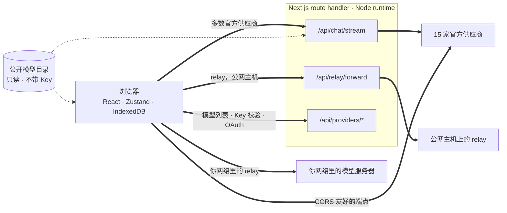
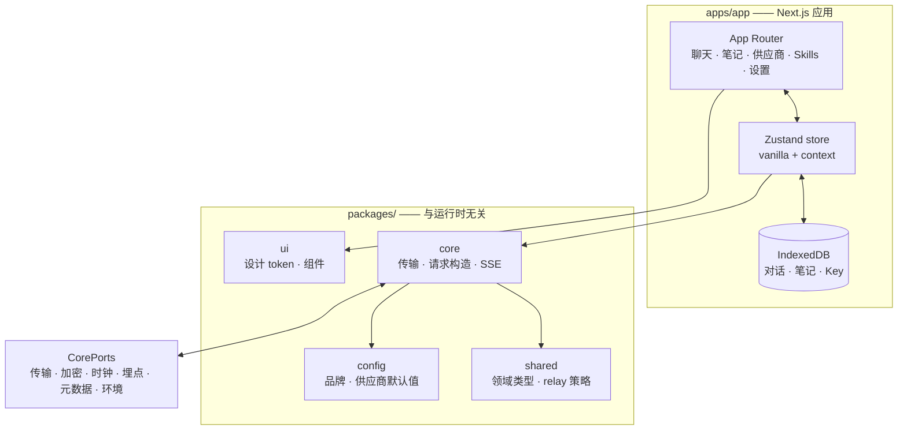

<div align="center">

# Oriveo for Web

**一个 Next.js 聊天客户端，用来使用你已经在付费的那些 AI 模型。**

<a href="../../LICENSE"></a>


<sub>

<a href="../../web/README.md">English</a> ·
<a href="../ar/web.md">العربية</a> ·
<a href="../de/web.md">Deutsch</a> ·
<a href="../es/web.md">Español</a> ·
<a href="../fr/web.md">Français</a> ·
<a href="../hi/web.md">हिन्दी</a> ·
<a href="../id/web.md">Indonesia</a> ·
<a href="../ja/web.md">日本語</a> ·
<a href="../ko/web.md">한국어</a> ·
<a href="../pt-BR/web.md">Português</a> ·
<a href="../ru/web.md">Русский</a> ·
<a href="../th/web.md">ไทย</a> ·
<a href="../tr/web.md">Türkçe</a> ·
<a href="../vi/web.md">Tiếng Việt</a> ·
**简体中文** ·
<a href="../zh-Hant/web.md">繁體中文</a>

</sub>

</div>

---

Oriveo Web 客户端是一个用 Next.js 构建的、自带 Key 的 AI 聊天 App。对话、笔记、文件夹、Skills 以及
你的供应商 Key 都存在浏览器自己的存储里。没有账号，也不需要登录。

它是 [Oriveo 社区版](README.md) 的一部分 —— 三个客户端共用同一份「怎么和模型供应商说话」的定义。

## 快速开始

需要 Node 22.22 或更新版本（见 [`.nvmrc`](../../web/.nvmrc)）。npm 随它一起发布；不需要别的包管理器。

```bash
npm install
npm run dev:app     # http://localhost:3001
```

第一屏会问你要一个供应商的 API Key。开始聊天不需要别的东西。

## 一个请求实际是怎么走的

这一节值得先于其它任何内容读，因为 Web 客户端是唯一一处请求通常**不是**从客户端直达供应商的地方。



**为什么要绕这一下。** 多数供应商的 API 不发 CORS 头，浏览器没法直接调用 `api.openai.com` 之流 ——
预检请求就会失败。每一个浏览器 BYOK 客户端都得想办法解决这件事；这一个的做法是转发给几个跑在 Node
runtime 里的 Next.js route handler。当你跑 `npm run dev:app` 时，这些 handler 就在你自己机器上。
当你把应用部署到某处时，它们就在你部署到的那台机器上。

handler 不止一个：聊天流式、relay 转发器、图像生成、模型列表、Key 校验，以及 Grok 和 ChatGPT 的设备
登录交换，加起来一共十二个 route 文件。Key 校验在这里值得留意 —— 它把 Key 发给你自己的服务器，由
后者拿它去探测供应商。

少数端点*确实*允许浏览器直连，这些是直接调用、中间不经过任何服务器的：Kimi 用于聊天的中国区端点
（`api.moonshot.cn`），以及 OpenRouter、SiliconFlow、DeepSeek 和 Kimi 的余额端点。

**这些 handler 做什么、不做什么。** 它校验请求形状并限制大小，对聊天和 relay 流量施加按 IP 的限流，
拒绝解析到私有地址或链路本地地址的 URL，构造供应商特有的请求体，然后把响应流式传回。`app/api` 底下
任何地方都没有数据库、没有写文件，也没有记录请求体 —— 你的 Key 和你的消息只是被转发，然后被忘掉。
因为这条路由是所有访客共用的同一个进程，有一个专门的测试（`server-never-learns.test.ts`）钉死了它绝
不会把某个用户被拒绝的参数缓存下来、再套到别人的请求上。

relay 转发器还额外把 DNS 钉在它解析出的那个地址上，限制响应大小，给每个超时设上界，把重定向限制在
同源范围内，并拒绝透传逐跳（hop-by-hop）头部。

**本地端点完全跳过它。** 位于私有地址、`.local` 名称、`localhost` 上的 relay，或者配置成本地 HTTP
或私有 VPN 模式的 relay，都是**由浏览器直接**请求的，带 `credentials: 'omit'` 和
`targetAddressSpace: 'local'`。你的局域网流量不会离开你的网络，也不会经过这个应用的服务器。

## 架构



`packages/core` 持有关于供应商协议的每一个字节的知识，并被刻意保持得不碰任何浏览器全局对象 ——
eslint 在它内部以及 `packages/ipc-contract` 里禁用了 `window`、`document`、`fetch`、`crypto`、
`localStorage`、`sessionStorage` 和 `indexedDB`。它需要
从环境里拿的一切都经由 `CorePorts` 到达。正是这一点，让同一份代码可以跑在浏览器里、跑在 Node route
handler 里，也可以跑在一个没有 DOM 的测试里。

供应商支持是两条互相独立的轴。`providerKind` 挑选一个**请求构造器**（这家厂商的请求体长什么样）。
`model.transport` 从十二种里挑选一个**传输策略**（实际说的是哪种线上协议），而且它是按模型、从目录
解析出来的，不是按供应商 —— 所以同一个 Key 后面的两个模型完全可以不一致。一个策略只实现三个方法：
`buildRequestBody`、`parseStreamChunk`、`parseError`。

## 工作区

```
apps/app/               the Next.js application
packages/core/          provider protocols: transports, request builders, SSE parsing
packages/shared/        domain types, relay policy, helpers
packages/ui/            design tokens and shared components
packages/config/        brand and provider defaults
packages/ipc-contract/  typed channel contract for a desktop shell
```

样式是 CSS Modules 叠在 `packages/ui` 里一张统一的自定义属性 token 表上 —— 没有用任何原子类框架。
`packages/ipc-contract` 描述的是一个桌面壳会绑定的通道界面；本仓库里并没有这样的壳，所以在 Web 构建
上它只贡献一些永远走不到的类型和分支。

还有一处同类的接缝。`apps/app/lib/core/sync-port.ts` 声明了一个同步后端要实现的接口，而每一处调用点都通过
可选链去访问它。没有东西装上这样的后端，所以 `getSyncAdapter()` 返回 `null`，IndexedDB 始终是你数据
的唯一副本 —— 这正是「没有账号、没有登录」在实际上的含义。

## 存储

一切都按分区隔离，由一个默认为 `guest` 的活跃 id 作为键。

| 内容 | 位置 |
|---|---|
| 对话、消息、文件夹、笔记、供应商 | IndexedDB `oriveo--{id}`，8 个 object store |
| 模型目录快照（约 3 MB）和 model facts | IndexedDB blob store，刻意不放 localStorage |
| 偏好设置和模型控制项表 | `localStorage`，实测会抛异常的那些路径由 `safeLocalStorage` 包住 |
| 生成的和附加的图片 | 一个单独的 IndexedDB 数据库 |

有两个细节来自真实的翻车，而不是审美偏好。目录快照放在 IndexedDB 里，是因为它约 3 MB，会吃掉一个
浏览器 origin 那 5 MB localStorage 配额的大半。而每一次 localStorage 访问都要走 `safeLocalStorage`，
是因为当浏览器被配置为阻止站点数据时，`window.localStorage` 这个 *getter* 本身就会抛
`SecurityError` —— 一次裸读会在你的 `try` 块开始执行之前就把页面搞崩。

> [!IMPORTANT]
> 在 Web 上，供应商 Key 是**明文**存在 IndexedDB 里的 —— 这也是基于浏览器的 BYOK 客户端普遍采用的
> 方式，因为浏览器没有更好的地方可放。想要最强的保证，请用 iOS 或 Android 客户端，那里由系统的
> keychain 或 keystore 加密它们。备份归档是另一回事：当你设定密码时，它们用 AES-256-GCM 和
> PBKDF2-SHA-256 迭代 600,000 次加密。

## 模型目录

每家供应商提供哪些模型、每个模型支持什么，来自启动时拉取的一份只读目录。只请求两个端点，都是 `GET`，
都带 ETag 条件，都不携带 API Key、对话或任何用户标识：

```
GET {backend}/api/metadata?view=lean
GET {backend}/api/metadata/model-facts
```

默认后端是 `https://api.oriveoai.com`。把 `NEXT_PUBLIC_BACKEND_URL` 指向你自己的服务器就能自己提供
它。响应在 IndexedDB 里缓存 24 小时，并用 `If-None-Match` 重新校验；目录不可达时，应用仍能靠缓存
副本继续工作。

## 命令

在当前目录下运行这些命令。

| 命令 | 作用 |
|---|---|
| `npm run dev:app` | 在 3001 端口启动开发服务器 |
| `npm run build:app` | 生产构建 |
| `npm run typecheck` | 对每个 workspace 执行 `tsc --noEmit` |
| `npm run test:run` | vitest，跑一遍 |
| `npm run test` | vitest 监听模式 |
| `npm run lint` | 对 `apps/` 和 `packages/` 执行 eslint |

`npm start --workspace @oriveo/app` 会在 3001 端口提供一份已经构建好的产物。

要跑单个测试文件，请在拥有它的那个 workspace 里跑，因为有几套测试是相对工作目录解析 fixture 的：

```bash
cd apps/app && npx vitest run lib/core/chat/__tests__/stream-options.test.ts
```

## 配置

所有配置都是可选的。把 [`.env.example`](../../web/.env.example) 复制成 `.env.local`，只设置你需要的
那些；代码会读的每一个变量都列在那里，并有说明。

### 错误上报

这个应用打包了 Sentry SDK。**没有 DSN 时它是惰性的** —— 没有 `NEXT_PUBLIC_SENTRY_DSN` 就没有
transport、没有事件、什么都不会发出去，而这正是从本仓库构建出来的默认状态。配上一个 DSN，你就得到
错误上报、10% 的性能追踪和 1% 的会话回放，并且有钩子会在事件离开浏览器之前把供应商 Key、端点和消息
内容剥掉。它在这里，是为了让想要错误上报的部署能有，而不是因为这个构建会回传什么。

## 自托管

这里没有 Dockerfile，也没有部署脚本；这个应用就是一台普通的 Next.js 服务器。

```bash
npm ci
npm run build:app
npm start --workspace @oriveo/app     # 127.0.0.1:3001
```

把它放到反向代理后面之前，有三件事值得知道。

`npm start` 绑定的是 `127.0.0.1`，所以代理得跑在同一台主机上，否则就得改绑定地址。

把 `NEXT_PUBLIC_APP_URL` 设成你实际对外提供服务的 origin。canonical 链接、sitemap 和社交预览图都
是相对它解析的，而它的默认值是开发端口。

把 `TRUSTED_PROXY_HOP_COUNT` 设成应用前面代理的层数。聊天限流器读的是 `X-Forwarded-For` 从*右*数
那么多跳的客户端地址 —— 绝不从左数，因为左边由客户端控制、可以伪造。默认值 1 对单层代理是正确的；
前面有两层却把它留得太小，所有访客就会共用同一个限流桶，因为读到的地址是你自己内层代理的。

应用已经在 `next.config.ts` 里发送 HSTS、`X-Content-Type-Options`、`X-Frame-Options`、
`Referrer-Policy`、`Permissions-Policy` 和 `Cross-Origin-Opener-Policy`，所以代理不需要再加。TLS
终止和请求体积上限是代理的活。

最后一件值得慎重决定的事：任何能访问到这个部署的人，都可以用它的 route handler、拿自己提供的 Key 去
调用供应商。这些 handler 自己不持有任何 Key，也不保存任何东西，但它们是一条对外的 HTTP 通路，所以
一个公网可达的部署，应该像你对待任何别的内部工具那样放在访问控制之后。

## 测试

460 个文件里大约 5,600 个测试，跑在 vitest 上。覆盖最密的地方也是出错代价最高的地方：每家供应商的
请求形状、每种线上协议的传输行为、SSE 与代理分片解析、用量与花费解析、错误分类、relay 探测与安全
模式、SSRF 防护、能力配方执行、目录缓存与契约版本失效、IndexedDB 持久化、存储分区、备份往返一致性，
以及 route handler 本身。

> [!IMPORTANT]
> 有三十多个套件从 `../shared` 加载契约 fixture，所以**测试只有在完整 checkout 里才能通过** ——
> 把 `web/` 单独拷出来是跑不起来的。

## 本地化

`apps/app/messages` 里有十六个 locale，每个约 1,800 个键，英语是源语言。有一个测试会遍历这个目录，
一旦某个 locale 的键集与英语不同就失败，所以新增一个 locale 文件就会自动把它纳入。阿拉伯语有完整的
从右到左布局。locale 的选取顺序是：显式的 `?locale=` 参数，然后 cookie，然后 `Accept-Language`。

## 参与贡献

见 [CONTRIBUTING.md](../../CONTRIBUTING.md)。`packages/core` 是传输优先的：新增一家供应商通常只是
一个请求构造器加一个响应适配器，而不是一个新客户端。修供应商协议问题时，优先用 `shared/test-fixtures`
下录制的 fixture 而不是手写的 mock。

## 许可证

[AGPL-3.0-or-later](../../LICENSE)。
