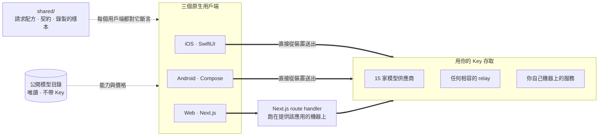

<div align="center">


# Oriveo

**所有模型，一個應用程式。**

開源、自備金鑰的 AI 聊天應用，支援 iOS、Android 與網頁。
不需要帳號，不需要訂閱，你和模型之間沒有我們的伺服器。

<a href="../../LICENSE"></a>
<a href="ios.md"></a>
<a href="android.md"></a>
<a href="web.md"></a>


<a href="https://oriveoai.com">官方網站</a> &nbsp;·&nbsp;
<a href="#開始使用">開始使用</a> &nbsp;·&nbsp;
<a href="#架構">架構</a> &nbsp;·&nbsp;
<a href="#社群版與-oriveo">版本比較</a> &nbsp;·&nbsp;
<a href="#常見問題">常見問題</a> &nbsp;·&nbsp;
<a href="../../CONTRIBUTING.md">參與貢獻</a>

<sub>

<a href="../../README.md">English</a> ·
<a href="../ar/README.md">العربية</a> ·
<a href="../de/README.md">Deutsch</a> ·
<a href="../es/README.md">Español</a> ·
<a href="../fr/README.md">Français</a> ·
<a href="../hi/README.md">हिन्दी</a> ·
<a href="../id/README.md">Indonesia</a> ·
<a href="../ja/README.md">日本語</a> ·
<a href="../ko/README.md">한국어</a> ·
<a href="../pt-BR/README.md">Português</a> ·
<a href="../ru/README.md">Русский</a> ·
<a href="../th/README.md">ไทย</a> ·
<a href="../tr/README.md">Türkçe</a> ·
<a href="../vi/README.md">Tiếng Việt</a> ·
<a href="../zh-Hans/README.md">简体中文</a> ·
**繁體中文**

</sub>

</div>

---

## Oriveo 是什麼

Oriveo 社群版是一個自備金鑰（BYOK）的 AI 聊天用戶端，支援 iOS、Android 與網頁。你提供自己既有的
API Key，用戶端就直接拿它去跟供應商溝通。沒有 Oriveo 帳號、沒有訂閱，也沒有任何分析追蹤。

它原生支援 **15 家模型供應商** —— OpenAI、Anthropic、Google Gemini、OpenRouter、DeepSeek、Grok、
Mistral、Groq、Together AI、Fireworks AI、MiniMax、Z.ai、Qwen、Kimi 與 SiliconFlow —— 再加上
**任何 OpenAI、Anthropic 或 Gemini 相容的端點**，包括跑在你自己機器上的 llama.cpp、Ollama、
LM Studio 或 vLLM。

| | |
|---|---|
| **供應商** | 內建 15 家，另有自訂 relay 端點與本機模型伺服器 |
| **用戶端** | iOS（SwiftUI）· Android（Jetpack Compose）· 網頁（Next.js） |
| **介面語言** | 16 種 |
| **是否需要帳號** | 不需要 |
| **它為自己發出的呼叫** | 只有一個：唯讀的模型目錄，不帶 Key、也不帶任何識別資訊 |
| **授權條款** | AGPL-3.0-or-later |

## 為什麼會有它

聊天用戶端不該擋在你和你正在付費的模型中間。

- **你的 Key，你的帳單。** 你按供應商的公開價格付費。沒有加價、沒有二次計量，也沒有轉售。
- **預設留在本機。** 對話、筆記、資料夾、Skills 與附件都留在裝置上。想匯出成檔案隨時都可以；不存在
  哪天會失去存取權的雲端副本。
- **一套行為，三個用戶端。** 針對某家供應商、某種傳輸方式與某項能力該如何組出請求，只在
  [`shared/`](shared.md) 裡定義一次，三個用戶端都對著同一批 JSON fixture 做斷言。供應商的怪癖修一次
  就好，不必修三次。
- **對它唯一發出的那個請求誠實以告。** 應用程式會抓取一份公開的模型目錄，讓今天剛發表的模型不必更新
  應用程式就能使用。這個請求是唯讀的，不帶 Key 也不帶任何識別資訊，你也可以把它指向自己的主機。

## 功能

- **聊天** —— 串流輸出、推理區塊、引用來源、附件（圖片、PDF、Office、EPUB、HTML、純文字）、
  選取引用、重試、重新產生、回答被中斷後繼續
- **供應商** —— 內建 15 家，每一家都用你自己的 Key；可依供應商覆寫端點、模型與參數
- **Relay** —— 任何 OpenAI、Anthropic 或 Gemini 相容的端點，包括你區域網路裡的那一個
- **本機模型伺服器** —— llama.cpp、Ollama、LM Studio、vLLM，並支援在區域網路上自動探索
- **訂閱登入** —— 用你已持有的 Codex 或 Grok 訂閱取代 API Key
- **Skills** —— 可重複使用的系統提示詞，各自帶有專屬的模型、參數與參考文件
- **筆記與資料夾** —— 把回覆存成筆記、整理對話、全文搜尋
- **交叉比對** —— 用第二個模型再問一次同樣的問題，兩份答案並排保留
- **費用** —— 依訊息與依供應商統計支出，在裝置上根據每次回應實際回報的內容計算，包含快取折扣級距
- **圖片生成** —— 供應商支援時可用
- **備份** —— 把所有內容匯出成檔案，可選擇用你自訂的密碼加密
- **16 種介面語言**，包含為阿拉伯文提供的完整由右至左版面

## 社群版與 Oriveo

這個儲存庫是 **Oriveo 社群版**，採用 [AGPL-3.0-or-later](../../LICENSE) 授權。App Store、
Google Play 上的應用程式以及託管的網頁版則是 **Oriveo** —— 一個獨立的專有產品，以同樣的用戶端建置，
並在上面加了一層帳號機制。

| | 社群版 | Oriveo |
|---|---|---|
| 原始碼 | 本儲存庫，AGPL-3.0-or-later | 專有 |
| 用自己的供應商 Key 聊天 | 是 | 是 |
| Relay 與本機模型伺服器 | 是 | 是 |
| 筆記、資料夾、Skills、附件 | 是，無上限 | 是 |
| 裝置端費用追蹤 | 是 | 是 |
| 帳號 | 無 | Oriveo 帳號 |
| 儲存 | 在裝置上；手動匯出與還原 | 本機優先，另有跨裝置雲端同步 |
| 用量洞察與預算提醒 | — | 是 |
| 由 Oriveo 付費的模型 | — | 是 |
| 分析追蹤與當機回報 | 無 | 有 |

社群版建置使用 `ai.oriveo.community` 這個識別碼前綴，因此它可以和商店版並存，兩者不共用鑰匙圈、
更新來源或本機資料。這個版本會接受什麼、不接受什麼，都寫在 [COMMUNITY.md](../../COMMUNITY.md) 裡。

**Oriveo 完整產品：**
[iPhone 與 iPad](https://apps.apple.com/app/oriveo/id6775370458) &nbsp;·&nbsp;
[Android](https://play.google.com/store/apps/details?id=com.kenny.oriveo) &nbsp;·&nbsp;
[網頁版](https://app.oriveoai.com) &nbsp;·&nbsp;
[oriveoai.com](https://oriveoai.com)

## 供應商

以下每一家都是用你自己申請的 Key 去存取。

| 供應商 | 到哪裡申請 Key |
|---|---|
| OpenAI | [platform.openai.com](https://platform.openai.com/api-keys) |
| Anthropic | [console.anthropic.com](https://console.anthropic.com/settings/keys) |
| Google Gemini | [aistudio.google.com](https://aistudio.google.com/apikey) |
| OpenRouter | [openrouter.ai](https://openrouter.ai/keys) |
| DeepSeek | [platform.deepseek.com](https://platform.deepseek.com/api_keys) |
| Grok | [console.x.ai](https://console.x.ai/) |
| Mistral | [console.mistral.ai](https://console.mistral.ai/api-keys) |
| Groq | [console.groq.com](https://console.groq.com/keys) |
| Together AI | [api.together.xyz](https://api.together.xyz/settings/api-keys) |
| Fireworks AI | [fireworks.ai](https://fireworks.ai/api-keys) |
| MiniMax | [platform.minimax.io](https://platform.minimax.io/docs/guides/quickstart-preparation) |
| Z.ai | [open.bigmodel.cn](https://open.bigmodel.cn/usercenter/apikeys) |
| Qwen | [bailian.console.alibabacloud.com](https://bailian.console.alibabacloud.com/?apiKey=1#/api-key) |
| Kimi | [platform.kimi.ai](https://platform.kimi.ai/console/api-keys) |
| SiliconFlow | [cloud.siliconflow.cn](https://cloud.siliconflow.cn/account/ak) |
| **Relay** | 任何 OpenAI、Anthropic 或 Gemini 相容的端點，包括你自己機器上的那一個 |

## 架構

三個原生用戶端，一份「該怎麼跟模型供應商說話」的定義。



每個用戶端各自擁有自己的介面、儲存與導覽，只在唯一一處接縫上與共用契約相接：把*這個模型、這項能力*
轉成一個 HTTP 請求的那一層。

唯一值得知道的不對稱在網頁用戶端。供應商 API 不送 CORS 標頭，瀏覽器無法直接呼叫它們；因此送往 15 家
官方供應商的請求會經過一個 Next.js route handler，它跑在提供該應用的那台機器上 —— 你在本機執行時，
那就是你自己的機器。iOS 與 Android 用戶端沒有這個限制，直接連上供應商。指向你自己網路的 relay 端點
同樣由瀏覽器直連。

**各用戶端的架構：**

| | 技術堆疊 | README |
|---|---|---|
| **iOS** | SwiftUI 搭配一個 UIKit 訊息列表、GRDB | [ios.md](ios.md) |
| **Android** | Jetpack Compose、Room、Koin、Ktor/OkHttp | [android.md](android.md) |
| **Web** | Next.js App Router、React、Zustand、TypeScript | [web.md](web.md) |
| **Shared** | 契約、錄製的 fixture，以及 Swift 通訊核心 | [shared.md](shared.md) |

## 開始使用

<details open>
<summary><b>網頁版</b> —— 最快的試用方式</summary>

<br>

需要 Node 22（見 [`web/.nvmrc`](../../web/.nvmrc)）。

```bash
cd web
npm install
npm run dev:app        # http://localhost:3001
```

第一個畫面會向你要一組供應商 API Key。除此之外不需要別的。
更多指令與設定：[web.md](web.md)。

</details>

<details>
<summary><b>iOS</b> —— 在自己的 iPhone 上建置並執行</summary>

<br>

需要一台裝有 Xcode 26 的 Mac，以及一台 iOS 18 以上的裝置。免費的 Apple Developer 帳號就夠了 ——
這個應用程式沒有用到任何付費功能。

1. 開啟 `ios/Oriveo/Oriveo.xcodeproj`
2. 選擇 `Oriveo` scheme
3. 在 Signing &amp; Capabilities 下選擇你自己的 Team
4. 執行

完整流程，包括 Xcode 拒絕開啟專案時該怎麼辦：[ios.md](ios.md)。

</details>

<details>
<summary><b>Android</b> —— 建置 APK</summary>

<br>

需要 JDK 17 以上與 Android SDK。建置使用 AGP 9.3、Gradle 9.5 與 Kotlin 2.3，所以 Android Studio
必須是能同步它們的版本；若走命令列，只需要 JDK 與 SDK。

```bash
cd android
./gradlew :app:assembleDebug
```

想從自己的主機提供模型目錄：[android.md](android.md)。

</details>

## 隱私

- **供應商 Key** 交由平台自身的機制保管 —— iOS Keychain、Android Keystore
  （`EncryptedSharedPreferences`）或瀏覽器的 IndexedDB —— 而且只用來連上它所屬的那家供應商。在網頁上
  它們是未加密儲存的，這也是瀏覽器 BYOK 用戶端普遍採用的做法；若要最強的保障，請使用 iOS 或
  Android 用戶端。
- **對話、筆記、資料夾、Skills 與附件** 都存在裝置上。不會上傳到任何地方。
- **沒有帳號、沒有分析追蹤、沒有當機回報。** 沒有東西可以登入，也沒有東西在偷偷回報。
- **在 iOS 與 Android 上，聊天請求從裝置直達供應商。** 在網頁上，它們會經過提供該應用的那台
  Next.js 伺服器，因為供應商 API 不允許瀏覽器直接呼叫；那台伺服器不會保存 Key 或訊息，而當你在本機
  執行時，它就是你自己的機器。
- **我們自己只發一個請求：** 一次唯讀的模型目錄抓取，不帶 Key、不帶對話，也不帶任何識別資訊，讓今天
  剛發表的模型不必重新建置就能使用。如果你比較想自己提供這份目錄，把它指向你自己的主機即可。

## 常見問題

<details>
<summary><b>BYOK 是什麼意思？</b></summary>

<br>

Bring your own key，自備金鑰。你在供應商自己的主控台建立一組 API Key —— OpenAI、Anthropic、
Google 等等 —— 然後貼進 Oriveo。請求由那家供應商依其公開價格計費。Oriveo 只是用戶端；它不是經銷商，
也不抽成。

</details>

<details>
<summary><b>我的對話會經過 Oriveo 的伺服器嗎？</b></summary>

<br>

不會。在 iOS 與 Android 上，用戶端直接呼叫供應商端點。在網頁上，請求會經過提供該應用的那台
Next.js 伺服器 —— 你在本機執行時那就是你自己的機器 —— 因為瀏覽器無法直接呼叫供應商 API。兩條路徑都
不涉及由 Oriveo 營運的伺服器。Oriveo 唯一為自己發出的請求，是唯讀地抓取公開模型目錄，其中不帶 Key、
不帶對話，也不帶任何識別資訊。

</details>

<details>
<summary><b>我可以使用跑在自己機器上的模型嗎？</b></summary>

<br>

可以。新增一個 Relay 連線，指向任何 OpenAI、Anthropic 或 Gemini 相容的伺服器 —— llama.cpp、Ollama、
LM Studio、vLLM，或任何說這幾種協定的東西。Android 與網頁用戶端還能在區域網路上探索這樣的伺服器。
本機 HTTP 不使用任何憑證，流量也不會離開你的網路。

</details>

<details>
<summary><b>它和 App Store 上的那個應用程式差在哪？</b></summary>

<br>

商店裡的應用程式是 Oriveo，一個專有產品，額外提供帳號、跨裝置雲端同步、用量洞察，以及由 Oriveo 付費
的模型。社群版是同樣的三個用戶端，但沒有這些：沒有帳號、沒有同步服務、沒有計費、沒有分析追蹤。完整
比較請見[社群版與 Oriveo](#社群版與-oriveo)。

</details>

<details>
<summary><b>有 macOS 用戶端嗎？</b></summary>

<br>

這個儲存庫裡沒有。在那之前，網頁用戶端在任何瀏覽器裡都很適合當桌面應用使用，而 iOS 版建置可以直接
跑在 Apple 晶片的 Mac 上。

</details>

<details>
<summary><b>介面支援哪些語言？</b></summary>

<br>

十六種：阿拉伯文、德文、英文、西班牙文、法文、印地文、印尼文、日文、韓文、巴西葡萄牙文、俄文、
泰文、土耳其文、越南文、簡體中文與繁體中文。阿拉伯文有完整的由右至左版面。

</details>

## 儲存庫結構

```
ios/       iOS client (SwiftUI)
android/   Android client (Jetpack Compose)
web/       Web client (Next.js)
macos/     Reserved for a macOS client
shared/    Cross-client contracts, recorded fixtures, and the Swift wire kernel
```

## 參與貢獻

歡迎回報問題與送出 Pull Request。[CONTRIBUTING.md](../../CONTRIBUTING.md) 說明如何建置每一個用戶端，
以及一個好的 Pull Request 長什麼樣；[COMMUNITY.md](../../COMMUNITY.md) 說明這個版本的定位，以及少數
幾類無論寫得多好都不會被接受的變更。

發現安全問題了嗎？請不要開公開 issue —— [SECURITY.md](../../SECURITY.md) 說明了如何私下回報，以及這個
專案把什麼算作漏洞、把什麼不算。所有參與的人都必須遵守[行為準則](../../CODE_OF_CONDUCT.md)。

## 授權條款

[AGPL-3.0-or-later](../../LICENSE)。貢獻同樣以此授權條款接受。
