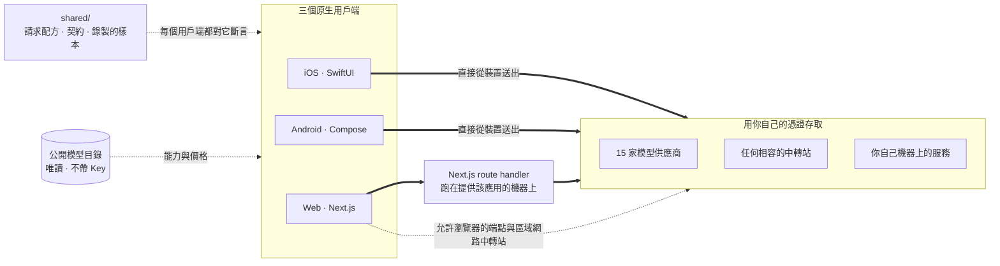

<div align="center">


# Oriveo 社群版

**所有模型，一個應用程式。**

開源、自備金鑰的 AI 聊天應用，支援 iOS、Android 與網頁，
另有一個原生 macOS 用戶端正在開發中。
不需要帳號，不需要訂閱，聊天請求路徑上沒有我們的任何服務。

<a href="../../LICENSE"></a>
<a href="ios.md"></a>
<a href="android.md"></a>
<a href="web.md"></a>
<a href="macos.md"></a>
<a href="https://github.com/oriveo/oriveo/releases/latest"></a>
<a href="https://github.com/oriveo/oriveo/stargazers"></a>

**取得 Oriveo：**
<a href="https://oriveoai.com"><b>oriveoai.com</b></a> &nbsp;·&nbsp;
<a href="https://apps.apple.com/app/oriveo/id6775370458">App Store</a> &nbsp;·&nbsp;
<a href="https://play.google.com/store/apps/details?id=com.kenny.oriveo">Google Play</a> &nbsp;·&nbsp;
<a href="https://app.oriveoai.com">網頁版</a>

<sub>商店裡的版本是 <b>Oriveo</b>，專有版本。這個儲存庫是<a href="#社群版與-oriveo">社群版</a>，由原始碼建置。</sub>

<a href="#開始使用">從原始碼建置</a> &nbsp;·&nbsp;
<a href="#架構">架構</a> &nbsp;·&nbsp;
<a href="#社群版與-oriveo">版本比較</a> &nbsp;·&nbsp;
<a href="#常見問題">常見問題</a> &nbsp;·&nbsp;
<a href="../../CONTRIBUTING.md">參與貢獻</a>

<sub>

<a href="../../README.md">English</a> ·
<a href="../ar/README.md">العربية</a> ·
<a href="../de/README.md">Deutsch</a> ·
<a href="../es/README.md">Español</a> ·
<a href="../fr/README.md">Français</a> ·
<a href="../hi/README.md">हिन्दी</a> ·
<a href="../id/README.md">Indonesia</a> ·
<a href="../ja/README.md">日本語</a> ·
<a href="../ko/README.md">한국어</a> ·
<a href="../pt-BR/README.md">Português</a> ·
<a href="../ru/README.md">Русский</a> ·
<a href="../th/README.md">ไทย</a> ·
<a href="../tr/README.md">Türkçe</a> ·
<a href="../vi/README.md">Tiếng Việt</a> ·
<a href="../zh-Hans/README.md">简体中文</a> ·
**繁體中文**

</sub>

&nbsp;
&nbsp;


<sub>你用過的每一家供應商與各自花了多少 · 第二個模型正在核對第一個 · 一則被留成筆記的回覆</sub>

</div>

---

## Oriveo 是什麼

Oriveo 社群版是一個開源、自備金鑰的多模型 AI 聊天用戶端（open-source BYOK multi-model AI chat
client），支援 iOS、Android 與網頁，另有一個原生 macOS 用戶端正在開發中。它是託管版 ChatGPT 或 Claude
方案之外一個本機優先（local-first）的選擇，給那些寧願直接付錢給模型供應商、也不願為擋在供應商前面的
那一層繳訂閱費的人。你提供自己既有的 API Key，用戶端就直接拿它去跟供應商溝通；這個 LLM client 的網頁版
你可以自行架設（self-host）—— 沒有 Oriveo 帳號，也沒有任何東西回報給我們。

它原生支援 **15 家模型供應商** —— OpenAI、Anthropic、Google Gemini、OpenRouter、DeepSeek、Grok、
Mistral、Groq、Together AI、Fireworks AI、MiniMax、Z.ai、Qwen、Kimi（Moonshot）與 SiliconFlow ——
再加上 **任何 OpenAI、Anthropic 或 Gemini 相容的端點**，包括跑在你自己機器上的 llama.cpp、Ollama、
LM Studio 或 vLLM。一個用戶端，一套對話，無論最後由哪個模型回答。

<table>
<tr>
<td width="33%" valign="top"><b>15 家供應商</b><br>另有中轉站（Relay）端點與本機模型伺服器。</td>
<td width="33%" valign="top"><b>預設留在本機</b><br>對話、筆記、資料夾、技能與附件都留在裝置上。</td>
<td width="33%" valign="top"><b>一套行為，三個用戶端</b><br>一份規格寫在 <code>shared/</code>，三套測試對著它斷言。</td>
</tr><tr>
<td valign="top"><b>不需要帳號</b><br>沒有任何東西回報給我們。</td>
<td valign="top"><b>自行架設</b><br>網頁用戶端跑在你自己的機器上。</td>
<td valign="top"><b>16 種語言</b><br>為阿拉伯文提供完整的由右至左版面。</td>
</tr></table>

## 為什麼會有它

沒有人該有辦法對你正在付費的模型計量、記錄或加價。

- **你的 Key，你的帳單。** 你按供應商的公開價格付費。沒有加價、沒有二次計量，也沒有轉售。
- **預設留在本機。** 對話、筆記、資料夾、技能與附件都留在裝置上。想匯出成檔案隨時都可以；不存在
  哪天會失去存取權的雲端副本。
- **一套行為，三個用戶端。** 針對某家供應商、某種傳輸方式與某項能力該如何組出請求，只在
  [`shared/`](shared.md) 裡寫下一次，三個用戶端都對著同一批 JSON fixture 做斷言。住在那份資料裡的
  怪癖修一次就好；住在解析器裡的那種，會被三套測試同時抓到。
- **它唯一去取的那樣東西。** 一份公開、唯讀的模型目錄，讓今天剛發表的模型不必更新應用程式就能使用
  —— 不帶 Key，不帶任何由我們附加的識別資訊，而且可以指向你自己的主機。

## 功能

- **聊天** —— 串流輸出、推理區塊、引用來源、附件（圖片與影片、PDF、Office（docx、xlsx、pptx）、
  OpenDocument、EPUB、RTF、HTML，以及任何純文字或原始碼檔案）、選取引用、重試、重新產生、回答被中斷
  後繼續
- **供應商** —— 內建 15 家，每一家都用你自己的 Key；可依供應商覆寫模型與生成參數，供應商提供多個
  區域端點時也可以選擇要用哪一個
- **中轉站** —— 任何 OpenAI、Anthropic 或 Gemini 相容的端點，外加 llama.cpp 的原生 API，包括你
  區域網路裡的那一個
- **本機模型伺服器** —— llama.cpp、Ollama、LM Studio、vLLM、Open WebUI；引擎會自行廣播時，iOS 與
  Android 透過 mDNS 在區域網路上找到它們，否則就去探測慣用的連接埠
- **訂閱登入** —— 用你已持有的 ChatGPT 或 Grok 訂閱取代 API Key，走各家供應商自己的裝置授權流程
- **技能** —— 可重複使用的系統提示詞，各自帶有專屬的模型、推理設定與參考文件
- **筆記與資料夾** —— 把回覆存成筆記、整理對話、在兩者之間搜尋
- **換模型核對** —— 把一份答案交給第二個模型檢視，並把兩者放在一起保留
- **費用** —— 依訊息與依供應商統計支出，在裝置上根據每次回應實際回報的內容計算，包含快取讀取與快取
  寫入級距
- **圖片生成** —— 供應商支援時可用
- **備份** —— 把所有內容匯出成檔案；其中的供應商 Key 如果你選擇一併匯出，會用你自訂的密碼加密
- **16 種介面語言**，包含為阿拉伯文提供的完整由右至左版面

## 社群版與 Oriveo

這個儲存庫是 **Oriveo 社群版**，採用 [AGPL-3.0-or-later](../../LICENSE) 授權。App Store、
Google Play 上的應用程式以及託管的網頁版則是 **Oriveo** —— 一個獨立的專有產品，額外加了一層帳號
機制。

| | 社群版 | Oriveo |
|---|---|---|
| 原始碼 | 本儲存庫，AGPL-3.0-or-later | 專有 |
| 用自己的供應商 Key 聊天 | 是 | 是 |
| 中轉站與本機模型伺服器 | 是 | 是 |
| 筆記、資料夾、技能、附件 | 是 | 是 |
| 裝置端費用追蹤 | 是 | 是 |
| 帳號 | 無 | Oriveo 帳號 |
| 儲存 | 在裝置上；手動匯出與還原 | 本機優先，另有跨裝置雲端同步 |
| 用量洞察與預算提醒 | — | 是 |
| 由 Oriveo 付費的模型 | — | 是 |
| 分析追蹤與當機回報 | 沒有。網頁版套件裡的 Sentry 在你沒設定自己的 DSN 時始終不會出聲 | 有 |

社群版建置使用 `ai.oriveo.community` 這個識別碼前綴，因此它可以和商店版裝在同一台裝置上，兩者不共用
鑰匙圈，也不共用任何本機資料。這個版本會接受什麼、不接受什麼，都寫在
[COMMUNITY.md](../../COMMUNITY.md) 裡。

**Oriveo 完整產品：** [iPhone 與 iPad](https://apps.apple.com/app/oriveo/id6775370458) ·
[Android](https://play.google.com/store/apps/details?id=com.kenny.oriveo) · [網頁版](https://app.oriveoai.com) · [oriveoai.com](https://oriveoai.com)

## 供應商

以下每一家都是用你自己申請的 Key 去存取。其中有兩家也可以改用你已持有的訂閱登入來存取，不必用
Key：用 ChatGPT 方案登入的 OpenAI，以及 Grok。

| 供應商 | 到哪裡申請 Key |
|---|---|
| OpenAI | [platform.openai.com](https://platform.openai.com/api-keys) |
| Anthropic | [platform.claude.com](https://platform.claude.com/settings/keys) |
| Google Gemini | [aistudio.google.com](https://aistudio.google.com/apikey) |
| OpenRouter | [openrouter.ai](https://openrouter.ai/keys) |
| DeepSeek | [platform.deepseek.com](https://platform.deepseek.com/api_keys) |
| Grok | [console.x.ai](https://console.x.ai/) |
| Mistral | [console.mistral.ai](https://console.mistral.ai/api-keys) |
| Groq | [console.groq.com](https://console.groq.com/keys) |
| Together AI | [api.together.xyz](https://api.together.xyz/settings/api-keys) |
| Fireworks AI | [fireworks.ai](https://fireworks.ai/api-keys) |
| MiniMax | [platform.minimax.io](https://platform.minimax.io/docs/guides/quickstart-preparation) |
| Z.ai | [open.bigmodel.cn](https://open.bigmodel.cn/usercenter/apikeys) |
| Qwen | [bailian.console.alibabacloud.com](https://bailian.console.alibabacloud.com/?apiKey=1#/api-key) |
| Kimi (Moonshot) | [platform.kimi.ai](https://platform.kimi.ai/console/api-keys) |
| SiliconFlow | [cloud.siliconflow.cn](https://cloud.siliconflow.cn/account/ak) |
| **中轉站** | 任何 OpenAI、Anthropic 或 Gemini 相容的端點，外加 llama.cpp 的原生 API，包括你自己機器上的那一個 |

## 架構

三個原生用戶端，一份「該怎麼跟模型供應商說話」的定義。



每個用戶端各自擁有自己的介面、儲存與導覽，只在唯一一處接縫上與共用契約相接：把*這個模型、這項能力*
轉成一個 HTTP 請求的那一層。

唯一值得知道的不對稱在網頁用戶端。多數供應商 API 不送 CORS 標頭，瀏覽器無法直接呼叫它們。這些請求
會經過一個 Next.js route handler，它跑在提供該應用的那台機器上 —— 你在本機執行時，那就是你自己的
機器。少數確實允許瀏覽器直連的端點（Kimi 的中國區端點，以及 OpenRouter、SiliconFlow、DeepSeek 與
Kimi 的餘額端點），以及你自己網路裡的中轉站，則是直連。iOS 與 Android 用戶端沒有這個限制，一律直連
供應商。

**各用戶端的架構：**

| | 技術堆疊 | README |
|---|---|---|
| **iOS** | SwiftUI 搭配一個 UIKit 訊息列表、GRDB | [ios.md](ios.md) |
| **Android** | Jetpack Compose、Room、Koin、Ktor/OkHttp | [android.md](android.md) |
| **Web** | Next.js App Router、React、Zustand、TypeScript | [web.md](web.md) |
| **macOS** | 開發中，未來幾個月推出 | [macos.md](macos.md) |
| **Shared** | 契約、錄製的 fixture，以及 Swift 通訊核心 | [shared.md](shared.md) |

## 開始使用

這裡沒有預先建置好的二進位檔 —— 沒有 APK、沒有 `.ipa`。社群版是你自己建置的原始碼。想最快跑起來，
網頁用戶端是最短的一條路。

<details open>
<summary><b>網頁版</b> —— 最快的試用方式</summary>

<br>

需要 Node 22.22.2 或更新的 22.x（見 [`web/.nvmrc`](../../web/.nvmrc)）；不支援 Node 23 以上。

```bash
cd web
npm install
npm run dev:app        # http://localhost:3001
```

第一個畫面會向你要一組供應商 API Key。除此之外不需要別的。
更多指令與設定：[web.md](web.md)。

</details>

<details>
<summary><b>iOS</b> —— 在自己的 iPhone 上建置並執行</summary>

<br>

需要一台裝有 Xcode 26 的 Mac，以及一台 iOS 18 以上的裝置。免費的 Apple Developer 帳號就夠了 ——
這個應用程式沒有用到任何付費功能。

1. 開啟 `ios/Oriveo/Oriveo.xcodeproj`
2. 選擇 `Oriveo` scheme
3. 在 Signing &amp; Capabilities 下選擇你自己的 Team
4. 如果 Xcode 無法註冊 `ai.oriveo.community`，請把 bundle identifier 換成一個你的 Team 擁有的
5. 執行

完整流程，包括 Xcode 拒絕開啟專案時該怎麼辦：[ios.md](ios.md)。

</details>

<details>
<summary><b>Android</b> —— 建置 APK</summary>

<br>

需要 JDK 21 與 Android SDK。建置使用 AGP 9.3、Gradle 9.5 與 Kotlin 2.3，所以 Android Studio 必須
是能同步它們的版本。若走命令列，只需要 JDK 與 SDK。

```bash
cd android
./gradlew :app:assembleDebug
```

想從自己的主機提供模型目錄：[android.md](android.md)。

</details>

## 隱私

- **供應商 Key** 在 iOS 上交給 Keychain，在 Android 上存進 `EncryptedSharedPreferences`，用來加密
  它的金鑰則由 Android Keystore 保管。瀏覽器沒有對等的機制，所以在網頁上它們是未加密地躺在
  IndexedDB 裡 —— 這也是瀏覽器 BYOK 用戶端普遍採用的做法。若要最強的保障，請使用 iOS 或
  Android 用戶端。
- **對話、筆記、資料夾、技能與附件** 都存在裝置上。不會上傳到任何地方。
- **沒有帳號，也沒有分析追蹤。** 沒有東西可以登入，也沒有東西在統計你做了什麼。網頁版套件內含用於
  錯誤回報的 Sentry。在你把 `NEXT_PUBLIC_SENTRY_DSN` 指向你自己的專案之前，它不會出聲，而一旦你設
  了，它除了堆疊追蹤之外還會擷取工作階段重播。iOS 與 Android 用戶端裡根本沒有任何回報 SDK。
- **在 iOS 與 Android 上，聊天請求從裝置直達供應商。** 在網頁上，它們大多會經過提供該應用的那台
  Next.js 伺服器，因為多數供應商 API 不允許瀏覽器直接呼叫。那台伺服器不會保存 Key 或訊息，而當你在
  本機執行時，它就是你自己的機器。
- **我們自己只發兩個請求：** 一份唯讀的模型目錄，分兩次呼叫讀取。一次取每個模型希望被怎麼呼叫，
  另一次取個別模型的事實資料，而 iOS 只有在訂閱登入之後才會去讀後者。有了這兩次，今天剛發表的模型
  不必重新建置就能使用。兩者都不帶 Key、不帶對話，也不帶任何由我們附加的識別資訊。主機只看得到
  平台預設的 User-Agent，而用戶端唯一送回去的東西是目錄自己的 `ETag`，以 `If-None-Match` 的形式
  送出。網頁用戶端（`NEXT_PUBLIC_BACKEND_URL`）與 Android 建置（`-PORIVEO_METADATA_BASE_URL`）
  可以指向你自己的主機；在 iOS 上，這個覆寫只是 Debug 建置的一點方便而已。

## 常見問題

<details>
<summary><b>Oriveo 是支援 OpenAI、Claude、Gemini 與 OpenRouter 的 BYOK 用戶端嗎？</b></summary>

<br>

Bring your own key，自備金鑰。你在供應商自己的主控台建立一組 API Key —— OpenAI、Anthropic、
Google 等等 —— 然後貼進 Oriveo。請求由那家供應商依其公開價格計費。Oriveo 只是用戶端；它不是經銷商，
也不抽成。

</details>

<details>
<summary><b>Oriveo 是免費開源的 ChatGPT 替代方案嗎？</b></summary>

<br>

用戶端是：開源、沒有任何可以訂閱的東西，也沒有哪個部分被擋在付費之後。你付的是模型供應商自己的
公開價格，為你發出的那些請求付費，由他們向這組 Key 所屬的帳戶計費。Oriveo 從來看不到那張帳單。

</details>

<details>
<summary><b>我的對話會經過 Oriveo 的伺服器嗎？</b></summary>

<br>

不會。iOS 與 Android 直接呼叫供應商。在網頁上，多數請求會經過提供該應用的那台 Next.js 伺服器 ——
你在本機執行時那就是你自己的機器 —— 因為多數供應商 API 不接受瀏覽器直接呼叫。聊天路徑上沒有任何
由我們營運的伺服器。請見[隱私](#隱私)。

</details>

<details>
<summary><b>它能搭配 Ollama、LM Studio 或 llama.cpp 使用嗎？</b></summary>

<br>

可以。新增一個中轉站連線，指向任何 OpenAI、Anthropic 或 Gemini 相容的伺服器 —— llama.cpp、Ollama、
LM Studio、vLLM、Open WebUI，或任何說這幾種協定的東西。引擎會自行廣播時，iOS 與 Android 用戶端透過
mDNS 在區域網路上找到它，否則就去探測慣用的連接埠；網頁用戶端則會提供每個引擎慣用的位址。本機 HTTP
不使用任何憑證，流量也不會離開你的網路。

</details>

<details>
<summary><b>我可以自行架設 Oriveo 嗎？</b></summary>

<br>

可以。網頁用戶端是這個專案裡唯一有伺服器端的部分，而它既不保存 Key 也不保存訊息。把它指向你自己
硬體上的模型伺服器，再用 `NEXT_PUBLIC_BACKEND_URL`（網頁）或 `-PORIVEO_METADATA_BASE_URL`
（Android）自行架設模型目錄，就沒有任何請求會越過你的網路。在 iOS 上這個覆寫只存在於 Debug 建置。
請見[隱私](#隱私)。

</details>

<details>
<summary><b>社群版和 App Store 上的 Oriveo 差在哪？</b></summary>

<br>

商店裡的應用程式是 Oriveo，一個專有產品，額外提供帳號、跨裝置雲端同步、用量洞察，以及由 Oriveo 付費
的模型。社群版沒有這些。完整比較請見[社群版與 Oriveo](#社群版與-oriveo)。

</details>

<details>
<summary><b>有 macOS 應用程式嗎？</b></summary>

<br>

一個原生 macOS 用戶端正在開發中，會在未來幾個月推出；[`macos/`](macos.md) 就是它將來落腳的地方。
在那之前，網頁用戶端在任何瀏覽器裡都很適合當桌面應用使用，而 iOS 版建置可以直接從 Xcode 跑在 Apple
晶片的 Mac 上。那個負責跟供應商通訊的 Swift 套件已經宣告了 macOS 15，所以 Mac 用戶端所需的通訊層
今天已經在測試之中。

</details>

<details>
<summary><b>介面支援哪些語言？</b></summary>

<br>

十六種：阿拉伯文、德文、英文、西班牙文、法文、印地文、印尼文、日文、韓文、巴西葡萄牙文、俄文、
泰文、土耳其文、越南文、簡體中文與繁體中文。阿拉伯文有完整的由右至左版面。

</details>

## 儲存庫結構

```
ios/           iOS 用戶端（SwiftUI）
android/       Android 用戶端（Jetpack Compose）
web/           網頁用戶端（Next.js）
macos/         macOS 用戶端 —— 開發中，未來幾個月推出
shared/        跨用戶端契約、錄製的 fixture，以及 Swift 通訊核心
readme_i18n/   這些 README 的另外十五種語言版本
docs/assets/   README 用到的圖片
llms.txt       這份文件的機器可讀索引
.github/       Issue 與 Pull Request 範本
```

## 參與貢獻

歡迎回報問題與送出 Pull Request。[CONTRIBUTING.md](../../CONTRIBUTING.md) 說明如何建置每一個用戶端，
以及一個好的 Pull Request 長什麼樣。[COMMUNITY.md](../../COMMUNITY.md) 說明這個版本是做什麼的，
以及少數幾類無論寫得多好都不會被接受的變更。

發現安全問題了嗎？請不要開公開 issue —— [SECURITY.md](../../SECURITY.md) 說明了如何私下回報，以及這個
專案把什麼算作漏洞、把什麼不算。所有參與的人都必須遵守[行為準則](../../CODE_OF_CONDUCT.md)。

## 授權條款

[AGPL-3.0-or-later](../../LICENSE)。貢獻同樣以此授權條款接受。

供應商名稱與標誌屬於各自的所有者，出現在這裡只是為了標示這個用戶端可以指向哪些服務。它們不在本儲存庫
授權條款的涵蓋範圍內，出現在這裡也不代表任何人的背書。用戶端所打包的字型與程式庫，以及它們各自適用的
條款，都列在 [THIRD-PARTY-NOTICES.md](../../THIRD-PARTY-NOTICES.md) 裡。
