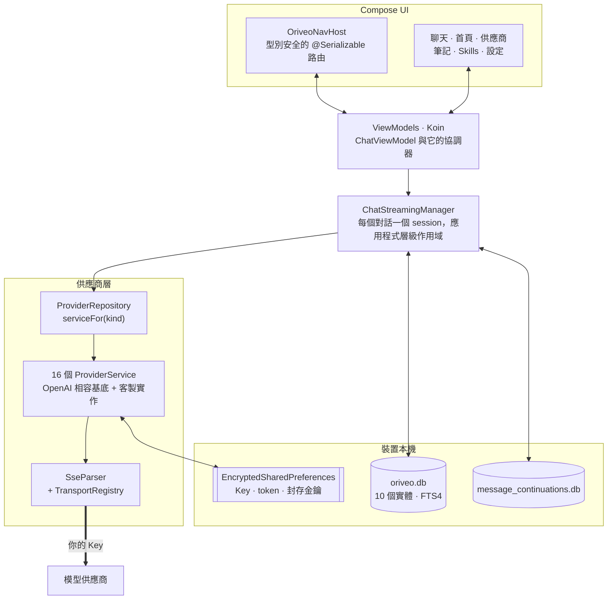

<div align="center">

# Oriveo for Android

**一個原生 Jetpack Compose 聊天用戶端，用來使用你早就在付費的那些 AI 模型。**

<a href="../../LICENSE"></a>


<sub>

<a href="../../android/README.md">English</a> ·
<a href="../ar/android.md">العربية</a> ·
<a href="../de/android.md">Deutsch</a> ·
<a href="../es/android.md">Español</a> ·
<a href="../fr/android.md">Français</a> ·
<a href="../hi/android.md">हिन्दी</a> ·
<a href="../id/android.md">Indonesia</a> ·
<a href="../ja/android.md">日本語</a> ·
<a href="../ko/android.md">한국어</a> ·
<a href="../pt-BR/android.md">Português</a> ·
<a href="../ru/android.md">Русский</a> ·
<a href="../th/android.md">ไทย</a> ·
<a href="../tr/android.md">Türkçe</a> ·
<a href="../vi/android.md">Tiếng Việt</a> ·
<a href="../zh-Hans/android.md">简体中文</a> ·
**繁體中文**

</sub>

</div>

---

Oriveo Android 用戶端是一個自備金鑰的 AI 聊天應用程式。你加入自己既有的 API Key，應用程式就從手機
直接與每一家供應商溝通。對話、筆記、資料夾與 Skills 用 Room 存在裝置上；API Key 由一把存放在
Android Keystore 裡的金鑰加密。沒有帳號，也不需要登入。

它是 [Oriveo 社群版](README.md) 的一部分 —— 三個用戶端共用同一份「該怎麼跟模型供應商說話」的定義。

## 架構



這張圖裡有三處是刻意的設計決定，而不是順手長成的結構。

**串流活在畫面之上。** `ChatStreamingManager` 在一個 `ConcurrentHashMap` 裡，依對話 id 各保留一個
`StreamingSession`，每一個都有自己應用程式層級的
`CoroutineScope(SupervisorJob() + Dispatchers.IO)`。離開聊天畫面不會取消這次回答，而
`StreamingTokenBuffer` 會定期把部分文字沖進 SQLite，所以在回答到一半時把應用程式砍掉，也不會弄丟
已經到手的內容。

**兩個資料庫，不是一個。** `oriveo.db` 放對話、訊息、附件、筆記、資料夾、Skills 與模型目錄快取。
`message_continuations.db` 是一個實體上獨立的檔案，存放供應商那邊不透明的續傳狀態，正是為了讓
`backup_rules.xml` 與 `data_extraction_rules.xml` 能把它排除在雲端備份與裝置轉移之外 —— 一個被還原到
另一台裝置上的續傳 token，往好處說也只是毫無意義。

**目錄比執行檔新時是降級，不是壞掉。** `TransportKind` 是一個封閉 enum，配上一個寬容的反序列化器：
未知的 transport 字串會解碼成 `null`，`TransportRegistry` 給不出策略，於是這個模型就會被從選擇器裡
過濾掉。另一種做法 —— 嚴格 enum —— 會讓整份目錄解析失敗，把其他所有模型一起拖下水。

## 模型被允許做什麼

用戶端從不從模型名稱去猜它的能力。它從目錄讀取一套能力執行期：一組配方，描述在給定的供應商、傳輸
方式與能力下，究竟該把哪些 JSON pointer 寫進請求裡。`ProviderRecipeRequestCompiler` 會先驗證配方與
供應商、能力和傳輸方式是否相符，再把它編譯成一份自有的 body delta；不符就以一個具名理由拒絕
（`recipe_not_found`、`transport_mismatch`、`model_route_must_not_patch_body`），而不是默默產出一個
沒人審過的請求。

在回程上，`CapabilityEvidenceFacade` 依來源為「關於一項能力究竟已知什麼」排序 ——
`operator_override` > `server_typed` > `server_profile` > `model_facts` > `relay_verification` >
`relay_declaration` > `legacy_metadata`。只有串流解析器可以把一項能力標記為*已觀測*；意圖、配方、
HTTP 200 與工具宣告都明確不算數。每則訊息的結果都會被保存，所以介面能區分*已請求*與*已確認*。

覆寫項在七個作用域之間以後寫者優先解析，優先順序由高到低為：`single_send` >
`conversation_connection_model` > `skill_agent` > `connection_model` > `connection` >
`provider_recipe` > `provider_default`。

## 儲存與機密

| 內容 | 位置 |
|---|---|
| 對話、訊息、附件、筆記、資料夾、Skills | Room，`oriveo.db` |
| 筆記的全文搜尋 | FTS4 虛擬表 |
| 模型目錄快取 | `oriveo.db` 裡單獨一列，分批讀回 |
| 供應商續傳狀態 | `message_continuations.db`，排除在備份之外 |
| 供應商 API Key | `EncryptedSharedPreferences`，AES-256-GCM，主金鑰存在 Keystore |
| 訂閱 OAuth token | 第二個獨立的加密偏好設定檔 |
| 備份封存金鑰 | 第三個 |
| 附件二進位資料 | 磁碟上的檔案，以 id 參照 |

這三個加密偏好設定檔是依生命週期與波及範圍拆開的，而不是為了方便合成一個。每一個都有復原路徑：
損壞的檔案（`AEADBadTagException`、`VERIFICATION_FAILED`）會被偵測出來、刪除並重建，而不是讓應用程式
每次啟動都當機。

這三個檔案，連同那個續傳資料庫，都被排除在 Android 雲端備份與裝置轉移之外。這是把它們綁到 Keystore
的必然結果，不是疏漏 —— 密文換到新裝置上本來也解不開。**換新手機之後，你要重新輸入 API Key、重新
登入各家供應商的訂閱**；對話與筆記會正常帶過去。

你自己匯出的備份封存則是另外加密的，使用 PBKDF2-HMAC-SHA256 迭代 600,000 次搭配 AES-GCM，密碼由你
自訂。

## 連上你自己網路上的模型伺服器

manifest 裡設了 `android:usesCleartextTraffic="true"`，這是刻意的：本機模型伺服器 —— llama.cpp、
Ollama、LM Studio、vLLM —— 在你自己的機器或區域網路上說的是明文 HTTP，而且通常沒有憑證。

真正的邊界在程式碼裡，不在 manifest 裡，而且也只能如此。`RelayEndpointPolicy` 會解析主機名稱，要求
解析出的**每一個**位址都是私有位址（loopback、RFC 1918、link-local、unique-local，以及 VPN 模式下的
CGNAT 範圍），拒絕那些解析結果混雜公開與私有位址的主機，把解析出的位址集合釘住以防 DNS rebinding
並在送出時再驗證一次，拒絕任何攜帶憑證資料的明文請求，並擋下跨來源或變更協定的重新導向。

Android 的 network security config 表達不出這套規則：它只比對主機名稱，沒有描述位址範圍的語法，而
這裡的位址是執行期從使用者自己的網路來的。而且 config 嚴格來說更弱，因為它永遠看不到一個名稱解析成
了哪個位址。

## 模型目錄

應用程式從一份公開目錄讀取模型能力與價格，讓今天剛發表的模型不必更新應用程式就能使用。它是一個單純
的 HTTPS `GET`，不帶憑證也不帶任何識別資訊，而且聊天請求根本不會靠近它。只請求兩個端點：

```
GET {base}/api/metadata?view=lean
GET {base}/api/metadata/model-facts
```

base URL 是一個建置期屬性，預設為 `https://api.oriveoai.com`：

```bash
./gradlew :app:assembleDebug -PORIVEO_METADATA_BASE_URL=https://your.host
```

回應會以 ETag 重新驗證並快取在 `oriveo.db`，所以只要成功抓取過一次，之後目錄連不上時，應用程式仍能
靠快取副本繼續運作。

> [!IMPORTANT]
> 以空值建置（`-PORIVEO_METADATA_BASE_URL=`）會完全停用目錄抓取，而且 APK 裡**沒有內附任何快照**。
> 這樣建出來的版本，在全新安裝時：
>
> - 15 家內建供應商都拿不到模型清單，而且應用程式也不會轉頭去向供應商索取 —— 目錄是唯一來源；
> - 失敗是**無聲的**。加入 Key 依然會回報成功，模型選擇器只是空的，沒有任何說明；
> - **OpenAI 會變得不能用**，因為那家供應商禁止手動輸入模型；
> - Relay 端點與本機模型伺服器仍然完全可用，也是唯一完好的那條路。
>
> 想要離線建置，請自己提供這份目錄並讓建置指向它，而不是把這個值清空。

## 專案結構

```
android/
  app/src/main/java/ai/oriveo/community/
    core/
      provider/    every provider service, transports, relay, capability recipes
      data/        Room entities, DAOs, repositories, backup, catalog client
      model/       domain models and the capability/preference resolvers
      attachments/ routing, budgets, per-format text extraction
      security/    SecureKeyStore, BackupCrypto, external-URL policy
      streaming/   ChatStreamingManager
      navigation/  AppRoute, OriveoNavHost
    feature/       one package per screen
    ui/            shared components, Markdown + LaTeX renderer, theme
    di/            Koin modules
  benchmark/       macrobenchmark suite (cold start, model picker)
```

## 建置

需求：**JDK 17 以上**與 Android SDK。建置使用 AGP 9.3、Gradle 9.5 與 Kotlin 2.3，所以 Android
Studio 必須是能同步 AGP 9.3 的版本；若走命令列，只需要 JDK 與 SDK。

```bash
./gradlew :app:assembleDebug
./gradlew :app:testDebugUnitTest
```

建置目標為 `minSdk 26`、`targetSdk 36`、`compileSdk 37`。`local.properties`（你的 SDK 路徑）由
Android Studio 產生，不會提交。正式版簽署方式見 [SIGNING.md](../../android/SIGNING.md)。

> [!NOTE]
> Gradle daemon 跑在 Java 21 工具鏈上（`gradle/gradle-daemon-jvm.properties`），而且比對的是「剛好
> 21」，不是「21 或更新」。裝的是其他 JDK 時，Gradle 會在第一次建置時自己下載一個 JDK 21，這需要
> 網路連線；自己先裝好 JDK 21 就能省下這一步。如果你設過
> `org.gradle.java.installations.auto-download=false`，這次下載就不會發生，建置會以
> `Toolchain auto-provisioning is not enabled.` 失敗 —— 這是唯一一種只有 JDK 17 真的不夠用的情況。
> 無論哪一種方式，編譯目標都是 Java 17。

單元測試的並行度是從機器的 CPU 數與實體記憶體推導出來的，而不是寫死的，所以這套測試在筆電和大型
工作站上都表現正常。

## 相依套件

| 函式庫 | 版本 | 用途 |
|---|---|---|
| Jetpack Compose BOM | 2026.08.00 | 介面，Material 3 |
| Room | 2.8.4 | SQLite、DAO、FTS4 |
| Koin | 4.2.2 | 相依性注入 |
| Ktor client（OkHttp engine） | 3.5.2 | 供應商 HTTP 與 SSE |
| kotlinx.serialization | 1.11.0 | JSON |
| navigation-compose | 2.9.6 | 型別安全路由 |
| androidx.security-crypto | 1.1.0 | `EncryptedSharedPreferences` |
| haze | 1.7.3 | 背景模糊 |
| PDFBox-Android、jsoup | 2.0.27.0、1.23.2 | 附件文字擷取 |
| jlatexmath-android | 0.2.0 | LaTeX 渲染 |

確切版本鎖在 [`gradle/libs.versions.toml`](../../android/gradle/libs.versions.toml)。

## 測試

```bash
./gradlew :app:testDebugUnitTest
```

319 個檔案裡大約 3,000 個單元測試，使用 JUnit 4、MockK、Turbine、`kotlinx-coroutines-test` 與 Ktor
的 mock engine。覆蓋最密的地方，正是出錯代價最高的地方：每家供應商的請求形狀、SSE 解析、傳輸方式
選擇、relay 探測與安全模式、能力配方執行、目錄快取與契約版本處理、Room 持久化，以及備份的來回
一致性。

> [!IMPORTANT]
> 大約有 38 套測試從工作目錄一路往上找到 `shared/` 並載入契約 fixture，所以**測試只有在完整
> checkout 下才會通過** —— 把 `android/` 單獨複製出去是行不通的。

另外還有三個插樁測試 —— 一個本機引擎的釋出矩陣、一個明文 socket 測試，以及一個 keystore 隔離測試。
它們不是自足的：本機引擎那幾個需要用插樁參數指出你網路上一台真正在跑的模型伺服器，所以
`connectedAndroidTest` 開箱是跑不過的。Pull Request 的關卡是單元測試套件。

`:benchmark` 模組放的是冷啟動與模型選擇器的 macrobenchmark。它是一個獨立的 Gradle 模組，使用
`com.android.test` 搭配自我插樁，並驅動 `:app` 中一個專門的 `benchmark` 建置類型。

兩個資料庫都還在 `version = 1`，目前沒有任何遷移；schema 會匯出到 `app/schemas/` 並提交，第一次遷移
的 `2.json` 就會落在那裡。

## 在地化

十六種語言：`values/`（英文，來源語言）加上十五個 `values-*` 目錄，每個約 1,700 條字串，而且每個
locale 都持有完全相同的鍵集。應用內語言切換走 `AppLanguageManager` 與 `android:localeConfig`。
bundle 停用了語言分割，所以單一產物就帶著全部翻譯。

## 參與貢獻

見 [CONTRIBUTING.md](../../CONTRIBUTING.md)。專案的工作語言是英文：原始碼、註解、測試與提交訊息都
用英文。介面字串則會翻譯 —— 先把新字串加進 `values/`，其他 locale 之後再跟上。送出 Pull Request
之前請先跑單元測試。

## 授權條款

[AGPL-3.0-or-later](../../LICENSE)。
