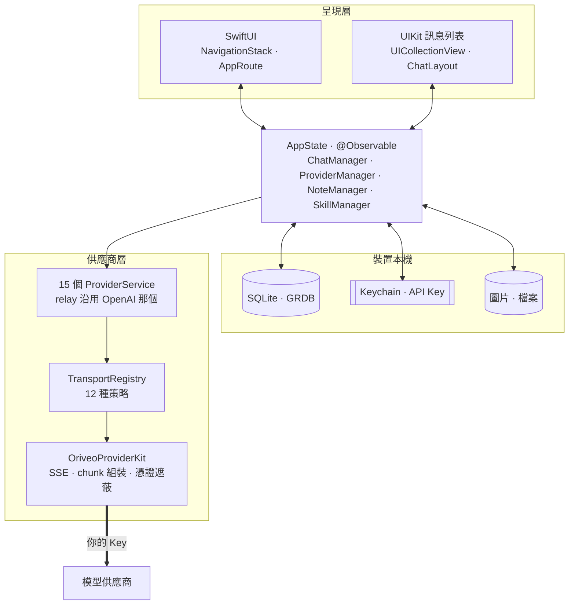
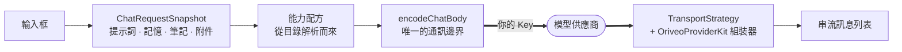

<div align="center">

# Oriveo for iOS

**一個原生 SwiftUI 聊天用戶端，用來使用你早就在付費的那些 AI 模型。**

<a href="../../LICENSE"></a>


<sub>

<a href="../../ios/README.md">English</a> ·
<a href="../ar/ios.md">العربية</a> ·
<a href="../de/ios.md">Deutsch</a> ·
<a href="../es/ios.md">Español</a> ·
<a href="../fr/ios.md">Français</a> ·
<a href="../hi/ios.md">हिन्दी</a> ·
<a href="../id/ios.md">Indonesia</a> ·
<a href="../ja/ios.md">日本語</a> ·
<a href="../ko/ios.md">한국어</a> ·
<a href="../pt-BR/ios.md">Português</a> ·
<a href="../ru/ios.md">Русский</a> ·
<a href="../th/ios.md">ไทย</a> ·
<a href="../tr/ios.md">Türkçe</a> ·
<a href="../vi/ios.md">Tiếng Việt</a> ·
<a href="../zh-Hans/ios.md">简体中文</a> ·
**繁體中文**

</sub>

</div>

---

Oriveo iOS 用戶端是一個自備金鑰的 AI 聊天應用程式。你加入自己既有的 API Key，應用程式就從手機直接
呼叫每一家供應商。對話、筆記、資料夾、Skills 與附件以 SQLite 存在裝置上；API Key 則交給 iOS
Keychain。沒有帳號，也不需要登入。

它是 [Oriveo 社群版](README.md) 的一部分 —— 三個用戶端共用同一份「該怎麼跟模型供應商說話」的定義。

## 架構



這張圖有三件事值得明講。

**訊息列表是 UIKit，其餘都是 SwiftUI。** `ChatView` 內嵌了一個包住 `UICollectionView` 的
`ChatListViewControllerRepresentable`，由 [ChatLayout](https://github.com/ekazaev/ChatLayout)
驅動。其他所有東西 —— 導覽、設定、供應商設定、筆記、Skills —— 都是 SwiftUI。之所以拆開，是因為以
token 速率更新的串流訊息列表，需要對量測與重用做到 cell 層級的掌控，而 SwiftUI 的 diff 給不了這件事。
[`Features/Chat/ARCHITECTURE.md`](../../ios/Oriveo/Oriveo/Features/Chat/ARCHITECTURE.md)
記錄了這條邊界。

**有三條各自獨立的路徑在更新那個訊息列表**，這是刻意的：

| 路徑 | 承載什麼 | 為什麼 |
|---|---|---|
| `@Observable AppState` | 結構性變化 —— 出現一則訊息、切換一個對話 | SwiftUI 原生，低頻事件下成本很低 |
| GRDB `ValueObservation` | 從 SQLite 讀回來的持久狀態 | 寫入之後只有一個真相來源，重新啟動也還在 |
| 每個對話一個 Combine `PassthroughSubject` | 串流文字與推理增量 | 在 token 速率下完全繞開 SwiftUI 的 diff |

**供應商支援是四條互相獨立的軸，不是一個 enum。** `ProviderKind`（16 個 case）是*使用者設定了誰*。
`ProviderServiceProtocol` 是*呼叫介面*。`TransportKind`（12 個 case）是*實際說的是哪一種通訊協定* ——
而且它是**依模型、從目錄解析出來的**，所以同一把 Key 後面的兩個模型完全可以不一致。`RelayKind` 負責
使用者自備的端點。把它們分開，正是新模型不必重新建置就能用的原因。

### 一則訊息是怎麼送出去的



`BaseAPIService.encodeChatBody` 是請求主體變成位元組的唯一一處。每一條能力配方、每一個生成參數、
每一個自訂欄位都得從這裡通過，這也是通訊格式能在一個地方而不是十五個地方被測試的原因。

## 模型被允許做什麼

用戶端從不從模型名稱去猜它的能力。它讀取一套**能力執行期** —— 一組配方，描述在給定的供應商、傳輸
方式與能力下，究竟該把哪些 JSON pointer 寫進請求裡。這些配方放在
[`shared/capabilityrecipe`](../../shared/capabilityrecipe/)，
由 `CapabilityRecipeRequestCompiler` 套用。

在回程上，`CapabilityExecutionRuntime` 記錄實際發生了什麼。只有被選定的正式串流解析器可以把一項能力
提升為*已觀測*。HTTP 200、一個非空的答案，以及請求裡的工具宣告，都明確**不算證據**。終端狀態依訊息
保存，所以介面能告訴你某個控制項曾被請求但從未被確認，而不是默默暗示它成功了。

## 儲存

```
Application Support/Oriveo/
  active-uid                     # storage partition, "guest" by default
  users/<uid>/
    oriveo.sqlite                # conversations, messages, notes, catalog cache
    Images/  Files/              # attachment blobs, referenced by id
    session-snapshot.json        # preferences, provider list (never API keys)
```

- **透過 GRDB 使用 SQLite**，開啟 WAL 與外鍵，並以一個 `DatabaseMigrator` 涵蓋每一次 schema 變更。
  對訊息與筆記的全文搜尋使用 FTS5 搭配 trigram 斷詞器。
- **API Key 存在 Keychain 裡**，以供應商與分區作為鍵，並且在 session 快照寫入之前就被清空。
- **附件是磁碟上的檔案**，不是資料列，所以一份大 PDF 永遠不會撐爆資料庫。

## 應用程式唯一為自己發出的網路請求

冷啟動時，應用程式會對 `https://api.oriveoai.com` 發出兩個未驗證、帶 ETag 條件的 `GET` 請求 ——
`/api/metadata?view=lean` 與 `/api/metadata/model-facts`。它們抓取公開的模型目錄：有哪些模型、每個
支援什麼、它的推理控制項叫什麼名字，以及要多少錢。不帶 Key、不帶對話，也不帶任何識別資訊，回應會被
快取在 SQLite 裡，所以目錄連不上時，應用程式仍能靠快取副本運作。

這是應用程式唯一為自己發出的請求。其餘一切都送往你設定的供應商，用你的 Key。

想讓 **Debug** 建置指向你自己的目錄主機，設定 `ORIVEO_METADATA_BASE_URL` —— 可以放在 scheme 的環境
變數裡，也可以當成 `ios/Oriveo/Config/Info.plist` 裡的一個鍵。和 Android 與網頁用戶端不同，Release
建置會忽略它，一律使用官方發布的目錄；想改這點，就得動 `BackendURLResolver`。

## 專案結構

```
ios/Oriveo/
  Oriveo.xcodeproj/
  Oriveo/
    Core/
      Providers/       15 provider services, transports, capability runtime, catalog client
      State/           AppState and the managers it owns
      Database/        GRDB pool, schema, migrator, stores, observations
      Models/          domain types
      Attachments/     import limits, budgets, per-format text extraction
      Tools/           tool-call loop and per-protocol adapters
    Features/
      Chat/            transcript, composer, model controls, export
      Providers/       setup, detail, relay, local engines, subscription sign-in
      Home/ Notes/ Skills/ Settings/ Backup/ Onboarding/
    Shared/Components/ shared views
    DesignSystem/      theme, colour, haptics
  OriveoTests/
```

## 建置與執行

你需要一台裝有 **Xcode 26** 的 Mac，以及一台 **iOS 18 以上**的裝置。免費的 Apple Developer 帳號就
夠了；這個應用程式沒有用到任何付費功能，並且帶的是一個空的 entitlements 檔案。

1. 開啟 `ios/Oriveo/Oriveo.xcodeproj`
2. 選擇 `Oriveo` scheme
3. 在 **Signing & Capabilities** 下選擇你自己的 Team
4. 如果 Xcode 無法註冊 `ai.oriveo.community`，把 bundle identifier 改成你的團隊擁有的那種
5. 接上 iPhone、啟用開發者模式、信任這台電腦，然後執行

若要改為建置給模擬器，挑任何一個 iPhone 模擬器再執行即可。套件相依性由已提交的 `Package.resolved`
解析。

專案檔使用 `objectVersion = 77` 與檔案系統同步群組，因此較舊的 Xcode 可能拒絕開啟它。請更新 Xcode，
不要去改專案檔格式。

> [!NOTE]
> App target 以 Swift 5 語言模式編譯，啟用了 `SWIFT_APPROACHABLE_CONCURRENCY` 與
> `SWIFT_DEFAULT_ACTOR_ISOLATION = MainActor`。本機的 `OriveoProviderKit` 套件宣告
> `swift-tools-version: 6.1`，以 Swift 6 語言模式建置。

## 相依套件

| 套件 | 版本 | 用途 |
|---|---|---|
| [GRDB.swift](https://github.com/groue/GRDB.swift) | 7.11.1 | SQLite 存取、遷移、`ValueObservation` |
| [ChatLayout](https://github.com/ekazaev/ChatLayout) | 2.4.3 | 訊息列表的 collection view 版面 |
| [swift-markdown-ui](https://github.com/gonzalezreal/swift-markdown-ui) | 2.4.1 | Markdown 渲染 |
| [SwiftMath](https://github.com/mgriebling/SwiftMath) | 1.7.3 | LaTeX 渲染 |
| [ZIPFoundation](https://github.com/weichsel/ZIPFoundation) | 0.9.20 | 備份封存、Office/EPUB/ODF 擷取 |
| `OriveoProviderKit` | 本機 | 供應商通訊核心，位於 [`shared/`](shared.md) |

## 測試

在 Xcode 裡執行 `Oriveo` scheme 的 test action（⌘U），或是從儲存庫根目錄執行：

```bash
xcodebuild test -project ios/Oriveo/Oriveo.xcodeproj -scheme Oriveo \
  -destination 'platform=iOS Simulator,name=iPhone 17'
```

請換成你本機真的有的模擬器 —— `xcrun simctl list devices available` 會列出來。

> [!IMPORTANT]
> 測試 target 從 `#filePath` 一路往上找到 `shared/` 目錄，再從那裡讀取契約 fixture。大約有 29 套測試
> 依賴這一點，所以**測試只有在完整 checkout 下才會通過** —— 把 `ios/` 單獨複製出去是行不通的。

這套測試很大：273 個檔案裡大約 2,900 個測試，多數使用
[Swift Testing](https://github.com/swiftlang/swift-testing)。涵蓋每家供應商的請求形狀、錄製的上游
SSE 重播、relay 與本機引擎政策、訊息列表的量測與串流行為、儲存，以及備份的來回一致性。

`shared/OriveoProviderKit` 有自己的一套：

```bash
cd shared/OriveoProviderKit && swift test
```

## 在地化

十六種語言，以 Xcode String Catalog（`.xcstrings`）保存 —— 十個 catalog、約 1,900 個鍵，英文是來源
語言。字串透過 `L10n.tr(_:table:)` 從一個依使用者應用內語言設定選出的 `.lproj` bundle 解析，所以切換
語言不必重新啟動就會生效。阿拉伯文的由右至左版面是明確處理的。

## 參與貢獻

見 [CONTRIBUTING.md](../../CONTRIBUTING.md)。行為變更請附上測試；修供應商協定問題時，請優先採用
`shared/test-fixtures` 底下錄製的 fixture 而不是手寫的 mock，並說明你是對哪家供應商、哪個模型測的。

## 授權條款

[AGPL-3.0-or-later](../../LICENSE)。
