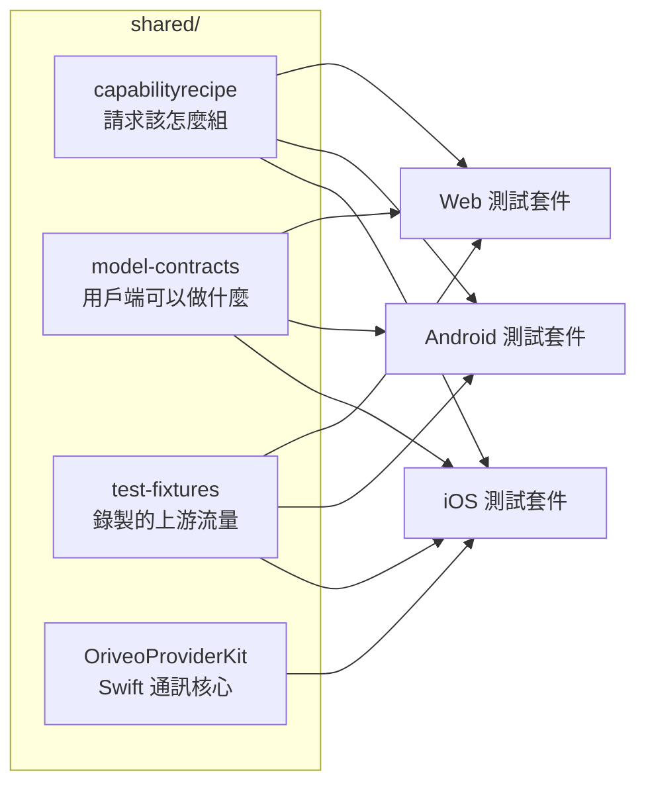

<div align="center">

# 共用契約

**一份「該怎麼跟模型供應商說話」的定義，由三個用戶端共同斷言。**

<a href="../../LICENSE"></a>


<sub>

<a href="../../shared/README.md">English</a> ·
<a href="../ar/shared.md">العربية</a> ·
<a href="../de/shared.md">Deutsch</a> ·
<a href="../es/shared.md">Español</a> ·
<a href="../fr/shared.md">Français</a> ·
<a href="../hi/shared.md">हिन्दी</a> ·
<a href="../id/shared.md">Indonesia</a> ·
<a href="../ja/shared.md">日本語</a> ·
<a href="../ko/shared.md">한국어</a> ·
<a href="../pt-BR/shared.md">Português</a> ·
<a href="../ru/shared.md">Русский</a> ·
<a href="../th/shared.md">ไทย</a> ·
<a href="../tr/shared.md">Türkçe</a> ·
<a href="../vi/shared.md">Tiếng Việt</a> ·
<a href="../zh-Hans/shared.md">简体中文</a> ·
**繁體中文**

</sub>

</div>

---

三個用戶端如果各自獨立實作「呼叫供應商」這件事，它們一定會漂移。它們會安靜地漂，朝著最近有人測過的
那一個的方向漂，而這份漂移最終會以一個「在某個平台上重現得出來、在其他平台上重現不了」的 bug 浮上
檯面。

`shared/` 就是對這件事的回答：行為以資料的形式寫下一次，而每個用戶端的測試套件都對著同一批檔案做
斷言。住在那份資料裡的怪癖修一次就好。住在解析器裡的那種，會被三套測試同時抓到，而不是在兩個平台上
順利出貨、把第三個搞壞。



## capabilityrecipe

配方註冊表。對於給定的供應商、傳輸方式與能力 —— 網頁搜尋、推理強度、圖片生成 —— 它精確說明該把哪些
JSON pointer 寫進送出的請求裡，以及該怎麼把答案讀回來。

正是它讓今天剛發表的模型不必更新用戶端就能使用，也正是它讓任何用戶端都不會從模型名稱去猜能力。
`capability_runtime.v1.json` 承載配方本身；`capability_result_definitions.v1.json` 與
`capability_custom_controls.v2.json` 則定義結果與面向使用者的控制項該如何解讀。

每一條配方都宣告一個 `executionKind` —— `request_overlay`、`server_tool`、`client_tool_loop`、
`endpoint_route`、`model_route` —— 而每個用戶端的編譯器都會在套用之前驗證這條配方與供應商、能力和
傳輸方式是否相符，不符就以一個具名理由拒絕，而不是送出一個沒人審過的請求。

## model-contracts

用來釘住跨用戶端行為的 JSON fixture：對於給定的供應商與能力，一個請求必須長什麼樣；生成參數如何
解析、覆寫項如何疊加；用戶端可以呈現哪些能力狀態；以及模型目錄與它的證據該如何被消費。

每個用戶端的測試都直接載入這些檔案，所以這裡的一次變更，就是對三個用戶端同時的變更。

## test-fixtures

黃金測試資料：錄製的上游工具呼叫流量、relay 路由與探索情境、model-facts 與能力證據快照，以及本機
引擎情境。

`recorded/` 底下的 `.sse` 檔案是**真實捕捉到的上游流量**，逐位元組原封不動保留；其餘的是手寫的
fixture，用來釘住某一條特定的解析路徑。這個區分很要緊：手寫的 mock 編碼的是你以為供應商會做的事，而
一段錄下來的串流編碼的則是它當時實際做了什麼，包含那個星期二它送來的那個格式錯誤的區塊。當一個供應商
協定修正需要測試時，優先用錄製。

## OriveoProviderKit

一個 Swift 套件，裝著供應商通訊協定的核心：SSE 行組裝、OpenAI 相容的區塊解析、工具名稱編碼、憑證
遮蔽、上游錯誤分類、thinking 標籤解析、串流 JSON 路徑擷取，以及各家廠商的怪癖設定檔。

它的範圍是刻意畫窄的。**在內：**只依賴 Foundation 的通訊知識。**在外：**應用模型、介面、資料庫、
遙測、在地化。每個 Apple 用戶端都在它外面保留一層薄綁定，好讓通訊行為只有唯一一份實作。

```bash
cd shared/OriveoProviderKit && swift build && swift test
```

- 平台：iOS 18+、macOS 15+ · `swift-tools-version: 6.1`
- `ProviderWireProfile` 承載的是單一個 OpenAI 相容組裝器仍然需要的那些殘餘的各家差異 —— 推理文字從
  哪裡送來、快取 token 計數放在哪裡、prompt token 是否已經包含快取命中。它描述的是*位元組以什麼方式
  抵達*，從不描述*一個模型能做什麼*；那是配方的工作。

## 修改這些檔案時

這裡的一次變更，就是對每一個用戶端的變更。請把讀了你所改檔案的每個用戶端的契約測試都跑過一遍，而不
只是你剛好正在做的那一個：

從儲存庫根目錄執行：

```bash
(cd web && npm run test:run)
(cd shared/OriveoProviderKit && swift test)
# plus the iOS and Android suites — see their READMEs
```

iOS 那套測試是從測試檔一路往上走、直到看見 `shared/` 來定位這個目錄；Android 那套是從 Gradle 模組
目錄解析 `../../shared`；網頁那套則是相對於 workspace 解析它。因此它們全都需要儲存庫的完整
checkout。

## 授權條款

[AGPL-3.0-or-later](../../LICENSE)。
