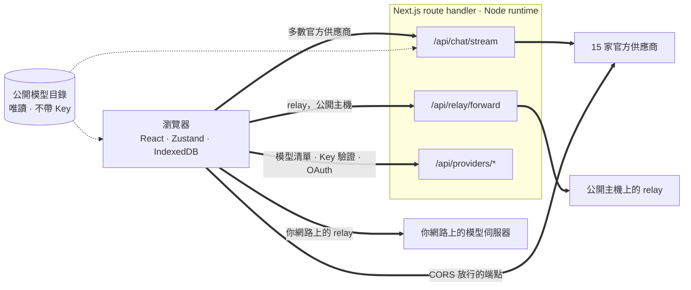
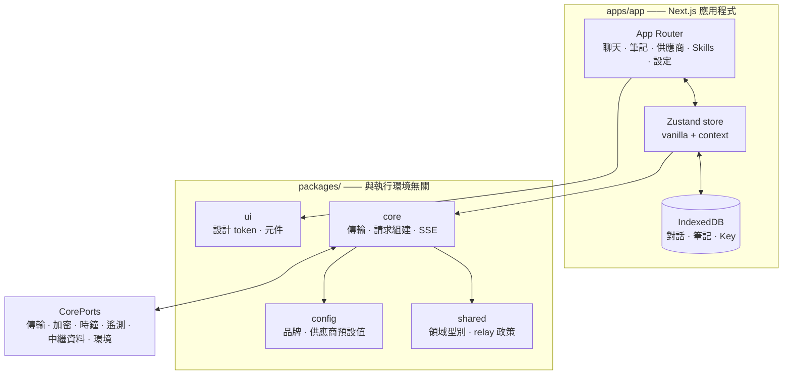

<div align="center">

# Oriveo for Web

**一個 Next.js 聊天用戶端，用來使用你早就在付費的那些 AI 模型。**

<a href="../../LICENSE"></a>


<sub>

<a href="../../web/README.md">English</a> ·
<a href="../ar/web.md">العربية</a> ·
<a href="../de/web.md">Deutsch</a> ·
<a href="../es/web.md">Español</a> ·
<a href="../fr/web.md">Français</a> ·
<a href="../hi/web.md">हिन्दी</a> ·
<a href="../id/web.md">Indonesia</a> ·
<a href="../ja/web.md">日本語</a> ·
<a href="../ko/web.md">한국어</a> ·
<a href="../pt-BR/web.md">Português</a> ·
<a href="../ru/web.md">Русский</a> ·
<a href="../th/web.md">ไทย</a> ·
<a href="../tr/web.md">Türkçe</a> ·
<a href="../vi/web.md">Tiếng Việt</a> ·
<a href="../zh-Hans/web.md">简体中文</a> ·
**繁體中文**

</sub>

</div>

---

Oriveo 網頁用戶端是一個以 Next.js 打造、自備金鑰的 AI 聊天應用程式。對話、筆記、資料夾、Skills 以及
你的供應商 Key，都放在瀏覽器自己的儲存空間裡。沒有帳號，也不需要登入。

它是 [Oriveo 社群版](README.md) 的一部分 —— 三個用戶端共用同一份「該怎麼跟模型供應商說話」的定義。

## 快速開始

需要 Node 22.22 或更新版本（見 [`.nvmrc`](../../web/.nvmrc)）。npm 隨附其中；不需要其他套件管理器。

```bash
npm install
npm run dev:app     # http://localhost:3001
```

第一個畫面會向你要一組供應商 API Key。開始聊天不需要別的東西。

## 一個請求實際上是怎麼跑的

這一節值得比其他任何內容都先讀，因為網頁用戶端是唯一一處請求通常**不會**從用戶端直達供應商的地方。



**為什麼要繞這一段。** 多數供應商 API 不送 CORS 標頭，所以瀏覽器無法直接呼叫 `api.openai.com` 之類
的端點 —— preflight 就會失敗。每一個瀏覽器 BYOK 用戶端都得想辦法解決這件事；這一個的做法是轉送給
幾個跑在 Node runtime 裡的 Next.js route handler。當你執行 `npm run dev:app` 時，這些 handler 就在
你自己的機器上。當你把應用部署到某處時，它們就在你部署到的那台機器上。

handler 不只一個：聊天串流、relay 轉送器、圖片生成、模型清單、Key 驗證，以及 Grok 與 ChatGPT 的裝置
登入交換，加起來一共十二個 route 檔案。Key 驗證在這裡特別值得留意 —— 它會把 Key 送到你自己的
伺服器，由它拿去探測供應商。

少數端點*確實*允許瀏覽器直連，這些就直接呼叫、中間不經過任何伺服器：Kimi 用於聊天的中國區端點
（`api.moonshot.cn`），以及 OpenRouter、SiliconFlow、DeepSeek 與 Kimi 的餘額端點。

**這些 handler 做什麼、不做什麼。** 它驗證請求形狀並限制大小，對聊天與 relay 流量套用依 IP 的速率
限制，拒絕解析到私有或連結本地位址的 URL，組出供應商特定的請求主體，然後把回應串流回來。`app/api`
底下任何地方都沒有資料庫、沒有寫入檔案，也沒有記錄請求主體 —— 你的 Key 與訊息只是被轉送，然後就被
忘掉。由於這條路由是所有訪客共用的同一個行程，有一個專門的測試（`server-never-learns.test.ts`）釘住
了它絕不會把某位使用者被拒絕的參數快取下來、再套到別人的請求上。

relay 轉送器還額外把 DNS 釘在它解析出的那個位址上、限制回應大小、為每個逾時設上界、把重新導向限制
在同源範圍內，並拒絕轉送逐跳（hop-by-hop）標頭。

**本機端點完全略過它。** 位於私有位址、`.local` 名稱、`localhost` 上的 relay，或設定為本機 HTTP 或
私有 VPN 模式的 relay，都是**由瀏覽器直接**抓取的，帶著 `credentials: 'omit'` 與
`targetAddressSpace: 'local'`。你的區域網路流量不會離開你的網路，也不會經過這個應用的伺服器。

## 架構



`packages/core` 持有關於供應商協定的每一個位元組的知識，並且被刻意保持得完全不碰瀏覽器全域物件 ——
eslint 在它裡面以及 `packages/ipc-contract` 裡禁用了 `window`、`document`、`fetch`、`crypto`、
`localStorage`、`sessionStorage` 與 `indexedDB`。它需要
從環境取得的一切，都經由 `CorePorts` 抵達。正是這一點，讓同一份程式碼能跑在瀏覽器裡、跑在 Node
route handler 裡，也能跑在一個沒有 DOM 的測試裡。

供應商支援是兩條互相獨立的軸。`providerKind` 挑選一個**請求組建器**（這家廠商的請求主體長什麼樣）。
`model.transport` 從十二種裡挑選一個**傳輸策略**（實際說的是哪一種通訊協定），而且它是依模型、從
目錄解析出來的，不是依供應商 —— 所以同一把 Key 後面的兩個模型完全可以不一致。一個策略只實作三個
方法：`buildRequestBody`、`parseStreamChunk`、`parseError`。

## Workspace

```
apps/app/               the Next.js application
packages/core/          provider protocols: transports, request builders, SSE parsing
packages/shared/        domain types, relay policy, helpers
packages/ui/            design tokens and shared components
packages/config/        brand and provider defaults
packages/ipc-contract/  typed channel contract for a desktop shell
```

樣式是 CSS Modules 疊在 `packages/ui` 裡一張統一的自訂屬性 token 表上 —— 沒有使用任何工具類別框架。
`packages/ipc-contract` 描述的是一個桌面外殼會綁定的通道介面；這個儲存庫裡並沒有這樣的外殼，所以在
網頁建置上，它只貢獻一些永遠走不到的型別與分支。

還有一處同類的接縫。`apps/app/lib/core/sync-port.ts` 宣告了一個同步後端要實作的介面，而每一處呼叫點都透過
optional chaining 去存取它。沒有任何東西裝上這樣的後端，所以 `getSyncAdapter()` 回傳 `null`，
IndexedDB 始終是你資料的唯一一份副本 —— 這正是「沒有帳號、沒有登入」在實際上的意思。

## 儲存

一切都依分區隔離，以一個預設為 `guest` 的作用中 id 作為鍵。

| 內容 | 位置 |
|---|---|
| 對話、訊息、資料夾、筆記、供應商 | IndexedDB `oriveo--{id}`，8 個 object store |
| 模型目錄快照（約 3 MB）與 model facts | IndexedDB blob store，刻意不放 localStorage |
| 偏好設定與模型控制項表 | `localStorage`，實測會拋例外的那些路徑由 `safeLocalStorage` 包住 |
| 產生的與附加的圖片 | 一個獨立的 IndexedDB 資料庫 |

有兩個細節來自真實的災情，而不是品味。目錄快照放在 IndexedDB，是因為它約 3 MB，會吃掉一個瀏覽器
origin 那 5 MB localStorage 配額的大半。而每一次 localStorage 存取都要走 `safeLocalStorage`，是因為
當瀏覽器被設定成封鎖網站資料時，`window.localStorage` 這個 *getter* 本身就會拋 `SecurityError` ——
一次裸讀會在你的 `try` 區塊開始執行之前就把頁面弄崩。

> [!IMPORTANT]
> 在網頁上，供應商 Key 是**未加密**存在 IndexedDB 裡的 —— 這也是瀏覽器端 BYOK 用戶端普遍採用的做
> 法，因為瀏覽器沒有更好的地方可以放。若要最強的保障，請使用 iOS 或 Android 用戶端，那裡由系統的
> keychain 或 keystore 加密它們。備份封存是另一回事：當你設定密碼時，它們會以 AES-256-GCM 與
> PBKDF2-SHA-256 迭代 600,000 次加密。

## 模型目錄

每家供應商提供哪些模型、每個模型支援什麼，來自啟動時抓取的一份唯讀目錄。只請求兩個端點，都是 `GET`，
都帶 ETag 條件，都不攜帶 API Key、對話或任何使用者識別資訊：

```
GET {backend}/api/metadata?view=lean
GET {backend}/api/metadata/model-facts
```

預設後端是 `https://api.oriveoai.com`。把 `NEXT_PUBLIC_BACKEND_URL` 指向你自己的主機就能自行提供。
回應會在 IndexedDB 快取 24 小時，並以 `If-None-Match` 重新驗證；目錄連不上時，應用程式仍能靠快取
副本繼續運作。

## 指令

請在這個目錄下執行以下指令。

| 指令 | 作用 |
|---|---|
| `npm run dev:app` | 在連接埠 3001 上啟動開發伺服器 |
| `npm run build:app` | 正式版建置 |
| `npm run typecheck` | 對每個 workspace 執行 `tsc --noEmit` |
| `npm run test:run` | vitest，跑一輪 |
| `npm run test` | vitest 監看模式 |
| `npm run lint` | 對 `apps/` 與 `packages/` 執行 eslint |

`npm start --workspace @oriveo/app` 會在連接埠 3001 上提供一份已建置完成的成品。

若要執行單一測試檔，請在擁有它的那個 workspace 裡執行，因為有幾套測試是相對於工作目錄解析 fixture
的：

```bash
cd apps/app && npx vitest run lib/core/chat/__tests__/stream-options.test.ts
```

## 設定

所有設定都是選用的。把 [`.env.example`](../../web/.env.example) 複製成 `.env.local`，只設定你需要的
項目；程式會讀取的每一個變數都列在那裡，並附有說明。

### 錯誤回報

這個應用打包了 Sentry SDK。**沒有 DSN 時它是惰性的** —— 沒有 `NEXT_PUBLIC_SENTRY_DSN` 就沒有
transport、沒有事件，什麼都不會送出去，而這正是從本儲存庫建置出來的預設狀態。設上一組 DSN，你就會
得到錯誤回報、10% 的效能追蹤與 1% 的工作階段重播，並且有 hook 會在事件離開瀏覽器之前把供應商 Key、
端點與訊息內容剝掉。它擺在這裡，是為了讓想要錯誤回報的部署能有，而不是因為這個建置會回傳什麼。

## 自行架設

這裡沒有 Dockerfile，也沒有部署腳本；這個應用就是一台普通的 Next.js 伺服器。

```bash
npm ci
npm run build:app
npm start --workspace @oriveo/app     # 127.0.0.1:3001
```

在把它擺到反向代理後面之前，有三件事值得先知道。

`npm start` 綁定的是 `127.0.0.1`，所以代理得跑在同一台主機上，否則就得改綁定位址。

把 `NEXT_PUBLIC_APP_URL` 設成你實際對外提供服務的 origin。canonical 連結、sitemap 與社群預覽圖都是
相對它解析的，而它的預設值是開發用的連接埠。

把 `TRUSTED_PROXY_HOP_COUNT` 設成應用前面代理的層數。聊天流量限制器讀的是 `X-Forwarded-For` 從*右*
邊數過來那麼多跳的用戶端位址 —— 絕不從左邊數，因為左邊由用戶端控制、可以偽造。預設值 1 對單層代理是
正確的；前面有兩層卻把它留得太小，所有訪客就會共用同一個限流桶，因為讀到的位址是你自己內層代理的。

應用已經在 `next.config.ts` 裡送出 HSTS、`X-Content-Type-Options`、`X-Frame-Options`、
`Referrer-Policy`、`Permissions-Policy` 與 `Cross-Origin-Opener-Policy`，所以代理不需要再加。TLS
終結與請求大小上限則是代理的工作。

最後一件值得慎重決定的事：任何能連到這個部署的人，都可以用它的 route handler、拿自己提供的 Key 去
呼叫供應商。這些 handler 自己不持有任何 Key，也不保存任何東西，但它們是一條對外的 HTTP 通路，所以
一個公開可連的部署，應該像你對待任何其他內部工具那樣，擺在存取控制之後。

## 測試

460 個檔案裡大約 5,600 個測試，跑在 vitest 上。覆蓋最密的地方，正是出錯代價最高的地方：每家供應商的
請求形狀、每種通訊協定的傳輸行為、SSE 與 proxy 區塊解析、用量與費用解析、錯誤分類、relay 探測與安全
模式、SSRF 防護、能力配方執行、目錄快取與契約版本失效、IndexedDB 持久化、儲存分區、備份來回一致性，
以及 route handler 本身。

> [!IMPORTANT]
> 有三十多套測試從 `../shared` 載入契約 fixture，所以**測試只有在完整 checkout 下才會通過** ——
> 把 `web/` 單獨複製出去是行不通的。

## 在地化

`apps/app/messages` 裡有十六個 locale，每個約 1,800 個鍵，英文是來源語言。有一個測試會走訪這個目錄，
只要任何 locale 的鍵集與英文不同就失敗，所以新增一個 locale 檔案就會自動把它納入。阿拉伯文有完整的
由右至左版面。locale 的選取順序是：明確的 `?locale=` 參數，接著 cookie，最後 `Accept-Language`。

## 參與貢獻

見 [CONTRIBUTING.md](../../CONTRIBUTING.md)。`packages/core` 是傳輸優先的：新增一家供應商，通常只是
一個請求組建器加一個回應轉接器，而不是一個新的用戶端。修供應商協定問題時，請優先採用
`shared/test-fixtures` 底下錄製的 fixture 而不是手寫的 mock。

## 授權條款

[AGPL-3.0-or-later](../../LICENSE)。
