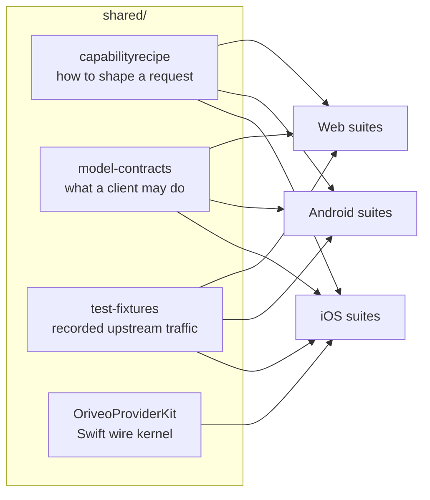

<div align="center">

# Shared contracts

**One definition of how to talk to a model provider, asserted by all three clients.**

<a href="../LICENSE"></a>


<sub>

**English** ·
<a href="../readme_i18n/ar/shared.md">العربية</a> ·
<a href="../readme_i18n/de/shared.md">Deutsch</a> ·
<a href="../readme_i18n/es/shared.md">Español</a> ·
<a href="../readme_i18n/fr/shared.md">Français</a> ·
<a href="../readme_i18n/hi/shared.md">हिन्दी</a> ·
<a href="../readme_i18n/id/shared.md">Indonesia</a> ·
<a href="../readme_i18n/ja/shared.md">日本語</a> ·
<a href="../readme_i18n/ko/shared.md">한국어</a> ·
<a href="../readme_i18n/pt-BR/shared.md">Português</a> ·
<a href="../readme_i18n/ru/shared.md">Русский</a> ·
<a href="../readme_i18n/th/shared.md">ไทย</a> ·
<a href="../readme_i18n/tr/shared.md">Türkçe</a> ·
<a href="../readme_i18n/vi/shared.md">Tiếng Việt</a> ·
<a href="../readme_i18n/zh-Hans/shared.md">简体中文</a> ·
<a href="../readme_i18n/zh-Hant/shared.md">繁體中文</a>

</sub>

</div>

---

Three clients that each implement "call the provider" independently will drift. They will drift
quietly, in the direction of whichever one someone tested last, and the drift will surface as a bug
that reproduces on one platform and not the others.

`shared/` is the answer to that: the behaviour is written down once as data, and each client's test
suite asserts against the same files. A quirk that lives in that data is fixed once. A quirk that
lives in a parser is caught by three suites at the same time, instead of shipping on two platforms
and breaking the third.



## capabilityrecipe

The recipe registry. For a given provider, transport, and capability — web search, reasoning
effort, image generation — it says exactly which JSON pointers to write into the outgoing request,
and how to read the answer back.

This is what makes a model released today work without a client update, and it is why no client
guesses a capability from a model name. `capability_runtime.v1.json` carries the recipes themselves;
`capability_result_definitions.v1.json` and `capability_custom_controls.v2.json` define how results
and user-facing controls are interpreted.

Each recipe declares an `executionKind` — `request_overlay`, `server_tool`, `client_tool_loop`,
`endpoint_route`, `model_route`, `external_connector`, `unavailable` — and each client's compiler
validates that the recipe matches the provider, capability, and transport before applying it,
rejecting with a named reason rather than sending a request nobody reviewed. The list is a closed
set: a recipe naming anything else is refused rather than guessed at.

## model-contracts

JSON fixtures pinning down cross-client behaviour: what a request must look like for a given
provider and capability, how generation parameters resolve and how overrides layer, which
capability states a client may present, and how the model catalog and its evidence are consumed.

Each client's tests load these directly, so a change here is a change to all three clients at once.

## test-fixtures

Golden test data: recorded upstream tool-call traffic, relay routing, form validation,
local-address classification, catalog and portable-config scenarios, model-facts and
capability-evidence snapshots, and local-engine scenarios.

The `.sse` files under `provider-toolcall/recorded/` are **real captured upstream traffic**, kept
byte for byte as it arrived — only the response headers were dropped, and the bodies never carried a
key. The `.sse` files directly in `provider-toolcall/` are hand-written fixtures pinning a specific
parse path. The distinction matters: a hand-written mock encodes what you believed the provider
does, while a recording encodes what it actually did, including the malformed chunk it sent that
Tuesday. When a provider protocol fix needs a test, prefer a recording.

A fixture's `$comment`, or the `expected.json` manifest beside it, says what the entries around it
pin down. Read that before adding a case.

## OriveoProviderKit

A Swift package holding the provider wire-protocol kernel: SSE line assembly, OpenAI-compatible
chunk parsing, event-based assembly for the Responses / Anthropic Messages / Gemini protocols,
transport-neutral request building, recipe compilation and its execution guards, tool-name encoding,
credential redaction, upstream error classification, thinking-tag parsing, streaming JSON path
extraction, an explicit `URLSession` redirect policy, and per-provider quirk profiles.

Its scope is drawn deliberately tight. **In:** Foundation-only wire knowledge. **Out:** app models,
UI, database, telemetry, localization. The package depends on nothing beyond the standard library and
Foundation, and each Apple client keeps a thin binding around it so that wire behaviour has exactly
one implementation.

It implements the whole request-and-streaming path for Apple platforms. The iOS app currently links a
subset of it — the stream assemblers, the wire profiles, the tool-name codec and the error
classifiers — and keeps its own request builders; the macOS client under development is the second
consumer, which is why the recipe compiler and the transport-neutral request builder live here rather
than inside one app. The suite below covers the parts every consumer shares: SSE splitting,
OpenAI-compatible assembly, the tool-name codec and the redirect policy.

```bash
cd shared/OriveoProviderKit && swift build && swift test
```

- Platforms: iOS 18+, macOS 15+ · `swift-tools-version: 6.1`
- `ProviderWireProfile` carries the residual per-vendor quirks a single OpenAI-compatible assembler
  still needs — where reasoning text arrives, where cached-token counts live, whether prompt tokens
  already include cache hits. It describes *how bytes arrive*, never *what a model can do*; that is
  the recipes' job.

## Working on these files

A change here is a change to every client. Run the contract suites of each client that reads the
file you touched, not just the one you happen to be working in:

From the repository root:

```bash
(cd web && npm run test:run)
(cd shared/OriveoProviderKit && swift test)
# plus the iOS and Android suites — see their READMEs
```

The iOS suites find this directory by walking up from the test file until they see `shared/`; the
Android suites walk up from the working directory the same way; the web suites resolve it relative
to the workspace. All of them therefore require a full checkout of the repository.

Before opening a pull request, read [CONTRIBUTING.md](../CONTRIBUTING.md).

## License

[AGPL-3.0-or-later](../LICENSE).
