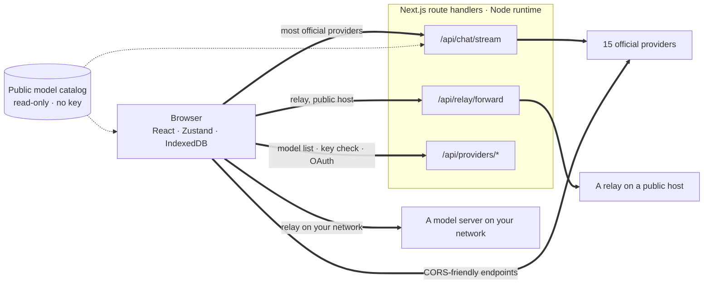
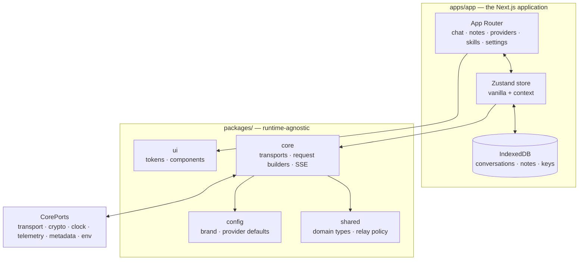

<div align="center">

# Oriveo for Web

**A Next.js chat client for the AI models you already pay for.**

<a href="../LICENSE"></a>


<sub>

**English** ·
<a href="../readme_i18n/ar/web.md">العربية</a> ·
<a href="../readme_i18n/de/web.md">Deutsch</a> ·
<a href="../readme_i18n/es/web.md">Español</a> ·
<a href="../readme_i18n/fr/web.md">Français</a> ·
<a href="../readme_i18n/hi/web.md">हिन्दी</a> ·
<a href="../readme_i18n/id/web.md">Indonesia</a> ·
<a href="../readme_i18n/ja/web.md">日本語</a> ·
<a href="../readme_i18n/ko/web.md">한국어</a> ·
<a href="../readme_i18n/pt-BR/web.md">Português</a> ·
<a href="../readme_i18n/ru/web.md">Русский</a> ·
<a href="../readme_i18n/th/web.md">ไทย</a> ·
<a href="../readme_i18n/tr/web.md">Türkçe</a> ·
<a href="../readme_i18n/vi/web.md">Tiếng Việt</a> ·
<a href="../readme_i18n/zh-Hans/web.md">简体中文</a> ·
<a href="../readme_i18n/zh-Hant/web.md">繁體中文</a>

</sub>

</div>

---

The Oriveo web client is a bring-your-own-key AI chat app built with Next.js. Conversations, notes,
folders, skills, and your provider keys live in the browser's own storage. There is no account and
no sign-in.

It is part of [Oriveo Community Edition](../README.md) — three clients that share one definition of
how to talk to a model provider.

## Quick start

Requires Node 22 (see [`.nvmrc`](.nvmrc)). npm ships with it; no other package manager is needed.

```bash
npm install
npm run dev:app     # http://localhost:3001
```

The first screen asks for a provider API key. Nothing else is required to start chatting.

## How a request actually travels

This is the part worth reading before anything else, because the web client is the one place where
a request usually does **not** go straight from the client to the provider.



**Why the detour exists.** Most provider APIs send no CORS headers, so a browser cannot call
`api.openai.com` and friends directly — the preflight fails. Every browser BYOK client has to solve
this somehow; this one forwards through Next.js route handlers running in the Node runtime. When
you run `npm run dev:app`, those handlers are on your own machine. When you deploy the app
somewhere, they are on the machine you deployed to.

There are twelve of them, not one: chat streaming, the relay forwarder, image generation, the model
list, key validation, and the Grok and Codex device-login exchanges. Key validation matters here —
it posts the key to your own server, which probes the provider with it.

A few endpoints *do* allow a browser, and those are called directly with no server in between:
Moonshot's China endpoint for chat, and the balance endpoints of OpenRouter, SiliconFlow, DeepSeek
and Moonshot.

**What the handler does and does not do.** It validates the request shape and caps its size, applies
a per-IP rate limit to chat and relay traffic, refuses URLs that resolve to private or link-local
addresses, builds the provider-specific body, and streams the response back. There is no database,
no filesystem write and no logging of request bodies anywhere under `app/api` — your key and your
messages are forwarded and forgotten. Because the route is one process shared by every visitor, a
dedicated test (`server-never-learns.test.ts`) pins that it never caches one user's rejected
parameter and applies it to somebody else's request.

The relay forwarder additionally pins DNS to the address it resolved, caps the response, bounds
every timeout, limits redirects to the same origin, and refuses to pass through hop-by-hop
headers.

**Local endpoints skip it entirely.** A relay on a private address, a `.local` name, `localhost`,
or one configured in local-HTTP or private-VPN mode is fetched **directly from the browser**, with
`credentials: 'omit'` and `targetAddressSpace: 'local'`. Your LAN traffic does not leave your
network, and it does not pass through the app's server either.

## Architecture



`packages/core` holds every byte of provider-protocol knowledge and is deliberately kept free of
browser globals — eslint bans `window`, `document`, `fetch`, `crypto`, `localStorage`,
`sessionStorage` and `indexedDB` inside it and in `packages/ipc-contract`. Anything it needs from
the environment arrives through `CorePorts`. That is what lets the same code run in a browser, in a
Node route handler, and in a test with no DOM.

Provider support is two independent axes. `providerKind` picks a **request builder** (what the body
looks like for this vendor). `model.transport` picks a **transport strategy** (which wire protocol
is spoken) out of twelve, and it is resolved per model from the catalog, not per provider — so two
models behind the same key can disagree. A strategy implements exactly three methods:
`buildRequestBody`, `parseStreamChunk`, `parseError`.

## Workspaces

```
apps/app/               the Next.js application
packages/core/          provider protocols: transports, request builders, SSE parsing
packages/shared/        domain types, relay policy, helpers
packages/ui/            design tokens and shared components
packages/config/        brand and provider defaults
packages/ipc-contract/  typed channel contract for a desktop shell
```

Styling is CSS Modules over a single custom-property token sheet in `packages/ui` — there is no
utility-class framework. `packages/ipc-contract` describes the channel surface a desktop shell would
bind to; no such shell ships in this repository, so on the web build it contributes types and
branches that are never taken.

## Storage

Everything is per-partition, keyed by an active id that defaults to `guest`.

| What | Where |
|---|---|
| Conversations, messages, folders, notes, providers | IndexedDB `oriveo--{id}`, 8 object stores |
| Model catalog snapshot (~3 MB) and model facts | IndexedDB blob store, deliberately not localStorage |
| Preferences and model-control tables | `localStorage`, with `safeLocalStorage` wrapping the paths that were seen to throw |
| Generated and attached images | a separate IndexedDB database |

Two details that came from real breakage rather than taste. The catalog snapshot lives in IndexedDB
because at ~3 MB it was consuming most of a browser origin's 5 MB localStorage quota. And every
localStorage access goes through `safeLocalStorage`, because the `window.localStorage` *getter*
itself throws `SecurityError` when a browser is configured to block site data — a bare read crashes
the page before your `try` block ever runs.

> [!IMPORTANT]
> On the web, provider keys are stored in IndexedDB **unencrypted** — the same model browser-based
> BYOK clients generally use, because a browser has nowhere better to put them. For the strongest
> guarantee, use the iOS or Android client, where the system keychain or keystore encrypts them.
> Backup archives are a different matter: those are encrypted with AES-256-GCM and PBKDF2-SHA-256
> at 600,000 iterations when you choose a password.

## The model catalog

Which models each provider offers, and what each supports, comes from a read-only catalog fetched
at startup. Exactly two endpoints are requested, both `GET`, both ETag-conditional, neither
carrying an API key, a conversation, or any user identifier:

```
GET {backend}/api/metadata?view=lean
GET {backend}/api/metadata/model-facts
```

The default backend is `https://api.oriveoai.com`. Point `NEXT_PUBLIC_BACKEND_URL` at your own host
to serve it yourself. The response is cached for 24 hours in IndexedDB and revalidated with
`If-None-Match`; when the catalog is unreachable the app keeps working from its cached copy.

## Commands

Run these from this directory.

| Command | What it does |
|---|---|
| `npm run dev:app` | development server on port 3001 |
| `npm run build:app` | production build |
| `npm run typecheck` | `tsc --noEmit` across every workspace |
| `npm run test:run` | vitest, one pass |
| `npm run test` | vitest in watch mode |
| `npm run lint` | eslint over `apps/` and `packages/` |

To run a single test file, do it from the workspace that owns it, because several suites resolve
fixtures relative to the working directory:

```bash
cd apps/app && npx vitest run lib/core/chat/__tests__/stream-options.test.ts
```

## Configuration

Everything is optional. Copy [`.env.example`](.env.example) to `.env.local` and set only what you
need; each key is documented there. A few variables the code reads are not in that file:
`BACKEND_URL` (a server-side-only twin of `NEXT_PUBLIC_BACKEND_URL`), `NEXT_PUBLIC_LIBRARY_ENABLED`,
`ORIVEO_DESKTOP` and `NEXT_DIST_DIR`.

### Error reporting

The app bundles the Sentry SDK. It is **inert without a DSN** — no `NEXT_PUBLIC_SENTRY_DSN` means no
transport, no events, nothing sent anywhere, which is the default for a build from this repository.
Set one and you get error reporting, 10% performance tracing and 1% session replay, with hooks that
strip provider keys, endpoints and message content before an event leaves the browser. It is here so
that a deployment which wants error reporting can have it, not because this build phones home.

## Testing

Around 4,600 tests across 461 files, on vitest. The heaviest coverage is where a mistake is most
expensive: request shape per provider, transport behaviour per wire protocol, SSE and proxy chunk
parsing, usage and cost parsing, error classification, relay probing and security modes, the SSRF
guard, capability recipe execution, catalog caching and contract-version invalidation, IndexedDB
persistence, storage partitioning, backup round-trips, and the route handlers themselves.

> [!IMPORTANT]
> Around 24 suites load contract fixtures from `../shared`, so **the tests only pass in a full
> checkout** — copying `web/` out on its own will not work.

## Localization

Sixteen locales in `apps/app/messages`, about 1,800 keys each, English as the source. A test walks
the directory and fails if any locale's key set differs from English, so adding a locale file
enrolls it automatically. Arabic gets a full right-to-left layout. Locale selection follows an
explicit `?locale=` parameter, then a cookie, then `Accept-Language`.

## Contributing

See [CONTRIBUTING.md](../CONTRIBUTING.md). `packages/core` is transport-first: adding a provider is
usually a request builder and a response adapter, not a new client. For a provider protocol fix,
prefer a recorded fixture under `shared/test-fixtures` over a hand-written mock.

## License

[AGPL-3.0-or-later](../LICENSE).
